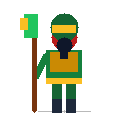
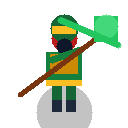
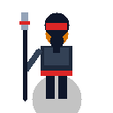
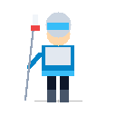
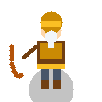
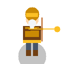

# Asset Gallery — Tam Quốc Prototype Pack

> [!NOTE]
> Tất cả các hình ảnh bên dưới sử dụng đường dẫn tương đối Markdown (`../../../../src/assets/...`) giúp hiển thị trực tiếp hình ảnh khi mở chế độ Markdown Preview trong IDE.

---

## 1. Bảng Trưng Bày Toàn Diện Theo Tướng (Hero Showcase)

### 1.1. Quan Vũ (Võ Thánh — Melee Cleave / Physical)

| Portrait (128x128) | Idle Sprite (128x128) | Attack Sprite (128x128) | Skill VFX: Thanh Long Trảm (128x128) |
|:---:|:---:|:---:|:---:|
|  |  |  |  |
| `portraits/quan-vu.png` | `heroes/quan-vu/idle.png` | `heroes/quan-vu/attack.png` | `vfx/thanh-long-tram.png` |

---

### 1.2. Trương Phi (Dũng Tướng — Melee Tank / Stun)

| Portrait (128x128) | Idle Sprite (128x128) | Attack Sprite (128x128) | Skill VFX: Bát Xà Gầm Vang (128x128) |
|:---:|:---:|:---:|:---:|
|  |  |  |  |
| `portraits/truong-phi.png` | `heroes/truong-phi/idle.png` | `heroes/truong-phi/attack.png` | `vfx/ba-xa-gam-vang.png` |

---

### 1.3. Triệu Vân (Hổ Uy Tướng Quân — Fast Striker / Multi-Hit)

| Portrait (128x128) | Idle Sprite (128x128) | Attack Sprite (128x128) | Skill VFX: Thất Tiến Thất Xuất (128x128) |
|:---:|:---:|:---:|:---:|
|  |  |  |  |
| `portraits/trieu-van.png` | `heroes/trieu-van/idle.png` | `heroes/trieu-van/attack.png` | `vfx/that-tien-that-xuat.png` |

---

### 1.4. Hoàng Trung (Lão Tướng Thần Tiễn — Ranged Sniper / Single Target)

| Portrait (128x128) | Idle Sprite (128x128) | Attack Sprite (128x128) | Skill VFX: Bách Bộ Xuyên Dương (128x128) |
|:---:|:---:|:---:|:---:|
|  |  |  |  |
| `portraits/hoang-trung.png` | `heroes/hoang-trung/idle.png` | `heroes/hoang-trung/attack.png` | `vfx/bach-bo-xuyen-duong.png` |

---

### 1.5. Gia Cát Lượng (Ngọa Long Quân Sư — Magic AoE / Slow)

| Portrait (128x128) | Idle Sprite (128x128) | Attack Sprite (128x128) | Skill VFX: Đông Phong Hỏa Trận (128x128) |
|:---:|:---:|:---:|:---:|
|  |  |  |  |
| `portraits/gia-cat-luong.png` | `heroes/gia-cat-luong/idle.png` | `heroes/gia-cat-luong/attack.png` | `vfx/dong-phong-hoa-tran.png` |

---

## 2. Bảng Tổng Hợp Theo Chủng Loại Asset (Categorical Overview)

### 2.1. Bộ Chân Dung HUD (5 Portraits)

| Quan Vũ | Trương Phi | Triệu Vân | Hoàng Trung | Gia Cát Lượng |
|:---:|:---:|:---:|:---:|:---:|
|  |  |  |  |  |

### 2.2. Bộ Sprite Đứng Chờ Trên Bàn Cờ (5 Idle Sprites)

| Quan Vũ (Idle) | Trương Phi (Idle) | Triệu Vân (Idle) | Hoàng Trung (Idle) | Gia Cát Lượng (Idle) |
|:---:|:---:|:---:|:---:|:---:|
|  |  |  |  |  |

### 2.3. Bộ Sprite Tấn Công (5 Attack Sprites)

| Quan Vũ (Attack) | Trương Phi (Attack) | Triệu Vân (Attack) | Hoàng Trung (Attack) | Gia Cát Lượng (Attack) |
|:---:|:---:|:---:|:---:|:---:|
|  |  |  |  |  |

### 2.4. Bộ Hiệu Ứng Tuyệt Kỹ (5 Skill VFX)

| Thanh Long Trảm | Bát Xà Gầm Vang | Thất Tiến Thất Xuất | Bách Bộ Xuyên Dương | Đông Phong Hỏa Trận |
|:---:|:---:|:---:|:---:|:---:|
|  |  |  |  |  |
