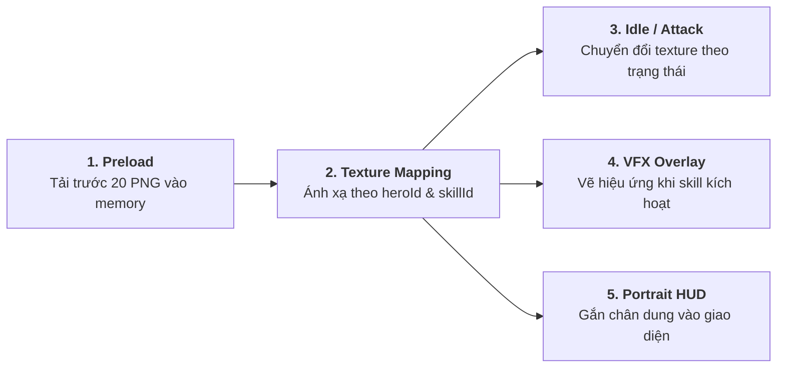

# Runtime Integration Handoff Specification (Codex VIS-C01)

> [!IMPORTANT]
> **Tài Liệu Đặc Tả Bàn Giao Kỹ Thuật (Handoff to Codex `VIS-C01`)**:
> - **Mục đích**: Cung cấp hợp đồng chức năng (Functional Contract) để Codex kết nối bộ 20 asset prototype hiện có vào hệ thống Runtime Rendering của *Huyền Sử TD*.
> - **Quyền quyết định kiến trúc**: Mọi quyết định về tên file, cấu trúc module, tên class, và mẫu thiết kế (Design Pattern) hoàn toàn do **Codex quyết định**.
> - **Tham số chưa khóa**: Mọi thông số về thời lượng animation, scale, anchor behavior đều ở trạng thái `[OPEN / CONFIG]`, Codex có thể tự cấu hình theo logic rendering thực tế.

---

## 1. Hiện Trạng Hệ Thống Runtime (Current State)

| Thành Phần | Hiện Trạng Trong Codebase | Hướng Nối Asset (`VIS-C01`) |
|---|---|---|
| **Bàn cờ / Grid** | Đang render Hero bằng hình vẽ hình học cơ bản (Circle/Shape) kèm text placeholder. | Vẽ texture Sprite $128 \times 128$ px (`idle.png`), neo chân theo Baseline $Y=112$. |
| **Đòn đánh Hero** | Logic đòn đánh đã có, nhưng chưa có chuyển đổi hình ảnh. | Đổi sang texture `attack.png` khi ra đòn, sau đó quay lại `idle.png`. |
| **Kỹ năng Active Skill** | Logic kỹ năng đã có, nhưng chưa có visual overlay. | Vẽ sprite VFX (`vfx/<skill-id>.png`) tương ứng khi kích hoạt skill. |
| **Giao diện HUD** | Các ô chọn tướng / hiển thị thông tin đang dùng text placeholder. | Hiển thị icon chân dung từ `portraits/<hero-id>.png`. |

---

## 2. Hợp Đồng Tích Hợp Chức Năng (Functional Contract)

---

### Bước 1: Nạp Asset (Preload)
* **Contract**:
  * Tải trước toàn bộ 20 file PNG trong `src/assets/**` vào bộ nhớ trước hoặc trong quá trình khởi tạo trận đấu để tránh giật lag khi render.
  * *File / Module tổ chức*: `[Codex quyết định]`

---

### Bước 2: Ánh Xạ Asset Theo Định Danh (Texture Mapping by HeroId / SkillId)
* **Contract**:
  * Cung cấp cơ chế mapping giữa `heroId` / `skillId` với đường dẫn asset tương ứng:
    * `quan-vu` $\rightarrow$ `portraits/quan-vu.png`, `heroes/quan-vu/idle.png`, `heroes/quan-vu/attack.png`, `vfx/thanh-long-tram.png`
    * `truong-phi` $\rightarrow$ `portraits/truong-phi.png`, `heroes/truong-phi/idle.png`, `heroes/truong-phi/attack.png`, `vfx/ba-xa-gam-vang.png`
    * `trieu-van` $\rightarrow$ `portraits/trieu-van.png`, `heroes/trieu-van/idle.png`, `heroes/trieu-van/attack.png`, `vfx/that-tien-that-xuat.png`
    * `hoang-trung` $\rightarrow$ `portraits/hoang-trung.png`, `heroes/hoang-trung/idle.png`, `heroes/hoang-trung/attack.png`, `vfx/bach-bo-xuyen-duong.png`
    * `gia-cat-luong` $\rightarrow$ `portraits/gia-cat-luong.png`, `heroes/gia-cat-luong/idle.png`, `heroes/gia-cat-luong/attack.png`, `vfx/dong-phong-hoa-tran.png`
  * *Kiểu dữ liệu & vị trí khai báo*: `[Codex quyết định]`

---

### Bước 3: Hiển Thị Hero Trên Bàn Cờ & Chuyển Đổi Đòn Đánh (Idle / Attack)
* **Contract**:
  * **Trạng thái bình thường (Idle)**: Vẽ texture `idle.png` tại vị trí ô đặt Hero.
  * **Căn chỉnh điểm neo (Anchor Behavior)**: `[OPEN / CONFIG]` — Dữ liệu chuẩn của sprite có chân nhân vật tiếp đất tại $Y = 112$ trên canvas $128 \times 128$.
  * **Trạng thái ra đòn (Attack)**: Khi Hero phát động đòn đánh, chuyển sang vẽ `attack.png`, sau một khoảng thời gian `attackDuration` (`[OPEN / CONFIG]`) thì trở lại `idle.png`.

---

### Bước 4: Hiển Thị Hiệu Ứng Tuyệt Kỹ (VFX Overlay)
* **Contract**:
  * Khi logic Active Skill của Hero kích hoạt, spawn hiệu ứng hình ảnh từ file `vfx/<skill-id>.png`.
  * **Vị trí hiển thị & Tọa độ neo**: `[OPEN / CONFIG]` (tại vị trí Hero hoặc vị trí mục tiêu tùy bản chất skill).
  * **Thời lượng & Hiệu ứng Scale/Fade**: `[OPEN / CONFIG]`.

---

### Bước 5: Hiển Thị Chân Dung Trên Giao Diện (Portrait HUD)
* **Contract**:
  * Nối file `portraits/<hero-id>.png` vào các thành phần giao diện liên quan (như danh sách chọn tướng, bảng thông tin tướng đang chọn).
  * *Vị trí và cách thức binding UI*: `[Codex quyết định]`

---

## 3. Checklist Bàn Giao Cho Codex VIS-C01

- [ ] Toàn bộ 20 file PNG tại `src/assets/**` đã được kiểm tra tính toàn vẹn (không lỗi nhị phân, kích thước $128 \times 128$, PNG RGBA).
- [ ] Không có file asset nào bị di chuyển hay đổi tên.
- [ ] Không có thay đổi nào trong `src/**` thuộc task này.
- [ ] Mọi quyết định về kiến trúc mã nguồn và tham số hiển thị thuộc quyền tự chủ của Codex.
