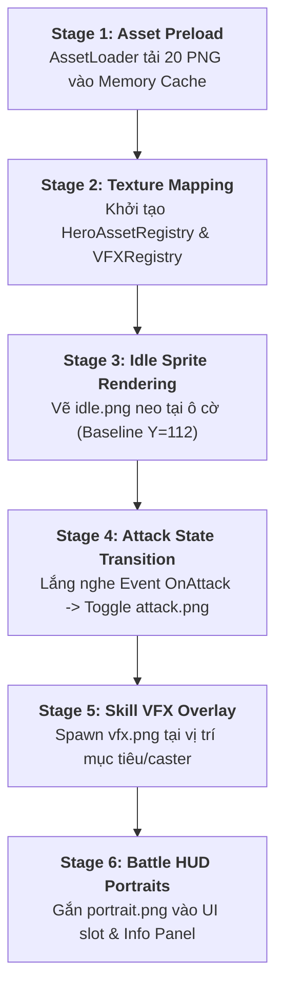

# Runtime Integration Handoff Specification (Codex VIS-C01)

> [!IMPORTANT]
> **Tài Liệu Đặc Tả Bàn Giao Kỹ Thuật (Handoff to Codex `VIS-C01`)**:
> - **Mục đích**: Hướng dẫn chi tiết kiến trúc và lộ trình kỹ thuật cho Codex kết nối bộ 20 asset prototype hiện có vào hệ thống Runtime Rendering của *Huyền Sử TD*.
> - **Nguyên tắc**: Antigravity không sửa source code, bàn giao tài liệu đặc tả chuẩn để Codex thực thi an toàn và đồng bộ với Core Architecture.

---

## 1. Hiện Trạng Hệ Thống Runtime (Current State Audit)

| Thành Phần | Hiện Trạng Trong Codebase | Mục Tiêu Sau Khi Nối Asset (`VIS-C01`) |
|---|---|---|
| **Hero Placement Grid** | Đang vẽ hình tròn cơ bản (Canvas circle / colored shape) kèm text hiển thị Hero Name/Type. | Hiển thị Sprite hình ảnh $128 \times 128$ px (`idle.png`), căn theo Baseline $Y=112$ của ô cờ. |
| **Combat Attack Event** | Không có animation đổi hình; chỉ có số liệu combat trừ máu âm thầm hoặc log text. | Tạm thời đổi sang Sprite `attack.png` trong $150 \sim 200$ms tại thời điểm ra đòn rồi trả về `idle.png`. |
| **Active Skill Event** | Hệ thống logic kích hoạt skill đã chạy, nhưng không có hiệu ứng thị giác trên màn hình. | Render VFX overlay (`vfx/<skill-id>.png`) tại tọa độ caster hoặc mục tiêu với hiệu ứng scale/fade-out. |
| **Battle HUD / Selection** | Các slot chọn tướng và bảng thông tin Hero đang dùng thẻ text placeholder. | Hiển thị Icon tròn sắc nét từ `portraits/<hero-id>.png` với viền giao diện sang trọng. |

---

## 2. Quy Trình Tích Hợp Runtime 6 Bước (6-Stage Pipeline)



---

### Bước 1: Khởi Tạo Bộ Nạp Asset (Asset Preloader)
* **Vị trí đề xuất**: `src/ui/assets/AssetLoader.ts` hoặc `src/assets/AssetRegistry.ts`
* **Nhiệm vụ**:
  * Tải trước (preload) toàn bộ danh sách 20 ảnh PNG vào bộ nhớ (`HTMLImageElement` hoặc `ImageBitmap`).
  * Cung cấp hàm `isLoaded()` và sự kiện `onAllAssetsLoaded()` trước khi bắt đầu Battle Loop.

---

### Bước 2: Bảng Ánh Xạ Dữ Liệu (Texture Mapping Dictionary)
* **Quy chuẩn Mapping Khuyến Nghị**:

```typescript
export interface HeroVisualConfig {
  heroId: string;
  portraitUrl: string;
  idleSpriteUrl: string;
  attackSpriteUrl: string;
  skillVfxUrl: string;
}

export const HERO_ASSET_REGISTRY: Record<string, HeroVisualConfig> = {
  'quan-vu': {
    heroId: 'quan-vu',
    portraitUrl: 'src/assets/portraits/quan-vu.png',
    idleSpriteUrl: 'src/assets/heroes/quan-vu/idle.png',
    attackSpriteUrl: 'src/assets/heroes/quan-vu/attack.png',
    skillVfxUrl: 'src/assets/vfx/thanh-long-tram.png',
  },
  'truong-phi': {
    heroId: 'truong-phi',
    portraitUrl: 'src/assets/portraits/truong-phi.png',
    idleSpriteUrl: 'src/assets/heroes/truong-phi/idle.png',
    attackSpriteUrl: 'src/assets/heroes/truong-phi/attack.png',
    skillVfxUrl: 'src/assets/vfx/ba-xa-gam-vang.png',
  },
  'trieu-van': {
    heroId: 'trieu-van',
    portraitUrl: 'src/assets/portraits/trieu-van.png',
    idleSpriteUrl: 'src/assets/heroes/trieu-van/idle.png',
    attackSpriteUrl: 'src/assets/heroes/trieu-van/attack.png',
    skillVfxUrl: 'src/assets/vfx/that-tien-that-xuat.png',
  },
  'hoang-trung': {
    heroId: 'hoang-trung',
    portraitUrl: 'src/assets/portraits/hoang-trung.png',
    idleSpriteUrl: 'src/assets/heroes/hoang-trung/idle.png',
    attackSpriteUrl: 'src/assets/heroes/hoang-trung/attack.png',
    skillVfxUrl: 'src/assets/vfx/bach-bo-xuyen-duong.png',
  },
  'gia-cat-luong': {
    heroId: 'gia-cat-luong',
    portraitUrl: 'src/assets/portraits/gia-cat-luong.png',
    idleSpriteUrl: 'src/assets/heroes/gia-cat-luong/idle.png',
    attackSpriteUrl: 'src/assets/heroes/gia-cat-luong/attack.png',
    skillVfxUrl: 'src/assets/vfx/dong-phong-hoa-tran.png',
  },
};
```

---

### Bước 3: Render Hero Trên Bàn Cờ (Idle Sprite Rendering)
* **Neo Điểm Tiếp Đất (Anchor Alignment)**:
  * Khi vẽ Hero $128 \times 128$ px vào ô grid kích thước $W_{cell} \times H_{cell}$:
  * Chân Hero nằm ở $Y = 112$ trong frame $128 \times 128$.
  * Tọa độ vẽ canvas:
    $$\text{drawX} = \text{cellCenterX} - \frac{\text{renderWidth}}{2}$$
    $$\text{drawY} = \text{cellBottomY} - \left( \frac{112}{128} \times \text{renderHeight} \right)$$
  * Đảm bảo mọi tướng khi đứng cạnh nhau trên bàn cờ đều tiếp đất thẳng hàng tự nhiên.

---

### Bước 4: Chuyển Đổi Trạng Thái Đòn Đánh (Attack Animation Toggle)
* Khi `CombatSystem` kích hoạt đòn đánh của Hero:
  1. Chuyển trạng thái render của Hero từ `IDLE` $\rightarrow$ `ATTACKING`.
  2. Vẽ `attack.png` thay cho `idle.png`.
  3. Sau thời gian `attackDuration` (khuyến nghị: $150 \sim 200$ms), tự động trả trạng thái về `IDLE`.

---

### Bước 5: Hiển Thị Hiệu Ứng Tuyệt Kỹ (Skill VFX Overlay)
* Khi `SkillSystem` kích hoạt kỹ năng đặc biệt:
  1. Tạo một thực thể `VfxInstance` với texture `skillVfxUrl`.
  2. Gán vị trí:
     - **Cleave / Self-AoE** (Quan Vũ, Trương Phi, Gia Cát Lượng): Tọa độ trung tâm của Hero hoặc nhóm mục tiêu.
     - **Projectile / Directional** (Hoàng Trung, Triệu Vân): Tọa độ hướng từ Hero tới mục tiêu.
  3. Chạy animation: Scale $0.8 \rightarrow 1.2$, Alpha $1.0 \rightarrow 0.0$ trong thời gian $300 \sim 500$ms rồi giải phóng memory.

---

### Bước 6: Cập Nhật Chân Dung HUD (Battle HUD Portraits)
* Trong thanh chọn tướng đặt quân (`DeploymentBar` / `HeroSelector`):
  * Thay thế nút text bằng ảnh `portraits/<hero-id>.png`.
  * Khi click chọn, làm nổi bật viền vàng (Active border).
* Trong bảng thông tin chi tiết Hero đang chọn (`HeroDetailModal` / `Inspector`):
  * Hiển thị ảnh Portrait lớn $128 \times 128$ px bên cạnh các chỉ số chiến đấu.

---

## 3. Checklist Bàn Giao Cho Codex VIS-C01

- [ ] Toàn bộ 20 file PNG tại `src/assets/**` đã được kiểm tra checksum và xác nhận không lỗi format.
- [ ] Không có file nào bị đổi tên, bảo toàn cấu trúc chuẩn kebab-case.
- [ ] Quy chuẩn Baseline $Y=112$ đã được xác nhận $10/10$ files Hero sprites.
- [ ] Không có thay đổi nào trong `src/**` ở task này, sẵn sàng để Codex tạo PR tính năng render `VIS-C01`.
