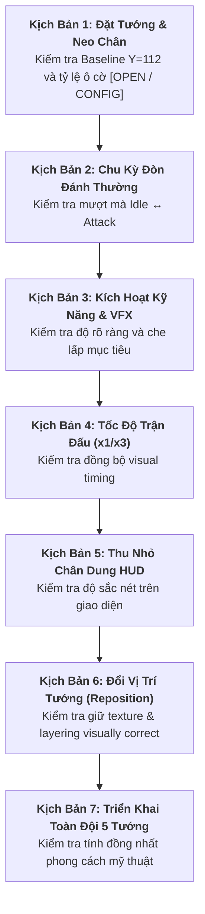

# Runtime Visual Test Scenarios (Manual QA Execution Guide)

> [!IMPORTANT]
> **Kịch Bản Kiểm Thử Thị Giác Thực Tế Trong Trận Đấu (Runtime Test Scenarios)**:
> - **Mục đích**: Cung cấp 7 kịch bản kiểm thử thao tác từng bước (Step-by-step Test Scenarios) để tester hoặc developer thực hiện kiểm tra bằng mắt sau khi hoàn tất tích hợp `VIS-C01`.
> - **Phạm vi kiểm thử**: Bao quát toàn bộ 5 Hero prototype, 20 file PNG asset, các trạng thái nhàn rỗi (Idle), tấn công (Attack), tuyệt kỹ (VFX), giao diện HUD, tốc độ trận đấu (x1/x3) và thao tác đổi vị trí tướng (Reposition).
> - **Tham số linh hoạt**: Mọi tham số thời lượng, tỉ lệ kích thước (Scale), điểm neo (Anchor) đều ở trạng thái `[OPEN / CONFIG]`.

---

## 1. Danh Sách 7 Kịch Bản Kiểm Thử Thị Giác

---

## 2. Chi Tiết Từng Kịch Bản Kiểm Thử

### Kịch Bản 1: Đặt Tướng & Kiểm Tra Neo Chân (Hero Placement & Baseline Alignment)

* **Mục tiêu**: Xác minh Hero khi được đặt xuống bàn cờ có tiếp đất chính xác theo đường Baseline $Y=112$, không bị bay lơ lửng hoặc thụt lún; góc nhìn Front View trực diện.
* **Các bước thực hiện**:
  1. Khởi động một trận đấu mới ở màn hình Game.
  2. Chọn lần lượt từng Hero trong số 5 tướng (`quan-vu`, `truong-phi`, `trieu-van`, `hoang-trung`, `gia-cat-luong`).
  3. Đặt mỗi tướng vào các vị trí ô cờ khác nhau trên bàn cờ.
  4. Quan sát kỹ ở trạng thái nhàn rỗi (Idle).
* **Kết quả kỳ vọng (Expected Results)**:
  * Góc nhìn nhân vật hoàn toàn trực diện (Front View Only), hướng về phía trước đối đầu quái.
  * Chân của tất cả 5 Hero tiếp xúc tự nhiên với mặt sàn của ô cờ (Anchor Y tại Baseline $Y=112$ `[OPEN / CONFIG]`).
  * Không có khoảng trống hở dưới chân (không lơ lửng) và không bị chìm xuống dưới mép ô cờ (không lún đất).
  * Tỷ lệ kích thước Hero trên ô cờ (Grid Scale = `[OPEN / CONFIG]`) hiển thị cân đối, vừa vặn trong ô cờ.

---

### Kịch Bản 2: Chu Kỳ Đòn Đánh Thường (Single Target Attack & Transition Smoothness)

* **Mục tiêu**: Xác minh chuyển đổi qua lại giữa `idle.png` và `attack.png` diễn ra mượt mà, không bị giật vị trí, lệch tâm hoặc nhấp nháy.
* **Các bước thực hiện**:
  1. Đặt 1 Hero (ví dụ: Quan Vũ hoặc Triệu Vân) trên đường di chuyển của quái.
  2. Bắt đầu đợt quái ở tốc độ mặc định **x1**.
  3. Quan sát Hero khi quái vật đầu tiên bước vào phạm vi tấn công (Range).
  4. Theo dõi chuyển động khi Hero vung đòn đánh đầu tiên và hồi về thế đứng.
* **Kết quả kỳ vọng (Expected Results)**:
  * Hero chuyển từ `idle.png` sang `attack.png` ngay khi đòn đánh phát động.
  * Không có hiện tượng tâm nhân vật bị giật lệch sang trái/phải hay lên/xuống (Zero anchor shift).
  * Không xuất hiện chớp nháy màn hình hoặc biến mất trong tích tắc (No flickering).
  * Sau khoảng thời gian vung đòn (`[OPEN / CONFIG]`), Hero trở lại `idle.png` thanh thoát.
  * Thời điểm vung đòn chạm đích tương ứng với thời điểm quái bị trừ máu trên thanh HP theo logic trận đấu.

---

### Kịch Bản 3: Kích Hoạt Kỹ Năng & Che Lấp VFX (Active Skill VFX Readability)

* **Mục tiêu**: Đảm bảo hiệu ứng VFX tuyệt kỹ xuất hiện rõ ràng nhưng không che lấp mất thông tin chiến trận (thanh máu, vị trí quái, bóng dáng tướng).
* **Các bước thực hiện**:
  1. Đặt Hero có kỹ năng (ví dụ: Gia Cát Lượng với `dong-phong-hoa-tran` hoặc Trương Phi với `ba-xa-gam-vang`).
  2. Cho Hero đánh đủ số đòn đánh quy định để kích hoạt Active Skill.
  3. Quan sát khoảnh khắc hiệu ứng VFX (`vfx/*.png`) bung ra trên màn hình.
  4. Quan sát các đơn vị quái vật nằm trong vùng ảnh hưởng của chiêu thức.
* **Kết quả kỳ vọng (Expected Results)**:
  * Sprite VFX xuất hiện rõ ràng, đúng vị trí mục tiêu hoặc vị trí phát chiêu (VFX Scale & Position = `[OPEN / CONFIG]`).
  * Hình dáng của quái và Hero vẫn nhận diện được xuyên qua hiệu ứng (không bị che khuất quá mức gây mất thông tin chiến trận).
  * Thanh máu (HP Bar) và hiệu ứng trạng thái (nếu có) trên đầu quái vẫn đọc được rõ ràng.
  * Sau khi thời lượng hiển thị (`[OPEN / CONFIG]`) kết thúc, VFX biến mất sạch sẽ, không lưu vết trên màn hình.

---

### Kịch Bản 4: Tốc Độ Trận Đấu (Game Speed Scaling: x1 $\rightarrow$ x3)

* **Mục tiêu**: Đảm bảo visual timing của animation tấn công và VFX tăng tốc tương ứng với tốc độ trận đấu, không bị trượt nhịp hay đơ hình.
* **Các bước thực hiện**:
  1. Trong đợt quái đang diễn ra, chuyển đổi tốc độ trận đấu: **x1** $\rightarrow$ **x3**.
  2. Quan sát tốc độ chuyển đổi `idle` $\leftrightarrow$ `attack` của các Hero đang giao chiến liên tục.
  3. Kích hoạt Active Skill trong khi đang ở tốc độ **x3**.
* **Kết quả kỳ vọng (Expected Results)**:
  * Tốc độ đổi frame `idle` $\rightarrow$ `attack` tăng tốc mượt mà theo nhịp tốc độ trận đấu (x1 / x3).
  * Không có trường hợp Hero bị "kẹt cứng" ở frame `attack.png`.
  * VFX kỹ năng ở tốc độ x3 phát ra và biến mất nhanh chóng tương ứng, không bị kéo dài dây dưa làm trễ nhịp đòn đánh kế tiếp.

---

### Kịch Bản 5: Thu Nhỏ Chân Dung Giao Diện (HUD & Portrait Scaling Clarity)

* **Mục tiêu**: Xác minh ảnh chân dung `portraits/*.png` khi co nhỏ trên các thành phần giao diện HUD vẫn sắc nét, dễ nhận biết.
* **Các bước thực hiện**:
  1. Mở thanh chọn tướng trên giao diện HUD.
  2. Nhấp chọn từng tướng để mở bảng thông tin chi tiết hoặc xem vòng chọn tướng.
  3. Kiểm tra hình ảnh avatar hiển thị trên các khu vực giao diện.
* **Kết quả kỳ vọng (Expected Results)**:
  * Khuôn mặt và các đặc điểm nhận dạng chính (râu Quan Vũ, mắt Trương Phi, tóc bạc Hoàng Trung, quạt lông Gia Cát Lượng, giáp bạc Triệu Vân) rõ ràng, sắc sảo.
  * Không bị răng cưa nặng, vỡ nét (pixelated) hoặc méo tỉ lệ khung hình.
  * Màu sắc chân dung hài hòa với nền theme của giao diện HUD.

---

### Kịch Bản 6: Đổi Vị Trí Tướng (Dynamic Hero Repositioning & Layering)

* **Mục tiêu**: Kiểm tra tính ổn định hình ảnh và lớp vẽ thị giác (layering visually correct) khi thực hiện đổi vị trí Hero giữa trận.
* **Các bước thực hiện**:
  1. Đặt 1 Hero ở ô cờ A và 1 Hero ở ô cờ B.
  2. Thực hiện reposition Hero bằng interaction hiện có của runtime sang ô cờ đích mới.
  3. Quan sát hiển thị của Hero trong và sau thao tác reposition.
* **Kết quả kỳ vọng (Expected Results)**:
  * Trong suốt thao tác reposition bằng interaction hiện có của runtime, sprite Hero duy trì hiển thị ổn định, không bị méo hoặc mất texture.
  * Khi sang ô đích mới, Hero tiếp đất chuẩn xác tại Baseline $Y=112$ (Anchor Y = `[OPEN / CONFIG]`).
  * Hero duy trì trạng thái `idle.png` và sẵn sàng tấn công mục tiêu trong phạm vi mới.
  * Thứ tự lớp vẽ hiển thị đúng mặt thị giác (layering visually correct), không bị chồng đè sai lệch giữa các đơn vị trên bàn cờ.

---

### Kịch Bản 7: Triển Khai Toàn Đội 5 Tướng (Full 5-Hero Visual Cohesion)

* **Mục tiêu**: Đánh giá tính đồng nhất về mặt ngôn ngữ mỹ thuật (Art Style Cohesion) khi cả 5 vị tướng cùng xuất hiện trên chiến trường.
* **Các bước thực hiện**:
  1. Triển khai đồng thời cả 5 Hero (`quan-vu`, `truong-phi`, `trieu-van`, `hoang-trung`, `gia-cat-luong`) lên 5 ô cờ khác nhau trên cùng một màn chơi.
  2. Quan sát toàn cảnh chiến trường.
  3. Đánh giá tổng quan về phong cách vẽ, tỷ lệ và độ tương phản.
* **Kết quả kỳ vọng (Expected Results)**:
  * Cả 5 tướng tạo thành một thể thống nhất, góc nhìn Front View đồng bộ.
  * Độ dày nét vẽ viền (Outline stroke) đồng đều giữa các nhân vật.
  * Tỷ lệ chiều cao tương quan giữa các tướng hài hòa tự nhiên.
  * Toàn bộ đội hình tạo nên một bố cục chiến trường sống động, đậm chất Tower Defense.
