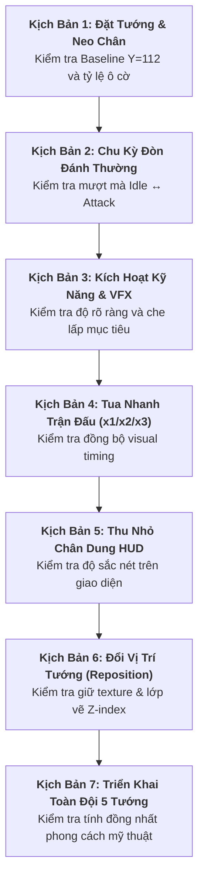

# Runtime Visual Test Scenarios (Manual QA Execution Guide)

> [!IMPORTANT]
> **Kịch Bản Kiểm Thử Thị Giác Thực Tế Trong Trận Đấu (Runtime Test Scenarios)**:
> - **Mục đích**: Cung cấp 7 kịch bản kiểm thử thao tác từng bước (Step-by-step Test Scenarios) để tester hoặc developer thực hiện kiểm tra bằng mắt sau khi hoàn tất tích hợp `VIS-C01`.
> - **Phạm vi kiểm thử**: Bao quát toàn bộ 5 Hero prototype, 20 file PNG asset, các trạng thái nhàn rỗi (Idle), tấn công (Attack), tuyệt kỹ (VFX), giao diện HUD, tốc độ trận đấu (x1/x2/x3) và thao tác kéo thả (Reposition).
> - **Tham số linh hoạt**: Mọi tham số thời lượng (`attackDuration`, `vfxDuration`, `speedMultiplier`) đều ở trạng thái `[OPEN / CONFIG]`.

---

## 1. Danh Sách 7 Kịch Bản Kiểm Thử Thị Giác

---

## 2. Chi Tiết Từng Kịch Bản Kiểm Thử

### Kịch Bản 1: Đặt Tướng & Kiểm Tra Neo Chân (Hero Placement & Baseline Alignment)

* **Mục tiêu**: Xác minh Hero khi được đặt xuống bàn cờ có tiếp đất chính xác theo đường Baseline $Y=112$, không bị bay lơ lửng hoặc thụt lún.
* **Các bước thực hiện**:
  1. Khởi động một trận đấu mới ở màn hình Game.
  2. Chọn lần lượt từng Hero trong số 5 tướng (`quan-vu`, `truong-phi`, `trieu-van`, `hoang-trung`, `gia-cat-luong`).
  3. Đặt mỗi tướng vào các vị trí ô cờ khác nhau: Hàng trên cùng, hàng giữa, và hàng dưới cùng.
  4. Dừng trận đấu (Pause) hoặc quan sát kỹ ở trạng thái nhàn rỗi (Idle).
* **Kết quả kỳ vọng (Expected Results)**:
  * Chân của tất cả 5 Hero tiếp xúc tự nhiên với mặt sàn của ô cờ.
  * Không có khoảng trống hở dưới chân (không lơ lửng).
  * Chân không bị chìm cắt ngang vào cạnh dưới của ô cờ (không lún đất).
  * Tỷ lệ cơ thể Hero chiếm khoảng $70\% - 90\%$ ô cờ một cách cân đối `[OPEN / CONFIG]`.

---

### Kịch Bản 2: Chu Kỳ Đòn Đánh Thường (Single Target Attack & Transition Smoothness)

* **Mục tiêu**: Xác minh chuyển đổi qua lại giữa `idle.png` và `attack.png` diễn ra mượt mà, không bị giật vị trí, lệch tâm hoặc nhấp nháy.
* **Các bước thực hiện**:
  1. Đặt 1 Hero (ví dụ: Quan Vũ hoặc Triệu Vân) trên đường di chuyển của quái.
  2. Bắt đầu đợt quái (Wave 1) ở tốc độ mặc định **x1**.
  3. Quan sát Hero khi quái vật đầu tiên bước vào phạm vi tấn công (Range).
  4. Theo dõi chuyển động khi Hero vung đòn đánh đầu tiên và hồi về thế đứng.
* **Kết quả kỳ vọng (Expected Results)**:
  * Hero chuyển từ `idle.png` sang `attack.png` ngay khi đòn đánh phát động.
  * Không có hiện tượng tâm nhân vật bị giật lệch sang trái/phải hay lên/xuống (Zero anchor shift).
  * Không xuất hiện chớp nháy màn hình hoặc biến mất trong tích tắc (No flickering).
  * Sau khoảng thời gian `attackDuration` (`[OPEN / CONFIG]`), Hero trở lại `idle.png` thanh thoát.
  * Thời điểm vung đòn chạm đích tương ứng chính xác với thời điểm quái bị trừ máu trên thanh HP.

---

### Kịch Bản 3: Kích Hoạt Kỹ Năng & Che Lấp VFX (Active Skill VFX Readability)

* **Mục tiêu**: Đảm bảo hiệu ứng VFX tuyệt kỹ xuất hiện hoành tráng nhưng không che lấp mất thông tin chiến trận (thanh máu, vị trí quái, bóng dáng tướng).
* **Các bước thực hiện**:
  1. Đặt Hero có kỹ năng diện rộng hoặc tầm xa (ví dụ: Gia Cát Lượng với `dong-phong-hoa-tran` hoặc Trương Phi với `ba-xa-gam-vang`).
  2. Cho Hero đánh đủ số đòn đánh quy định để kích hoạt Active Skill.
  3. Quan sát khoảnh khắc hiệu ứng VFX (`vfx/*.png`) bung ra trên màn hình.
  4. Quan sát các đơn vị quái vật nằm trong vùng ảnh hưởng của chiêu thức.
* **Kết quả kỳ vọng (Expected Results)**:
  * Sprite VFX xuất hiện rõ ràng, đúng vị trí mục tiêu hoặc vị trí phát chiêu.
  * Hình dáng của quái và Hero vẫn nhận diện được xuyên qua hiệu ứng (không bị che khuất $100\%$ gây mù thông tin).
  * Thanh máu (HP Bar) và hiệu ứng trạng thái (Stun/Slow nếu có) trên đầu quái vẫn đọc được rõ ràng.
  * Sau khi thời lượng `vfxDuration` kết thúc (`[OPEN / CONFIG]`), VFX tan biến sạch sẽ, không lưu vết trên canvas.

---

### Kịch Bản 4: Tua Nhanh Trận Đấu (Game Speed Scaling: x1 $\rightarrow$ x2 $\rightarrow$ x3)

* **Mục tiêu**: Đảm bảo visual timing của animation tấn công và VFX tăng tốc tỷ lệ thuận với tốc độ trận đấu, không bị trượt nhịp hay đơ hình.
* **Các bước thực hiện**:
  1. Trong đợt quái đông đảo, thiết lập tốc độ trận đấu lần lượt: **x1** $\rightarrow$ **x2** $\rightarrow$ **x3**.
  2. Quan sát tốc độ chuyển đổi `idle` $\leftrightarrow$ `attack` của các Hero đang giao chiến liên tục.
  3. Kích hoạt Active Skill trong khi đang ở chế độ **x3**.
* **Kết quả kỳ vọng (Expected Results)**:
  * Tốc độ đổi frame `idle` $\rightarrow$ `attack` tăng tốc mượt mà theo nhịp của `speedMultiplier`.
  * Không có trường hợp Hero bị "kẹt cứng" ở frame `attack.png` do thời gian hồi chiêu bị tính sai.
  * VFX kỹ năng ở tốc độ x3 phát ra và biến mất nhanh chóng tương ứng, không bị kéo dài dây dưa làm trễ nhịp đòn đánh kế tiếp.

---

### Kịch Bản 5: Thu Nhỏ Chân Dung Giao Diện (HUD & Portrait Scaling Clarity)

* **Mục tiêu**: Xác minh ảnh chân dung `portraits/*.png` khi co nhỏ trên các thành phần UI vẫn sắc nét, dễ nhận biết.
* **Các bước thực hiện**:
  1. Mở thanh danh sách triển khai tướng (Deploy Bar / Card Tray).
  2. Nhấp chọn từng tướng để mở bảng chi tiết (Hero Info Modal / Selection Ring).
  3. Kiểm tra hình ảnh avatar hiển thị ở góc màn hình hoặc trên thanh chọn.
* **Kết quả kỳ vọng (Expected Results)**:
  * Khuôn mặt và các đặc điểm nhận dạng chính (râu Quan Vũ, mắt Trương Phi, tóc bạc Hoàng Trung, quạt lông Gia Cát Lượng, giáp bạc Triệu Vân) rõ ràng, sắc sảo.
  * Không bị răng cưa nặng, vỡ nét (pixelated) hoặc méo tỉ lệ khung hình tròn/vuông.
  * Màu sắc chân dung hài hòa với nền theme của giao diện HUD.

---

### Kịch Bản 6: Đổi Vị Trí Tướng Động (Dynamic Hero Repositioning & Layering)

* **Mục tiêu**: Kiểm tra tính ổn định hình ảnh và lớp vẽ Z-Index khi người chơi kéo thả đổi vị trí Hero giữa trận.
* **Các bước thực hiện**:
  1. Đặt 1 Hero ở hàng trên (Row 1) và 1 Hero ở hàng dưới (Row 2).
  2. Nhấp và kéo Hero hàng trên di chuyển xuống hàng dưới hoặc đổi vị trí sang ô khác.
  3. Thả Hero vào ô cờ đích mới trong lúc quái đang di chuyển ngang qua.
* **Kết quả kỳ vọng (Expected Results)**:
  * Trong suốt quá trình kéo (Drag), sprite Hero giữ nguyên hình ảnh hiển thị ổn định theo con trỏ chuột.
  * Khi thả vào ô mới, Hero lập tức tiếp đất chuẩn xác tại Baseline $Y=112$ của ô mới.
  * Hero lập tức duy trì trạng thái `idle.png` và sẵn sàng tấn công mục tiêu trong tầm mới.
  * Thứ tự hiển thị Z-Index chuẩn xác: Hero ở hàng dưới che phủ phần chân của Hero ở hàng trên nếu có sự giao thoa thị giác chiều sâu.

---

### Kịch Bản 7: Triển Khai Toàn Đội 5 Tướng (Full 5-Hero Visual Cohesion)

* **Mục tiêu**: Đánh giá tính đồng nhất về mặt ngôn ngữ mỹ thuật (Art Style Cohesion) khi cả 5 vị tướng cùng xuất hiện trên chiến trường.
* **Các bước thực hiện**:
  1. Triển khai đồng thời cả 5 Hero (`quan-vu`, `truong-phi`, `trieu-van`, `hoang-trung`, `gia-cat-luong`) lên 5 ô cờ khác nhau trên cùng một màn chơi.
  2. Thu nhỏ tầm nhìn toàn cảnh chiến trường.
  3. Đánh giá tổng quan về phong cách vẽ, tỷ lệ và độ tương phản.
* **Kết quả kỳ vọng (Expected Results)**:
  * Cả 5 tướng tạo thành một thể thống nhất, không có nhân vật nào bị lệch tông nghệ thuật (ví dụ: 1 nhân vật tả thực giữa 4 nhân vật hoạt họa).
  * Độ dày nét vẽ viền (Outline stroke) đồng đều giữa các nhân vật.
  * Chiều cao tương quan giữa các tướng tự nhiên và hợp lý (Hoàng Trung và Quan Vũ bệ vệ, Triệu Vân thanh thoát).
  * Toàn bộ đội hình tạo nên một bố cục chiến trường sống động, đậm chất sử thi Tower Defense.
