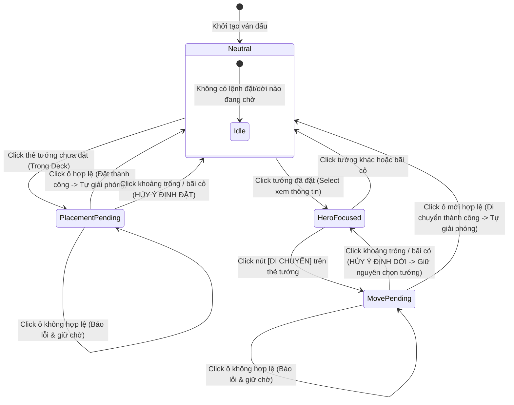

# Đặc Tả Thị Giác & Kiểm Tra Chất Lượng Giao Diện Trận Đấu (HUD V1 Visual Spec & QA Audit)

**Task ID**: `HUD-A01R` (Corrective Revision of `HUD-A01`)
**Tài liệu**: `docs/drafts/hud/HUD_V1_VISUAL_SPEC.md`
**Chương mục tiêu**: Màn chơi Hai Bà Trưng (*Huyết Chiến Lãng Bạc*) & Khung Battle HUD Chuẩn Hóa
**Trạng thái**: Official Corrective Visual Specification — Implementation-Ready for HUD-C02

---

> [!IMPORTANT]
> **Ràng Buộc & Quyền Sở Hữu Tài Liệu (Scope & File Ownership)**:
> - **Antigravity không can thiệp code runtime** trong task này để tránh xung đột mã nguồn với Codex.
> - **Chỉ tạo/sửa trong thư mục**: `docs/drafts/hud/**`.
> - **Tuyệt đối cấm sửa**: `src/**`, `tests/**`, `package.json`, `PROJECT_PLAN.md`.
> - **Nhiệm vụ trọng tâm**: Cập nhật chính xác 5 điểm hiệu đính cốt lõi (Flat bonus equipment, Wave running lock rules, Interaction flow deployed hero, Empty-background click intent clearing, và Combat Inventory scope), đồng thời duy trì toàn bộ báo cáo QA Audit và hướng dẫn triển khai cho Codex (`Implementation Notes for Codex`).

---

## 1. Đánh Giá Hiện Trạng & Phân Tích Chất Lượng Giao Diện (HUD QA Audit)

Qua rà soát trực quan bản dựng chạy thực tế trên desktop, các vấn đề thẩm mỹ và trải nghiệm được xác định như sau:

| Hạng Mục Rà Soát | Vấn Đề Hiện Trạng Trên Bản Dựng | Giải Pháp Thiết Kế Chuẩn Hóa (HUD V1) |
|---|---|---|
| **1. Dải đen trống cạnh tabs** *(Empty strip next to tabs)* | Thanh điều hướng `meta-tabs` nằm độc lập ở giữa màn hình, để lại một khoảng trống đen lớn vô nghĩa bên phải, ngắt quãng dòng chảy thị giác giữa canvas và bảng điều khiển. | Tích hợp trực tiếp thanh Tab làm **Header gắn liền của Khung Dưới Đáy (Bottom HUD Panel)**, kéo dài toàn bộ chiều rộng, loại bỏ hoàn toàn khoảng trống thừa. |
| **2. Phân cấp Top Header** *(Top header hierarchy)* | Các phần tử `Tên Màn`, `Thành HP`, `Vàng/KNB`, `Wave` và `Chip Quái` bị phân tán, kích thước chữ không đồng nhất, thiếu ranh giới thị giác giữa nhóm phòng thủ và nhóm tài nguyên. | Gom thành **3 phân khu thị giác độc lập** trên 1 thanh ngang: **Trái** (Thành trì & Chiến dịch) — **Giữa** (Tiến trình Wave) — **Phải** (Tài nguyên & Bộ đếm quái). |
| **3. Độ dày & chói của Range Circle** *(Range circle styling)* | Vòng tròn tầm đánh vẽ bằng nét dày ($2\text{ px}$) với độ đục cao; khi cắm 3 tướng thì các vòng đan xen làm rối loạn tầm nhìn bãi bồi và đường đi của quái. | Giảm độ dày nét vẽ xuống $\mathbf{\le 1.5\text{ px}}$, giảm alpha viền còn $\mathbf{0.35}$, nền trong suốt $\mathbf{0.04}$. Thêm nút bấm **`Tầm đánh: Tắt`** toàn cục (Mặc định: TẮT). |
| **4. Ô chỉ định được chọn** *(Selected tile indicator)* | Ô triển khai đang chọn (`selected`) chỉ đổi màu vàng nhạt, khó phân biệt với ô trống thường trên nền nước sông và bụi rậm. | Áp dụng hiệu ứng **viền vàng hổ phách (`#fbbf24`, nét $2.5\text{ px}$)** kèm góc ngắm mục tiêu (corner brackets) và hiệu ứng thở nhẹ (subtle pulse). |
| **5. Kiểu dáng Tab Active/Inactive** *(Tab state styling)* | Nút tab chỉ đổi màu nền cơ bản (`#3a2b12` vs `#172033`), không tạo cảm giác kết nối vật lý với nội dung bên dưới. | Thiết kế Tab dạng **folder gắn liền panel**: Tab Active có viền trên vàng kim, không có viền đáy, liền mạch với thân panel; Tab Inactive chìm xuống nền tối. |
| **6. Mật độ & Khả năng đọc Bottom HUD** *(Bottom density & readability)* | Bảng đáy có nhiều khoảng đệm trống, các nút bấm không thẳng hàng; dòng chữ `"Chọn ô để di chuyển"` bị lưu lại vĩnh viễn gây hiểu nhầm. | Phân chia bố cục lưới chặt chẽ: Cột trái (Nội dung Tab $75\%$), Cột phải (Cụm điều khiển $25\%$). Tự động reset hướng dẫn về `"Sẵn sàng chiến đấu"`. |

---

## 2. Bố Cục Không Gian & Ba Độ Phân Giải Desktop (Desktop Viewport Target)

Giao diện Battle HUD V1 được thiết kế theo nguyên tắc **Single-Viewport No-Scroll**: toàn bộ màn hình chiến đấu phải nằm trọn trong khung nhìn $100\text{vh}$, ưu tiên tối đa diện tích chiều dọc cho bàn cờ chiến trường.

```
┌──────────────────────────────────────────────────────────────────────────────┐
│ [🏯 Huyết Chiến Lãng Bạc] [Thành HP: 10/10] │ [ĐỢT 3/10] │ [🪙 1,250] [⚔×4 🏹×2] │ (TOP HUD: ~44-48px)
├──────────────────────────────────────────────────────────────────────────────┤
│                                                                              │
│                                                                              │
│                         BÀN CỜ CHIẾN TRƯỜNG CHÍNH                           │
│                      (DOMINANT BATTLEFIELD CANVAS)                           │
│                      [Tỷ Lệ 4:3-ish Căn Giữa Màn Hình]                       │
│                                                                              │
│                                                                              │
├──────────────────────────────────────────────────────────────────────────────┤
│ 💬 Hướng dẫn: Đã chọn Trưng Nhị (Ô 2-4). Nhấn 'Di chuyển' để dời vị trí.     │ (HINT BAR: ~22-26px)
├──────────────────────────────────────────────────────────────────────────────┤
│ [ ⚔ ĐỘI HÌNH ]   [ 🎒 HÀNH TRANG ]   [ 🔒 Đang đánh wave: Khóa Lắp/Gỡ ]      │ (TAB HEADER: ~32px)
├───────────────────────────────────────────────────────┬──────────────────────┤
│ VÙNG NỘI DUNG THAY THẾ ĐỒNG VỊ TRÍ                     │ CỤM ĐIỀU KHIỂN CHUNG │
│                                                       │                      │
│ • TAB ĐỘI HÌNH: 3 Thẻ Tướng Xuất Trận                │ ⚡ Quân Lệnh: 1/1    │
│ • TAB HÀNH TRANG: Loadout Tướng Đang Chọn + Túi Đồ   │ 🛡 Triển Khai: 2/3   │ (PANEL THÂN:
│   (Vũ Khí, Ngọc, Ghép 3, Lắp/Gỡ)                      │ [ ▶ BẮT ĐẦU WAVE ]   │  ~120-145px)
│                                                       │ [ AUTO: BẬT ]        │
│                                                       │ [x1][x3] [🎯Tầm:Bật] │
│                                                       │ [🔍 Chi Tiết Tướng]  │
└───────────────────────────────────────────────────────┴──────────────────────┘
```

### 2.1. Kiểm Tra Độ Phù Hợp Trên 3 Viewport Desktop

| Độ Phân Giải Màn Hình | Chiều Cao Battlefield (`game-frame`) | Chiều Cao Bottom HUD (Tabs + Panel) | Trải Nghiệm & Hành Vi Co Giãn |
|---|:---:|:---:|---|
| **$1920 \times 1080$** (Full HD) | $\approx 640 - 680\text{ px}$ ($\approx 63\%$ viewport) | $\approx 180\text{ px}$ ($32\text{ px}$ tabs + $148\text{ px}$ panel) | Rộng rãi tối đa; canvas sắc nét; thẻ tướng và ô trang bị hiển thị đầy đủ chi tiết với padding $12\text{ px}$. **Zero scroll**. |
| **$1600 \times 900$** (HD+) | $\approx 520 - 550\text{ px}$ ($\approx 60\%$ viewport) | $\approx 165\text{ px}$ ($30\text{ px}$ tabs + $135\text{ px}$ panel) | Tỷ lệ cân đối hoàn hảo; canvas co giãn tự nhiên; padding $10\text{ px}$; toàn bộ nút bấm vừa vặn. **Zero scroll**. |
| **$1366 \times 768$** (Desktop Tối Thiểu) | $\approx 440 - 460\text{ px}$ ($\approx 59\%$ viewport) | $\approx 150\text{ px}$ ($28\text{ px}$ tabs + $122\text{ px}$ panel) | Chế độ gọn gàng (Compact Mode): Top HUD giảm còn $40\text{ px}$, icon trang bị $42\text{ px}$, chữ mô tả rút gọn 1 dòng. **Tuyệt đối không cuộn trang**. |

---

## 3. Đặc Tả Hai Trạng Thái Tab: [ ĐỘI HÌNH ] & [ HÀNH TRANG ]

### 3.1. Trạng Thái 1: Tab [ ĐỘI HÌNH ] (Hero Roster Deck)

Khi Tab `ĐỘI HÌNH` được kích hoạt, vùng đáy hiển thị **3 Thẻ Tướng Xuất Trận** xếp ngang trên một hàng:


#### A. Cấu Trúc Thẻ Tướng (Hero Card Anatomy)
* **Kích thước**: Rộng $260 - 280\text{ px}$, Cao $105 - 115\text{ px}$, bo góc $8\text{ px}$.
* **Ảnh Chân Dung (Portrait Frame)**: Kích thước $64 \times 80\text{ px}$ (hoặc $70 \times 90\text{ px}$), pixel art trực diện (Front View), viền nổi theo trạng thái.
* **Khu vực thông tin (Card Meta)**:
  - **Dòng 1**: Tên Tướng (Font bold $15\text{ px}$, màu `#f8fafc`).
  - **Dòng 2**: Badge Trạng Thái Triển Khai.
  - **Dòng 3**: Vị trí ô đóng giữ trên bản đồ (VD: `Vị trí: Ô 2-4 (Sông)` hoặc `Chưa triển khai`).
  - **Dòng 4 (Nút Thao Tác)**:
    - Nếu tướng chưa đặt: Nút `[Triển Khai]` (Xanh dương đậm `#1d4ed8`).
    - Nếu tướng đã đặt: Nút `[Di Chuyển]` (Xanh lam `#1e293b`, viền `#3b82f6`).
    - Nếu đang trong trạng thái chờ dời: Nút `[Hủy Dời]` (Đỏ mờ `#7f1d1d`).

#### B. Ma Trận Trạng Thái Thẻ Tướng (Hero Card State Matrix)

| Trạng Thái Thẻ (State) | Màu Viền Khung | Màu Nền Thẻ | Nhãn Badge (Badge Text) | Nút Thao Tác Hiển Thị |
|---|---|---|---|---|
| **1. Trong Deck (Available)** | Xám thép `#475569` ($1\text{ px}$) | `#172236` | `● Trong Deck` (Xám) | Nút `[Triển Khai]` $\rightarrow$ Kích hoạt `PlacementPending`. |
| **2. Đang Chọn Đặt (PlacementPending)** | Xanh lơ sáng `#38bdf8` ($2\text{ px}$) | `#0c2d48` | `⚡ Chọn ô để đặt` (Xanh lơ) | Nút `[Hủy Đặt]` $\rightarrow$ Reset về `Neutral`. |
| **3. Đã Triển Khai (Deployed - Focus)** | Xanh ngọc `#10b981` ($1.5\text{ px}$) | `#064e3b` | `● Đã triển khai` (Lục sáng) | Nút `[Di Chuyển]` $\rightarrow$ Kích hoạt `MovePending`. |
| **4. Đang Chờ Dời Ô (MovePending)** | Vàng hổ phách `#fbbf24` ($2\text{ px}$) | `#451a03` | `⚡ Chờ chọn ô mới` (Vàng) | Nút `[Hủy Dời]` $\rightarrow$ Reset về `Neutral`. |

---

### 3.2. Trạng Thái 2: Tab [ HÀNH TRANG ] (Combat Inventory & Loadout)

> [!IMPORTANT]
> **Phạm Vi Giới Hạn Của Tab HÀNH TRANG Trong Trận Đấu (Combat Scope)**:
> - Tab `HÀNH TRANG` trong Battle HUD **chỉ bao gồm Quản Lý Trang Bị / Kho Đồ (Equipment Loadout, Inventory Grid, Merge, Equip/Unequip)**.
> - **Tuyệt đối không đưa các tính năng kinh tế ngoại vi** như Gacha, Cửa Hàng (Shop), Chiêu Mộ Tướng (Recruitment), Sử Dụng Lệnh Bài / Tiêu Hao (Consumable economy actions) vào HUD chiến đấu thời gian thực. Các tính năng đó thuộc về màn hình Meta / Quản lý ngoài trận đấu.

Khi Tab `HÀNH TRANG` được kích hoạt, **toàn bộ 3 thẻ tướng được thay thế ngay tại chỗ** bằng giao diện Quản Lý Trang Bị gọn gàng:


#### A. Phân Vùng 1: Trang Bị Của Tướng Đang Chọn (Current Hero Loadout — Rộng $\approx 270\text{ px}$)
Nhằm giữ cho Bottom HUD không bị phình to theo chiều cao, trang bị được tổ chức trực quan theo từng Hero:
* **Bộ chọn Tướng nhanh (Hero Mini-Pills)**: 3 nút gạt nhỏ `[Trưng Trắc]` `[Trưng Nhị]` `[Lê Chân]` ở đầu khung để đổi nhanh Hero muốn xem trang bị (đồng bộ với `selectedHeroId`).
* **2 Ô Trang Bị Cố Định (Dedicated Loadout Slots)**:
  1. **Ô Vũ Khí (`⚔ VŨ KHÍ`)**:
     - *Khi đã gắn*: Hiện tên vũ khí (VD: `Trống Đồng`), cấp độ `Lv3 · ATK +35`, nút nhỏ `[Gỡ]`.
     - *Khi trống*: Khung viền nét đứt màu xám, hiện chữ `+ Trống (Chưa gắn Vũ Khí)`.
  2. **Ô Ngọc Khảm (`💎 NGỌC`)**:
     - *Khi đã gắn*: Hiện tên ngọc (VD: `Hồng Ngọc`), cấp độ `Lv2 · Range +15` hoặc `AttackSpeed +10`, nút nhỏ `[Gỡ]`.
     - *Khi trống*: Khung viền nét đứt màu xám, hiện chữ `+ Trống (Chưa gắn Ngọc)`.

#### B. Phân Vùng 2: Lưới Túi Đồ Trang Bị (Inventory Grid Slots — Rộng $\approx 600\text{ px}$)
* **Cơ chế hiển thị**: Lưới các ô trang bị hình chữ nhật đứng ($105\text{ px} \times 96\text{ px}$), sắp xếp theo hàng ngang có thanh cuộn nội bộ mượt mà (`overflow-y: auto`).
* **Quy chuẩn chỉ số Flat Bonus**:
  - Toàn bộ trang bị chỉ sử dụng chỉ số cộng thẳng dạng: `ATK +N`, `Range +N`, `AttackSpeed +N` (Ví dụ: `ATK +35`, `ATK +12`, `Range +8`, `AttackSpeed +15`).
  - **Không sử dụng chỉ số phần trăm** (như `Spd +5%`).
* **Cấu trúc 1 Ô Trang Bị (Inventory Slot)**:
  - **Huy hiệu loại**: `⚔ VŨ KHÍ` (Xanh lam) hoặc `💎 NGỌC` (Tím).
  - **Tên trang bị & Cấp độ**: `Lạc Long Kiếm` - `Lv1`.
  - **Chỉ số cộng thêm ngắn gọn**: `ATK +12` hoặc `Range +8` hoặc `AttackSpeed +15`.
  - **Trạng thái chủ sở hữu**: Badge nhỏ `Trưng Trắc dùng` (nếu đã có người đeo) hoặc `Túi đồ (Rảnh)`.
  - **Nút hành động nhanh**:
    - Nếu rảnh: Nút `[Lắp vào]` (Xanh dương đậm `#1d4ed8`).
    - Nếu đang được chọn dùng: Nút `[Tháo gỡ]` (Đỏ mờ `#7f1d1d`).
    - Nếu là trưởng nhóm ghép 3: Nút `[✨ Ghép 3 → Lv N+1]` (Tím sáng `#7c3aed`).

#### C. Quy Tắc Khóa Trang Bị Khi Đang Chạy Wave (Wave Running Rules)
Khi một Wave đang diễn ra (`waveStatus === 'running'`):
1. **Lắp Trang Bị (`Equip`) = `LOCK / DISABLED`**: Nút `[Lắp vào]` bị vô hiệu hóa (`opacity: 0.45; cursor: not-allowed`), tooltip: *"Không thể lắp trang bị khi đang trong đợt chiến!"*.
2. **Tháo Trang Bị (`Unequip`) = `LOCK / DISABLED`**: Nút `[Tháo gỡ]` bị vô hiệu hóa, tooltip: *"Không thể tháo trang bị khi đang trong đợt chiến!"*.
3. **Ghép 3 Trang Bị (`Merge`) = `ALLOWED / ENABLED`**: Nút `[✨ Ghép 3 → Lv N+1]` **vẫn hoạt động bình thường**, cho phép người chơi tối ưu hóa các trang bị rảnh rỗi trong túi đồ mà không ảnh hưởng trực tiếp đến chỉ số runtime của Hero đang tham chiến.
4. **Huy hiệu thông báo**: Hiển thị trên thanh tab: `[🔒 Đang đánh wave: Khóa Lắp/Gỡ · Cho phép Ghép 3]`.

---

## 4. Đặc Tả Tương Tác Chọn Tướng, Di Chuyển & Hủy Lệnh

### 4.1. Quy Chuẩn Tương Tác Hai Bước Cho Tướng Đã Đặt (Two-Step Move Interaction)

> [!IMPORTANT]
> **Nguyên Tắc Tránh Nhảy Vị Trí Vô Ý (Intentional Movement Guard)**:
> - **Click vào Tướng đã triển khai (trên bàn cờ hoặc thẻ tướng)** $\rightarrow$ Chỉ thực hiện hành động **`SELECT`** (chọn Hero để focus, xem thông tin/loadout/tầm đánh, mở nút `[Di Chuyển]`).
> - **Tuyệt đối không tự động kích hoạt di chuyển ngay khi vừa click vào tướng đã đặt**.
> - Chỉ khi người chơi **chủ động bấm nút `[Di Chuyển]`** (hoặc nút chuyển lệnh tương đương) $\rightarrow$ Hệ thống mới chuyển sang trạng thái **`MovePending`** để chờ click ô mới.



### 4.2. Quy Tắc Click Vào Khoảng Trống / Bãi Cỏ (Empty-Background Click Rule)

Khi người chơi click chuột vào vùng cỏ, dòng sông hoặc khoảng trống không phải là ô triển khai hợp lệ:

1. **`Clear PlacementIntent`**:
   - Hủy bỏ ngay lập tức ý định đặt tướng mới (`PlacementPending`) hoặc ý định di chuyển tướng (`MovePending`).
   - Xóa bỏ vệt highlight trên các ô triển khai.
   - Xóa bỏ vòng tầm đánh dự kiến (Preview Range) đang theo chuột.
2. **`KHÔNG CLEAR selectedHeroId`**:
   - **Vẫn giữ nguyên `selectedHeroId` hiện tại** để người chơi tiếp tục theo dõi thông tin, xem trang bị trong tab Hành Trang hoặc mở Modal Chi Tiết Tướng mà không bị mất dấu.
3. **An toàn chiến đấu tuyệt đối**:
   - Không di chuyển bất kỳ tướng nào.
   - Không gây ảnh hưởng đến tiến trình Wave hoặc đồng hồ trận đấu (`GameClock`).

### 4.3. Ma Trận Hành Vi Tương Tác Chi Tiết (Interaction Behavior Matrix)

| Hành Động Người Chơi | Trạng Thái Trước | Trạng Thái Sau | Phản Hồi Thị Giác Trên Bản Đồ & HUD | Ghi Chú An Toàn |
|---|---|---|---|---|
| **Click thẻ tướng chưa đặt** | `Neutral` | `PlacementPending` | Thẻ đổi viền xanh lơ; ô trống sáng viền đứt; hiện vòng tầm đánh theo chuột; thanh hint: `Chọn vị trí triển khai [Tướng]`. | Vũ trang đặt tướng mới. |
| **Click ô hợp lệ khi chờ đặt** | `PlacementPending` | `Neutral` | Tướng xuất hiện trên ô; thẻ chuyển `Đã triển khai`; **tự động reset về Neutral**; thanh hint: `Sẵn sàng chiến đấu`. | **Giải phóng vũ trang ngay**. |
| **Click tướng đã đặt** | `Neutral` | `HeroFocused` | Tướng sáng viền chọn; thẻ hiện nút `[Di Chuyển]`; thanh hint: `Đã chọn [Tướng]. Nhấn 'Di chuyển' để dời vị trí`. | **Chỉ Select, KHÔNG di chuyển ngay**. |
| **Click nút [Di Chuyển]** | `HeroFocused` | `MovePending` | Thẻ đổi viền vàng nhấp nháy; các ô trống khác sáng viền đón; thanh hint: `Chọn vị trí mới cho [Tướng]`. | **Vũ trang chờ chọn ô mới**. |
| **Click ô mới khi chờ dời** | `MovePending` | `Neutral` | Tướng dời sang ô mới; thẻ trở lại `Đã triển khai`; **tự động reset về Neutral**; thanh hint: `Sẵn sàng chiến đấu`. | **Hoàn tất di chuyển an toàn**. |
| **Click bãi cỏ trống bất kỳ** | `PlacementPending` hoặc `MovePending` | `HeroFocused` / `Neutral` | **Hủy PlacementIntent ngay lập tức**: Xóa vệt highlight ô; ẩn vòng xem trước; **giữ nguyên `selectedHeroId`**. | **Chống click nhầm cực kỳ an toàn**. |
| **Click ô không hợp lệ (cấm/đầy)** | `PlacementPending` hoặc `MovePending` | Giữ nguyên trạng thái chờ | Chớp đỏ ô click trong $0.3\text{s}$; thanh hint báo: `Không thể đặt tướng tại đây`. | Không làm mất trạng thái đang chọn. |

---

## 5. Hướng Dẫn Kỹ Thuật Dành Cho Codex (Implementation Notes for Codex)

> [!TIP]
> **Khuyến Nghị Triển Khai Không Gây Xung Đột Code (For Codex Execution / Task HUD-C02)**:
> 1. **Tách biệt State Chọn Tướng và Ý Định Đặt/Dời (`Selection` vs `PlacementIntent`)**:
>    - `selectedHeroId`: Định danh tướng đang được focus (để hiển thị loadout, xem thông tin, bật Modal Chi Tiết). Không bị xóa khi click bãi cỏ.
>    - `placementIntent`: State cục bộ (`null | { type: 'place', heroId } | { type: 'move', heroId }`). Được kích hoạt khi bấm nút `[Triển Khai]` hoặc `[Di Chuyển]`. **Bị xóa về `null` khi click bãi cỏ trống hoặc khi thao tác thành công**.
> 2. **Xử lý Tương Tác Click Bãi Cỏ (`Empty Grass Click`) Trong Phaser**:
>    - Trong `BattleScene.ts`: Đăng ký sự kiện click nền `this.input.on('pointerdown', (pointer, currentlyOver) => { ... })`.
>    - Nếu `currentlyOver.length === 0` (click vào vùng không có interactive tile/hero): Gửi thông điệp `battleBridge.clearPlacementIntent()` để hủy lệnh chờ, nhưng giữ nguyên `selectedHeroId`.
> 3. **Quy Tắc Khóa Nút Trong Wave (`Wave Running Gate`)**:
>    - Trong component quản lý trang bị: Kiểm tra `const isWaveRunning = data.waveStatus === 'running'`.
>    - Nút `[Lắp vào]` và `[Tháo gỡ]`: set `disabled={isWaveRunning}`.
>    - Nút `[Ghép 3]`: **vẫn giữ `disabled={false}`** nếu đủ 3 nguyên liệu rảnh.
> 4. **Tổ Chức Giao Diện Combat HÀNH TRANG**:
>    - Loại bỏ component `EconomyPanel` (Gacha/Shop/Recruit/Consumables) khỏi luồng render của `App.tsx` trong màn chơi chiến đấu.
>    - Tích hợp `meta-tabs` và view túi đồ `BottomInventoryView` vào trực tiếp khung `BottomPlayerHUD.tsx`.
> 5. **Công Tắc Tầm Đánh Toàn Cục (`Global Range Overlay`)**:
>    - Thêm boolean `isRangeOverlayVisible` trong `BattleBridge` / `BattleScene`.
>    - Khi `false`: Set `rangeVisual.setVisible(false)` cho toàn bộ tướng tĩnh.
>    - Khi `placementIntent !== null` (đang rê chuột đặt/dời): Luôn hiển thị `previewRangeVisual` độc lập với công tắc toàn cục.

---

## 6. Danh Mục Tài Sản Hình Ảnh Đính Kèm (Asset Deliverables)

Tất cả mockup thiết kế dạng vector SVG độc lập được lưu trữ tại:
1. `docs/drafts/hud/assets/battle-hud-v1-layout-mockup.svg`: Mockup toàn cảnh giao diện 1280x720 với Tab **ĐỘI HÌNH** kích hoạt, chuẩn hóa 3 phân khu Top Header và nút `[Di Chuyển]`.
2. `docs/drafts/hud/assets/battle-hud-v1-inventory-mockup.svg`: Mockup chi tiết vùng Bottom Panel với Tab **HÀNH TRANG** kích hoạt, hiển thị flat modifiers, quy tắc khóa Lắp/Gỡ khi đánh wave và nút Ghép 3 được phép hoạt động.

---

## 7. Bảng Kiểm Tra Nghiệm Thu Visual (Visual Acceptance Checklist)

- [x] **1. Khung nhìn duy nhất**: Toàn bộ UI vừa vặn trong một màn hình Desktop ($1920 \times 1080$, $1600 \times 900$, $1366 \times 768$). Không xuất hiện thanh cuộn dọc toàn trang.
- [x] **2. Trọng tâm chiến trường**: Bàn cờ chiến đấu chiếm diện tích thị giác áp đảo ($\ge 60\%$ chiều cao viewport).
- [x] **3. Chuyển đổi tab đồng vị trí**: Hai tab `ĐỘI HÌNH` và `HÀNH TRANG` thay thế nội dung trong cùng một khung panel vật lý, không xếp chồng.
- [x] **4. Quy chuẩn chỉ số Flat Bonus**: Toàn bộ trang bị sử dụng `ATK +N`, `Range +N`, `AttackSpeed +N`. Không có chỉ số phần trăm `Spd +5%`.
- [x] **5. Quy tắc Wave Running**: Equip = LOCK, Unequip = LOCK, Merge = ALLOWED.
- [x] **6. Tương tác hai bước cho tướng đã đặt**: Click Deployed Hero $\rightarrow$ Select xem thông tin $\rightarrow$ Bấm `[Di Chuyển]` mới kích hoạt `MovePending`.
- [x] **7. An toàn click bãi cỏ**: Click khoảng trống chỉ hủy `PlacementIntent`, **không xóa `selectedHeroId`**.
- [x] **8. Phạm vi Combat HÀNH TRANG tinh gọn**: Chỉ gồm Trang Bị / Kho Đồ, không có Gacha / Shop / Recruit / Consumables.
- [x] **9. Công tắc tầm đánh toàn cục**: Có nút gạt `Tầm đánh: Bật/Tắt`, mặc định TẮT, hỗ trợ preview khi rê chuột.
- [x] **10. Hướng dẫn Codex chi tiết**: Có mục ghi chú triển khai kỹ thuật riêng biệt cho Codex (`Implementation Notes for Codex`).
