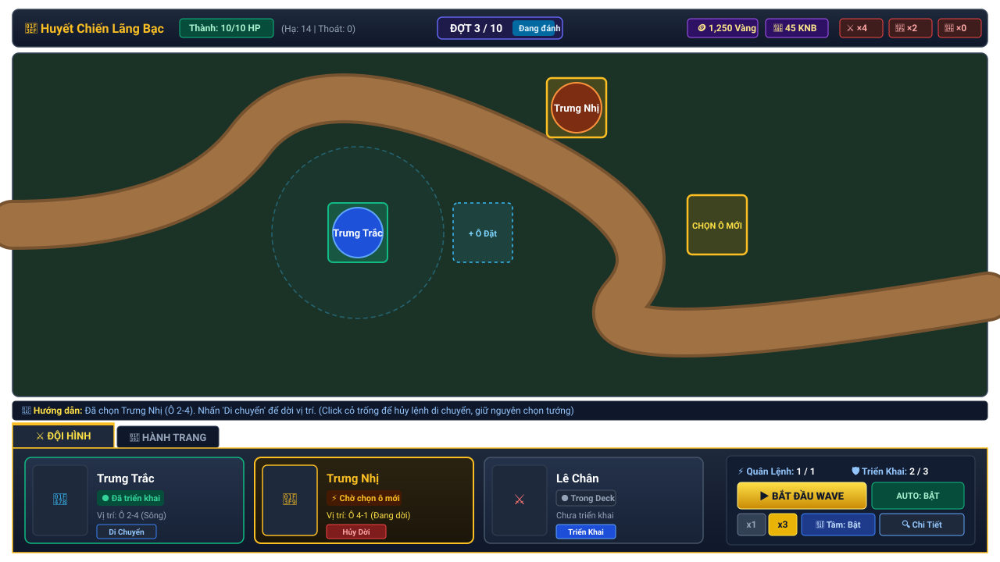
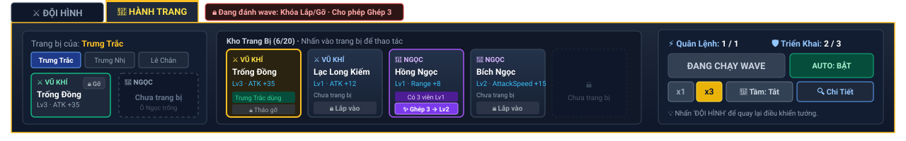
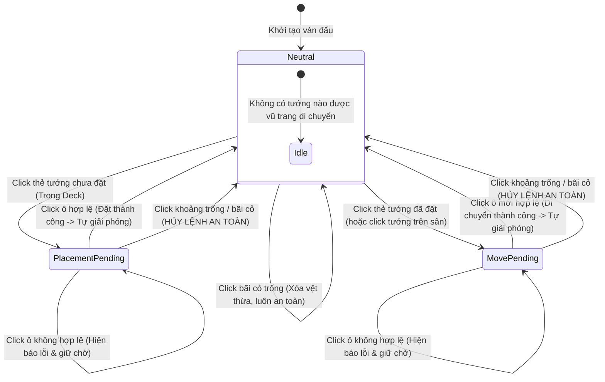

# Đặc Tả Thị Giác & Kiểm Tra Chất Lượng Giao Diện Trận Đấu (HUD V1 Visual Spec & QA Audit)

**Task ID**: `HUD-A01`
**Tài liệu**: `docs/drafts/hud/HUD_V1_VISUAL_SPEC.md`
**Chương mục tiêu**: Màn chơi Hai Bà Trưng (*Huyết Chiến Lãng Bạc*) & Khung Battle HUD Chuẩn Hóa
**Trạng thái**: Official Draft / Implementation-Ready Visual Specification

---

> [!IMPORTANT]
> **Ràng Buộc & Quyền Sở Hữu Tài Liệu (Scope & File Ownership)**:
> - **Antigravity không can thiệp code runtime** trong task này để tránh xung đột mã nguồn với Codex.
> - **Chỉ tạo/sửa trong thư mục**: `docs/drafts/hud/**`.
> - **Tuyệt đối cấm sửa**: `src/**`, `tests/**`, `package.json`, `PROJECT_PLAN.md`.
> - **Mục tiêu**: Cung cấp tài liệu đặc tả thiết kế giao diện (Visual Spec), ma trận trạng thái (State Matrix), giải pháp bố cục hai tab **ĐỘI HÌNH** và **HÀNH TRANG**, phân tích chất lượng (QA Audit) các lỗi hiển thị hiện tại, và hướng dẫn triển khai chi tiết cho Codex (`Implementation Notes for Codex`).

---

## 1. Đánh Giá Hiện Trạng & Phân Tích Chất Lượng Giao Diện (HUD QA Audit)

Qua rà soát trực quan bản dựng chạy thực tế trên desktop, các vấn đề thẩm mỹ và trải nghiệm được xác định như sau:

| Hạng Mục Rà Soát | Vấn Đề Hiện Trạng Trên Bản Dựng | Giải Pháp Thiết Kế Chuẩn Hóa (HUD V1) |
|---|---|---|
| **1. Dải đen trống cạnh tabs** *(Empty strip next to tabs)* | Thanh điều hướng `meta-tabs` nằm độc lập ở giữa màn hình, để lại một khoảng trống đen lớn vô nghĩa bên phải, ngắt quãng dòng chảy thị giác giữa canvas và bảng điều khiển. | Tích hợp trực tiếp thanh Tab làm **Header gắn liền của Khung Dưới Đáy (Bottom HUD Panel)**, kéo dài toàn bộ chiều rộng, loại bỏ hoàn toàn khoảng trống thừa. |
| **2. Phân cấp Top Header** *(Top header hierarchy)* | Các phần tử `Tên Màn`, `Thành HP`, `Vàng/KNB`, `Wave` và `Chip Quái` bị phân tán, kích thước chữ không đồng nhất, thiếu ranh giới thị giác giữa nhóm phòng thủ và nhóm tài nguyên. | Gom thành **3 phân khu thị giác độc lập** trên 1 thanh ngang: **Trái** (Thành trì & Chiến dịch) — **Giữa** (Tiến trình Wave) — **Phải** (Tài nguyên & Bộ đếm quái). |
| **3. Độ dày & chói của Range Circle** *(Range circle styling)* | Vòng tròn tầm đánh vẽ bằng nét dày ($2\text{ px}$) với độ đục cao; khi cắm 3 tướng thì các vòng đan xen làm rối loạn tầm nhìn bãi bồi và đường đi của quái. | Giảm độ dày nét vẽ xuống $\mathbf{\le 1.5\text{ px}}$, giảm alpha viền còn $\mathbf{0.35}$, nền trong suốt $\mathbf{0.04}$. Thêm nút bấm **`Tầm đánh: Tắt`** toàn cục (Mặc định: TẮT). |
| **4. Ô chỉ định được chọn** *(Selected tile indicator)* | Ô triển khai đang chọn (`selected`) chỉ đổi màu vàng nhạt, khó phân biệt với ô trống thường trên nền nước sông và bụi rậm. | Áp dụng hiệu ứng **viền vàng hổ phách (`#fbbf24`, nét $2.5\text{ px}$)** kèm góc ngắm mục tiêu (corner brackets) và hiệu ứng thở nhẹ (subtle pulse). |
| **5. Kiểu dáng Tab Active/Inactive** *(Tab state styling)* | Nút tab chỉ đổi màu nền cơ bản (`#3a2b12` vs `#172033`), không tạo cảm giác kết nối vật lý với nội dung bên dưới. | Thiết kế Tab dạng **folder gắn liền panel**: Tab Active có viền trên vàng kim, không có viền đáy, liền mạch với thân panel; Tab Inactive chìm xuống nền tối. |
| **6. Mật độ & Khả năng đọc Bottom HUD** *(Bottom density & readability)* | Bảng đáy có nhiều khoảng đệm trống, các nút bấm không thẳng hàng; dòng chữ `"Chọn ô để di chuyển"` bị lưu lại vĩnh viễn gây hiểu nhầm. | Phân chia bố cục lưới chặt chẽ: Cột trái (Nội dung Tab $75\%$), Cột phải (Cụm điều khiển $25\%$). Tự động reset hướng dẫn về `"Sẵn sàng chiến đấu"` sau mỗi hành động. |

---

## 2. Bố Cục Không Gian & Ba Độ Phân Giải Desktop (Desktop Viewport Target)

Giao diện Battle HUD V1 được thiết kế theo nguyên tắc **Single-Viewport No-Scroll**: toàn bộ màn hình chiến đấu phải nằm trọn trong khung nhìn $100\text{vh}$, ưu tiên tối đa diện tích chiều dọc cho bàn cờ chiến trường.

```
┌──────────────────────────────────────────────────────────────────────────────┐
│ [🏯 Huyết Chiến Lãng Bạc] [Thành HP: 10/10] │ [ĐỢT 3/10] │ [🪙 1,250] [⚔×4 🏹×2] │ (TOP HUD: ~44-48px)
├──────────────────────────────────────────────────────────────────────────────┤
│                                                                              │
│                                                                              │
│                         BÀN CỜ CHIẾN TRƯỜNG CHÍNH                           │
│                      (DOMINANT BATTLEFIELD CANVAS)                           │
│                      [Tỷ Lệ 4:3-ish Căn Giữa Màn Hình]                       │
│                                                                              │
│                                                                              │
├──────────────────────────────────────────────────────────────────────────────┤
│ 💬 Hướng dẫn: Chọn vị trí triển khai Trưng Trắc. Đã đặt 1/3 Hero.            │ (HINT BAR: ~22-26px)
├──────────────────────────────────────────────────────────────────────────────┤
│ [ ⚔ ĐỘI HÌNH ]   [ 🎒 HÀNH TRANG ]   [ 🔒 Khóa đổi đồ khi đánh wave ]       │ (TAB HEADER: ~32px)
├───────────────────────────────────────────────────────┬──────────────────────┤
│ VÙNG NỘI DUNG THAY THẾ ĐỒNG VỊ TRÍ                     │ CỤM ĐIỀU KHIỂN CHUNG │
│                                                       │                      │
│ • TAB ĐỘI HÌNH: 3 Thẻ Tướng Xuất Trận                │ ⚡ Quân Lệnh: 1/1    │
│ • TAB HÀNH TRANG: Trang Bị Tướng Đang Chọn + Kho Đồ  │ 🛡 Triển Khai: 2/3   │ (PANEL THÂN:
│                                                       │ [ ▶ BẮT ĐẦU WAVE ]   │  ~120-145px)
│                                                       │ [ AUTO: BẬT ]        │
│                                                       │ [x1][x3] [🎯Tầm:Tắt] │
│                                                       │ [🔍 Chi Tiết Tướng]  │
└───────────────────────────────────────────────────────┴──────────────────────┘
```

### 2.1. Kiểm Tra Độ Phù Hợp Trên 3 Viewport Desktop

| Độ Phân Giải Màn Hình | Chiều Cao Battlefield (`game-frame`) | Chiều Cao Bottom HUD (Tabs + Panel) | Trải Nghiệm & Hành Vi Co Giãn |
|---|:---:|:---:|---|
| **$1920 \times 1080$** (Full HD) | $\approx 640 - 680\text{ px}$ ($\approx 63\%$ viewport) | $\approx 180\text{ px}$ ($32\text{ px}$ tabs + $148\text{ px}$ panel) | Rộng rãi tối đa; canvas sắc nét; thẻ tướng và ô trang bị hiển thị đầy đủ chi tiết với padding $12\text{ px}$. **Zero scroll**. |
| **$1600 \times 900$** (HD+) | $\approx 520 - 550\text{ px}$ ($\approx 60\%$ viewport) | $\approx 165\text{ px}$ ($30\text{ px}$ tabs + $135\text{ px}$ panel) | Tỷ lệ cân đối hoàn hảo; canvas co giãn tự nhiên; padding $10\text{ px}$; toàn bộ nút bấm vừa vặn. **Zero scroll**. |
| **$1366 \times 768$** (Desktop Tối Thiểu) | $\approx 440 - 460\text{ px}$ ($\approx 59\%$ viewport) | $\approx 150\text{ px}$ ($28\text{ px}$ tabs + $122\text{ px}$ panel) | Chế độ gọn gàng (Compact Mode): Top HUD giảm còn $40\text{ px}$, icon trang bị $42\text{ px}$, chữ mô tả rút gọn 1 dòng. **Tuyệt đối không cuộn trang**. |

---

## 3. Đặc Tả Chi Tiết Hai Trạng Thái Tab: [ ĐỘI HÌNH ] & [ HÀNH TRANG ]

### 3.1. Trạng Thái 1: Tab [ ĐỘI HÌNH ] (Hero Roster Deck)

Khi Tab `ĐỘI HÌNH` được kích hoạt, vùng đáy hiển thị **3 Thẻ Tướng Xuất Trận** xếp ngang trên một hàng:



#### A. Cấu Trúc Thẻ Tướng (Hero Card Anatomy)
* **Kích thước**: Rộng $260 - 280\text{ px}$, Cao $105 - 115\text{ px}$, bo góc $8\text{ px}$.
* **Ảnh Chân Dung (Portrait Frame)**: Kích thước $64 \times 80\text{ px}$ (hoặc $70 \times 90\text{ px}$), pixel art trực diện (Front View), viền nổi theo trạng thái.
* **Khu vực thông tin (Card Meta)**:
  - **Dòng 1**: Tên Tướng (Font bold $15\text{ px}$, màu `#f8fafc`).
  - **Dòng 2**: Badge Trạng Thái Triển Khai (Xem ma trận bên dưới).
  - **Dòng 3**: Vị trí ô đóng giữ trên bản đồ (VD: `Vị trí: Ô 2-4 (Sông)` hoặc `Dự bị trong Deck`).
  - **Dòng 4**: Cấp độ & Hệ chiến đấu (VD: `Lv10 · Sát thương Vật Lý`).

#### B. Ma Trận Trạng Thái Thẻ Tướng (Hero Card State Matrix)

| Trạng Thái Thẻ (State) | Màu Viền Khung | Màu Nền Thẻ | Nhãn Badge (Badge Text) | Ý Nghĩa Trải Nghiệm & Tương Tác |
|---|---|---|---|---|
| **1. Sẵn Sàng (Available)** | Xám thép `#475569` ($1\text{ px}$) | `#172236` | `● Trong Deck` (Xám lam) | Tướng chưa đặt lên sân; click để chọn chuẩn bị đặt xuống ô trống. |
| **2. Đang Chọn Đặt (Selected - Ready)** | Xanh lơ sáng `#38bdf8` ($2\text{ px}$) | `#0c2d48` | `⚡ Chọn ô để đặt` (Xanh lơ) | Tướng đang được vũ trang; hover ô trống trên bản đồ sẽ hiện tầm đánh dự kiến. |
| **3. Đã Triển Khai (Deployed)** | Xanh ngọc `#10b981` ($1.5\text{ px}$) | `#064e3b` | `● Đã triển khai` (Lục sáng) | Tướng đã có mặt trên bàn cờ; click vào thẻ để kích hoạt chế độ dời chỗ. |
| **4. Đang Chọn Di Chuyển (Moving)** | Vàng hổ phách `#fbbf24` ($2\text{ px}$) | `#451a03` | `⚡ Chọn ô di chuyển` (Vàng) | Đang chọn ô mới để dời tướng; click ô mới để hoàn tất hoặc click cỏ trống để hủy. |

---

### 3.2. Trạng Thái 2: Tab [ HÀNH TRANG ] (Inventory & Equipment Loadout)

Khi Tab `HÀNH TRANG` được kích hoạt, **toàn bộ 3 thẻ tướng được thay thế ngay tại chỗ** bằng giao diện Quản Lý Trang Bị gọn gàng:



#### A. Phân Vùng 1: Trang Bị Tướng Đang Chọn (Current Hero Loadout — Rộng $\approx 270\text{ px}$)
Nhằm giữ cho Bottom HUD không bị phình to theo chiều cao, trang bị được tổ chức trực quan theo từng Hero:
* **Bộ chọn Tướng nhanh (Hero Mini-Pills)**: 3 nút gạt nhỏ `[Trưng Trắc]` `[Trưng Nhị]` `[Lê Chân]` ở đầu khung để đổi nhanh Hero muốn xem trang bị (đồng bộ với `selectedHeroId`).
* **2 Ô Trang Bị Cố Định (Dedicated Loadout Slots)**:
  1. **Ô Vũ Khí (`⚔ VŨ KHÍ`)**:
     - *Khi đã gắn*: Hiện tên vũ khí (VD: `Trống Đồng`), cấp độ `Lv3 · ATK +35`, nút nhỏ `[Gỡ]` màu đỏ mờ.
     - *Khi trống*: Khung viền nét đứt màu xám, hiện chữ `+ Gắn Vũ Khí`.
  2. **Ô Ngọc Khảm (`💎 NGỌC`)**:
     - *Khi đã gắn*: Hiện tên ngọc (VD: `Hồng Ngọc`), cấp độ `Lv2 · Range +15`, nút nhỏ `[Gỡ]`.
     - *Khi trống*: Khung viền nét đứt màu xám, hiện chữ `+ Gắn Ngọc`.

#### B. Phân Vùng 2: Lưới Túi Đồ Trang Bị (Inventory Grid Slots — Rộng $\approx 600\text{ px}$)
* **Cơ chế hiển thị**: Lưới các ô trang bị hình vuông/chữ nhật đứng ($100 - 110\text{ px} \times 90 - 96\text{ px}$), sắp xếp theo hàng ngang có thanh cuộn ngang/dọc nội bộ mượt mà (`overflow-y: auto`).
* **Cấu trúc 1 Ô Trang Bị (Inventory Slot)**:
  - **Huy hiệu loại**: `⚔ VŨ KHÍ` (Xanh lam) hoặc `💎 NGỌC` (Tím).
  - **Tên trang bị & Cấp độ**: `Lạc Long Kiếm` - `Lv1`.
  - **Chỉ số cộng thêm ngắn gọn**: `ATK +12` hoặc `Range +8` hoặc `Spd +5%`.
  - **Trạng thái chủ sở hữu**: Badge nhỏ `Trưng Trắc dùng` (nếu đã có người đeo) hoặc `Túi đồ (Rảnh)`.
  - **Nút hành động nhanh**:
    - Nếu rảnh: Nút `[Lắp vào]` (Xanh dương đậm `#1d4ed8`).
    - Nếu đang được chọn dùng: Nút `[Tháo gỡ]` (Đỏ mờ `#7f1d1d`).
    - Nếu là trưởng nhóm ghép 3: Nút `[Ghép 3 → Lv N+1]` (Tím sáng `#7c3aed`).

#### C. Quy Tắc Khóa Trang Bị Trong Wave (Disabled Equip State During Wave)
* **Quy tắc an toàn**: Trong thời gian Wave đang chạy (`waveStatus === 'running'`), mọi thao tác Gắn/Gỡ/Ghép trang bị bị **khóa tạm thời** để tránh xung đột chỉ số runtime.
* **Biểu hiện thị giác**:
  - Xuất hiện huy hiệu cảnh báo trên thanh tab: `[🔒 Khóa đổi đồ khi đánh wave]`.
  - Các nút `[Lắp vào]`, `[Tháo gỡ]`, `[Ghép]` chuyển sang trạng thái mờ (`opacity: 0.45; cursor: not-allowed`).
  - Hover chuột vào nút sẽ hiện tooltip: `"Không thể thay đổi trang bị khi đang trong đợt chiến!"`.

---

## 4. Đặc Tả Tương Tác Chọn Tướng, Di Chuyển & Hủy Lệnh

### 4.1. Sơ Đồ Chuyển Trạng Thái Tương Tác (UX Flowchart)



### 4.2. Ma Trận Hành Vi Tương Tác Chi Tiết (Interaction Behavior Matrix)

| Hành Động Người Chơi | Trạng Thái Trước | Trạng Thái Sau | Phản Hồi Thị Giác Trên Bản Đồ & HUD | Ghi Chú An Toàn |
|---|---|---|---|---|
| **Click thẻ tướng chưa đặt** | `Neutral` | `PlacementPending` | Thẻ đổi viền xanh lơ; ô trống sáng viền đứt; hiện vòng tầm đánh theo chuột; thanh hint: `Chọn vị trí triển khai [Tướng]`. | Vũ trang đặt tướng mới. |
| **Click ô hợp lệ khi chờ đặt** | `PlacementPending` | `Neutral` | Tướng xuất hiện trên ô; thẻ chuyển `Đã triển khai`; **tự động reset về Neutral**; thanh hint: `Sẵn sàng chiến đấu`. | **Tuyệt đối không lưu vũ trang ngầm**. |
| **Click thẻ tướng đã đặt** | `Neutral` | `MovePending` | Thẻ đổi viền vàng nhấp nháy; ô đang đứng sáng vàng; các ô trống khác sáng viền đón; thanh hint: `Chọn vị trí mới cho [Tướng]`. | Vũ trang dời vị trí tướng. |
| **Click ô mới khi chờ dời** | `MovePending` | `Neutral` | Tướng dời sang ô mới; thẻ trở lại `Đã triển khai`; **tự động reset về Neutral**; thanh hint: `Sẵn sàng chiến đấu`. | **Hoàn tất di chuyển an toàn**. |
| **Click bãi cỏ trống bất kỳ** | `PlacementPending` hoặc `MovePending` | `Neutral` | **Hủy lệnh ngay lập tức**: Xóa vệt highlight ô; ẩn vòng xem trước; thẻ tướng trở về trạng thái tĩnh; thanh hint về `Sẵn sàng chiến đấu`. | **Quy tắc an toàn chống click nhầm**. |
| **Click ô không hợp lệ (cấm/đầy)** | `PlacementPending` hoặc `MovePending` | Giữ nguyên trạng thái chờ | Chớp đỏ ô click trong $0.3\text{s}$; thanh hint báo: `Không thể đặt tướng tại đây`. | Không làm mất trạng thái đang chọn. |

---

## 5. Hướng Dẫn Kỹ Thuật Dành Cho Codex (Implementation Notes for Codex)

> [!TIP]
> **Khuyến Nghị Triển Khai Không Gây Xung Đột Code (For Codex Execution)**:
> 1. **Tổ chức Component trong `src/ui/`**:
>    - Chuyển `meta-tabs` vào bên trong `BottomPlayerHUD.tsx` (làm Tab Header của panel đáy), thay vì render độc lập ở `App.tsx`.
>    - Giữ `activeMetaTab` (`'roster' | 'inventory'`) trong state quản lý của `BottomPlayerHUD` hoặc truyền qua props từ `App.tsx`.
>    - Tách nội dung Tab `HÀNH TRANG` thành một view con gọn gàng (`BottomInventoryView`), chỉ render bên trong khung đáy với chiều cao cố định `height: 100%`, cuộn nội bộ `overflow-y: auto`.
> 2. **Xử lý Tương Tác Click Bãi Cỏ (`Empty Grass Click`)**:
>    - Trong `BattleScene.ts`: Đăng ký sự kiện click nền `this.input.on('pointerdown', (pointer, currentlyOver) => { ... })`.
>    - Nếu `currentlyOver.length === 0` (click vào vùng không có interactive game object): Gửi thông điệp `battleBridge.clearSelection()` hoặc `battleBridge.setSelectedHeroId(null)` để giải phóng trạng thái chờ.
> 3. **Công Tắc Tầm Đánh Toàn Cục (`Global Range Overlay`)**:
>    - Thêm state `isRangeOverlayVisible` trong `BattleBridge` / `BattleScene`.
>    - Khi `false`: Set `rangeVisual.setVisible(false)` cho toàn bộ tướng tĩnh.
>    - Khi đang hover ô đặt tướng: Luôn hiển thị `previewRangeVisual.setVisible(true)` độc lập với công tắc toàn cục.
> 4. **Tự Động Reset Trạng Thái Sau Khi Đặt/Dời Tướng**:
>    - Trong hàm `placeOrMoveSelectedHero()` của `BattleScene.ts`: Sau khi `this.placedHeroes.set(...)` hoặc `this.repositionHero(...)` thành công, lập tức gọi `battleBridge.reportPlacementFeedback({ status: 'placed', heroId })` và đưa chỉ định chọn về trạng thái ổn định, không để lại cờ di chuyển treo.
> 5. **Nợ Kỹ Thuật Trang Bị (Out of Scope Debt)**:
>    - Không cố sửa logic tính toán chỉ số trang bị trong task HUD này; chỉ cần hiển thị chuẩn UI text từ `EquipmentV2Runtime`.

---

## 6. Danh Mục Tài Sản Hình Ảnh Đính Kèm (Asset Deliverables)

Tất cả mockup thiết kế dạng vector SVG độc lập được lưu trữ tại:
1. `docs/drafts/hud/assets/battle-hud-v1-layout-mockup.svg`: Mockup tổng thể giao diện 1280x720 với Tab **ĐỘI HÌNH** kích hoạt.
2. `docs/drafts/hud/assets/battle-hud-v1-inventory-mockup.svg`: Mockup chi tiết vùng Bottom Panel với Tab **HÀNH TRANG** kích hoạt.

---

## 7. Bảng Kiểm Tra Nghiệm Thu Visual (Visual Acceptance Checklist)

- [x] **1. Khung nhìn duy nhất**: Toàn bộ UI vừa vặn trong một màn hình Desktop ($1920 \times 1080$, $1600 \times 900$, $1366 \times 768$). Không xuất hiện thanh cuộn dọc toàn trang.
- [x] **2. Trọng tâm chiến trường**: Bàn cờ chiến đấu chiếm diện tích thị giác áp đảo ($\ge 60\%$ chiều cao viewport).
- [x] **3. Chuyển đổi tab đồng vị trí**: Hai tab `ĐỘI HÌNH` và `HÀNH TRANG` thay thế nội dung trong cùng một khung panel vật lý, không xếp chồng.
- [x] **4. Thiết kế thẻ tướng gọn gàng**: 3 thẻ tướng nằm ngang trong 1 hàng, có đầy đủ 4 trạng thái (`Available`, `Selected Ready`, `Deployed`, `Moving`).
- [x] **5. Thiết kế túi đồ tối ưu**: Hiển thị rõ 2 ô trang bị của Hero được chọn (`⚔ Vũ Khí`, `💎 Ngọc`) và lưới túi đồ cuộn nội bộ.
- [x] **6. Khóa đổi đồ khi đánh wave**: Có huy hiệu cảnh báo `[🔒 Khóa đổi đồ khi đánh wave]` và vô hiệu hóa nút bấm trong đợt chiến.
- [x] **7. Công tắc tầm đánh toàn cục**: Có nút gạt `Tầm đánh: Bật/Tắt`, mặc định TẮT, hỗ trợ preview khi rê chuột.
- [x] **8. An toàn click bãi cỏ**: Click khoảng trống hủy ngay trạng thái chờ, tự động reset về Neutral sau khi đặt/dời tướng thành công.
- [x] **9. Chuẩn hóa câu chữ tiếng Việt**: Toàn bộ chuỗi văn bản giao diện ngắn gọn, dứt khoát, dễ đọc.
- [x] **10. Hướng dẫn Codex chi tiết**: Có mục ghi chú triển khai kỹ thuật riêng biệt cho Codex.
