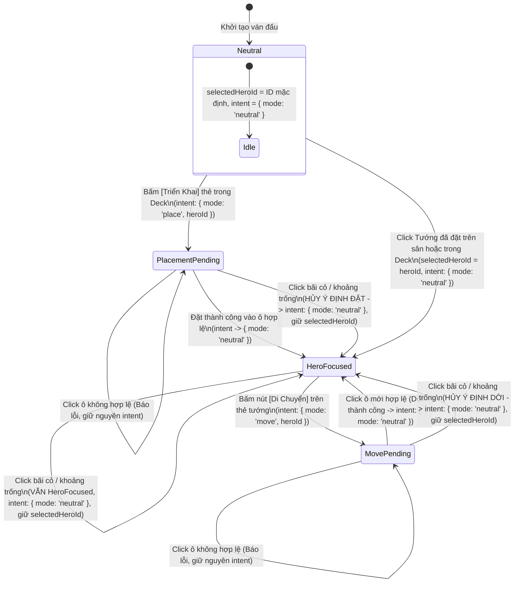

# Đặc Tả Thị Giác & Kiểm Tra Chất Lượng Giao Diện Trận Đấu (HUD V1 Visual Spec & QA Audit)

**Task ID**: `HUD-A01R2` (Final Contract Sync Revision)
**Tài liệu**: `docs/drafts/hud/HUD_V1_VISUAL_SPEC.md`
**Chương mục tiêu**: Màn chơi Hai Bà Trưng (*Huyết Chiến Lãng Bạc*) & Khung Battle HUD Chuẩn Hóa
**Trạng thái**: Official Final Spec Contract Sync — Aligned with HUD-C03

---

> [!IMPORTANT]
> **Ràng Buộc & Quyền Sở Hữu Tài Liệu (Scope & File Ownership)**:
> - **Antigravity không can thiệp code runtime** trong task này để tránh xung đột mã nguồn với Codex.
> - **Chỉ tạo/sửa trong thư mục**: `docs/drafts/hud/**`.
> - **Tuyệt đối cấm sửa**: `src/**`, `tests/**`, `package.json`, `PROJECT_PLAN.md`.
> - **Nhiệm vụ trọng tâm**: Đồng bộ chính xác 3 hợp đồng kỹ thuật (`Default Range = OFF`, `Background click giữ selectedHeroId & PlacementIntent -> neutral`, `PlacementIntent discriminated union`) và chuẩn hóa câu chữ giao diện người dùng theo `HUD-C03`.

---

## 1. Đánh Giá Hiện Trạng & Phân Tích Chất Lượng Giao Diện (HUD QA Audit)

Qua rà soát trực quan bản dựng chạy thực tế trên desktop, các vấn đề thẩm mỹ và trải nghiệm được xác định như sau:

| Hạng Mục Rà Soát | Vấn Đề Hiện Trạng Trên Bản Dựng | Giải Pháp Thiết Kế Chuẩn Hóa (HUD V1) |
|---|---|---|
| **1. Dải đen trống cạnh tabs** *(Empty strip next to tabs)* | Thanh điều hướng `meta-tabs` nằm độc lập ở giữa màn hình, để lại một khoảng trống đen lớn vô nghĩa bên phải, ngắt quãng dòng chảy thị giác giữa canvas và bảng điều khiển. | Tích hợp trực tiếp thanh Tab làm **Header gắn liền của Khung Dưới Đáy (Bottom HUD Panel)**, kéo dài toàn bộ chiều rộng, loại bỏ hoàn toàn khoảng trống thừa. |
| **2. Phân cấp Top Header** *(Top header hierarchy)* | Các phần tử `Tên Màn`, `Thành HP`, `Vàng/KNB`, `Wave` và `Chip Quái` bị phân tán, kích thước chữ không đồng nhất, thiếu ranh giới thị giác giữa nhóm phòng thủ và nhóm tài nguyên. | Gom thành **3 phân khu thị giác độc lập** trên 1 thanh ngang: **Trái** (Thành trì & Chiến dịch) — **Giữa** (Tiến trình Wave) — **Phải** (Tài nguyên & Bộ đếm quái). |
| **3. Độ dày & chói của Range Circle** *(Range circle styling)* | Vòng tròn tầm đánh vẽ bằng nét dày ($2\text{ px}$) với độ đục cao; khi cắm 3 tướng thì các vòng đan xen làm rối loạn tầm nhìn bãi bồi và đường đi của quái. | Giảm độ dày nét vẽ xuống $\mathbf{\le 1.5\text{ px}}$, giảm alpha viền còn $\mathbf{0.35}$, nền trong suốt $\mathbf{0.04}$. Mặc định **`Tầm đánh: Tắt`** (`Default Range = OFF`). |
| **4. Ô chỉ định được chọn** *(Selected tile indicator)* | Ô triển khai đang chọn (`selected`) chỉ đổi màu vàng nhạt, khó phân biệt với ô trống thường trên nền nước sông và bụi rậm. | Áp dụng hiệu ứng **viền vàng hổ phách (`#fbbf24`, nét $2.5\text{ px}$)** kèm góc ngắm mục tiêu (corner brackets) và hiệu ứng thở nhẹ (subtle pulse). |
| **5. Kiểu dáng Tab Active/Inactive** *(Tab state styling)* | Nút tab chỉ đổi màu nền cơ bản (`#3a2b12` vs `#172033`), không tạo cảm giác kết nối vật lý với nội dung bên dưới. | Thiết kế Tab dạng **folder gắn liền panel**: Tab Active có viền trên vàng kim, không có viền đáy, liền mạch với thân panel; Tab Inactive chìm xuống nền tối. |
| **6. Mật độ & Khả năng đọc Bottom HUD** *(Bottom density & readability)* | Bảng đáy có nhiều khoảng đệm trống, các nút bấm không thẳng hàng; dòng chữ `"Chọn ô để di chuyển"` bị lưu lại vĩnh viễn gây hiểu nhầm. | Phân chia bố cục lưới chặt chẽ: Cột trái (Nội dung Tab $75\%$), Cột phải (Cụm điều khiển $25\%$). Tự động reset hướng dẫn về `"Sẵn sàng chiến đấu"`. |

---

## 2. Bố Cục Không Gian & Ba Độ Phân Giải Desktop (Desktop Viewport Target)

Giao diện Battle HUD V1 được thiết kế theo nguyên tắc **Single-Viewport No-Scroll**: toàn bộ màn hình chiến đấu phải nằm trọn trong khung nhìn $100\text{vh}$, ưu tiên tối đa diện tích chiều dọc cho bàn cờ chiến trường.

```
┌──────────────────────────────────────────────────────────────────────────────┐
│ [🏯 Huyết Chiến Lãng Bạc] [Thành HP: 10/10] │ [ĐỢT 3/10] │ [🪙 1,250] [⚔×4 🏹×2] │ (TOP HUD: ~44-48px)
├──────────────────────────────────────────────────────────────────────────────┤
│                                                                              │
│                                                                              │
│                         BÀN CỜ CHIẾN TRƯỜNG CHÍNH                           │
│                      (DOMINANT BATTLEFIELD CANVAS)                           │
│                      [Tỷ Lệ 4:3-ish Căn Giữa Màn Hình]                       │
│                                                                              │
│                                                                              │
├──────────────────────────────────────────────────────────────────────────────┤
│ 💬 Hướng dẫn: Đã chọn Trưng Nhị (Ô 2-4). Nhấn 'Di chuyển' để dời vị trí.     │ (HINT BAR: ~22-26px)
├──────────────────────────────────────────────────────────────────────────────┤
│ [ ⚔ ĐỘI HÌNH ]   [ 🎒 HÀNH TRANG ]   [ 🔒 Đang đánh wave: Khóa Lắp/Gỡ ]      │ (TAB HEADER: ~32px)
├───────────────────────────────────────────────────────┬──────────────────────┤
│ VÙNG NỘI DUNG THAY THẾ ĐỒNG VỊ TRÍ                     │ CỤM ĐIỀU KHIỂN CHUNG │
│                                                       │                      │
│ • TAB ĐỘI HÌNH: 3 Thẻ Tướng Xuất Trận                │ ⚡ Quân Lệnh: 1/1    │
│ • TAB HÀNH TRANG: Loadout Tướng Đang Chọn + Túi Đồ   │ 🛡 Triển Khai: 2/3   │ (PANEL THÂN:
│   (Vũ Khí, Ngọc, Ghép 3, Lắp/Gỡ)                      │ [ ▶ BẮT ĐẦU WAVE ]   │  ~120-145px)
│                                                       │ [ AUTO: BẬT ]        │
│                                                       │ [x1][x3] [🎯Tầm:Tắt] │ (DEFAULT OFF)
│                                                       │ [🔍 Chi Tiết Tướng]  │
└───────────────────────────────────────────────────────┴──────────────────────┘
```

### 2.1. Kiểm Tra Độ Phù Hợp Trên 3 Viewport Desktop

| Độ Phân Giải Màn Hình | Chiều Cao Battlefield (`game-frame`) | Chiều Cao Bottom HUD (Tabs + Panel) | Trải Nghiệm & Hành Vi Co Giãn |
|---|:---:|:---:|---|
| **$1920 \times 1080$** (Full HD) | $\approx 640 - 680\text{ px}$ ($\approx 63\%$ viewport) | $\approx 180\text{ px}$ ($32\text{ px}$ tabs + $148\text{ px}$ panel) | Rộng rãi tối đa; canvas sắc nét; thẻ tướng và ô trang bị hiển thị đầy đủ chi tiết với padding $12\text{ px}$. **Zero scroll**. |
| **$1600 \times 900$** (HD+) | $\approx 520 - 550\text{ px}$ ($\approx 60\%$ viewport) | $\approx 165\text{ px}$ ($30\text{ px}$ tabs + $135\text{ px}$ panel) | Tỷ lệ cân đối hoàn hảo; canvas co giãn tự nhiên; padding $10\text{ px}$; toàn bộ nút bấm vừa vặn. **Zero scroll**. |
| **$1366 \times 768$** (Desktop Tối Thiểu) | $\approx 440 - 460\text{ px}$ ($\approx 59\%$ viewport) | $\approx 150\text{ px}$ ($28\text{ px}$ tabs + $122\text{ px}$ panel) | Chế độ gọn gàng (Compact Mode): Top HUD giảm còn $40\text{ px}$, icon trang bị $42\text{ px}$, chữ mô tả rút gọn 1 dòng. **Tuyệt đối không cuộn trang**. |

---

## 3. Đặc Tả Hai Trạng Thái Tab: [ ĐỘI HÌNH ] & [ HÀNH TRANG ]

### 3.1. Trạng Thái 1: Tab [ ĐỘI HÌNH ] (Hero Roster Deck)

Khi Tab `ĐỘI HÌNH` được kích hoạt, vùng đáy hiển thị **3 Thẻ Tướng Xuất Trận** xếp ngang trên một hàng:


#### A. Cấu Trúc Thẻ Tướng (Hero Card Anatomy & Copy Sync)
* **Kích thước**: Rộng $260 - 280\text{ px}$, Cao $105 - 115\text{ px}$, bo góc $8\text{ px}$.
* **Ảnh Chân Dung (Portrait Frame)**: Kích thước $64 \times 80\text{ px}$ (hoặc $70 \times 90\text{ px}$), pixel art trực diện (Front View), viền nổi theo trạng thái.
* **Khu vực thông tin (Card Meta — Sync HUD-C03)**:
  - **Dòng 1**: Tên Tướng (`Trưng Trắc`, `Trưng Nhị`, `Lê Chân` — Font bold $15\text{ px}$, màu `#f8fafc`).
  - **Dòng 2**: Badge Trạng Thái Triển Khai (`● Đã triển khai` hoặc `● Trong Deck`).
  - **Dòng 3**: Vị trí ô đóng giữ trên bản đồ (VD: `Vị trí: Ô 2-4 (Sông)` hoặc `Chưa trang bị / Chưa đặt`).
  - **Dòng 4 (Nút Thao Tác)**:
    - Nếu tướng chưa đặt: Nút `[Triển Khai]` (Xanh dương đậm `#1d4ed8`).
    - Nếu tướng đã đặt: Nút `[Di Chuyển]` (Xanh lam `#1e293b`, viền `#3b82f6`).
    - Nếu đang trong trạng thái chờ dời: Nút `[Hủy Dời]` (Đỏ mờ `#7f1d1d`).

#### B. Ma Trận Trạng Thái Thẻ Tướng (Hero Card State Matrix)

| Trạng Thái Thẻ (State) | Màu Viền Khung | Màu Nền Thẻ | Nhãn Badge (Badge Text) | Nút Thao Tác Hiển Thị |
|---|---|---|---|---|
| **1. Trong Deck (Available)** | Xám thép `#475569` ($1\text{ px}$) | `#172236` | `● Trong Deck` (Xám) | Nút `[Triển Khai]` $\rightarrow$ `PlacementIntent: { mode: 'place', heroId }`. |
| **2. Đang Chọn Đặt (PlacementPending)** | Xanh lơ sáng `#38bdf8` ($2\text{ px}$) | `#0c2d48` | `⚡ Chọn ô để đặt` (Xanh lơ) | Nút `[Hủy Đặt]` $\rightarrow$ `PlacementIntent: { mode: 'neutral' }`. |
| **3. Đã Triển Khai (Deployed - Focus)** | Xanh ngọc `#10b981` ($1.5\text{ px}$) | `#064e3b` | `● Đã triển khai` (Lục sáng) | Nút `[Di Chuyển]` $\rightarrow$ `PlacementIntent: { mode: 'move', heroId }`. |
| **4. Đang Chờ Dời Ô (MovePending)** | Vàng hổ phách `#fbbf24` ($2\text{ px}$) | `#451a03` | `⚡ Chờ chọn ô mới` (Vàng) | Nút `[Hủy Dời]` $\rightarrow$ `PlacementIntent: { mode: 'neutral' }`. |

---

### 3.2. Trạng Thái 2: Tab [ HÀNH TRANG ] (Combat Inventory & Loadout)

> [!IMPORTANT]
> **Phạm Vi Giới Hạn Của Tab HÀNH TRANG Trong Trận Đấu (Combat Scope)**:
> - Tab `HÀNH TRANG` trong Battle HUD **chỉ bao gồm Quản Lý Trang Bị / Kho Đồ (Equipment Loadout, Inventory Grid, Merge, Equip/Unequip)**.
> - **Tuyệt đối không đưa các tính năng kinh tế ngoại vi** như Gacha, Cửa Hàng (Shop), Chiêu Mộ Tướng (Recruitment), Sử Dụng Lệnh Bài / Tiêu Hao (Consumable economy actions) vào HUD chiến đấu thời gian thực.

Khi Tab `HÀNH TRANG` được kích hoạt, **toàn bộ 3 thẻ tướng được thay thế ngay tại chỗ** bằng giao diện Quản Lý Trang Bị gọn gàng:


#### A. Phân Vùng 1: Trang Bị Của Tướng Đang Chọn (Current Hero Loadout — Rộng $\approx 270\text{ px}$)
* **Bộ chọn Tướng nhanh (Hero Mini-Pills)**: 3 nút gạt nhỏ `[Trưng Trắc]` `[Trưng Nhị]` `[Lê Chân]` ở đầu khung để đổi nhanh Hero muốn xem trang bị (đồng bộ với `selectedHeroId`).
* **2 Ô Trang Bị Cố Định (Dedicated Loadout Slots — Sync HUD-C03)**:
  1. **Ô Vũ Khí (`⚔ VŨ KHÍ`)**:
     - *Khi đã gắn*: Hiện tên vũ khí (VD: `Trống Đồng`), cấp độ `Lv3 · ATK +35`, nút nhỏ `[Gỡ]`.
     - *Khi trống*: Khung viền nét đứt màu xám, hiển thị rõ ràng: **`Chưa trang bị`** (kèm chú thích `Ô Vũ Khí trống`).
  2. **Ô Ngọc Khảm (`💎 NGỌC`)**:
     - *Khi đã gắn*: Hiện tên ngọc (VD: `Hồng Ngọc`), cấp độ `Lv2 · Range +15` hoặc `AttackSpeed +10`, nút nhỏ `[Gỡ]`.
     - *Khi trống*: Khung viền nét đứt màu xám, hiển thị rõ ràng: **`Chưa trang bị`** (kèm chú thích `Ô Ngọc trống`).

#### B. Phân Vùng 2: Lưới Túi Đồ Trang Bị (Inventory Grid Slots — Rộng $\approx 600\text{ px}$)
* **Cơ chế hiển thị**: Lưới các ô trang bị hình chữ nhật đứng ($105\text{ px} \times 96\text{ px}$), sắp xếp theo hàng ngang có thanh cuộn nội bộ mượt mà (`overflow-y: auto`).
* **Quy chuẩn chỉ số Flat Bonus**:
  - Toàn bộ trang bị chỉ sử dụng chỉ số cộng thẳng dạng: `ATK +N`, `Range +N`, `AttackSpeed +N` (Ví dụ: `ATK +35`, `ATK +12`, `Range +8`, `AttackSpeed +15`).
  - **Không sử dụng chỉ số phần trăm** (như `Spd +5%`).
* **Cấu trúc 1 Ô Trang Bị (Inventory Slot)**:
  - **Huy hiệu loại**: `⚔ VŨ KHÍ` (Xanh lam) hoặc `💎 NGỌC` (Tím).
  - **Tên trang bị & Cấp độ**: `Lạc Long Kiếm` - `Lv1`.
  - **Chỉ số cộng thêm ngắn gọn**: `ATK +12` hoặc `Range +8` hoặc `AttackSpeed +15`.
  - **Trạng thái chủ sở hữu**: Badge nhỏ `Trưng Trắc dùng` (nếu đã có người đeo) hoặc `Chưa trang bị`.
  - **Nút hành động nhanh**:
    - Nếu rảnh: Nút `[Lắp vào]` (Xanh dương đậm `#1d4ed8`).
    - Nếu đang được chọn dùng: Nút `[Tháo gỡ]` (Đỏ mờ `#7f1d1d`).
    - Nếu là trưởng nhóm ghép 3: Nút `[✨ Ghép 3 → Lv N+1]` (Tím sáng `#7c3aed`).

#### C. Quy Tắc Khóa Trang Bị Khi Đang Chạy Wave (Wave Running Rules)
Khi một Wave đang diễn ra (`waveStatus === 'running'`):
1. **Lắp Trang Bị (`Equip`) = `LOCK / DISABLED`**: Nút `[Lắp vào]` bị vô hiệu hóa (`opacity: 0.45; cursor: not-allowed`), tooltip: *"Không thể lắp trang bị khi đang trong đợt chiến!"*.
2. **Tháo Trang Bị (`Unequip`) = `LOCK / DISABLED`**: Nút `[Tháo gỡ]` bị vô hiệu hóa, tooltip: *"Không thể tháo trang bị khi đang trong đợt chiến!"*.
3. **Ghép 3 Trang Bị (`Merge`) = `ALLOWED / ENABLED`**: Nút `[✨ Ghép 3 → Lv N+1]` **vẫn hoạt động bình thường**, cho phép người chơi tối ưu hóa các trang bị rảnh rỗi trong túi đồ mà không ảnh hưởng trực tiếp đến chỉ số runtime của Hero đang tham chiến.
4. **Huy hiệu thông báo**: Hiển thị trên thanh tab: `[🔒 Đang đánh wave: Khóa Lắp/Gỡ · Cho phép Ghép 3]`.

---

## 4. Đặc Tả Tương Tác & Ba Hợp Đồng Kỹ Thuật Cốt Lõi (Core Technical Contracts)

### 4.1. Hợp Đồng 1: Default Range = OFF
* **Trạng thái khởi tạo**: Giá trị mặc định của công tắc tầm đánh là **`Tắt`** (`isRangeOverlayVisible = false`).
* **Hiển thị trên HUD**: Nút gạt luôn hiển thị **`🎯 Tầm: Tắt`** ở trạng thái ban đầu, nền xám sẫm (`#334155`), viền mờ.
* **Hành vi chiến trường**: Không vẽ bất kỳ vòng tầm đánh tĩnh nào của các tướng đã đặt. Chỉ vẽ vòng tròn xem trước (Preview Range) của riêng tướng đang được rê chuột trong ý định đặt/dời (`PlacementIntent`).

### 4.2. Hợp Đồng 2: Background Click Contract
Khi người chơi click vào vùng cỏ trống, dòng sông hoặc khoảng không gian không chứa interactive tile:
1. **`HeroFocused` + Background Click $\rightarrow$ VẪN LÀ `HeroFocused`**:
   - **`selectedHeroId` GIỮ NGUYÊN HOÀN TOÀN**: Không bị xóa hoặc chuyển thành rỗng.
   - Người chơi vẫn tiếp tục focus vị tướng đó để xem thông tin, xem trang bị hoặc mở Modal Chi Tiết.
2. **Chỉ `PlacementIntent` chuyển về `{ mode: 'neutral' }`**:
   - Nếu đang ở `MovePending` (`{ mode: 'move', heroId }`): Hủy ý định dời ô $\rightarrow$ Quay về `HeroFocused` tĩnh với `PlacementIntent: { mode: 'neutral' }`.
   - Nếu đang ở `PlacementPending` (`{ mode: 'place', heroId }`): Hủy ý định cắm tướng $\rightarrow$ Quay về `PlacementIntent: { mode: 'neutral' }`, giữ nguyên `selectedHeroId`.
   - Xóa bỏ vệt highlight trên các ô triển khai và ẩn vòng tầm đánh dự kiến.

### 4.3. Hợp Đồng 3: PlacementIntent Discriminated Union Contract
Cấu trúc kiểu dữ liệu của `PlacementIntent` trong runtime và bridge được định nghĩa chính xác theo discriminated union (không dùng `null`):

```ts
export type PlacementIntent =
  | { mode: 'neutral' }
  | { mode: 'place'; heroId: string }
  | { mode: 'move'; heroId: string }
```

### 4.4. Sơ Đồ Chuyển Trạng Thái Tương Tác (State Transition Diagram)



### 4.5. Ma Trận Hành Vi Tương Tác Chi Tiết (Interaction Behavior Matrix)

| Hành Động Người Chơi | Trạng Thái Trước | Trạng Thái Sau | selectedHeroId | PlacementIntent | Phản Hồi Thị Giác |
|---|---|---|:---:|:---:|---|
| **Bấm [Triển Khai] thẻ chưa đặt** | `Neutral` | `PlacementPending` | `heroId` | `{ mode: 'place', heroId }` | Thẻ sáng viền lơ; ô trống sáng đón; hiện vòng tầm đánh theo chuột; hint: `Chọn vị trí triển khai [Tướng]`. |
| **Click ô hợp lệ khi chờ đặt** | `PlacementPending` | `HeroFocused` | `heroId` | `{ mode: 'neutral' }` | Tướng xuất hiện trên ô; thẻ chuyển `Đã triển khai`; hint: `Sẵn sàng chiến đấu`. |
| **Click Tướng đã đặt** | Bất kỳ | `HeroFocused` | `heroId` | `{ mode: 'neutral' }` | Tướng sáng viền chọn; thẻ hiện nút `[Di Chuyển]`; hint: `Đã chọn [Tướng]. Nhấn 'Di chuyển' để dời vị trí`. |
| **Bấm nút [Di Chuyển]** | `HeroFocused` | `MovePending` | `heroId` | `{ mode: 'move', heroId }` | Thẻ đổi viền vàng nhấp nháy; ô trống sáng đón; hint: `Chọn vị trí mới cho [Tướng]`. |
| **Click ô mới khi chờ dời** | `MovePending` | `HeroFocused` | `heroId` | `{ mode: 'neutral' }` | Tướng dời sang ô mới; thẻ trở lại `Đã triển khai`; hint: `Sẵn sàng chiến đấu`. |
| **Click bãi cỏ trống bất kỳ** | `MovePending` / `PlacementPending` | `HeroFocused` | **GIỮ NGUYÊN** | `{ mode: 'neutral' }` | **Hủy ý định đặt/dời ngay**: Xóa highlight ô, ẩn preview range, **giữ nguyên chọn tướng**. |
| **Click bãi cỏ khi đang HeroFocused** | `HeroFocused` | `HeroFocused` | **GIỮ NGUYÊN** | `{ mode: 'neutral' }` | Không thay đổi gì; duy trì trạng thái xem thông tin tướng an toàn. |

---

## 5. Hướng Dẫn Kỹ Thuật Dành Cho Codex (Implementation Notes for Codex)

> [!TIP]
> **Khuyến Nghị Triển Khai Không Gây Xung Đột Code (For Codex Execution / Task HUD-C03/C02)**:
> 1. **Khởi Tạo Trạng Thái Mặc Định**:
>    - `isRangeOverlayVisible: false` (Default Range = OFF).
>    - `placementIntent: { mode: 'neutral' }` (Discriminated union, không dùng `null`).
>    - `selectedHeroId`: Khởi tạo với ID của tướng chủ lực đầu tiên (VD: `'trung-trac'`).
> 2. **Xử Lý Sự Kiện Click Nền Trong Phaser (`BattleScene.ts`)**:
>    ```ts
>    this.input.on('pointerdown', (pointer, currentlyOver) => {
>      if (currentlyOver.length === 0) {
>        // Click bãi cỏ trống: Chỉ reset PlacementIntent về neutral, giữ nguyên selectedHeroId
>        battleBridge.setPlacementIntent({ mode: 'neutral' })
>      }
>    })
>    ```
> 3. **Quy Chuẩn Chuỗi Ký Tự Hiển Thị Người Dùng (Copy Alignment)**:
>    - Tên tướng: `Trưng Trắc`, `Trưng Nhị`, `Lê Chân`.
>    - Loại trang bị: `Vũ Khí`, `Ngọc`.
>    - Trạng thái ô trống: `Chưa trang bị`.
> 4. **Khóa Thao Tác Trang Bị Khi Đang Chạy Wave**:
>    - `const isWaveRunning = data.waveStatus === 'running'`
>    - `Equip / Unequip`: `disabled={isWaveRunning}`.
>    - `Merge`: `disabled={false}` (vẫn cho phép ghép 3 món rảnh trong kho).

---

## 6. Danh Mục Tài Sản Hình Ảnh Đính Kèm (Asset Deliverables)

Tất cả mockup thiết kế dạng vector SVG độc lập được lưu trữ tại:
1. `docs/drafts/hud/assets/battle-hud-v1-layout-mockup.svg`: Mockup toàn cảnh giao diện 1280x720 với Tab **ĐỘI HÌNH** kích hoạt, Default Range = OFF, 3 phân khu Top Header và nút `[Di Chuyển]`.
2. `docs/drafts/hud/assets/battle-hud-v1-inventory-mockup.svg`: Mockup chi tiết vùng Bottom Panel với Tab **HÀNH TRANG** kích hoạt, Default Range = OFF, hiển thị flat modifiers, quy tắc khóa Lắp/Gỡ khi đánh wave, nút Ghép 3 được phép hoạt động và copy chuẩn `Chưa trang bị`.

---

## 7. Bảng Kiểm Tra Nghiệm Thu Visual (Visual Acceptance Checklist)

- [x] **1. Khung nhìn duy nhất**: Toàn bộ UI vừa vặn trong một màn hình Desktop ($1920 \times 1080$, $1600 \times 900$, $1366 \times 768$). Không xuất hiện thanh cuộn dọc toàn trang.
- [x] **2. Trọng tâm chiến trường**: Bàn cờ chiến đấu chiếm diện tích thị giác áp đảo ($\ge 60\%$ chiều cao viewport).
- [x] **3. Hợp đồng 1 (Default Range = OFF)**: Mặc định công tắc là `Tầm đánh: Tắt`, không vẽ vòng tầm đánh tĩnh trên bàn cờ tổng quan.
- [x] **4. Hợp đồng 2 (Background Click)**: Click bãi cỏ trống giữ nguyên `selectedHeroId`, chỉ chuyển `PlacementIntent` về `{ mode: 'neutral' }`.
- [x] **5. Hợp đồng 3 (PlacementIntent Contract)**: Kiểu dữ liệu chuẩn `{ mode: 'neutral' } | { mode: 'place', heroId } | { mode: 'move', heroId }` (không dùng `null`).
- [x] **6. Đồng bộ Player-Facing Copy**: Chuẩn hóa `Trưng Trắc`, `Vũ Khí`, `Ngọc`, `Chưa trang bị` theo HUD-C03.
- [x] **7. Quy tắc Wave Running**: Equip = LOCK, Unequip = LOCK, Merge = ALLOWED.
- [x] **8. Quy chuẩn Flat Bonus**: Toàn bộ trang bị sử dụng `ATK +N`, `Range +N`, `AttackSpeed +N`.
- [x] **9. Phạm vi Combat HÀNH TRANG tinh gọn**: Chỉ gồm Trang Bị / Kho Đồ, không có Gacha / Shop / Recruit / Consumables.
- [x] **10. Hướng dẫn Codex chi tiết**: Có mục ghi chú triển khai kỹ thuật riêng biệt cho Codex (`Implementation Notes for Codex`).
