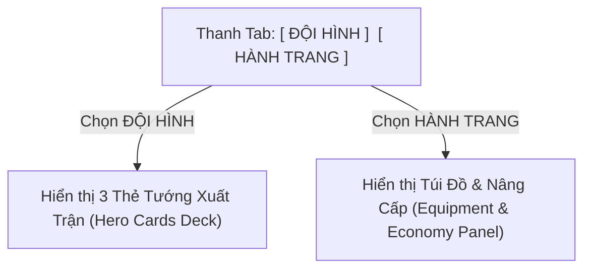
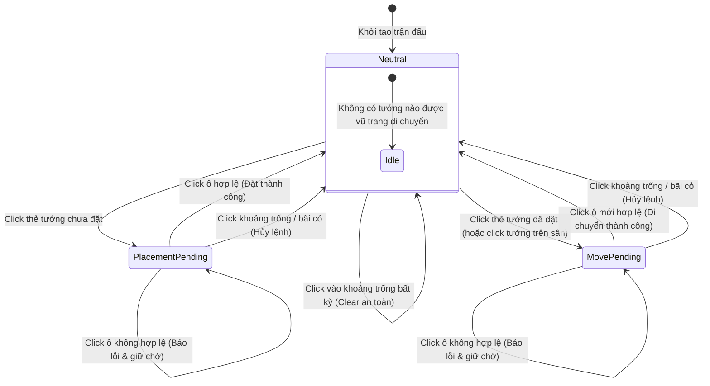

# Tài Liệu Đặc Tả Bố Cục & Trải Nghiệm Giao Diện Trận Đấu (Battle HUD UX Spec)
**Task ID**: `VIS-HUD-01A`
**Tài liệu**: `docs/drafts/ui/vis-hud-01a-battle-layout-spec.md`
**Chương mục tiêu**: Màn chơi Hai Bà Trưng (*Huyết Chiến Lãng Bạc*) & Khung Battle HUD Chuẩn Hóa
**Trạng thái**: Draft / Implementation-Ready UX Specification

---

> [!IMPORTANT]
> **Ràng Buộc & Phạm Vi Tài Liệu (Guardrails)**:
> - **Chỉ đặc tả tài liệu UI/UX**: Tài liệu này phục vụ triển khai giao diện, **tuyệt đối không sửa đổi mã nguồn (`src/**`), file test (`tests/**`), `package.json` hay lockfiles**.
> - **Không thay đổi Logic Cốt Lõi**: Giữ nguyên toàn bộ cấu trúc kiến trúc `Combat Core`, `Meta State`, `Economy`, `Equipment System` và `GameClock`.
> - **Bảo tồn phong cách thị giác**: Giữ nguyên tông màu tối xanh biển sẫm (Dark Navy `#0f172a` / `#172033`), điểm nhấn vàng đồng (`#fbbf24`), ngọc lục bảo (`#10b981`) và lam sáng (`#38bdf8`).
> - **Nợ kỹ thuật hiện tại (Known Current Debt)**: Việc trang bị Vũ khí/Ngọc chưa phản ánh tức thời lên chỉ số/hiệu ứng chiến đấu là nợ kỹ thuật hệ thống ngoài phạm vi task UI này (`OUT OF SCOPE for VIS-HUD-01`).

---

## 1. Mục Tiêu Thiết Kế & Yêu Cầu Người Dùng (Design Goals)

Qua thử nghiệm trực tiếp trên bản dựng hiện tại, giao diện Battle HUD cần khắc phục các vấn đề trải nghiệm sau:

1. **Hiển thị trọn vẹn trong một màn hình Desktop (Single-Viewport No-Scroll)**:
   - Toàn bộ giao diện (Thanh thông tin đỉnh, Chiến trường, Bảng tướng/trang bị, Cụm phím điều khiển) phải hiển thị vừa vặn trong một khung hình duy nhất trên các độ phân giải từ $1920 \times 1080$, $1600 \times 900$ đến tối thiểu $1366 \times 768$.
   - **Tuyệt đối không xuất hiện thanh cuộn dọc toàn trang (No page-level vertical scroll)** trong suốt quá trình chơi.
2. **Chiến trường (Battlefield) làm trọng tâm thị giác áp đảo**:
   - Tối đa hóa diện tích chiều dọc cho bàn cờ chiến đấu (`game-frame`), giảm bớt các khoảng trống thừa (wasted padding) của các thanh HUD trên và dưới.
3. **Chuyển đổi Tab [ ĐỘI HÌNH ] / [ HÀNH TRANG ] trên cùng một vị trí vật lý**:
   - Hai nội dung Đội hình xuất trận (Hero Deck) và Túi đồ trang bị (Equipment Inventory) chia sẻ chung một vùng không gian dưới đáy; không xếp chồng theo chiều dọc gây tràn màn hình.
4. **Điều khiển hiển thị Tầm Đánh (Global Range Overlay Toggle)**:
   - Cung cấp nút bật/tắt hiển thị vòng tầm đánh toàn cục rõ ràng; mặc định tắt (`Tầm đánh: Tắt`) để giữ chiến trường thoáng đãng.
5. **An toàn tương tác Chọn Tướng & Di Chuyển (Safe Selection/Movement UX)**:
   - Click vào bãi cỏ/khoảng trống trên bản đồ sẽ **hủy lệnh chờ (Cancel)** ngay lập tức.
   - Sau khi đặt hoặc di chuyển tướng thành công, trạng thái vũ trang di chuyển tự động reset về trung lập (`Neutral`), không để lại trạng thái "ngầm kích hoạt di chuyển".
6. **Chuẩn hóa văn bản giao diện tiếng Việt (Concise Vietnamese Copy)**:
   - Câu lệnh ngắn gọn, dứt khoát, dễ đọc, loại bỏ câu từ thừa thãi.

---

## 2. Bố Cục Tổng Thể Desktop (Desktop Viewport Architecture)

### 2.1. Khung Wireframe Chuẩn Hóa

```
┌──────────────────────────────────────────────────────────────────────────────┐
│ [🏯 Huyết Chiến Lãng Bạc] [Thành HP: 10/10] │ [Đợt 3/10] │ [Vàng: 120] [⚔×4 🏹×2]│ (TOP HUD: ~48px)
├──────────────────────────────────────────────────────────────────────────────┤
│                                                                              │
│                                                                              │
│                         BÀN CỜ CHIẾN TRƯỜNG CHÍNH                           │
│                      (LARGE DOMINANT BATTLEFIELD)                            │
│                       [Tỷ lệ 4:3-ish Canvas Centered]                         │
│                                                                              │
│                                                                              │
├──────────────────────────────────────────────────────────────────────────────┤
│ 💬 Hướng dẫn: Chọn vị trí triển khai Trưng Trắc. Đã đặt 1/3 Hero.            │ (HINT ROW: ~24px)
├──────────────────────────────────────────────────────────────────────────────┤
│ [ ĐỘI HÌNH (Active) ]   [ HÀNH TRANG ]                                       │ (TAB BAR: ~36px)
├───────────────────────────────────────────────────────┬──────────────────────┤
│ VÙNG NỘI DUNG TAB (ĐỘI HÌNH / HÀNH TRANG)             │ CỤM ĐIỀU KHIỂN CHUNG │
│                                                       │                      │
│ ┌───────────────┐ ┌───────────────┐ ┌───────────────┐ │ ⚡ Quân Lệnh: 1/1    │
│ │ [Ảnh] Trưng   │ │ [Ảnh] Trưng   │ │ [Ảnh] Lê      │ │ 🛡 Triển khai: 1/3   │ (BOTTOM PANEL:
│ │       Trắc    │ │       Nhị     │ │       Chân    │ │ [ BẮT ĐẦU WAVE ]   │  ~160-190px)
│ │ ● Đã đặt      │ │ ● Sẵn sàng    │ │ ● Sẵn sàng    │ │ [ AUTO: TẮT ]      │
│ └───────────────┘ └───────────────┘ └───────────────┘ │ [x1] [x3] [Tầm: Tắt] │
│                                                       │ [🔍 Chi Tiết Tướng]  │
└───────────────────────────────────────────────────────┴──────────────────────┘
```

### 2.2. Phân Bổ Kích Thước Theo Chiều Dọc (Vertical Budget)

| Thành Phần Giao Diện | Chiều Cao Dự Kiến | Tỷ Lệ Chiều Cao | Ghi Chú Hành Vi |
|---|:---:|:---:|---|
| **Top City Bar (Header HUD)** | $44 - 52\text{ px}$ | $\approx 6 - 8\%$ | Cố định trên đỉnh, dạng thanh ngang liền mạch, không chia card rời rạc. |
| **Bàn Cờ Chiến Trường (`game-frame`)** | Chiếm phần lớn diện tích còn lại | $\approx 60 - 65\%$ | Tự động co giãn theo tỷ lệ 4:3 bên trong khung chứa, căn giữa màn hình. |
| **Thanh Gợi Ý & Trạng Thái (`Hint / Feedback`)** | $22 - 28\text{ px}$ | $\approx 3 - 4\%$ | Dòng chữ ngắn báo trạng thái chọn tướng, cảnh báo giới hạn đặt tướng. |
| **Thanh Tab Chuyển Đổi (`Meta Tabs`)** | $32 - 38\text{ px}$ | $\approx 4 - 5\%$ | 2 nút Tab `[ ĐỘI HÌNH ]` và `[ HÀNH TRANG ]` nằm sát trên khung đáy. |
| **Khung Dưới Đáy (`Bottom Player Panel`)** | $150 - 190\text{ px}$ | $\approx 20 - 25\%$ | Chia 2 cột: Cột trái (Nội dung Tab), Cột phải (Cụm điều khiển trận đấu). |
| **Tổng Chiều Cao (Total Viewport)** | **$\mathbf{100vh}$ (100% Khung nhìn)** | **$\mathbf{100\%}$** | **`overflow: hidden` trên toàn trang; tuyệt đối không cuộn trang**. |

---

## 3. Đặc Tả Top City Bar (Header HUD)

Thanh Top HUD được thiết kế thành một dải băng ngang liền khối duy nhất (`display: flex; justify-content: space-between; align-items: center`), phân bố thành 3 cụm thông tin rõ ràng:

```
┌────────────────────────────────────────────────────────────────────────────────────────┐
│ [CỤM TRÁI: Thành Trì]            │ [CỤM GIỮA: Tiến Trình Wave] │ [CỤM PHẢI: Tài Nguyên & Quái] │
└────────────────────────────────────────────────────────────────────────────────────────┘
```

### 3.1. Phân Bố Thông Tin & Thứ Bậc

1. **Cụm Trái (Left Group) — Thông Tin Chiến Dịch & Thành Trì**:
   - **Tên màn chơi**: `🏯 Huyết Chiến Lãng Bạc` (Font bold $14 - 15\text{ px}$, màu vàng kim `#fbbf24`).
   - **Lượng máu Thành trì (City HP)**: `Thành: 10/10` (Badge nền tối viền xanh lá `#10b981` hoặc đỏ khi nguy cấp).
   - **Tỷ số diệt quái rút gọn**: `(Hạ: X | Thoát: Y)` (Màu xám nhạt `#94a3b8`, font nhỏ $12\text{ px}$).
2. **Cụm Giữa (Center Group) — Tiến Trình Đợt Quái (Wave Tracker)**:
   - **Bộ đếm Wave**: `ĐỢT 3/10` (Font to nổi bật $16\text{ px}$, chữ trắng sáng `#f8fafc`).
   - **Huy hiệu trạng thái**: Badge nhỏ bên cạnh: `[Đang đánh]` (Xanh lơ) / `[Chờ lệnh]` (Vàng cam) / `[Thắng]` (Lục) / `[Bại]` (Đỏ).
3. **Cụm Phải (Right Group) — Ví Tiền & Quái Còn Lại**:
   - **Tài nguyên ví**: `🪙 Vàng: 120` | `💎 KNB: 50` (Badge gọn gàng, cách nhau $8\text{ px}$).
   - **Đếm quái theo loại (Enemy Chips)**: Các thẻ siêu nhỏ hiển thị icon và số lượng:
     - `⚔ ×4` (Bộ binh)
     - `🏹 ×2` (Nỏ thủ)
     - `👾 ×1` (Thiết giáp / Mã Viện — chỉ hiện khi $>0$).

---

## 4. Đặc Tả Bàn Cờ Chiến Trường (Central Battlefield)

* **Vị trí & Tính ưu tiên**: Nằm ở trung tâm màn hình, chiếm tỷ trọng không gian thị giác lớn nhất ($\ge 60\%$ chiều cao viewport).
* **Tỷ lệ hiển thị**: Tỷ lệ khung hình chuẩn 4:3 (`aspect-ratio: 4 / 3`), tự căn lề giữa (`margin: 0 auto`), có viền sẫm bo góc mềm (`border-radius: 8px; border: 1px solid #334155`).
* **Tính dễ đọc của Ô Triển Khai (Placement Tiles)**:
  - Ô trống hợp lệ: Viền lam sáng nét đứt (`#38bdf8`, alpha 0.4), nền mờ nhẹ để nổi bật trên nền cỏ phù sa.
  - Ô đang có tướng đóng giữ: Viền ngọc lục bảo (`#10b981`), nền mờ hiển thị rõ chân đế tướng.
  - Ô đang được chọn để đặt/di chuyển: Hiệu ứng viền vàng sáng (`#fbbf24`) nhấp nháy nhẹ (pulse) để người chơi nhận diện ngay vị trí đích.
* **Sprite Tướng trên chiến trường**:
  - Tỷ lệ hiển thị sprite tướng: Tăng kích thước thị giác **khoảng 20–30%** so với bản prototype cũ (đảm bảo nhận diện rõ khuôn mặt và vũ khí, không bị chìm vào nền).
  - Tọa độ chân gióng chuẩn $Y=112\text{ px}$ trên khung $128 \times 128\text{ px}$.
* **Vòng Tầm Đánh (Range Circles)**:
  - Giảm độ chói (opacity viền giảm còn $\approx 0.35$, màu nền trong suốt $\approx 0.04$).
  - Chỉ hiển thị khi được bật qua công tắc toàn cục hoặc khi đang trong trạng thái xem trước vị trí đặt tướng (Placement Preview).
* **Ràng buộc hình học**: **Tuyệt đối không thay đổi tọa độ grid, path hay kích thước logic của map data**.

---

## 5. Đặc Tả Thanh Tab Chuyển Đổi [ ĐỘI HÌNH ] / [ HÀNH TRANG ]

### 5.1. Cơ Chế Chuyển Đổi Vùng Vật Lý (Physical Region Replacement)



* **Vị trí**: Nằm ngay phía trên Khung Dưới Đáy, gắn liền với khối bảng điều khiển.
* **Nguyên tắc chia sẻ không gian**:
  - Khi chọn **ĐỘI HÌNH**: Khung panel bên dưới hiển thị danh sách thẻ tướng (Hero Deck).
  - Khi chọn **HÀNH TRANG**: Khung panel bên dưới thay thế hoàn toàn thẻ tướng bằng giao diện Túi đồ trang bị (Equipment Inventory).
  - **Không bao giờ xếp chồng cả hai bảng cùng lúc theo chiều dọc**.

### 5.2. Quy Chuẩn Kiểu Dáng Tab (Tab Styling)

* **Tab Đang Hoạt Động (Active Tab)**:
  - Nền: Xanh sẫm ánh vàng (`#2a2415`), viền dưới và viền nút màu vàng hổ phách (`#fbbf24`), chữ màu vàng sáng (`#fde047`), font-weight 700.
* **Tab Không Hoạt Động (Inactive Tab)**:
  - Nền: Xanh đá tối (`#1e293b`), viền xám tro (`#475569`), chữ xám nhạt (`#94a3b8`), font-weight 600.
* **Trạng thái Rê chuột / Tiêu điểm (Hover / Focus)**:
  - Nền chuyển sáng hơn (`#334155`), viền sáng nhẹ (`#93c5fd`), con trỏ dạng `pointer`.

---

## 6. Đặc Tả Thẻ Tướng Trong Deck (Hero Card Spec)

Giao diện Đội Hình hiển thị tối đa 3 thẻ tướng nằm ngang trong một hàng duy nhất. Mỗi thẻ có kích thước nhỏ gọn, tối ưu chiều dọc:

```
┌────────────────────────────────────────────────────────┐
│ ┌──────────────┐  Trưng Trắc                           │
│ │              │  [Đang di chuyển] / [Đã đặt: Ô 2-3]   │
│ │   PORTRAIT   │                                       │
│ │   (48x48)    │  ⚡ Sẵn sàng                          │
│ └──────────────┘                                       │
└────────────────────────────────────────────────────────┘
```

### 6.1. Cấu Trúc Thành Phần Thẻ Tướng

1. **Ảnh đại diện (Portrait)**:
   - Kích thước $48 \times 48\text{ px}$ (hoặc $52 \times 52\text{ px}$), bo góc $6\text{ px}$, viền kim loại mảnh theo trạng thái.
2. **Tên Tướng (Hero Name)**:
   - Font chữ đậm $14\text{ px}$, màu trắng sáng `#f8fafc`.
3. **Huy hiệu trạng thái triển khai (Deployment Badge)**:

| Trạng Thái Thẻ | Màu Viền & Nền Thẻ | Nhãn Trạng Thái (Status Text) | Ý Nghĩa Trải Nghiệm |
|---|---|---|---|
| **Chưa chọn / Sẵn sàng (Available)** | Viền xám sẫm `#334155`, nền `#1e293b` | `● Trong Deck` | Tướng chưa được chọn, chưa đặt lên sân. |
| **Đang chọn để đặt (Selected - Ready to Place)** | Viền xanh lơ `#38bdf8`, nền `#0c2d48` | `● Chọn ô để đặt` | Người chơi đang chọn tướng này để chuẩn bị cắm xuống bãi bồi. |
| **Đã triển khai (Deployed)** | Viền xanh lục `#10b981`, nền `#064e3b` | `● Đã triển khai` | Tướng đã có mặt trên sân, đang tự động tác chiến. |
| **Đang chọn di chuyển (Selected - Moving)** | Viền vàng nhấp nháy `#fbbf24`, nền `#451a03` | `● Chọn ô di chuyển` | Người chơi đã click vào tướng đã đặt để chuẩn bị dời sang ô khác. |

* **Không thêm phân cấp phẩm chất (No Rarity Tiers)**: Giữ thiết kế đồng nhất, không phân chia khung SSR/UR gây rối mắt.

---

## 7. Đặc Tả Nút Bật/Tắt Tầm Đánh (Range Overlay Control)

* **Vị trí**: Đặt trong cụm phím điều khiển chung (Control Group) ở góc phải đáy màn hình.
* **Tên hiển thị & Nhãn trạng thái**:
  - Khi Tắt (Mặc định): `Tầm đánh: Tắt` (Nền xám tối `#334155`, viền mờ).
  - Khi Bật: `Tầm đánh: Bật` (Nền xanh lam đậm `#1e3a8a`, viền sáng `#60a5fa`, chữ vàng sáng).
* **Quy tắc hiển thị vòng tròn**:
  1. **Khi `Tầm đánh: Tắt`**: Không vẽ các vòng tròn tầm đánh cố định của các tướng đã đặt. Màn chơi hoàn toàn sạch sẽ, không bị rối mắt bởi các vòng tròn đan xen.
  2. **Khi `Tầm đánh: Bật`**: Vẽ toàn bộ các vòng tròn tầm đánh của tất cả tướng đang có mặt trên bản đồ với độ trong suốt vừa phải.
  3. **Ngoại lệ khi Đặt/Dời Tướng (Placement Preview)**: Bất kể công tắc toàn cục đang Bật hay Tắt, khi người chơi đang chọn một tướng để chuẩn bị đặt hoặc di chuyển, vòng tầm đánh dự kiến của riêng tướng đó **luôn luôn hiển thị theo con trỏ/ô hover** để hỗ trợ căn chỉnh vị trí.

---

## 8. Luồng Tương Tác Chọn Tướng & Di Chuyển (Selection & Move UX)



### 8.1. Nguyên Tắc An Toàn Tuyệt Đối (Safety Rules)

1. **Tự động Giải Phóng Vũ Trang (Auto-Disarm on Completion)**:
   - Ngay khi một thao tác đặt tướng hoặc di chuyển tướng hoàn tất thành công, trạng thái tương tác **phải lập tức quay về trạng thái Trung Lập (`Neutral`)**.
   - **Tuyệt đối không để lại trạng thái vũ trang ngầm**: Không để người chơi vô tình click tiếp vào ô khác làm tướng bị dời chỗ ngoài ý muốn.
2. **Hủy Lệnh Nhanh Bằng Click Bãi Cỏ (Cancel via Empty Grass Click)**:
   - Nếu đang trong trạng thái chờ đặt (`PlacementPending`) hoặc chờ di chuyển (`MovePending`), người chơi chỉ cần click vào bất kỳ vùng cỏ trống nào trên bản đồ $\rightarrow$ Hệ thống lập tức hủy trạng thái chọn, xóa vệt highlight và trở về `Neutral`.
3. **Click Trùng Tướng Đang Chọn**:
   - Nếu click lại vào chính thẻ tướng đang được chọn $\rightarrow$ Hủy chọn, quay về `Neutral`.

---

## 9. Đặc Tả Tương Tác Click Vào Bãi Cỏ Trống (Empty Grass Click)

Khi người chơi nhấn chuột vào bất kỳ vị trí bãi cỏ, dòng sông hoặc khoảng trống không phải là ô triển khai hợp lệ:

1. **Hành vi được thực hiện**:
   - Xóa bỏ trạng thái chọn tướng hiện tại (`Clear selectedHeroId`).
   - Xóa bỏ toàn bộ viền highlight xem trước trên các ô triển khai.
   - Xóa bỏ dòng chữ hướng dẫn chờ đặt tướng, đưa dòng gợi ý về trạng thái mặc định: `"Sẵn sàng chiến đấu"`.
2. **Hành vi KHÔNG ĐƯỢC PHÉP xảy ra**:
   - Không di chuyển bất kỳ tướng nào.
   - Không gây ảnh hưởng đến tiến trình Wave đang chạy.
   - Không làm dừng hay reset đồng hồ trận đấu (`GameClock`).
   - Không kích hoạt đòn đánh hay làm mất năng lượng.

---

## 10. Từ Điển Văn Bản Giao Diện Tiếng Việt (Concise UI Copy Dictionary)

Tất cả chuỗi ký tự hiển thị trên Battle HUD được chuẩn hóa ngắn gọn, chính xác, không dùng văn phong kể chuyện rườm rà:

| Ngữ Cảnh Sử Dụng | Chuỗi Văn Bản Đề Xuất (Recommended Copy) | Ghi Chú |
|---|---|---|
| **Trạng thái trung lập (Neutral Hint)** | `Sẵn sàng chiến đấu` | Hiển thị khi không chọn tướng nào. |
| **Gợi ý đặt tướng mới** | `Chọn vị trí triển khai [Tên Tướng]` | Ví dụ: `Chọn vị trí triển khai Trưng Trắc`. |
| **Gợi ý di chuyển tướng** | `Chọn vị trí mới cho [Tên Tướng]` | Ví dụ: `Chọn vị trí mới cho Lê Chân`. |
| **Thông báo ô không hợp lệ** | `Không thể đặt tướng tại đây` | Xuất hiện khi bấm vào ô đã có người hoặc ô cấm. |
| **Cảnh báo vượt giới hạn** | `Đã đạt giới hạn triển khai (X/X Hero)` | Xuất hiện khi hết lượt quân lệnh triển khai. |
| **Công tắc tầm đánh: Bật** | `Tầm đánh: Bật` | Trạng thái hiển thị toàn bộ vòng tầm đánh. |
| **Công tắc tầm đánh: Tắt** | `Tầm đánh: Tắt` | Trạng thái ẩn vòng tầm đánh cố định. |
| **Tên Tab 1** | `Đội Hình` | Tab quản lý 3 thẻ tướng xuất trận. |
| **Tên Tab 2** | `Hành Trang` | Tab quản lý trang bị và kho đồ. |
| **Trạng thái thẻ tướng: Đã đặt** | `Đã triển khai` | Gắn trên thẻ tướng đang ở trên bàn cờ. |
| **Trạng thái thẻ tướng: Chưa đặt** | `Trong Deck` | Gắn trên thẻ tướng dự bị. |
| **Nút Bắt Đầu Đợt** | `BẮT ĐẦU WAVE` | Nút kích hoạt đợt quái thủ công. |
| **Nút Auto Wave: Bật** | `AUTO WAVE: BẬT` | Tự động gọi đợt tiếp theo khi hết quái. |
| **Nút Auto Wave: Tắt** | `AUTO WAVE: TẮT` | Chờ người chơi bấm bắt đầu wave thủ công. |
| **Nút Xem Chi Tiết Tướng** | `Chi Tiết Tướng` | Mở Modal nâng cấp / tiến hóa tướng. |

---

## 11. Cụm Phím Điều Khiển Chung (Battle Control Group)

Cụm điều khiển được gom gọn vào góc phải của Bottom HUD (`width: ~280 - 320px`), sắp xếp theo mức độ thường xuyên sử dụng từ trên xuống dưới, từ trái sang phải:

```
┌────────────────────────────────────────────────────────┐
│ ⚡ Quân Lệnh: 1/1        🛡 Triển khai: 1/3            │ (Hàng 1: Chỉ số cốt lõi)
├────────────────────────────────────────────────────────┤
│ [     ▶ BẮT ĐẦU WAVE     ]   [ ⚙ AUTO: BẬT ]           │ (Hàng 2: Nút hành động chính)
├────────────────────────────────────────────────────────┤
│ [ x1 ] [ x3 ]       [ 🎯 Tầm đánh: Tắt ]               │ (Hàng 3: Tốc độ & Overlay)
├────────────────────────────────────────────────────────┤
│ [               🔍 CHI TIẾT TƯỚNG                    ] │ (Hàng 4: Tiện ích mở rộng)
└────────────────────────────────────────────────────────┘
```

### Thứ Bậc Ưu Tiên Thị Giác:
1. **Nút `BẮT ĐẦU WAVE`**: Nút chính (Primary Action Button), kích thước lớn, màu vàng kim `#fbbf24`, chữ đậm màu đen `#0f172a`. Khi đang chạy Wave hoặc chưa đủ điều kiện sẽ chuyển sang màu xám mờ (`opacity: 0.5; cursor: not-allowed`).
2. **Nút `AUTO WAVE`**: Nút gạt chế độ (Toggle Button), đổi màu nền xanh lục khi BẬT và xám tối khi TẮT.
3. **Cụm Tốc Độ `[x1] [x3]` & `Tầm Đánh`**: Nút phụ (Secondary Buttons), thiết kế phẳng, gọn gàng.
4. **Nút `CHI TIẾT TƯỚNG`**: Nút tiện ích mở Modal, viền xanh lam `#3b82f6`.

---

## 12. Đặc Tả Bảng Hành Trang & Túi Đồ (Inventory Panel)

* **Vị trí hiển thị**: Thay thế hoàn toàn vùng hiển thị thẻ tướng ở góc dưới bên trái khi Tab `[ HÀNH TRANG ]` được chọn.
* **Cơ chế cuộn nội bộ (Internal Scroll Only)**:
  - Nếu danh sách trang bị hoặc chức năng chiêu mộ vượt quá chiều cao cho phép của Bottom Panel ($150 - 190\text{ px}$), bảng chỉ cho phép **cuộn nội bộ bên trong khung (`overflow-y: auto`)**.
  - **Tuyệt đối không đẩy dãn chiều cao toàn trang web gây cuộn trang**.
* **Phạm vi chức năng**: Giữ nguyên toàn bộ logic gắn/tháo trang bị, gacha, mua sắm và tiến hóa hiện có của `EquipmentInventoryPanel` và `EconomyPanel`.
* **Phân định rõ ràng**: Không đề xuất thêm bất kỳ cơ chế trang bị mới nào trong tài liệu này.

---

## 13. Hướng Dẫn Tỷ Lệ & Tương Phản Thị Giác (Visual Scale Guidance)

Tài liệu xác lập các tỷ lệ thị giác tương đối nhằm hướng dẫn việc tinh chỉnh CSS và asset:

1. **Sprite Tướng trên chiến trường**:
   - Chiều cao hiển thị hiển thị trên canvas tăng khoảng **$20\% - 30\%$** so với bản cũ (từ $\approx 72\text{ px}$ lên $\approx 88 - 96\text{ px}$), đảm bảo tương xứng với ô lưới $128 \times 128\text{ px}$ và nổi bật trên đường đi của quái.
2. **Ảnh đại diện trong thẻ (Portrait)**:
   - Kích thước đạt tối thiểu $48 \times 48\text{ px}$ với độ sắc nét cao (pixel-art crispness), giúp người chơi nhận diện ngay vị tướng mà không cần đọc tên.
3. **Vòng tròn tầm đánh (Range Overlay)**:
   - Giảm độ dày nét vẽ xuống $1.5\text{ px}$, màu xanh lam nhạt `#38bdf8` với độ mờ viền $0.35$ và nền trong suốt $0.04$, giúp nhìn rõ đường di chuyển của quái vật bên dưới.
4. **Ô Triển Khai (Placement Tile)**:
   - Đường biên ô cắm tướng luôn phân biệt rõ ràng bên dưới chân nhân vật, không bị che khuất hoàn toàn bởi sprite.

---

## 14. Quy Tắc Đáp Ứng Màn Hình Desktop (Responsive Rules)

Thiết kế tập trung $100\%$ cho môi trường máy tính để bàn (Desktop Web/Electron), bảo đảm hoạt động mượt mà trên 3 độ phân giải tiêu chuẩn:

| Độ Phân Giải | Hành Vi Bố Cục (Layout Behavior) | Quy Tắc Co Giãn (Scaling Rules) |
|---|---|---|
| **$1920 \times 1080$** (Full HD) | Bố cục tiêu chuẩn rộng rãi, chiến trường đạt diện tích cực đại. | Canvas tự động căn giữa, padding vỏ bọc `16px`, thẻ tướng $160\text{ px}$ rộng. |
| **$1600 \times 900$** (HD+) | Bố cục co nhẹ chiều cao, bảo toàn toàn bộ tỷ lệ. | Canvas thu nhỏ tỷ lệ thuận theo 4:3, padding vỏ bọc giảm còn `12px`, không xuất hiện scrollbar. |
| **$1366 \times 768$** (Desktop tối thiểu) | Chế độ siêu gọn (Ultra-compact mode). | Chiều cao Top HUD giảm còn $40\text{ px}$, Bottom Panel giảm còn $140\text{ px}$, thẻ tướng co gọn thành dạng ảnh + tên 1 dòng. **Không cuộn trang**. |

### Quy Tắc Co Dãn Thành Phần:
* **Được phép co giãn (May Shrink)**: Kích thước canvas chiến trường, padding giữa các khối, chiều rộng thẻ tướng.
* **Được phép cuộn nội bộ (May Scroll Internally)**: Danh sách vật phẩm trong Tab Hành Trang.
* **TUYỆT ĐỐI KHÔNG ĐƯỢC BIẾN MẤT (Must Never Disappear)**:
  - Thanh máu thành trì (`City HP`) và tiến trình Wave.
  - Cụm phím `BẮT ĐẦU WAVE`, `AUTO WAVE`, `Tốc độ x1/x3`.
  - 3 Thẻ Tướng trong Deck.
  - Công tắc `Tầm đánh`.

---

## 15. Bảng Ma Trận Trạng Thái Giao Diện (Comprehensive State Table)

| TRẠNG THÁI (STATE) | TƯỚNG ĐƯỢC CHỌN (SELECTED HERO) | HÀNH ĐỘNG CHỜ (PENDING ACTION) | HƯỚNG DẪN HIỂN THỊ (INSTRUCTION / HINT) | HIỂN THỊ TẦM ĐÁNH (RANGE DISPLAY) | KẾT QUẢ KHI CLICK BÃI CỎ (CLICK EMPTY GRASS) |
|---|---|---|---|---|---|
| **Trung Lập (Neutral)** | Không chọn (hoặc tướng xem thông tin) | Không có hành động chờ | `Sẵn sàng chiến đấu` | Ẩn (hoặc hiện nếu công tắc Tầm Đánh đang BẬT) | Giữ nguyên trạng thái Trung Lập. |
| **Chọn Tướng Chưa Đặt (Hero Selected)** | Tướng A (chưa triển khai) | Chuẩn bị đặt tướng | `Chọn vị trí triển khai [Tên Tướng A]` | Vẽ vòng tầm đánh xem trước theo chuột/ô chọn | **Hủy chọn** $\rightarrow$ Trở về **Trung Lập**, xóa vòng xem trước. |
| **Đang Chờ Đặt Tướng (Placement Pending)** | Tướng A (chưa triển khai) | Đang rê chuột tìm ô đặt | `Chọn vị trí triển khai [Tên Tướng A]` | Hiển thị vòng tầm đánh dự kiến tại ô đang hover | **Hủy chọn** $\rightarrow$ Trở về **Trung Lập**, không đặt tướng. |
| **Đang Chờ Di Chuyển (Move Pending)** | Tướng B (đã có trên sân) | Đang chọn ô mới để dời | `Chọn vị trí mới cho [Tên Tướng B]` | Hiển thị vòng tầm đánh tại vị trí mới | **Hủy di chuyển** $\rightarrow$ Trở về **Trung Lập**, tướng giữ nguyên chỗ cũ. |
| **Đặt / Dời Thành Công (Action Completed)** | Tướng vừa đặt | **Tự động hoàn tất & Reset** | `Đã triển khai [Tên Tướng]. Sẵn sàng chiến đấu` | Trở về chế độ hiển thị toàn cục của công tắc | Trở về **Trung Lập**. |
| **Hủy Lệnh (Cancelled)** | Đã xóa chọn | Đã hủy bỏ thao tác | `Sẵn sàng chiến đấu` | Xóa vòng xem trước ngay lập tức | Giữ nguyên **Trung Lập**. |

---

## 16. Bảng Kiểm Tra Nghiệm Thu Thiết Kế (Acceptance Checklist)

Bản đặc tả này được coi là hoàn tất và đạt chuẩn triển khai khi đáp ứng toàn bộ 13 tiêu chí kiểm tra sau:

- [ ] **1. Không cuộn trang dọc ở độ phân giải $1920 \times 1080$** (No page vertical scroll at 1920x1080).
- [ ] **2. Không cuộn trang dọc ở độ phân giải $1600 \times 900$** (No page vertical scroll at 1600x900).
- [ ] **3. Vừa vặn thực tế và không tràn trang ở độ phân giải tối thiểu $1366 \times 768$** (Practical fit at 1366x768).
- [ ] **4. Bàn cờ chiến trường chiếm ưu thế thị giác trung tâm ($\ge 60\%$ diện tích chiều dọc)** (Battlefield visually dominant).
- [ ] **5. Hai Tab Đội Hình và Hành Trang chia sẻ và thay thế chung một vùng panel vật lý** (Tabs switch same panel region).
- [ ] **6. Công tắc Tầm Đánh (Range Toggle) rõ ràng, mặc định TẮT** (Range toggle obvious, default OFF).
- [ ] **7. Click vào bãi cỏ/khoảng trống trên bản đồ hủy ngay hành động chờ đặt/dời tướng** (Empty grass cancels pending action).
- [ ] **8. Đặt tướng thành công tự động giải phóng vũ trang và reset trạng thái về Neutral** (Placement success resets state).
- [ ] **9. Di chuyển tướng thành công tự động giải phóng vũ trang và reset trạng thái về Neutral** (Move success resets state).
- [ ] **10. Không còn hiện tượng tồn lưu dòng chữ "Chọn ô để di chuyển" sau khi thao tác xong** (No stale "Chọn ô để di chuyển").
- [ ] **11. 3 Thẻ Tướng hiển thị rõ ràng, dễ đọc trong 1 hàng duy nhất** (Hero cards readable in one compact row).
- [ ] **12. Cụm điều khiển trận đấu (Quân Lệnh, Bắt Đầu, Tốc Độ, Chi Tiết) luôn hiển thị đầy đủ** (Battle controls remain visible).
- [ ] **13. Bảng Hành Trang cho phép cuộn nội bộ khi nhiều vật phẩm; không gây phình trang** (Inventory may internally scroll; no page scroll).
- [ ] **14. Không đưa ra bất kỳ cơ chế hay yêu cầu mới nào về thuộc tính trang bị** (No Equipment behavior claim / marked as debt).
