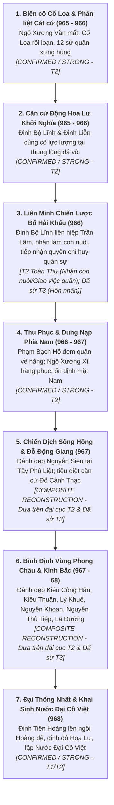

# Đề Cương & Khung Cốt Truyện Chương: Vạn Thắng Hoa Lư (ARC-12SQ-01)

**Tài liệu**: `docs/drafts/viet-su/12-su-quan/chapter-outline.md`
**Chương Lịch Sử**: `ARC-12SQ-01: Vạn Thắng Hoa Lư — Dẹp Loạn Sứ Quân`
**Giai đoạn Lịch sử**: 965/966 – 968 SCN
**Trạng thái**: Production History Outline & Narrative Spine (Final Attribution Lock)

---

## 1. Định Danh Chương & Khung Tác Phẩm (Chapter Identity)

### 1.1. Tên Chương Khuyến Nghị (Recommended Final Chapter Title)
* **Tên chính thức đề xuất**: **`Vạn Thắng Hoa Lư — Dẹp Loạn Sứ Quân`**
* **Mã định danh sản xuất**: `ARC-12SQ-01`

### 1.2. Các Phương Án Tên Gọi Thay Thế (Alternate Vietnamese Titles)
1. *`Vạn Thắng Khởi Binh — Thu Phục Mười Hai Sứ Quân`* (Nhấn mạnh khí thế khởi nghiệp và tính chính danh thu phục non sông).
2. *`Động Hoa Lư Khởi Nghiệp — Thống Nhất Giang Sơn`* (Gắn liền với căn cứ địa Hoa Lư và đại nghiệp thống nhất đất nước).

### 1.3. Khung Thời Gian Lịch Sử (Historical Date Range)
* **965/966 – 968 SCN**:
  - *Năm 965*: Nam Tấn Vương Ngô Xương Văn tử trận, vương triều Cổ Loa tan rã, các tướng lĩnh tranh chấp nội bộ.
  - *Năm 966*: 12 sứ quân chính thức cát cứ chiếm giữ các châu huyện trọng yếu (*Toàn Thư* T2).
  - *Năm 967*: Đinh Bộ Lĩnh liên hiệp Bố Hải Khẩu, từng bước đánh dẹp và thu phục các thế lực cát cứ.
  - *Năm 968*: Hoàn thành thống nhất toàn cõi; Đinh Bộ Lĩnh xưng Hoàng đế (Đinh Tiên Hoàng), đặt quốc hiệu Đại Cồ Việt, định đô Hoa Lư. *(Lưu ý: Niên hiệu Thái Bình được đặt vào năm 970)*.

---

## 2. Lời Dẫn Kịch Bản (Narrative Framing)

### 2.1. Lời Dẫn Mở Đầu Chương (Opening Narrative)
> `[SOURCE-BACKED: Toàn Thư / Cương Mục]`
> *"Năm 965, Nam Tấn Vương Ngô Xương Văn tử trận, triều đình Cổ Loa sụp đổ. Các thủ lĩnh hào trưởng cùng tướng lĩnh khắp cõi Giao Châu đồng loạt dấy binh chiếm cứ châu huyện, lập đồn đắp lũy, tự xưng hùng xưng bá, gây nên thảm cảnh phân tranh 12 sứ quân.*
> *Từ thung lũng Động Hoa Lư non sông hiểm trở, Đinh Bộ Lĩnh dấy cờ tụ nghĩa. Mang tài thao lược vượt trội và khát vọng quy giang sơn về một mối, Vạn Thắng Vương cùng con trưởng Đinh Liễn và các tướng lĩnh kiệt xuất bước vào đại nghiệp bình định thiên hạ."*

### 2.2. Mục Tiêu Lịch Sử Trọng Tâm (Historical Objective)
* **Về mặt Quân sự & Chính trị**: Liên hiệp thế lực hào trưởng giàu mạnh Bố Hải Khẩu (Trần Lãm), thu phục các dòng họ hào tộc có thế lực (Phạm Bạch Hổ đem quân về hàng, Ngô Xương Xí, Ngô Nhật Khánh), đồng thời xuất quân đánh dẹp các căn cứ kháng cự kiên cố (Nguyễn Siêu, Đỗ Cảnh Thạc, Kiều Công Hãn, Kiều Thuận, Lý Khuê...).
* **Về mặt Lãnh thổ & Dân tộc**: Chấm dứt tình trạng cát cứ chia rẽ, khôi phục quyền lực trung ương thống nhất, tạo tiền đề vững chắc cho việc kiến lập nhà nước quân chủ độc lập Đại Cồ Việt năm 968.

### 2.3. Lời Dẫn Kết Thúc & Chuyển Giao Lịch Sử (Ending Narrative & Transition)
> `[SOURCE-BACKED: Toàn Thư / Tống Sử]`
> *"Trải qua ba năm xông pha trận mạc, bằng sự kết hợp tài tình giữa sức mạnh quân sự và viễn kiến chính trị thu phục lòng người, Đinh Bộ Lĩnh đã dẹp yên các lộ sứ quân, thống nhất toàn vẹn lãnh thổ non sông vào năm Mậu Thìn (968).*
> *Vạn Thắng Vương lên ngôi Hoàng đế, lấy hiệu Đinh Tiên Hoàng, đặt quốc hiệu Đại Cồ Việt, dựng kinh đô tại Hoa Lư hiểm yếu, mở ra kỷ nguyên độc lập, tự chủ, xưng đế ngang hàng với các hoàng triều phương Bắc."*

---

## 3. Trục Xương Sống Cốt Truyện Theo Biên Niên (Chapter Story Spine)

---

## 4. Bảng Chi Tiết Phân Tầng Nguồn Từng Mắt Xích Lịch Sử

| Mắt Xích Lịch Sử | Niên Đại | Nguồn Thư Tịch | Phân Tầng & Mức Độ Bằng Chứng | Đánh Giá Học Thuật & Ranh Giới Kịch Bản |
|---|:---:|---|:---:|---|
| **1. Biến loạn Cổ Loa & 12 Sứ quân cát cứ** | 965–966 | *Toàn Thư*, *Việt Sử Lược*, *Cương Mục* | **T2 (CONFIRMED / STRONG)** | Sự kiện lịch sử xác thực. Tách bạch biến loạn Cổ Loa (965) với thời điểm 12 sứ quân cát cứ toàn diện (966). |
| **2. Động Hoa Lư củng cố binh lực** | 965–966 | *Toàn Thư*, *Tống Sử*, Khảo cổ học | **T1/T2/T4 (CONFIRMED / STRONG)** | Đinh Bộ Lĩnh tận dụng địa thế hiểm trở của vùng thung lũng karst Hoa Lư để xây dựng lực lượng tinh nhuệ. |
| **3. Liên minh Bố Hải Khẩu với Trần Lãm** | 966 | *Toàn Thư*, *Cương Mục*, Thần tích Kỳ Bố | **T2 (Nhận con nuôi/Giao việc quân) + T3 (Hôn nhân)** | *Toàn Thư* (T2) ghi Trần Lãm nhận Bộ Lĩnh làm con nuôi và giao việc quân. Chi tiết gả con gái thuộc tầng dã sử/thần phả (T3). |
| **4. Phạm Bạch Hổ quy phục & Hôn nhân Ngô Nhật Khánh** | 966–967 | *Toàn Thư*, *Tống Sử* | **T1/T2 (CONFIRMED / STRONG)** | Thể hiện biện pháp ngoại giao chính trị: Phạm Bạch Hổ đem quân về hàng (*Toàn Thư* T2), dùng hôn nhân kiềm chế dòng họ Ngô Đường Lâm (*Toàn Thư* T2). |
| **5. Chiến dịch Tây Phù Liệt & Đỗ Động Giang** | 967 | *Toàn Thư*, Thần phả Thanh Trì / Quốc Oai | **T2 (Đại cục) / T3 (Diễn biến chi tiết)** | Hai sứ quân kiên cố án ngữ cửa ngõ sông Hồng và vùng Đỗ Động bị quân Hoa Lư đánh dẹp trong đại cục thống nhất. Diễn biến chi tiết mang tính phục dựng kịch bản (`COMPOSITE RECONSTRUCTION`). |
| **6. Bình định vùng Phong Châu & Kinh Bắc** | 967–968 | *Toàn Thư*, Dã sử miền Bắc | **T2 (Đại cục) / T3 (Diễn biến chi tiết)** | Chuỗi chiến dịch dẹp các sứ quân vùng trung du và đồng bằng tả ngạn sông Hồng. Diễn biến chi tiết được tái hiện an toàn học thuật (`COMPOSITE RECONSTRUCTION`). |
| **7. Đinh Tiên Hoàng xưng Đế, lập Nước Đại Cồ Việt** | 968 | *Tống Sử*, *Toàn Thư*, Minh văn Cột kinh | **T1/T2 (CONFIRMED / STRONG)** | Mốc son lịch sử vĩ đại: định đô Hoa Lư, đặt quốc hiệu Đại Cồ Việt năm 968. *(Niên hiệu Thái Bình được đặt vào năm Canh Ngọ 970)*. |
