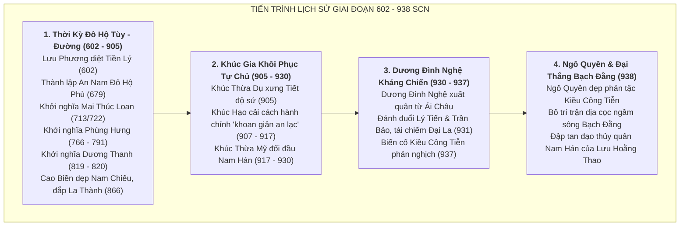

# Khảo Cứu Lịch Sử & Phân Kỳ Niên Biểu: Giai Đoạn 602–938 SCN

> [!IMPORTANT]
> **Ràng Buộc Nghiên Cứu & Lập Kế Hoạch Niên Biểu (Task `VS-EA-00`)**:
> - Đây là **Gói Khảo Cứu Lịch Sử & Phân Tích Niên Biểu (Research & Chronology Planning Specification)** cho toàn bộ giai đoạn từ khi nhà Tùy chiếm Giao Châu (năm 602) đến chiến thắng Bạch Đằng của Ngô Quyền (năm 938).
> - **TUYỆT ĐỐI KHÔNG LÀM GAMEPLAY DESIGN TRONG TASK NÀY**:
>   - Không chọn Roster 3 Hero chính thức cho từng arc.
>   - Không thiết kế Skill, Passive, hay TriggerHits.
>   - Không tạo chỉ số Stats (HP, ATK, Range, Speed).
>   - Không viết Waves outline hay Enemy mechanics.
>   - Không tạo Prompt asset hay file PNG.
>   - Không sửa `src/**` hoặc `PROJECT_PLAN.md`.
> - Mọi sự kiện, nhân vật và hiện vật đều phải được phân định nguồn gốc theo hệ thống 4 tầng học thuật (**T1 / T2 / T3 / T4**).

---

## 1. Mục Tiêu & Tổng Quan Giai Đoạn 602–938 SCN

Giai đoạn 602–938 là thời kỳ chuyển biến quyết định trong lịch sử Việt Nam, trải qua hơn 300 năm dưới ách đô hộ của nhà Tùy, nhà Đường (thời kỳ An Nam Đô Hộ Phủ), các cuộc khởi nghĩa quật khởi giành quyền tự chủ, sự suy sụp của nhà Đường dẫn đến thời kỳ Ngũ Đại Thập Quốc, và đỉnh cao là sự nghiệp trung hưng của họ Khúc, họ Dương và đại thắng Bạch Đằng năm 938 của Ngô Quyền mở ra kỷ nguyên độc lập lâu dài.

---

## 2. Hệ Thống Phân Tầng Nguồn Sử Liệu 4 Cấp Độ

| Tầng Nguồn | Tên Gọi | Định Nghĩa & Phạm Vi Thư Tịch |
|:---:|---|---|
| **T1** | **Near-source Chinese Chronicles** | Sử liệu phương Bắc biên soạn gần thời điểm sự kiện (thế kỷ VII–XI): *Tùy Thư*, *Cựu Đường Thư*, *Tân Đường Thư*, *Tư Trị Thông Giám*, *Cựu Ngũ Đại Sử*, *Tân Ngũ Đại Sử*, *Thập Quốc Xuân Thu*, *An Nam Chí Lược*. |
| **T2** | **Later Vietnamese Historiography** | Chính sử trung đại Đại Việt (thế kỷ XIII–XIX): *Việt Sử Lược*, *Đại Việt Sử Ký Toàn Thư*, *Khâm Định Việt Sử Thông Giám Cương Mục*, *Việt Sử Tiêu Án*. |
| **T3** | **Local Tradition / Folklore** | Thần tích đền miếu, truyền thuyết dân gian, truyện ký thế kỷ XIV–XV: *Việt Điện U Linh Tập*, *Lĩnh Nam Chích Quái*, thần phả Đường Lâm, đền Vua Mai, đền Ngô Quyền. |
| **T4** | **Modern Interpretation** | Nghiên cứu khảo cổ học (bãi cọc Bạch Đằng, di tích La Thành/Hoàng thành Thăng Long), địa danh học và nghiên cứu lịch sử của các học giả hiện đại thế kỷ XX–XXI. |

---

## 3. Danh Mục Tài Liệu Chi Tiết

| Tài Liệu | Nội Dung Trọng Tâm |
|---|---|
| [sources.md](sources.md) | Khảo cứu chi tiết toàn bộ các nguồn T1, T2, T3, T4; phân tích tính xác thực, thiên kiến và độ tin cậy của các chi tiết lịch sử gây tranh cãi (niên đại Mai Thúc Loan, số quân liên quân, danh hiệu Bố Cái Đại Vương, truyền thuyết Cao Biền trấn yểm, cọc gỗ Bạch Đằng). |
| [historical-context-and-timeline.md](historical-context-and-timeline.md) | Bối cảnh lịch sử và niên biểu toàn diện 602–938 SCN với nhãn nguồn T1/T2/T3/T4 nghiêm ngặt cho từng sự kiện, giai đoạn và trận đánh. |
| [character-and-faction-index.md](character-and-faction-index.md) | Bảng tra cứu toàn diện các nhân vật lịch sử, thủ lĩnh khởi nghĩa, tướng soái đô hộ và các thế lực chính trị (Tùy, Đường, Nam Chiếu, Nam Hán, Khúc, Dương, Ngô), phân loại theo 4 tầng nguồn. |
| [chapter-segmentation-proposal.md](chapter-segmentation-proposal.md) | Đề xuất phân chia các Historical Arcs cho dự án *Huyền Sử TD*, đánh giá tính khả thi về mặt tư liệu lịch sử và cơ chế của từng giai đoạn; chỉ rõ những giai đoạn không đủ dữ liệu làm Chapter độc lập. |
