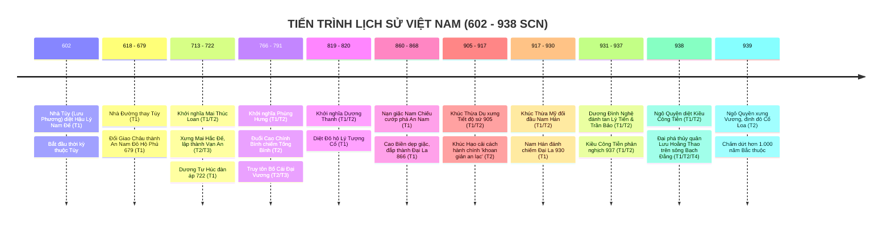
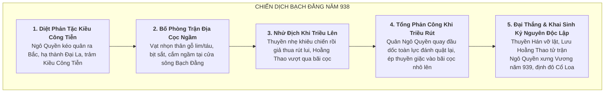

# Bối Cảnh Lịch Sử & Niên Biểu Toàn Tuyến: Giai Đoạn 602–938 SCN

> [!IMPORTANT]
> **Ràng Buộc Nghiên Cứu Lịch Sử (Task `VS-EA-00`)**:
> - Tài liệu này khảo cứu toàn bộ tiến trình lịch sử 336 năm từ khi nhà Tùy đánh chiếm Giao Châu (602) đến đại thắng Bạch Đằng (938).
> - Mọi sự kiện, trận đánh và niên đại đều được gắn nhãn nguồn gốc 4 tầng (**T1 / T2 / T3 / T4**) nghiêm ngặt.
> - **KHÔNG thiết kế gameplay, không gán số liệu stats/waves**.

---

## 1. Niên Biểu Toàn Tuyến Giai Đoạn 602–938 SCN

---

## 2. Diễn Biến Chi Tiết Qua 6 Giai Đoạn Lịch Sử

### Giai Đoạn 1: Sự Thiết Lập Ách Đô Hộ Tùy — Đường & An Nam Đô Hộ Phủ (602–713)

* **Năm 602 (T1 — *Tùy Thư*)**: Tướng Tùy là **Lưu Phương** dẫn 27 doanh quân tràn sang Giao Châu. Lý Phật Tử thế cùng lực kiệt đầu hàng tại Đô Long, bị giải về kinh đô Trường An.
* **Năm 618 (T1 — *Cựu Đường Thư*)**: Nhà Đường thay thế nhà Tùy cai trị Trung Hoa, tiếp tục đặt quyền thống trị lên đất Giao Châu.
* **Năm 679 (T1 — *Tân Đường Thư*)**: Đường Cao Tông đổi Giao Châu đô đốc phủ thành **An Nam Đô Hộ Phủ** (安南都護府), đóng trị sở tại thành Tống Bình (khu vực Hà Nội ngày nay). Đây là khởi đầu cho tên gọi hành chính "An Nam" kéo dài suốt thời Đường.
* **Tổ chức bóc lột (T1/T2)**: Triều Đường chia An Nam thành các châu, quận; đặt ra chế độ thuế khóa Tô - Dung - Điệu, cống nạp ngọc trai, đồi mồi, ngà voi, trầm hương và các sản vật nhiệt đới quý hiếm (vải quả tiến cống).

---

### Giai Đoạn 2: Phong Trào Quật Khởi Thế Kỷ VIII — Mai Thúc Loan & Phùng Hưng (713–791)

#### A. Khởi Nghĩa Mai Thúc Loan (713/722)
* **Bối cảnh & Dấy binh (T2 — *Toàn Thư*, T3 — Thần phả đền Vua Mai)**:
  * Mai Thúc Loan (người làng Mai Phụ, huyện Thiên Lộc, nay thuộc Hà Tĩnh; sau dời về Sa Nam, Nam Đàn, Nghệ An) lãnh đạo phu phen nổi dậy chống ách cống nạp vải quả nặng nề.
  * Nghĩa quân đánh chiếm phủ thành Hoan Châu, xây dựng căn cứ địa **thành Vạn An** (Nam Đàn, Nghệ An) tựa lưng vào núi Hùng Sơn, nhìn ra sông Lam.
  * Mai Thúc Loan lên ngôi Hoàng đế, tự xưng là **Mai Hắc Đế** (Hắc Đế = Vua Đen, lấy đức Thủy / sắc áo chàm làm biểu tượng).
* **Liên minh quốc tế & Quy mô (T1 — *Tân Đường Thư*)**:
  * Mai Hắc Đế liên kết với nghĩa quân 32 châu và liên minh với các quốc gia láng giềng phía Nam: **Lâm Ấp (Champa), Chân Lạp (Khmer)**.
  * Tiến quân ra Bắc đánh đuổi Quan đô hộ nhà Đường là Quang Sở Khách, giải phóng toàn bộ lãnh thổ An Nam đô hộ phủ.
* **Chiến dịch đàn áp của Dương Tư Húc (722 SCN — T1 *Cựu Đường Thư*)**:
  * Vua Đường Huyền Tông sai Phiêu kỵ tướng quân **Dương Tư Húc** (viên tướng hoạn quan nổi tiếng thiện chiến tàn bạo) cùng Quang Lộc khanh Nguyên Sở Khách dẫn hơn 10 vạn quân ồ ạt tiến sang.
  * Dương Tư Húc bí mật hành quân men theo đường bờ biển, bất ngờ tập kích hạ thành Vạn An. Cuộc khởi nghĩa bị dẹp tan đẫm máu.

---

#### B. Khởi Nghĩa Phùng Hưng — Bố Cái Đại Vương (766–791)
* **Dấy binh Đường Lâm (T2 — *Toàn Thư*, T3 — Thần phả Đường Lâm)**:
  * Khoảng niên hiệu Đại Lịch (766–779) / Trinh Nguyên (785–791), hào trưởng đất Đường Lâm (Sơn Tây) là **Phùng Hưng** cùng hai em trai là **Phùng Hải** và **Phùng Dĩnh** tập hợp nhân dân nổi dậy chống lại ách cai trị tham tàn của Quan đô hộ **Cao Chính Bình**.
* **Đánh chiếm thành Tống Bình (T2 — *Toàn Thư*)**:
  * Nghĩa quân từ Đường Lâm bao vây phủ thành Tống Bình. Cao Chính Bình chống giữ không nổi, kinh sợ phát bệnh thổ huyết mà chết.
  * Phùng Hưng vào thành Tống Bình tiếp quản chính sự, thiết lập nền tự chủ độc lập trong nhiều năm.
* **Giai đoạn Phùng An & Triệu Xương (791 SCN — T1 *Cựu Đường Thư*)**:
  * Sau khi Phùng Hưng qua đời, con trai là **Phùng An** nối nghiệp. Phùng An truy tôn cha là **Bố Cái Đại Vương** (T2/T3).
  * Năm 791, nhà Đường cử Kinh lược sứ **Triệu Xương** (viên quan có mưu lược mềm mỏng) đem quân sang vừa đánh vừa dụ. Phùng An thế yếu bèn ra hàng; nhà Đường tái lập quyền cai trị.

---

### Giai Đoạn 3: Khởi Nghĩa Dương Thanh & Nạn Giặc Nam Chiếu — Thời Kỳ Cao Biền (819–868)

#### A. Khởi Nghĩa Dương Thanh (819–820 SCN)
* **Biến cố (T1 — *Cựu Đường Thư*, T2 — *Toàn Thư*)**:
  * Dương Thanh vốn là hào trưởng châu Hoan/châu Tượng, được nhà Đường bổ nhiệm làm Đô đốc Ái Châu. Quan đô hộ mới sang là **Lý Tượng Cổ** nghi ngờ lòng trung thành, điều ông đi đánh dẹp người bản địa vùng núi.
  * Tháng 7 năm 819, Dương Thanh bất ngờ quay giáo đem 3.000 binh biến tập kích thành Tống Bình, chém chết Quan đô hộ Lý Tượng Cổ cùng toàn bộ thuộc hạ, chiếm giữ thành trì trong hơn một năm.
  * Đến năm 820, tướng Đường là **Quế Trọng Vũ** dùng kế mua chuộc thủ hạ nội ứng phản bội, Dương Thanh bị bắt và hy sinh anh dũng.

---

#### B. Chiến Tranh Nam Chiếu & Cao Biền Đắp Thành Đại La (860–868 SCN)
* **Chiến tranh tàn phá (T1 — *Tân Đường Thư*)**:
  * Từ năm 860 đến 863, vương quốc **Nam Chiếu** (ở vùng Vân Nam ngày nay) liên tục xua quân tràn xuống cướp phá An Nam, hai lần đánh chiếm và phá hủy thành Tống Bình. Nhân dân Giao Châu chịu cảnh điêu linh ly tán.
* **Cao Biền dẹp Nam Chiếu & Xây La Thành (866 SCN — T1/T2 Fact)**:
  * Năm 866, nhà Đường cử danh tướng **Cao Biền** (Gao Pian) làm An Nam Đô hộ Kinh lược chiêu thảo sứ. Cao Biền dùng thủy bộ phối hợp đánh tan quân Nam Chiếu, thu hồi toàn bộ An Nam.
  * Vua Đường thăng chức cho Cao Biền làm Tiết độ sứ **Tĩnh Hải quân** (tên gọi hành chính mới của Giao Châu).
  * Năm 866, Cao Biền cho xây dựng lại phủ thành quy mô to lớn gọi là **thành Đại La (La Thành)**, khơi thông sông ngòi (sông Tô Lịch), đắp đê ngăn lũ, tạo nền tảng đô thị cho Thăng Long sau này.
* **Truyền thuyết Trấn yểm (T3 Folklore)**:
  * Dân gian truyền lại huyền tích Cao Biền dùng bùa phép phong thủy trấn yểm các long mạch An Nam nhưng đều bị thần linh sông núi (tiêu biểu là Thần Long Đỗ / Bạch Mã) đánh bại.

---

### Giai Đoạn 4: Họ Khúc Đặt Nền Móng Tự Chủ (905–930 SCN)

* **Khúc Thừa Dụ giành quyền Tiết độ sứ (905 SCN — T1 *Tân Đường Thư*, T2 *Toàn Thư*)**:
  * Cuối thời Đường, Trung Hoa rơi vào thời kỳ Ngũ Đại Thập Quốc hỗn chiến, nhà Đường hoàn toàn suy kiệt. Quan đô hộ Độc Cô Tổn bị triều đình đày ra đảo Hải Nam rồi bị giết.
  * Chớp thời cơ ngàn năm, năm 905, **Khúc Thừa Dụ** (hào trưởng giàu có, nhân ái đất Hồng Châu, Ninh Giang, Hải Dương) được nhân dân và các hào kiệt đồng lòng suy tôn, kéo quân chiếm giữ thành Đại La, tự xưng là **Tĩnh Hải quân Tiết độ sứ**.
  * Đầu năm 906, vua Đường suy tàn buộc phải ban chiếu sắc phong Khúc Thừa Dụ làm Tiết độ sứ. Nền tự chủ độc lập đầu tiên sau hơn 300 năm thuộc Đường chính thức được thiết lập một cách hòa bình và hợp pháp danh nghĩa.
* **Khúc Hạo và Cuộc Cải Cách Hành Chính Vĩ Đại (907–917 SCN — T2 *Toàn Thư*)**:
  * Năm 907, Khúc Thừa Dụ qua đời, con trai là **Khúc Hạo** nối chức Tiết độ sứ.
  * Khúc Hạo tiến hành cuộc cải cách hành chính mang tính lịch sử:
    1. Xóa bỏ hoàn toàn cơ chế cai trị đô hộ của nhà Đường, chia nước thành các đơn vị hành chính quy củ: **Lộ $\rightarrow$ Phủ $\rightarrow$ Châu $\rightarrow$ Giáp $\rightarrow$ Xã**. Mỗi giáp cử một Quản giáp và một Phó tri giáp phụ trách.
    2. Định lại mức thuế ruộng đất công bằng, bãi bỏ chế độ lao dịch cống nạp hà khắc, lập sổ hộ tịch hộ khẩu rõ ràng.
    3. Tôn chỉ trị quốc ghi trong sử sách: *"Chính sự cốt chuộng khoan dung, giản dị, nhân dân đều được yên vui"* (Khoan giản an lạc).
* **Khúc Thừa Mỹ và Sự Xâm Lược Của Nam Hán (917–930 SCN — T1 *Tân Ngũ Đại Sử*, T2 *Toàn Thư*)**:
  * Năm 917, Khúc Hạo mất, con là **Khúc Thừa Mỹ** kế vị.
  * Ở phương Nam, Lưu Nham lập ra nước **Nam Hán** (đóng đô tại Quảng Châu) luôn nhăm nhe thôn tính Tĩnh Hải quân. Khúc Thừa Mỹ nhận sắc phong của nhà Hậu Lương (Trung Nguyên) để kiềm chế Nam Hán.
  * Mùa thu năm 930, vua Nam Hán Lưu Cung sai các tướng **Lý Khắc Chính** và **Lý Tiến** đem đại quân thủy bộ xâm lược. Khúc Thừa Mỹ chống cự không nổi, bị bắt giải về Quảng Châu. Nam Hán cử Lý Tiến làm Thứ sử cùng tướng Trần Bảo đóng quân chiếm giữ thành Đại La.

---

### Giai Đoạn 5: Dương Đình Nghệ Quét Sạch Quân Nam Hán & Biến Loạn Kiều Công Tiễn (931–937 SCN)

* **Dương Đình Nghệ Tập Hợp Lực Lượng (930–931 SCN — T2 *Toàn Thư*)**:
  * **Dương Đình Nghệ** (vốn là nha tướng tâm phúc của Khúc Hạo, hào trưởng thế lực đất Ái Châu - Làng Giàng, Thiệu Hóa, Thanh Hóa) nuôi dạy 3.000 nghĩa tử và chiêu mộ đông đảo anh hào hào kiệt các nơi (Ngô Quyền, Đinh Công Trứ, Kiều Công Tiễn, Phạm Chiêm, Đỗ Cảnh Thạc...).
* **Chiến Dịch Giải Phóng Thành Đại La (931 SCN — T1 *Tân Ngũ Đại Sử*, T2 *Toàn Thư*)**:
  * Mùa xuân năm 931, Dương Đình Nghệ xuất quân thần tốc từ Ái Châu tiến thẳng ra Bắc, bao vây và công phá dữ dội thành Đại La.
  * Tướng Nam Hán là Lý Tiến bỏ chạy tháo thân về nước.
  * Vua Nam Hán vội phái Thứ sử Kiền Châu là **Trần Bảo** đem đạo quân tiếp viện sang cứu. Dương Đình Nghệ chủ động mở cửa thành đón đánh, chém chết Trần Bảo tại trận, tiêu diệt hoàn toàn viện binh địch.
  * Dương Đình Nghệ khôi phục nền tự chủ, tự xưng Tiết độ sứ, cắt cử các tướng tài cai quản các trọng trấn: Ngô Quyền trấn thủ Ái Châu, Đinh Công Trứ làm Thứ sử Hoan Châu.
* **Họa Phản Nghịch Kiều Công Tiễn (937 SCN — T1 *Tân Ngũ Đại Sử*, T2 *Toàn Thư*)**:
  * Tháng 4 năm 937, nha tướng **Kiều Công Tiễn** (hào trưởng Phong Châu) vì tham vọng quyền lực đã cấu kết làm phản, giết chết Dương Đình Nghệ để đoạt chức Tiết độ sứ.
  * Hành động phản nghịch bị nhân dân và tướng lĩnh khắp nơi căm ghét. Trước sức ép thảo phạt của Ngô Quyền từ Ái Châu, Kiều Công Tiễn hoảng sợ sai sứ mang vàng bạc sang cầu cứu vua Nam Hán sang cứu viện.

---

### Giai Đoạn 6: Ngô Quyền & Trận Thủy Chiến Bạch Đằng Lịch Sử (938–939 SCN)

* **Trừ Gian Diệt Phản (Mùa thu 938 — T2 *Toàn Thư*)**:
  * Ngô Quyền tập hợp quân sĩ từ Ái Châu, liên kết với các hào kiệt yêu nước (Dương Tam Kha, Đỗ Cảnh Thạc, Kiều Công Hãn, Đinh Công Trứ) tiến quân thần tốc ra thành Đại La, vây bắt và xử trảm tên phản quốc Kiều Công Tiễn trước khi quân Nam Hán kịp đặt chân đến biên giới.
* **Chiến Thuật Cọc Ngầm Bạch Đằng (Mùa đông 938 — T1 *Tân Ngũ Đại Sử*, T2 *Toàn Thư*, T4 Khảo cổ học)**:
  * Vua Nam Hán sai con trai là **Vạn Vương Lưu Hoằng Thao** chỉ huy thủy quân hùng hậu theo đường biển cửa sông Bạch Đằng tiến vào xâm lược.
  * Ngô Quyền nhận định: *"Hoằng Thao là đứa trẻ khờ dại, đem quân từ xa đến... Nếu ta sai người vạt nhọn cọc lớn, bịt sắt cắm ngầm trước ở cửa biển, thuyền giặc nhân khi nước triều lên tiến vào bên trong hàng cọc, bấy giờ ta dốc quân đánh quật lại, thuyền chúng tất vướng cọc mà vỡ tan"*.
  * Nghĩa quân chặt hàng ngàn cây gỗ lim, táu vạt nhọn đầu, cắm thành nhiều lớp bãi cọc ngầm tại các hiểm yếu trên sông Bạch Đằng.
* **Diễn Biến Trận Đánh (Tháng 11 năm 938 — T1/T2)**:
  * Khi thủy triều dâng cao che lấp bãi cọc, Ngô Quyền sai thuyền nhẹ ra khiêu chiến rồi giả vờ thua chạy. Hoằng Thao đắc thắng xua toàn bộ chiến hạm lớn đuổi theo vượt qua bãi cọc.
  * Khi nước triều bắt đầu rút nhanh, các đầu cọc nhọn nhô lên khỏi mặt nước, Ngô Quyền hạ lệnh cho toàn quân quay đầu, tung các cánh quân mai phục hai bên bờ dốc toàn lực tổng phản công dữ dội.
  * Thuyền chiến to lớn của quân Nam Hán tháo chạy tán loạn, va phải bãi cọc ngầm bị thủng vỡ, lật úp chìm vô số. Quân sĩ Nam Hán chết đuối quá nửa, chủ tướng Lưu Hoằng Thao bị chém chết tại trận.
  * Vua Nam Hán Lưu Cung đang đóng quân tại Hải Môn tiếp ứng nghe tin con trai tử trận và đại quân tan vỡ đã kinh hoàng gạt nước mắt thu tàn quân tháo chạy về nước.
* **Xưng Vương & Mở Ra Kỷ Nguyên Độc Lập Lâu Dài (Mùa xuân 939 — T2 *Toàn Thư*)**:
  * Năm 939, Ngô Quyền chính thức xưng Vương (**Ngô Vương**), bỏ chức Tiết độ sứ của phong kiến phương Bắc, định đô tại kinh thành cổ **Cổ Loa** (Đông Anh, Hà Nội) — biểu tượng nối tiếp truyền thống An Dương Vương, thiết lập triều đình độc lập tự chủ hoàn toàn.
  * Đại thắng Bạch Đằng năm 938 vĩnh viễn chấm dứt hơn 1.000 năm Bắc thuộc, mở ra kỷ nguyên độc lập tự chủ rực rỡ muôn đời của dân tộc Việt Nam.
