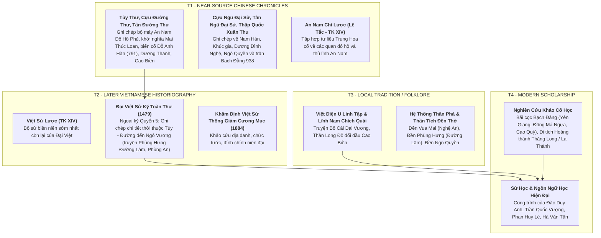

# Khảo Cứu Nguồn Thư Tịch & Thẩm Định Học Thuật: Giai Đoạn 602–938 SCN

> [!IMPORTANT]
> **Nguyên Tắc Thẩm Định Nguồn (Task `VS-EA-00`)**:
> - Tài liệu này cung cấp bức tranh toàn cảnh về thư tịch học, đánh giá độ tin cậy và phân tầng nguồn học thuật cho toàn bộ tiến trình lịch sử Việt Nam từ năm 602 đến năm 938.
> - Bắt buộc phân định rạch ròi giữa **Ghi chép gần thời (T1)**, **Chính sử trung đại Đại Việt (T2)**, **Huyền tích dân gian & Thần phả (T3)** và **Nghiên cứu khảo cổ / Sử học hiện đại (T4)**.
> - Tuyệt đối không biến truyền thuyết dân gian thành dữ kiện lịch sử đã được xác thực (historical fact).

---

## 1. Hệ Thống Thư Tịch Khảo Cứu Theo 4 Tầng

---

## 2. Phân Tích Chuyên Sâu Các Điểm Gây Tranh Cãi Lịch Sử

### 2.1. Niên Đại Khởi Nghĩa Mai Thúc Loan (Mai Hắc Đế)

* **Hiện trạng sử liệu**:
  * **T1 — *Cựu Đường Thư* (Quyển 8 — Huyền Tông bản kỷ & Liệt truyện Dương Tư Húc)** và ***Tư Trị Thông Giám* (Quyển 212)**: Ghi nhận sự kiện Mai Thúc Loan dấy binh chiếm giữ châu Hoan, xưng hiệu và bị tướng Đường là Dương Tư Húc cùng **Quang Sở Khách** (光楚客) đàn áp vào **năm Khai Nguyên thứ 10 (722 SCN)**.

> [!NOTE]
> **Tên canonical**: **Quang Sở Khách** (光楚客) là tên được đọc chính xác theo nguyên văn *Cựu Đường Thư* và *Tư Trị Thông Giám*. Hình thức "Nguyên Sở Khách" là một biến thể chép sai (textual variant / erroneous reading) xuất hiện trong một số bản in và tài liệu thứ cấp tiếng Việt. Không dùng "Nguyên Sở Khách" làm tên canonical trong tài liệu này.

  * **T2 — *Đại Việt Sử Ký Toàn Thư***: Ghi khởi nghĩa nổ ra vào **năm Quý Sửu (713 SCN)** và kéo dài đến 722 mới bị dẹp tan (kéo dài gần 10 năm).
* **Đánh giá học thuật (T4)**:
  * Đa số các nhà sử học hiện đại (Hà Văn Tấn, Phan Huy Lê) nhận định cuộc khởi nghĩa có thể đã nhen nhóm và chuẩn bị lực lượng từ khoảng 713–715 (T2), nhưng đợt bùng nổ vũ trang quy mô lớn kiểm soát toàn bộ An Nam đô hộ phủ và chiến dịch đàn áp khốc liệt của Dương Tư Húc diễn ra tập trung vào **năm 722 SCN (T1)**.
  * Sự khác biệt niên đại: `713–722 SCN (T2)` vs `722 SCN (T1)`.

---

### 2.2. Quy Mô Lực Lượng Liên Minh Của Mai Thúc Loan ("30–40 Vạn Quân")

* **Hiện trạng sử liệu**:
  * **T1 — *Tân Đường Thư* (Quyển 207 — Dương Tư Húc truyện)**: Ghi Mai Thúc Loan liên kết với quân của 32 châu, kết hợp với các nước phía Nam như **Lâm Ấp (Champa), Chân Lạp (Khmer), Kim Lân**, quân số ghi ước chừng "đến 40 vạn" (quần sầm tứ thập vạn).
  * **T2 — *Toàn Thư* & *Cương Mục***: Dẫn lại con số "30 vạn" hoặc "40 vạn" từ thư tịch phương Bắc.
* **Đánh giá học thuật (T4)**:
  * Con số **30–40 vạn** trong các sử thư cổ phương Bắc là **ước lệ phóng đại truyền thống** (thường dùng để nhấn mạnh chiến công của các tướng triều đình như Dương Tư Húc hoặc cường điệu hóa mức độ biến động).
  * **Sự thật lịch sử xác nhận (T1 fact)**: Mai Thúc Loan thực sự đã thiết lập một liên minh ngoại giao - quân sự rộng lớn với các quốc gia và tiểu quốc Đông Nam Á lân cận (Lâm Ấp, Chân Lạp). Tuy nhiên, con số nhân lực tác chiến thực tế ước tính chỉ khoảng vài vạn người.

---

### 2.3. Khởi Nghĩa Phùng Hưng (Narrative T2/T3) & Biến Cố Đỗ Anh Hàn (T1)

* **Hiện trạng sử liệu**:

> [!WARNING]
> **Phân định rạch ròi T1 vs T2/T3**:
> - **T1 (*Cựu Đường Thư*, Quyển 15 & Liệt truyện Triệu Xương)**: Ghi nhận sự kiện năm Trinh Nguyên thứ 7 (791 SCN), hào trưởng bản địa **Đỗ Anh Hàn** (杜英翰) nổi dậy, Quan đô hộ **Cao Chính Bình** (高正平) lo sợ phát bệnh mà chết, triều đình sai Kinh lược sứ **Triệu Xương** (趙昌) sang vỗ về thu phục. T1 **hoàn toàn không ghi danh Phùng Hưng hay Phùng An**.
> - **T2 (*Đại Việt Sử Ký Toàn Thư*, *Cương Mục*)**: Ghi nhận toàn bộ câu chuyện về hào trưởng **Phùng Hưng** cùng hai em (Phùng Hải, Phùng Dĩnh) dấy binh từ Đường Lâm, bao vây phủ thành Tống Bình khiến Cao Chính Bình lo sợ mà chết; Phùng Hưng làm chủ phủ thành vài năm rồi mất, con là **Phùng An** nối nghiệp rồi đầu hàng Triệu Xương (791).
> - **T3 (*Việt Điện U Linh Tập*, Thần tích Đường Lâm)**: Truyền thuyết dân gian về sức mạnh phi thường của Phùng Hưng (đánh hổ, vật trâu), hiển linh giúp dân phù trợ các triều đại sau.

* **Vấn đề đồng nhất Đỗ Anh Hàn (T1) và Phùng Hưng (T2)**:
  * Một số nhà nghiên cứu lịch sử hiện đại (T4) đưa ra giả thuyết rằng "Đỗ Anh Hàn" trong T1 có thể là tên chữ / danh xưng Hán hóa của Phùng Hưng, hoặc Đỗ Anh Hàn là một thủ lĩnh đồng minh cùng thời với Phùng Hưng.

> [!CAUTION]
> **T4 interpretation — Unverified**: Việc đồng nhất Đỗ Anh Hàn (T1) với Phùng Hưng (T2) là **giả thuyết nghiên cứu hiện đại (T4)**, tuyệt đối không biến thành T1 fact. Phùng Hưng narrative được phân loại chuẩn xác là **T2/T3**.

* **Vấn đề danh hiệu "Bố Cái Đại Vương" (T2/T3)**:
  * *Toàn Thư* (T2) giải thích: Dân chúng tôn xưng ông là "Bố Cái" vì kính trọng như cha mẹ (*Bố = Cha, Cái = Mẹ* theo tiếng Việt cổ).
  * *Nghiên cứu ngôn ngữ học lịch sử (T4)*: Một số học giả cho rằng "Bố Cái" có thể là phiên âm Hán-Việt của từ cổ gốc Nam Á / Môn-Khmer `Pô Khăy` hoặc `Pô Krông`, có nghĩa là **"Vua Lớn" / "Thủ lĩnh Tối cao"**.
  * **Lưu ý phân tầng**: Tước hiệu "Bố Cái Đại Vương" là danh hiệu do **con trai là Phùng An và nhân dân truy tôn sau khi ông qua đời (T2/T3)**, không phải danh xưng hành chính đương thời.

---

### 2.4. Nhân Vật Cao Biền: Công Trình Xây La Thành (Fact) vs Truyền Thuyết Trấn Yểm (Folklore)

* **Sự thật lịch sử đã xác nhận (T1/T2 Fact)**:
  * Cao Biền (Gao Pian, 821–887) là danh tướng mưu lược nhà Đường. Năm 866, Biền đem quân đánh tan quân Nam Chiếu xâm lược Giao Châu, khôi phục quyền kiểm soát của nhà Đường, được phong làm Tiết độ sứ Tĩnh Hải quân.
  * Năm 866, Cao Biền cho đắp lại **thành Đại La (La Thành)** với quy mô kiên cố, chu vi gần 2.000 trượng, đào kênh hào bao quanh, mở rộng sông Tô Lịch để phát triển giao thông thủy lợi. Đây là công trình lịch sử có thật được khảo cổ học Thăng Long xác nhận.
* **Huyền tích trấn yểm Long Đỗ (T3 Folklore — Tuyệt đối không xem là lịch sử)**:
  * *Lĩnh Nam Chích Quái* và *Việt Điện U Linh* chép truyện Cao Biền giỏi phong thủy, đi khắp nơi đào huyệt trấn yểm long mạch An Nam; khi Biền toan trấn yểm thần Long Đỗ (Thần Bạch Mã) ở sông Tô Lịch thì trời nổi giông sét, đồng sắt chôn yểm nát vụn, Biền kinh hãi than rằng xứ này có thần linh bảo hộ không thể trấn yểm được.
  * **Định vị**: Đây là **tác phẩm văn học dân gian mang tính huyền thoại hóa (T3)** phản ánh tinh thần bất khuất của dân tộc trước mưu đồ đồng hóa của phong kiến phương Bắc.

---

### 2.5. Trận Bạch Đằng 938: Thư Tịch Cổ & Bằng Chứng Khảo Cổ Học

* **Ghi chép thư tịch gần thời (T1)**:
  * ***Tân Ngũ Đại Sử* (Quyển 65 — Nam Hán thế gia, Âu Dương Tu soạn ~1060)**: Ghi nhận việc Vua Nam Hán Lưu Cung sai con là Vạn Vương Lưu Hoằng Thao đem thủy quân sang cứu Kiều Công Tiễn. Ngô Quyền đón đánh, **đóng cọc gỗ ngầm ở cửa biển**, lợi dụng thủy triều rút làm chiến thuyền Nam Hán vướng cọc lật úp, giết chết Hoằng Thao.

> [!NOTE]
> **Tân Đường Thư không phải nguồn trực tiếp cho sự kiện 938**: *Tân Đường Thư* kết thúc phạm vi biên niên ở thời điểm nhà Đường mất, không ghi các sự kiện thập quốc / Nam Hán. **Nguồn T1 chính** cho trận Bạch Đằng 938 là *Tân Ngũ Đại Sử* và *Cựu Ngũ Đại Sử*.

  * **T2 — *Đại Việt Sử Ký Toàn Thư* & *Việt Sử Lược***: Mô tả chi tiết chiến thuật: Ngô Quyền sai thuyền nhẹ ra khiêu chiến nhử giặc lúc triều lên, đợi triều rút thì tổng phản công dốc toàn lực ép thuyền giặc vào bãi cọc.
* **Bằng chứng khảo cổ học hiện đại (T4) — Lưu ý mức chắc chắn từng địa điểm**:
  * Các cuộc khai quật tại nhiều địa điểm ven sông Bạch Đằng và các sông phụ lưu đã phát hiện cọc gỗ (lim, sến, táu) vạt nhọn đầu, cắm sâu dưới bùn lầy. Niên đại C14 cho kết quả thuộc phạm vi **thế kỷ X–XIII** — tức là *bối cảnh khảo cổ học* (archaeological context) tương đồng với giai đoạn lịch sử 938 và sau đó.

> [!CAUTION]
> **Mức chắc chắn theo từng bãi cọc — Ghi riêng, không gộp**:
> - **Bãi cọc Yên Giang, Đồng Má Ngựa, Đồng Vạn Muối (Quảng Yên, Quảng Ninh)**: Được phát hiện từ nhiều thập kỷ trước và có độ liên hệ cao với trận Bạch Đằng theo sử liệu T2. Tuy nhiên, **việc đồng nhất trực tiếp với trận 938 cụ thể vẫn là giải thích khảo cổ học (T4)** chứ không phải T1 fact.
> - **Bãi cọc Cao Quỳ, Đầm Thượng (Thủy Nguyên, Hải Phòng)**: Phát hiện năm 2019–2020, đang trong quá trình nghiên cứu. C14 cho thấy niên đại thế kỷ X–XIII nhưng **mức độ liên hệ với trận 938 còn đang được các nhà khảo cổ tranh luận** — một số đề xuất liên quan trận 938, một số liên hệ với trận Bạch Đằng 981 hoặc 1288.
> - Tóm tắt: C14 xác nhận cọc gỗ quân sự ven sông từ thế kỷ X–XIII là **archaeological context**; việc gán cụ thể từng bãi cho trận 938 phải ghi rõ mức chắc chắn riêng biệt.

---

## 3. Bảng Đánh Giá Độ Tin Cậy Học Thuật Toàn Tuyến 602–938

| Sự Kiện / Nhân Vật | Nguồn Thư Tịch | Tầng | Đánh Giá Độ Tin Cậy Học Thuật |
|---|---|:---:|---|
| Tùy (Lưu Phương) diệt Tiền Lý (602) | *Tùy Thư*, *Toàn Thư* | **T1** | **Fact lịch sử** được ghi nhận gần thời. |
| Thành lập An Nam Đô Hộ Phủ (679) | *Cựu Đường Thư*, *Tân Đường Thư* | **T1** | **Fact lịch sử** về tổ chức hành chính. |
| Khởi nghĩa Mai Thúc Loan (713/722) | *Cựu Đường Thư*, *Tư Trị Thông Giám*, *Toàn Thư* | **T1/T2** | **Fact lịch sử**; chiến dịch đàn áp chính 722 SCN (T1). |
| Quang Sở Khách (光楚客) tham gia dẹp khởi nghĩa | *Cựu Đường Thư* | **T1** | **Tên canonical T1**; "Nguyên Sở Khách" là biến thể sai (textual variant). |
| Liên quân 30–40 vạn của Mai Thúc Loan | *Tân Đường Thư*, *Toàn Thư* | **T1/T2** | **Liên minh Champa/Chân Lạp là Fact (T1)**; con số quân là **ước lệ phóng đại**. |
| Đỗ Anh Hàn (杜英翰) nổi dậy ~791, Cao Chính Bình chết | *Cựu Đường Thư* | **T1** | **Fact lịch sử T1**. Phùng Hưng và Đỗ Anh Hàn có thể là cùng người — nhưng sự đồng nhất này là **T4 interpretation (unverified)**. |
| Phùng Hưng dấy binh từ Đường Lâm, cai quản Tống Bình | *Toàn Thư*, *Cương Mục*, Thần tích Đường Lâm | **T2/T3** | **Phùng Hưng narrative thuộc T2/T3**; không có tên Phùng Hưng hay Phùng An trực tiếp trong T1 gần thời. |
| Danh xưng "Bố Cái Đại Vương" | *Toàn Thư*, *Việt Điện U Linh* | **T2/T3** | **Truy tôn sau khi mất**; nguồn gốc từ ngữ Việt cổ / Pô Khăy là **T4 interpretation**. |
| Khởi nghĩa Dương Thanh (819–820) | *Cựu Đường Thư*, *Toàn Thư* | **T1/T2** | **Fact lịch sử**; giết Quan đô hộ Lý Tượng Cổ chiếm phủ thành. |
| Cao Biền đắp thành Đại La (866) | *Cựu Đường Thư*, *Tân Đường Thư*, *Toàn Thư* | **T1/T2** | **Fact lịch sử & Khảo cổ học**. |
| Truyền thuyết Cao Biền trấn yểm Long Đỗ | *Lĩnh Nam Chích Quái*, *Việt Điện U Linh* | **T3** | **Folklore / Huyền tích dân gian**; không có giá trị biên niên sử. |
| Khúc Thừa Dụ xưng Tiết độ sứ (905) | *Tân Đường Thư*, *Tư Trị Thông Giám*, *Toàn Thư* | **T1/T2** | **Fact lịch sử** mở đầu thời kỳ tự chủ. |
| Khúc Hạo cải cách hành chính (907–917) | *Toàn Thư*, *Cương Mục* | **T2** | **Fact lịch sử trung đại**; chủ trương "khoan giản an lạc". |
| Dương Đình Nghệ đánh đuổi Lý Tiến & Trần Bảo (931) | *Tân Ngũ Đại Sử*, *Toàn Thư* | **T1/T2** | **Fact lịch sử** giải phóng thành Đại La. |
| Kiều Công Tiễn giết Dương Đình Nghệ (937) | *Tân Ngũ Đại Sử*, *Toàn Thư* | **T1/T2** | **Fact lịch sử** về biến loạn nội bộ. |
| Trận Bạch Đằng 938 (thư tịch) | *Tân Ngũ Đại Sử*, *Cựu Ngũ Đại Sử*, *Toàn Thư*, *Việt Sử Lược* | **T1/T2** | **Fact lịch sử vững chắc** được sử thư hai phía xác nhận. |
| Bãi cọc Yên Giang / Đồng Má Ngựa = cọc trận 938 | Khảo cổ học, C14 | **T4** | **Bối cảnh khảo cổ học thế kỷ X–XIII**; liên hệ với 938 có độ chắc chắn cao nhưng **là giải thích T4**, chưa khóa tuyệt đối. |
| Bãi cọc Cao Quỳ / Đầm Thượng = cọc trận 938 | Khảo cổ học 2019–2020, C14 | **T4** | **C14 thế kỷ X–XIII**; **đang tranh luận** — có thể liên quan 938, 981 hoặc 1288. Ghi là **uncertain attribution**. |
