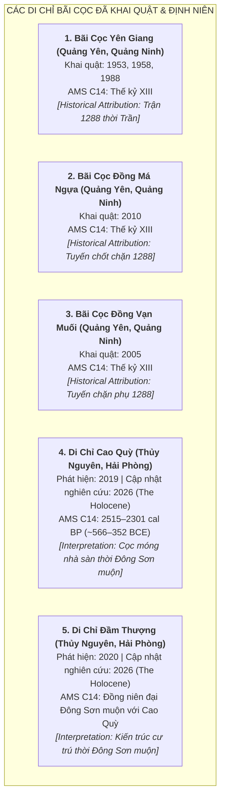

# Khảo Cổ Học & Cảnh Báo Phương Pháp Luận: Trận Địa Cọc Bạch Đằng (Task `VS-NQ-A01`)

> [!IMPORTANT]
> **Nguyên Tắc Thẩm Định Khảo Cổ Học (Task `VS-NQ-A01` — Cập Nhật Học Thuật 2026)**:
> - Tài liệu này phân tích, đối chiếu và đánh giá thực chứng các phát hiện khảo cổ học liên quan đến các bãi cọc tại lưu vực sông Bạch Đằng (Quảng Ninh và Hải Phòng).
> - **Cảnh báo phương pháp luận cốt lõi**:
>   - Tuyệt đối **KHÔNG** sử dụng các bài báo truyền thông phổ thông hoặc niềm tin dân gian để tự động biến các di chỉ cọc gỗ thành "chứng tích cọc gỗ năm 938 của Ngô Quyền".
>   - **Phải phân biệt rạch ròi 4 cấp độ nhận thức**:
>     1. **Radiocarbon Result**: Kết quả đo đạc khoa học phòng thí nghiệm (niên đại AMS $^{14}\text{C}$ / cal BP / BCE–CE).
>     2. **Archaeological Interpretation**: Diễn giải khảo cổ học về địa tầng, cấu trúc kỹ thuật cọc, trầm tích và môi trường thủy văn cổ.
>     3. **Historical Attribution**: Sự gán ghép bãi cọc vào một sự kiện lịch sử cụ thể (thời Đông Sơn, 938, 981 hay 1288).
>     4. **Popular / Local Tradition**: Truyền thuyết dân gian và truyền thông đại chúng.
>   - **Quy tắc logic bác bỏ ngụy biện**:
>     $$\text{Thư tịch cổ ghi năm 938 có cắm cọc} \not\Rightarrow \text{Mọi bãi cọc phát hiện tại vùng Bạch Đằng đều thuộc trận 938}$$

---

## 1. Bản Đồ Tổng Quan Các Di Chỉ Khảo Cổ Lưu Vực Bạch Đằng

---

## 2. Thẩm Định Chi Tiết Từng Di Chỉ Khảo Cổ

### 2.1. Di Chỉ Bãi Cọc Yên Giang (Thị Xã Quảng Yên, Tỉnh Quảng Ninh)

* **Lịch sử phát hiện & Khai quật**:
  * Phát hiện năm 1953; khai quật các năm 1958, 1969, 1976, 1984, 1988 (khu vực đầm Yên Giang, cửa sông Chanh).
* **Đặc điểm hiện vật**:
  * Cọc gỗ lim, táu cắm thẳng đứng và nghiêng $15^\circ - 45^\circ$, đường kính $20 - 30\text{ cm}$, ngập sâu trong bùn lầy, nhiều cọc bị vát nhọn phần đầu.
* **Thẩm định 3 phân tầng**:
  1. **Radiocarbon Result**: Các mẫu cọc gỗ được phân tích cho kết quả tập trung trong **thế kỷ XIII (khoảng $1250 - 1300\text{ SCN}$)**.
  2. **Archaeological Interpretation**: Trận địa cọc cản tàu chiến ở lạch sông hẹp thuộc hệ thống phòng ngự cửa sông Chanh.
  3. **Historical Attribution**: Phù hợp với **Chiến dịch Bạch Đằng năm 1288 thời Trần** (Đại Việt đại phá quân Nguyên Mông).
* **Kết luận đối với năm 938**: **Không thuộc trận 938 của Ngô Quyền** (niên đại muộn hơn hơn 3 thế kỷ).

---

### 2.2. Di Chỉ Bãi Cọc Đồng Má Ngựa & Đồng Vạn Muối (Quảng Yên, Quảng Ninh)

* **Lịch sử phát hiện & Khai quật**:
  * Đồng Vạn Muối (khai quật năm 2005); Đồng Má Ngựa (khai quật năm 2010).
* **Đặc điểm hiện vật**:
  * Hàng trăm cọc gỗ chôn dày đặc, có cọc được chêm chèn đá cuội và thân cây nhỏ dưới chân cọc để cố định thế đứng trong lòng bùn cát sông Rút.
* **Thẩm định 3 phân tầng**:
  1. **Radiocarbon Result**: Các mẫu $^{14}\text{C}$ tại Đồng Má Ngựa và Đồng Vạn Muối cho niên đại tương thích với **thế kỷ XIII (1288 SCN)**.
  2. **Archaeological Interpretation**: Tuyến chốt chặn phụ trợ ngăn chiến thuyền giặc rút chạy sang luồng sông Rút.
  3. **Historical Attribution**: Thuộc hệ thống bãi cọc phục vụ **Chiến dịch Bạch Đằng năm 1288**.
* **Kết luận đối với năm 938**: **Không thuộc trận 938 của Ngô Quyền**.

---

### 2.3. Di Chỉ Cao Quỳ & Đầm Thượng (Huyện Thủy Nguyên, TP. Hải Phòng)

#### A. Cập Nhật Nghiên Cứu Đột Phá Năm 2026 (*The Holocene*)
* **Nguồn công bố khoa học bắt buộc**:
  * **Tạp chí**: *The Holocene* (SAGE Publications).
  * **Ngày xuất bản**: 26/05/2026.
  * **DOI**: `10.1177/09596836261450824`.
  * **Tên công trình**: *Late-Holocene estuarine evolution influencing archeological wooden-pile sites, Bach Dang Estuary, Northern Vietnam*.
* **Kết quả khoa học chính yếu (Key Results)**:
  * Phân tích 8 mẫu định niên carbon phóng xạ AMS ($^{14}\text{C}$) từ cọc gỗ tại di chỉ **Cao Quỳ** và **Đầm Thượng** cho kết quả tập trung trong khoảng **$2515 - 2301\text{ cal BP}$ (tương đương khoảng $566 - 352\text{ TCN}$ / Thế kỷ VI – IV trước Công nguyên)**.
  * Phân tích trầm tích học, địa mạo cổ và cấu trúc vật liệu gỗ cho thấy đây là **dấu tích móng cọc nhà sàn / công trình cư trú ven sông thời Văn hóa Đông Sơn muộn (Late Dong Son stilt-house foundations)**, không phải là bãi cọc thủy chiến quân sự thời trung đại.

#### B. Phân Định Giữa Hiện Trạng Khoa Học Mới vs Giả Thuyết Ban Đầu (2019–2020)
* **Historical Research History / Superseded Initial Interpretation (Lịch sử nghiên cứu ban đầu đã bị thay thế)**:
  * Cuối năm 2019 – 2020, khi mới phát hiện di chỉ Cao Quỳ (27 cọc gỗ lớn bên bờ sông Giá) và Đầm Thượng, một số báo cáo sơ bộ và truyền thông đại chúng từng đưa ra giả thuyết đây có thể là bãi cọc chiến trận thời Ngô Quyền (938), Lê Hoàn (981) hoặc Trần Hưng Đạo (1288).
  * Giả thuyết ban đầu này **nay đã bị bác bỏ và thay thế** bởi các chứng cứ định niên AMS $^{14}\text{C}$ và địa mạo học chính xác trong công trình công bố năm 2026 trên *The Holocene*.
* **Đánh giá hiện trạng học thuật**:
  * **Cao Quỳ & Đầm Thượng KHÔNG PHẢI là ứng viên bãi cọc thủy chiến của các trận đánh năm 938, 981 hay 1288**.

---

## 3. Bảng Tổng Hợp So Sánh Các Di Chỉ Khảo Cổ Lưu Vực Bạch Đằng

| Di Chỉ Khảo Cổ | Vị Trí Địa Lý | Kết Quả Giám Định AMS $^{14}\text{C}$ | Diễn Giải Khảo Cổ Học (Archaeological Interpretation) | Gán Ghép Lịch Sử (Historical Attribution) | Đánh Giá Độ Tin Cậy Đối Với Trận 938 |
|---|---|---|---|---|:---:|
| **Bãi cọc Yên Giang** | Quảng Yên, Quảng Ninh | Thế kỷ XIII ($1250 - 1300\text{ SCN}$) | Trận địa chặn tàu cửa sông Chanh | **Trận Bạch Đằng 1288 (Thời Trần)** | **Bác bỏ (Thuộc thời Trần 1288)** |
| **Bãi cọc Đồng Má Ngựa** | Quảng Yên, Quảng Ninh | Thế kỷ XIII ($1250 - 1300\text{ SCN}$) | Tuyến chặn tàu sông Rút | **Trận Bạch Đằng 1288 (Thời Trần)** | **Bác bỏ (Thuộc thời Trần 1288)** |
| **Bãi cọc Đồng Vạn Muối** | Quảng Yên, Quảng Ninh | Thế kỷ XIII ($1250 - 1300\text{ SCN}$) | Tuyến chốt chặn phụ trợ | **Trận Bạch Đằng 1288 (Thời Trần)** | **Bác bỏ (Thuộc thời Trần 1288)** |
| **Di chỉ Cao Quỳ** | Thủy Nguyên, Hải Phòng | $2515 - 2301\text{ cal BP}$ (~$566 - 352\text{ TCN}$) | Cọc móng nhà sàn ven sông cổ (*The Holocene* 2026) | **Cư trú thời Đông Sơn muộn** (*Không phải thủy chiến*) | **Bác bỏ (Thuộc thời Đông Sơn muộn)** |
| **Di chỉ Đầm Thượng** | Thủy Nguyên, Hải Phòng | Đồng niên đại Đông Sơn muộn với Cao Quỳ | Kiến trúc cư trú ven sông (*The Holocene* 2026) | **Cư trú thời Đông Sơn muộn** (*Không phải thủy chiến*) | **Bác bỏ (Thuộc thời Đông Sơn muộn)** |

---

## 4. Nguyên Tắc Ứng Xử Sử Liệu & Thiết Kế Cho Dự Án

1. **Bảo tồn tính chân thực của văn bản học (Textual Fact)**:
   - Dữ kiện *"Ngô Quyền dùng trận địa cọc gỗ bịt sắt trên sông Bạch Đằng năm 938"* là **Sự Thật Lịch Sử Vững Chắc Cấp Độ T1/T2** (được *Tân Ngũ Đại Sử*, *Tư Trị Thông Giám* và *Toàn Thư* xác nhận nguyên văn).
2. **Thận trọng trước hiện vật khảo cổ học (Archaeological Caution)**:
   - Các bãi cọc chiến trận thời trung đại khai quật được (Yên Giang, Má Ngựa, Vạn Muối) thuộc về **chiến dịch năm 1288 thời Trần**.
   - Các cọc gỗ tại Cao Quỳ và Đầm Thượng theo kết quả công bố năm 2026 (*The Holocene*) là **dấu tích kiến trúc cư trú thời Đông Sơn muộn**, không phải trận địa thủy chiến trung đại.
3. **Quy chuẩn mỹ thuật & Gameplay trong dự án**:
   - Tái dựng bãi cọc ngầm bịt sắt trong game dựa trên **mô tả nguyên văn sử liệu T1/T2**, kết hợp với hình thái học cọc gỗ dưới danh nghĩa **`[T4 Artistic Reconstruction]`**.
   - Tuyệt đối không trích dẫn bãi cọc Yên Giang hay Cao Quỳ như bằng chứng khảo cổ học nguyên bản của riêng trận 938.
