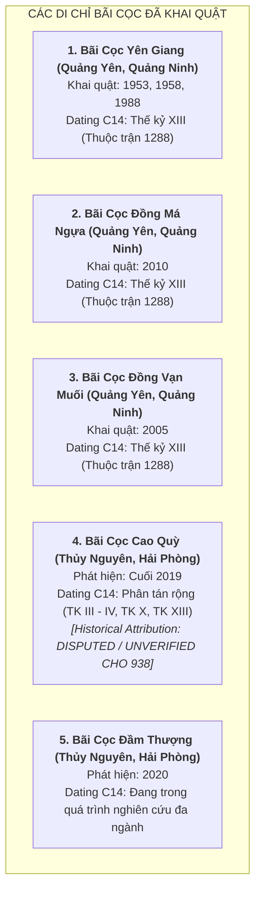

# Khảo Khảo Cổ Học & Cảnh Báo Phương Pháp Luận: Trận Địa Cọc Bạch Đằng (Task `VS-NQ-A01`)

> [!IMPORTANT]
> **Nguyên Tắc Thẩm Định Khảo Cổ Học (Task `VS-NQ-A01`)**:
> - Tài liệu này phân tích, đối chiếu và đánh giá thực chứng các phát hiện khảo cổ học liên quan đến các bãi cọc tại lưu vực sông Bạch Đằng (Quảng Ninh và Hải Phòng).
> - **Cảnh báo phương pháp luận cốt lõi**:
>   - Tuyệt đối **KHÔNG** sử dụng các bài báo truyền thông phổ thông hoặc niềm tin dân gian để tự động biến các di chỉ bãi cọc thành "chứng tích cọc gỗ năm 938 của Ngô Quyền".
>   - **Phải phân biệt rạch ròi 4 cấp độ nhận thức**:
>     1. **Dating Result**: Kết quả đo đạc khoa học phòng thí nghiệm (niên đại phóng xạ Carbon-14 / C14).
>     2. **Archaeological Interpretation**: Diễn giải khảo cổ học về địa tầng, cấu trúc kỹ thuật cắm cọc và môi trường thủy văn cổ.
>     3. **Historical Attribution**: Sự gán ghép bãi cọc vào một trận đánh lịch sử cụ thể (938, 981 hay 1288).
>     4. **Popular / Local Tradition**: Truyền thuyết dân gian và truyền thông đại chúng.
>   - **Quy tắc logic bác bỏ ngụy biện**:
>     $$\text{Thư tịch cổ ghi năm 938 có cắm cọc} \not\Rightarrow \text{Mọi bãi cọc phát hiện tại vùng Bạch Đằng đều thuộc năm 938}$$

---

## 1. Bản Đồ Tổng Quan Các Di Chỉ Khảo Cổ Bãi Cọc Lưu Vực Bạch Đằng

---

## 2. Thẩm Định Chi Tiết Từng Di Chỉ Khảo Cổ

### 2.1. Di Chỉ Bãi Cọc Yên Giang (Thị Xã Quảng Yên, Tỉnh Quảng Ninh)

* **Lịch sử phát hiện & Khai quật**:
  * Phát hiện năm 1953; khai quật các năm 1958, 1969, 1976, 1984, 1988 (khu vực đầm Yên Giang, cửa sông Chanh).
* **Đặc điểm hiện vật**:
  * Cọc gỗ lim, táu cắm thẳng đứng và nghiêng $15^\circ - 45^\circ$, đường kính $20 - 30\text{ cm}$, ngập sâu trong bùn lầy, nhiều cọc bị vát nhọn phần đầu.
* **4 Tầng thẩm định**:
  1. **Dating Result (Kết quả C14)**: Viện Khảo cổ học và các phòng thí nghiệm quốc tế phân tích các mẫu than hóa/gỗ cọc cho kết quả niên đại tập trung trong **khoảng $1250 - 1300\text{ SCN}$ (Thế kỷ XIII)**.
  2. **Archaeological Interpretation**: Trận địa chặn tàu chiến địch ở lạch sông hẹp thuộc hệ thống phòng thủ cửa sông Chanh.
  3. **Historical Attribution**: **Thuộc Chiến thắng Bạch Đằng năm 1288 của nhà Trần** (Đại Việt đại phá quân Nguyên Mông).
  4. **Popular / Local Tradition**: Được công nhận là Di tích Quốc gia đặc biệt (gắn với danh tướng Trần Hưng Đạo).
* **Kết luận đối với năm 938**: **KHÔNG PHẢI cọc năm 938 của Ngô Quyền**.

---

### 2.2. Di Chỉ Bãi Cọc Đồng Má Ngựa & Đồng Vạn Muối (Quảng Yên, Quảng Ninh)

* **Lịch sử phát hiện & Khai quật**:
  * Đồng Vạn Muối (khai quật năm 2005); Đồng Má Ngựa (khai quật năm 2010).
* **Đặc điểm hiện vật**:
  * Hàng trăm cọc gỗ chôn dày đặc, có cọc được chêm chèn đá cuội và thân cây nhỏ dưới chân cọc để cố định thế đứng trong lòng bùn cát sông Rút.
* **4 Tầng thẩm định**:
  1. **Dating Result**: Các mẫu C14 tại Đồng Má Ngựa và Đồng Vạn Muối đều cho niên đại tương thích cao với **thế kỷ XIII (1288 SCN)**.
  2. **Archaeological Interpretation**: Tuyến chốt chặn phụ trợ ngăn chiến thuyền giặc rút chạy sang luồng sông Rút.
  3. **Historical Attribution**: **Thuộc Chiến dịch Bạch Đằng năm 1288**.
  4. **Popular / Local Tradition**: Hệ thống bãi cọc bổ trợ thời Trần.
* **Kết luận đối với năm 938**: **KHÔNG PHẢI cọc năm 938 của Ngô Quyền**.

---

### 2.3. Di Chỉ Bãi Cọc Cao Quỳ (Xã Mai Trung, Huyện Thủy Nguyên, TP. Hải Phòng)

* **Lịch sử phát hiện & Khai quật**:
  * Phát hiện cuối năm 2019; Viện Khảo cổ học phối hợp với Bảo tàng Hải Phòng tiến hành khai quật khẩn cấp trên diện tích gần $1.000\text{ m}^2$ bên bờ sông Giá.
* **Đặc điểm hiện vật**:
  * Phát hiện 27 cọc gỗ (gỗ lim, sến, táu, xoan, de...) cắm trong lớp bùn sét xám đen, nhiều cọc có đường kính lớn $30 - 50\text{ cm}$, đầu cọc vát nhọn, bố trí theo các dải uốn lượn.
* **4 Tầng thẩm định khoa học**:
  1. **Dating Result (Kết quả giám định C14 tại Viện Hàn lâm KH&CN Việt Nam & quốc tế)**:
     - Các mẫu gỗ được lấy từ các cọc khác nhau cho **dải niên đại phân tán rất rộng**:
       - Một số mẫu rơi vào **thế kỷ III – V SCN**.
       - Một số mẫu rơi vào **thế kỷ X SCN** (khoảng $900 - 1000\text{ SCN}$).
       - Một số mẫu rơi vào **thế kỷ XIII SCN** (khoảng $1200 - 1300\text{ SCN}$).
     - Sự phân tán niên đại này là hiện tượng tự nhiên của gỗ cổ thụ (lõi gỗ và vỏ ngoài có tuổi sinh học cách nhau hàng trăm năm) kết hợp với hiện tượng tái sử dụng gỗ hoặc địa tầng bồi lắng phức tạp của vùng cửa sông.
  2. **Archaeological Interpretation**:
     - Bãi cọc có chức năng quân sự rõ rệt nhằm ngăn chặn hoặc dồn đuổi thuyền bè trên luồng sông Giá nối ra sông Bạch Đằng.
  3. **Historical Attribution**:
     - **Chưa có sự đồng thuận tuyệt đối trong giới khoa học**:
       - Một nhóm học giả nghiêng về khả năng thuộc chiến dịch năm 1288 của nhà Trần.
       - Một nhóm học giả đặt giả thiết liên quan đến trận Bạch Đằng năm 938 của Ngô Quyền hoặc trận năm 981 của Lê Hoàn.
       - **Báo cáo chính thức của Hội đồng Khoa học Viện Khảo cổ học**: Khẳng định đây là di tích quân sự cổ vô cùng quý giá, nhưng **CHƯA ĐỦ CƠ SỞ KHOA HỌC DUY NHẤT để khẳng định 100% đây là bãi cọc thuộc năm 938 của Ngô Quyền**.
  4. **Popular / Local Tradition & Truyền thông báo chí**:
     - Cuối năm 2019, nhiều tờ báo phổ thông giật tít khẳng định ngay *"đã tìm thấy bãi cọc Bạch Đằng của Ngô Quyền năm 938"*. Đây là cách truyền thông vội vã, đi trước kết luận thận trọng của giới khảo cổ học.
* **Kết luận học thuật**: **DISPUTED / UNVERIFIED ATTRIBUTION CHO RIÊNG NĂM 938** (Ghi nhận như một di chỉ khảo cổ học quân sự quan trọng, nhưng không gán nhãn Fact lịch sử tuyệt đối cho năm 938).

---

### 2.4. Di Chỉ Bãi Cọc Đầm Thượng (Huyện Thủy Nguyên, TP. Hải Phòng)

* **Lịch sử phát hiện**: Phát hiện năm 2020 tại xã Lại Xuân, gần khu vực ngã ba sông Kinh Thầy và sông Đá Bạc.
* **Thẩm định**:
  * Kết quả khảo sát cho thấy các cọc gỗ ngập sâu trong bùn lầy ven sông.
  * Hiện các nghiên cứu liên ngành (địa mạo cổ, trầm tích học, phấn hoa học và giám định C14) đang được tiếp tục thực hiện.
* **Kết luận học thuật**: **CHƯA ĐỦ CƠ SỞ ĐỊNH NIÊN (Under Investigation)**.

---

## 3. Bảng Tổng Hợp So Sánh Các Di Chỉ Khảo Cổ Bãi Cọc

| Di Chỉ Khảo Cổ | Vị Trí Địa Lý | Kết Quả Giám Định C14 (Dating Result) | Diễn Giải Khảo Cổ (Interpretation) | Gán Ghép Lịch Sử (Historical Attribution) | Độ Tin Cậy Gán Cho Năm 938 |
|---|---|---|---|---|:---:|
| **Bãi cọc Yên Giang** | Quảng Yên, Quảng Ninh | Thế kỷ XIII ($1250 - 1300\text{ SCN}$) | Trận địa chặn cửa sông Chanh | **Trận Bạch Đằng 1288 (Nhà Trần)** | **Bác bỏ (0% cho 938)** |
| **Bãi cọc Đồng Má Ngựa** | Quảng Yên, Quảng Ninh | Thế kỷ XIII ($1250 - 1300\text{ SCN}$) | Tuyến chặn sông Rút | **Trận Bạch Đằng 1288 (Nhà Trần)** | **Bác bỏ (0% cho 938)** |
| **Bãi cọc Đồng Vạn Muối** | Quảng Yên, Quảng Ninh | Thế kỷ XIII ($1250 - 1300\text{ SCN}$) | Tuyến chốt chặn phụ trợ | **Trận Bạch Đằng 1288 (Nhà Trần)** | **Bác bỏ (0% cho 938)** |
| **Bãi cọc Cao Quỳ** | Thủy Nguyên, Hải Phòng | Phân tán: TK III–IV, TK X, TK XIII | Trận địa bẫy cọc ven sông Giá | **Tranh luận (1288 vs 938/981)** | **Disputed / Unverified** |
| **Bãi cọc Đầm Thượng** | Thủy Nguyên, Hải Phòng | Đang phân tích mẫu C14 | Cọc gỗ ven ngã ba sông | **Đang nghiên cứu** | **Chưa xác định** |

---

## 4. Nguyên Tắc Ứng Xử Sử Liệu & Thiết Kế Cho Dự Án

1. **Bảo tồn tính chân thực của văn bản học (Textual Fact)**:
   - Dữ kiện *"Ngô Quyền dùng trận địa cọc gỗ bịt sắt trên sông Bạch Đằng năm 938"* là **Sự Thật Lịch Sử Vững Chắc Cấp Độ T1/T2** (được *Tân Ngũ Đại Sử*, *Tư Trị Thông Giám* và *Toàn Thư* xác nhận nguyên văn).
2. **Thận trọng trước hiện vật khảo cổ học (Archaeological Caution)**:
   - Trong khi thư tịch khẳng định sự tồn tại của trận địa cọc năm 938, các bãi cọc vật thể khai quật được cho đến nay (đặc biệt là Yên Giang, Má Ngựa, Vạn Muối) chủ yếu thuộc về **chiến dịch năm 1288 thời Trần**.
   - Di chỉ Cao Quỳ (2019) có mẫu niên đại thế kỷ X nhưng chưa có bằng chứng độc tôn duy nhất để khóa cố định cho riêng Ngô Quyền 938.
3. **Quy chuẩn mỹ thuật & Gameplay trong dự án**:
   - Tái dựng bãi cọc ngầm bịt sắt trong game dựa trên **mô tả nguyên văn sử liệu T1/T2**, kết hợp với hình thái học của cọc gỗ khai quật thực tế dưới danh nghĩa **`[T4 Artistic Reconstruction]`**.
   - Tuyệt đối không trích dẫn bãi cọc Yên Giang hay Cao Quỳ như bằng chứng khảo cổ học duy nhất đã được chứng minh tuyệt đối cho năm 938.
