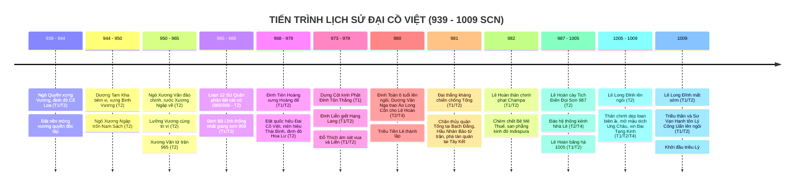

# Bối Cảnh Lịch Sử & Niên Biểu Toàn Tuyến: Giai Đoạn 939–1009 SCN

> [!IMPORTANT]
> **Ràng Buộc Nghiên Cứu Lịch Sử (Task `VS-NDPL-00`)**:
> - Tài liệu này khảo cứu toàn diện tiến trình lịch sử 70 năm từ khi Ngô Quyền xưng Vương dựng nền độc lập (939) đến khi triều Lý thành lập (1009), trải qua 3 triều đại liên tiếp: **Nhà Ngô**, **Nhà Đinh**, và **Nhà Tiền Lê**.
> - Mọi sự kiện, trận đánh và nhân vật đều được gắn nhãn phân tầng nguồn gốc 4 tầng (**T1 / T2 / T3 / T4**) nghiêm ngặt.
> - **KHÔNG thiết kế gameplay, không gán số liệu stats/waves, không khóa Roster Hero**.

---

## 1. Niên Biểu Toàn Tuyến Giai Đoạn 939–1009 SCN



---

## 2. Diễn Biến Chi Tiết Qua 6 Giai Đoạn Lịch Sử

### Giai Đoạn 1: Thời Kỳ Hậu Ngô Quyền & Khủng Hoảng Vương Quyền Cổ Loa (939–965 SCN)

* **Ngô Vương Kiến Quốc (939–944 SCN — T1 *Tân Ngũ Đại Sử*, T2 *Toàn Thư*)**:
  * Năm 939, sau chiến thắng Bạch Đằng vang dội, Ngô Quyền chính thức xưng Vương (**Ngô Vương**), bãi bỏ chức Tiết độ sứ của phương Bắc.
  * Chọn kinh đô tại **Cổ Loa** (Đông Anh, Hà Nội) — biểu tượng nối tiếp chủ quyền quốc gia từ thời Âu Lạc của An Dương Vương, thiết lập triều đình với hệ thống quan chế, quy định phẩm phục và nghi lễ vương triều.
* **Dương Tam Kha Tiếm Vị & Sự Trốn Chạy Của Ngô Xương Ngập (944–950 SCN — T2 *Toàn Thư*)**:
  * Tháng 1 năm 944, Ngô Quyền lâm bệnh nặng qua đời ở tuổi 47. Trước khi mất, ông ủy thác việc phụ chính giúp rập con trai trưởng là **Ngô Xương Ngập** cho người em vợ là **Dương Tam Kha**.
  * Dương Tam Kha cướp đoạt ngai vàng, tự xưng là **Dương Bình Vương** (944–950).
  * Ngô Xương Ngập phải bỏ trốn về ẩn náu tại vùng Nam Sách Giang (Hải Dương), được Hào trưởng **Phạm Lệnh Công** hết lòng che chở, ba lần dời chỗ giấu trong hang núi rừng sâu để thoát khỏi sự lùng bắt ráo riết của Dương Tam Kha.
  * Dương Tam Kha nhận người con thứ của Ngô Quyền là **Ngô Xương Văn** làm con nuôi nhằm xoa dịu hoàng tộc và tướng lĩnh nhà Ngô.
* **Binh Biến Năm 950 & Chế Độ Lưỡng Vương Trị Vì (950–965 SCN — T2 *Toàn Thư*, *Việt Sử Lược*)**:
  * Năm 950, Dương Tam Kha sai Ngô Xương Văn cùng hai tướng Đỗ Cảnh Thạc và Dương Cát Lợi đi đánh hai thôn Đường, Nguyễn ở Thái Bình.
  * Giữa đường, Ngô Xương Văn thuyết phục hai tướng quay quân về tập kích bắt sống Dương Tam Kha. Xương Văn nghĩ tình cậu cháu không nỡ giết, chỉ giáng Tam Kha xuống làm *Chương Dương Sứ*, ban cho thực ấp ở vùng Chương Dương (Thường Tín, Hà Nội).
  * Ngô Xương Văn tự xưng là **Nam Tấn Vương**, sai sứ đón anh trai Ngô Xương Ngập về cùng coi việc nước. Ngô Xương Ngập xưng là **Thiên Sách Vương** (chế độ Lưỡng Vương cùng trị vì).
  * Thiên Sách Vương Ngô Xương Ngập chuyên quyền lấn át em, toan trừ khử Nam Tấn Vương nhưng chưa kịp thực hiện thì phát bệnh qua đời năm 954.
  * Năm 965, Nam Tấn Vương Ngô Xương Văn đem quân đi dẹp loạn hai thôn Đường, Nguyễn ở Thái Bình, bị trúng tên nỏ tử trận. Chính quyền trung ương Cổ Loa hoàn toàn sụp đổ.

---

### Giai Đoạn 2: Loạn 12 Sứ Quân & Chiến Dịch Thống Nhất Của Đinh Bộ Lĩnh (965/966–968 SCN)

```mermaid
graph TD
    subgraph 12 SỨ QUÂN CANONICAL (TOÀN THƯ)
        S1["<b>1. Ngô Xương Xí</b><br>Bình Kiều (Thanh Hóa)"]
        S2["<b>2. Kiều Công Hãn</b><br>Phong Châu (Phú Thọ)"]
        S3["<b>3. Nguyễn Khoan</b><br>Tam Đái (Vĩnh Phúc)"]
        S4["<b>4. Ngô Nhật Khánh</b><br>Đường Lâm (Hà Nội)"]
        S5["<b>5. Đỗ Cảnh Thạc</b><br>Đỗ Động Giang (Quốc Oai)"]
        S6["<b>6. Lý Khuê</b><br>Siêu Loại (Bắc Ninh)"]
        S7["<b>7. Nguyễn Thủ Tiệp</b><br>Tiên Du (Bắc Ninh)"]
        S8["<b>8. Lã Đường</b><br>Tế Giang (Văn Giang)"]
        S9["<b>9. Nguyễn Siêu</b><br>Tây Phù Liệt (Thanh Trì)"]
        S10["<b>10. Kiều Thuận</b><br>Hồi Hồ (Phú Thọ)"]
        S11["<b>11. Phạm Bạch Hổ</b><br>Đằng Châu (Hưng Yên)"]
        S12["<b>12. Trần Lãm</b><br>Bố Hải Khẩu (Thái Bình)"]
    end

    subgraph TRUNG TÂM QUY TỤ HOA LƯ
        DBL["<b>Đinh Bộ Lĩnh (Vạn Thắng Vương)</b><br>Căn cứ hiểm trở Động Hoa Lư (Ninh Bình)"]
    end

    DBL -.->|Liên hiệp & Kế thừa căn cứ| S12
    DBL ==>|Chiêu hàng & Thu phục| S11
    DBL ==>|Hôn nhân chính trị liên kết| S4
    DBL ==>|Đánh dẹp quân sự (Khái quát T2)| S5
    DBL ==>|Đánh dẹp quân sự (Khái quát T2)| S9
    DBL ==>|Đánh dẹp quân sự (Khái quát T2)| S2
    DBL ==>|Đánh dẹp quân sự (Khái quát T2)| S10
    DBL ==>|Đánh dẹp quân sự (Khái quát T2)| S3
    DBL ==>|Đánh dẹp quân sự (Khái quát T2)| S6
    DBL ==>|Đánh dẹp quân sự (Khái quát T2)| S7
    DBL ==>|Đánh dẹp quân sự (Khái quát T2)| S8
    DBL ==>|Quy phục chính trị| S1
```

* **Biên niên bùng nổ (965 vs 966 SCN)**:
  * Sau khi Ngô Xương Văn mất năm 965 (*Việt Sử Lược*), triều đình Cổ Loa tan rã; con của Xương Ngập là Ngô Xương Xí bỏ chạy về giữ đất Bình Kiều.
  * *Toàn Thư* tính thời kỳ Loạn 12 Sứ Quân từ năm Bính Dần (966) đến năm 968. Các tướng lĩnh, hoàng thân và hào trưởng cát cứ 12 vùng độc lập chém giết lẫn nhau.
* **Chiến lược Thống nhất của Đinh Bộ Lĩnh (965–968 SCN — T1/T2 Fact)**:
  * **Xuất thân**: Đinh Bộ Lĩnh sinh năm 924 tại thôn Kim Lư, làng Gia Phương, huyện Gia Viễn, tỉnh Ninh Bình; là con trai Đinh Công Trứ (Thứ sử Hoan Châu thời Ngô Quyền).
  * **Căn cứ Hoa Lư**: Vùng núi đá vôi non nước hiểm trở Động Hoa Lư, sông ngòi liên thông ra biển, thuận tiện công thủ.
  * **Liên hiệp Bố Hải Khẩu**: Đinh Bộ Lĩnh cùng con trai Đinh Liễn sang liên minh với **Trần Lãm** (Trần Minh Công) ở căn cứ Bố Hải Khẩu (Kỳ Bố, Thái Bình). Trần Lãm nhận Bộ Lĩnh làm con nuôi, trao quyền chỉ huy quân sự. Sau khi Trần Lãm mất, Đinh Bộ Lĩnh tiếp quản toàn bộ lực lượng và căn cứ trù phú này.
  * **Đường lối kết hợp Quân sự - Ngoại giao - Hôn nhân**:
    1. **Thu phục**: Chiêu hàng tướng cũ nhà Ngô là Phạm Bạch Hổ (Đằng Châu), phong làm Thân vệ Đại tướng quân.
    2. **Hôn nhân chính trị**: Đinh Bộ Lĩnh gả con gái (Công chúa Minh Châu) cho Ngô Nhật Khánh; đồng thời lấy mẹ của Ngô Nhật Khánh và cưới em gái Ngô Nhật Khánh cho Đinh Liễn để trung hòa hoàng tộc họ Ngô.
    3. **Đánh dẹp kiên quyết (Khái quát T2)**: Đinh Bộ Lĩnh lần lượt tiến quân đánh bại các thế lực cát cứ còn lại (Đỗ Cảnh Thạc, Kiều Thuận, Kiều Công Hãn, Nguyễn Siêu, Lã Đường, Nguyễn Khoan, Nguyễn Thủ Tiệp, Lý Khuê, Ngô Xương Xí).
* **Lưu ý học thuật về các chi tiết trận đánh (T3/T4 vs T2)**:
  * Văn bản *Toàn Thư* (T2) chỉ chép tóm lược sự kiện Vạn Thắng Vương bình định xong 12 sứ quân.
  * Mọi chi tiết cụ thể về từng trận đánh, phục kích hay cái chết của từng sứ quân (như chuyện Đỗ Cảnh Thạc bị bắn trúng tai ở Quán Gái; Nguyễn Siêu đắm thuyền ở sông Hồng; Kiều Công Hãn bị giết ở Thao Giang...) đều thuộc tầng **Thần phả / Ngọc phả địa phương (T3)** hoặc **Phục dựng sử học hiện đại (T4)**, không phải ghi chép nguyên bản trong T1 hay T2.

---

### Giai Đoạn 3: Triều Đại Nhà Đinh — Nước Đại Cồ Việt & Biến Cố Cung Đình (968–979 SCN)

* **Xây Dựng Thể Chế Độc Lập & Định Đô Hoa Lư (968 SCN — T1/T2 Fact)**:
  * Năm Mậu Thìn (968), Đinh Bộ Lĩnh chính thức lên ngôi Hoàng đế, tự xưng hiệu là **Đại Thắng Minh Hoàng Đế** (**Đinh Tiên Hoàng**).
  * Đặt quốc hiệu là **Đại Cồ Việt**, đặt niên hiệu riêng là **Thái Bình**.
  * Dời đô từ Cổ Loa về **kinh đô Hoa Lư** (Ninh Bình) — tận dụng địa hình núi đá vôi tự nhiên kết hợp hào đầm và sông Hoàng Long tạo thành pháo đài quân sự kiên cố.
* **Tổ Chức Triều Chính & Quân Đội (T2 — *Toàn Thư*)**:
  * Phong **Đinh Liễn** (con trưởng) làm Nam Việt Vương.
  * Bổ nhiệm đại thần: **Nguyễn Bặc** làm Định Quốc công; **Đinh Điền** làm Ngoại triều nội thư sủng hạnh; **Lê Hoàn** làm Thập đạo tướng quân Điện tiền Đô chỉ huy sứ; **Lưu Cơ** làm Đô hộ phủ Sĩ sư; **Tăng thống Ngô Chân Lưu** làm Khuông Việt đại sư.
  * Tổ chức quân đội quy mô 10 đạo (Thập đạo quân tập trung).
* **Ngoại Giao Tự Chủ Với Nhà Tống (970–975 SCN — T1 *Tống Sử*)**:
  * Năm 970, Đinh Tiên Hoàng sai Nam Việt Vương Đinh Liễn đi sứ nhà Tống.
  * Năm 973, Tống Thái Tổ phong Đinh Tiên Hoàng làm *Giao Chỉ quận vương*, phong Đinh Liễn làm *Kiểm hiệu thái sư Tĩnh Hải quân Tiết độ sứ An Nam đô hộ*.
  * Đúc đồng tiền riêng (**Thái Bình Hưng Bảo** — đồng tiền độc lập đầu tiên của Việt Nam).
* **Vụ Án Khảo Cổ Cột Kinh Đinh Liễn & Bi kịch Cung Đình (979 SCN — T1/T2/T4 Fact)**:
  * Đinh Tiên Hoàng lập con út là **Hạng Lang** làm Thái tử kế vị.
  * Nam Việt Vương Đinh Liễn có công lao lớn bèn sinh lòng oán giận, ngầm sai thủ hạ ám hại Hạng Lang vào đầu năm 979. Sau đó, Đinh Liễn dựng hơn 20 Cột kinh Phật Đỉnh Tôn Thắng bằng đá tại Hoa Lư để sám hối cầu siêu (được khảo cổ học xác thực 100% qua minh văn T1).
  * Tháng 10 năm 979, viên quan nội thị **Đỗ Thích** nhân lúc Đinh Tiên Hoàng và Đinh Liễn say rượu ngủ trong sân cung đình đã dùng dao ám sát cả hai cha con.
  * Định Quốc công Nguyễn Bặc và quân sĩ bắt giết Đỗ Thích, phò tá ấu chúa **Đinh Toàn** (6 tuổi) lên ngôi; Thái hậu **Dương Vân Nga** buông rèm nhiếp chính.

---

### Giai Đoạn 4: Chuyển Giao Quyền Lực & Đại Thắng Kháng Tống Năm 981 (979–981 SCN)

```mermaid
graph TD
    subgraph KHỦNG HOẢNG HOA LƯ (979 - 980)
        DT["<b>Vua Đinh Toàn (6 tuổi)</b>"]
        DVN["<b>Thái hậu Dương Vân Nga</b><br>Nhiếp chính triều đình"]
        LH["<b>Lê Hoàn</b><br>Thập đạo tướng quân / Phó vương"]
        NB["<b>Phe chống đối:</b><br>Đinh Điền, Nguyễn Bặc, Phạm Hạp"]

        DT --- DVN
        DVN -->|Cử làm Nhiếp chính| LH
        NB -->|Dấy binh chống đối| LH
        LH ==>|Dẹp tan nội loạn| NB
    end

    subgraph NGUY CƠ NGOẠI XÂM TỐNG (980)
        TONG["<b>Đại quân Tống chuẩn bị xâm lược</b><br>Hầu Nhân Bảo (Bộ binh) & Lưu Trừng (Thủy binh)"]
        TONG -.->|Áp sát biên cương| DVN
        DVN ==>|<b>Trao Áo Long Cổn</b><br>Tôn Lê Hoàn lên làm Hoàng đế| LH
    end

    subgraph CHIẾN TRƯỜNG KHÁNG TỐNG 981
        LH2["<b>Lê Đại Hành (Lê Hoàn)</b><br>Thân chinh thống lĩnh toàn quân"]
        LH2 ==>|Cọc ngầm chặn thủy quân Tống| BDO["Mặt trận Thủy quân Bạch Đằng<br>(Lưu Trừng, Giả Đam bị cầm chân)"]
        LH2 ==>|Phục kích tiêu diệt cánh bộ binh| HNB["Mặt trận Bộ binh Hầu Nhân Bảo<br>(Hầu Nhân Bảo tử trận Tháng 4/981)"]
        LH2 ==>|Truy kích tàn quân| TK["Trận truy kích tại Tây Kết<br>(Trần Khâm Tộ đại bại)"]
    end
```

* **Khủng Hoảng Nội Bộ & Phản Ứng Của Các Đại Thần (979–980 SCN — T2 *Toàn Thư*)**:
  * Lê Hoàn làm Phó vương nắm quyền bính. Các cựu thần trung thành họ Đinh là **Nguyễn Bặc**, **Đinh Điền**, **Phạm Hạp** nghi ngờ Lê Hoàn soán ngôi, dấy binh từ Ái Châu tiến về Hoa Lư toan trừ khử Lê Hoàn.
  * Lê Hoàn dẹp tan các cánh quân nổi dậy, Đinh Điền tử trận, Nguyễn Bặc và Phạm Hạp bị bắt xử trảm. Phò mã Ngô Nhật Khánh dẫn thủy quân Champa toan đánh úp Hoa Lư nhưng thuyền bị bão đắm ở cửa biển Đại Ác, Nhật Khánh chết đuối.
* **Nghi Thức Trao Áo Long Cổn (Tháng 7 năm 980 SCN — T2 *Toàn Thư*, T4 Đánh giá học thuật)**:
  * Tháng 7 năm 980, thám báo cấp báo: Nhà Tống cử đại quân thủy bộ ồ ạt chuẩn bị tràn sang xâm lược.
  * Trước tình thế nguy cấp, tướng quân **Phạm Cự Lạng** cùng ba quân tướng sĩ đồng thanh suy tôn Lê Hoàn làm Hoàng đế.
  * Thái hậu **Dương Vân Nga** lấy đại cục cứu nước làm trọng, sai mang **áo Long Cổn** khoác lên mình Lê Hoàn, chính thức nhường ngôi báu. Lê Hoàn lên ngôi Hoàng đế (**Lê Đại Hành**), đổi niên hiệu thành **Thiên Phúc**, giáng Đinh Toàn xuống làm Vệ Vương.
* **Chiến Dịch Kháng Chiến Chống Tống Đại Thắng (Xuân - Hè 981 SCN — Tách Bạch 3 Mặt Trận)**:
  1. **Mặt trận thủy quân Bạch Đằng (Naval Operations)**:
     - Do Lưu Trừng, Giả Đam, Cổ Lượng chỉ huy theo đường biển tiến vào cửa sông Bạch Đằng đầu năm 981.
     - Lê Hoàn cho đóng cọc ngăn sông Bạch Đằng, xây lũy Bình Lỗ, kiên quyết cầm chân thủy hạm Tống không cho hội quân với cánh bộ binh.
  2. **Mặt trận bộ binh Hầu Nhân Bảo (Land Army Operations)**:
     - Do Hầu Nhân Bảo, Tôn Toàn Hưng, Trần Khâm Tộ chỉ huy tiến theo đường Lạng Sơn vào vùng nội địa.
     - Quân bộ Tống tiến sâu vào hiểm địa, cô lập, cạn lương và rơi vào thế bị động.
  3. **Hoàn cảnh tử trận của Hầu Nhân Bảo & Diễn biến kết thúc (Battle & Death Narrative)**:
     - *Tống Sử* (T1): Ghi nhận Hầu Nhân Bảo bị phục kích giết chết tại trận vào tháng 4 năm 981 trong nội địa; thủy quân Lưu Trừng nghe tin hoảng sợ rút chạy. **T1 không khẳng định Hầu Nhân Bảo chết ở cửa sông Bạch Đằng**.
     - *Toàn Thư* (T2): Ghi lại chi tiết Lê Hoàn sai người dâng thư trá hàng dụ Hầu Nhân Bảo, sau đó dốc quân đánh úp chém chết Hầu Nhân Bảo tại sông Bạch Đằng.
     - **Truy kích tàn quân tại Tây Kết**: *Tống Sử* (T1) xác nhận quân Đại Cồ Việt truy kích dữ dội cánh quân Trần Khâm Tộ tại Tây Kết, bắt sống các tướng Quách Quân Biện, Triệu Phụng Huân; Tôn Toàn Hưng và Lưu Trừng hoảng loạn tháo chạy về nước.

---

### Giai Đoạn 5: Triều Đại Tiền Lê — Củng Cố Biên Cương & Xây Dựng Đất Nước (982–1005 SCN)

* **Chiến Dịch Phạt Champa (982 SCN — T1/T2 Fact)**:
  * Năm 981, Lê Hoàn cử các sứ giả Từ Mục, Ngô Tử Canh sang bang giao với Champa nhưng bị vua Champa là **Paramesvaravarman I (Bê Mê Thuế)** bắt giam.
  * Mùa xuân năm 982, sau khi đánh bại giặc Tống, Lê Hoàn tự mình thống lĩnh đại quân thủy bộ tiến đánh Champa để bảo vệ quốc thể.
  * Quân Đại Cồ Việt chém chết Bê Mê Thuế tại trận, đánh chiếm và san phẳng kinh đô **Indrapura** (Quảng Nam), thu chiến lợi phẩm và giải phóng sứ thần trước khi khải hoàn rút quân về Hoa Lư.
* **Chính Sách Khuyến Nông & Phát Triển Hạ Tầng (987–1000 SCN — T2/T4 Fact)**:
  * **Lễ Tịch Điền (987 SCN)**: Mùa xuân năm 987, vua Lê Đại Hành đích thân cày ruộng Tịch Điền tại chân núi Đọi (Hà Nam), mở đầu truyền thống trọng nông của các bậc đế vương Việt Nam.
  * **Hệ thống Kênh Nhà Lê**: Đào đắp hệ thống kênh mương thủy lợi từ Ninh Bình qua Thanh Hóa đến Nghệ An, vừa phục vụ tưới tiêu nông nghiệp vừa là giao thông thủy bộ quân sự chiến lược.
* **Bang Giao Tự Chủ Với Nhà Tống (T1 — *Tống Sử*)**:
  * Năm 986, nhà Tống buộc phải sắc phong Lê Hoàn làm *An Nam Đô hộ Tĩnh Hải quân Tiết độ sứ*, sau thăng làm *Giao Chỉ quận vương* (993) và *Nam Bình Vương* (997).
  * Trong các cuộc tiếp sứ, Lê Hoàn và các danh tăng (Đỗ Thuận, Khuông Việt) biểu dương bản lĩnh ngoại giao độc lập qua bài thơ *Quốc tộ* và bài từ *Vương lang quy*.

---

### Giai Đoạn 6: Khủng Hoảng Hậu Kỳ Tiền Lê & Chuyển Giao Sang Nhà Lý (1005–1009 SCN)

```mermaid
graph TD
    subgraph BIẾN ĐỘNG CUNG ĐÌNH HOA LƯ (1005 - 1009)
        LH3["<b>Lê Đại Hành băng hà (1005)</b>"]
        TRANH["<b>Các Hoàng tử tranh đoạt ngôi báu (8 tháng)</b>"]
        TT["<b>Lê Trung Tông (Lê Long Việt)</b><br>Ở ngôi được 3 ngày"]
        LD["<b>Lê Long Đĩnh (Khai Minh Vương)</b><br>Ám sát anh, lên ngôi vua (1005 - 1009)"]

        LH3 --> TRANH
        TRANH --> TT
        TT -->|Bị ám sát| LD
    end

    subgraph CHUYỂN GIAO VƯƠNG QUYỀN HÒA BÌNH (1009)
        LD -->|Bệnh mất ở tuổi 24 (Tháng 10/1009)| MAT["<b>Ngai vàng trống</b>"]
        MAT --> VAN["<b>Sư Vạn Hạnh & Tăng lữ Phật giáo</b><br>Vận động tư tưởng, chuẩn bị dư luận"]
        MAT --> DCM["<b>Đào Cam Mộc & Triều thần Hoa Lư</b><br>Chủ động vận động chính trị cung đình"]

        VAN --> LCU["<b>Lý Công Uẩn</b><br>Thân vệ Điện tiền Chỉ huy sứ<br>Được triều thần đồng thuận suy tôn lên ngôi Hoàng đế (1009)"]
        DCM --> LCU
    end
```

* **Biến Loạn Tranh Đoạt Ngai Vàng Sau Khi Lê Hoàn Mất (1005 SCN — T2 *Toàn Thư*)**:
  * Tháng 3 năm 1005, Lê Đại Hành băng hà. Các hoàng tử kéo quân về vây thành Hoa Lư tranh giành ngôi vị suốt 8 tháng ròng rã.
  * Đến tháng 10 năm 1005, **Lê Long Việt** (con thứ 3) lên ngôi vua (**Lê Trung Tông**). Nhưng chỉ sau đúng 3 ngày ở ngôi, người em cùng mẹ là Khai Minh Vương **Lê Long Đĩnh** sai người ám sát Lê Trung Tông rồi cướp ngôi.
* **Thời Kỳ Trị Vì Của Lê Long Đĩnh (1005–1009 SCN — T1/T2/T4 Fact)**:
  * Trị vì 4 năm (1005–1009), đặt niên hiệu là Cảnh Thụy.
  * Thân chinh cầm quân đánh dẹp các cuộc nổi dậy ở vùng biên giới hiểm trở.
  * Mở cửa giao thương tại biên giới Ung Châu với nhà Tống (1007); cử người sang Tống xin kinh Phật Đại Tạng Kinh và sách Cửu Kinh (1008).
  * Do bệnh tật hiểm nghèo (mắc bệnh trĩ nặng phải nằm thiết triều) và những hành vi xử phạt tàn khốc theo mô tả của T2, triều đình dần suy yếu.
* **Cuộc Chuyển Giao Quyền Lực Sang Nhà Lý (Tháng 10 năm 1009 SCN — T1/T2 Fact)**:
  * Tháng 10 năm Kỷ Dậu (1009), Lê Long Đĩnh qua đời khi mới tròn 24 tuổi.
  * Chi hậu **Đào Cam Mộc** bí mật liên kết với **Thiền sư Vạn Hạnh** vận động triều thần tôn Thân vệ Điện tiền Chỉ huy sứ **Lý Công Uẩn** lên làm Hoàng đế.
  * Cuộc chuyển giao vương quyền diễn ra hòa bình, không đổ máu. Lý Công Uẩn chính thức lên ngôi Hoàng đế (**Lý Thái Tổ**), lập nên vương triều Lý rực rỡ, dời đô về Thăng Long năm 1010.
