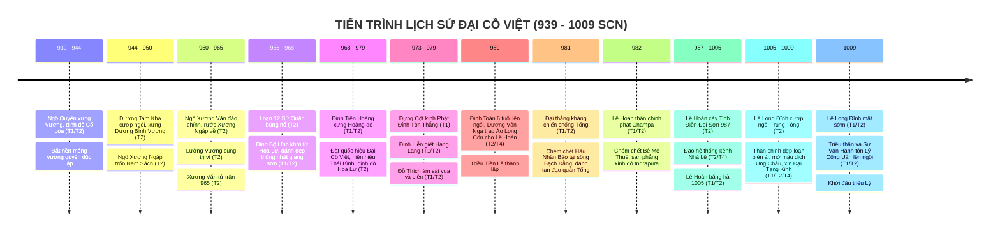

# Bối Cảnh Lịch Sử & Niên Biểu Toàn Tuyến: Giai Đoạn 939–1009 SCN

> [!IMPORTANT]
> **Ràng Buộc Nghiên Cứu Lịch Sử (Task `VS-NDPL-00`)**:
> - Tài liệu này khảo cứu toàn diện tiến trình lịch sử 70 năm từ khi Ngô Quyền xưng Vương dựng nền độc lập (939) đến khi triều Lý thành lập (1009), trải qua 3 triều đại liên tiếp: **Nhà Ngô**, **Nhà Đinh**, và **Nhà Tiền Lê**.
> - Mọi sự kiện, trận đánh và nhân vật đều được gắn nhãn phân tầng nguồn gốc 4 tầng (**T1 / T2 / T3 / T4**) nghiêm ngặt.
> - **KHÔNG thiết kế gameplay, không gán số liệu stats/waves, không khóa Roster Hero**.

---

## 1. Niên Biểu Toàn Tuyến Giai Đoạn 939–1009 SCN



---

## 2. Diễn Biến Chi Tiết Qua 6 Giai Đoạn Lịch Sử

### Giai Đoạn 1: Thời Kỳ Hậu Ngô Quyền & Khủng Hoảng Vương Quyền Cổ Loa (939–965 SCN)

* **Ngô Vương Kiến Quốc (939–944 SCN — T1 *Tân Ngũ Đại Sử*, T2 *Toàn Thư*)**:
  * Năm 939, sau chiến thắng Bạch Đằng vang dội, Ngô Quyền chính thức xưng Vương (**Ngô Vương**), bỏ chức Tiết độ sứ của phương Bắc.
  * Chọn kinh đô tại **Cổ Loa** (Đông Anh, Hà Nội) — biểu tượng nối tiếp chủ quyền quốc gia từ thời An Dương Vương Thục Phán, thiết lập triều đình với hệ thống quan chế, quy định phẩm phục và nghi lễ cung đình.
* **Dương Tam Kha Tiếm Vị & Sự Trốn Chạy Của Ngô Xương Ngập (944–950 SCN — T2 *Toàn Thư*)**:
  * Tháng 1 năm 944, Ngô Quyền lâm bệnh nặng qua đời ở tuổi 47. Trước khi mất, ông ủy thác việc phụ chính giúp rập con trai trưởng là **Ngô Xương Ngập** cho người em vợ là **Dương Tam Kha**.
  * Dương Tam Kha phản bội lời ủy thác, cướp đoạt ngai vàng, tự xưng là **Dương Bình Vương** (944–950).
  * Ngô Xương Ngập phải bỏ trốn về ẩn náu tại vùng Nam Sách Giang (Hải Dương), được Hào trưởng **Phạm Lệnh Công** hết lòng che chở, ba lần dời chỗ giấu trong hang núi rừng sâu để thoát khỏi sự lùng bắt ráo riết của Dương Tam Kha.
  * Dương Tam Kha nhận người con thứ của Ngô Quyền là **Ngô Xương Văn** làm con nuôi nhằm xoa dịu hoàng tộc và tướng lĩnh nhà Ngô.
* **Binh Biến Năm 950 & Chế Độ Lưỡng Vương Trị Vì (950–965 SCN — T2 *Toàn Thư*, *Việt Sử Lược*)**:
  * Năm 950, Dương Tam Kha sai Ngô Xương Văn cùng hai tướng Đỗ Cảnh Thạc và Dương Cát Lợi đi đánh hai thôn Đường, Nguyễn ở Thái Bình.
  * Đi đến giữa đường, Ngô Xương Văn thuyết phục hai tướng quay quân về tập kích bắt sống Dương Tam Kha. Xương Văn nghĩ tình cậu cháu không nỡ giết, chỉ giáng Tam Kha xuống làm *Chương Dương Sứ*, ban cho thực ấp ở vùng Chương Dương (Thường Tín, Hà Nội).
  * Ngô Xương Văn tự xưng là **Nam Tấn Vương**, sai sứ đón anh trai Ngô Xương Ngập về cùng coi việc nước. Ngô Xương Ngập cũng xưng là **Thiên Sách Vương** (chế độ Hai Vua — Lưỡng Vương cùng trị vì).
  * Thiên Sách Vương Ngô Xương Ngập chuyên quyền lấn át em, toan trừ khử Nam Tấn Vương nhưng chưa kịp thực hiện thì phát bệnh qua đời năm 954.
  * Năm 965, Nam Tấn Vương Ngô Xương Văn đem quân đi dẹp loạn hai thôn Đường, Nguyễn ở Thái Bình, bị trúng tên nỏ tử trận. Chính quyền trung ương Cổ Loa hoàn toàn sụp đổ.

---

### Giai Đoạn 2: Loạn 12 Sứ Quân & Chiến Dịch Thống Nhất Của Đinh Bộ Lĩnh (965–968 SCN)

```mermaid
graph TD
    subgraph LOẠN 12 SỨ QUÂN (965 - 968)
        S1["<b>Ngô Xương Xí</b><br>Bình Kiều (Thanh Hóa)"]
        S2["<b>Đỗ Cảnh Thạc</b><br>Đỗ Động Giang (Quốc Oai)"]
        S3["<b>Phạm Bạch Hổ</b><br>Đằng Châu (Hưng Yên)"]
        S4["<b>Kiều Thuận</b><br>Hồi Hồ (Phú Thọ)"]
        S5["<b>Kiều Tri Hựu</b><br>Phong Châu (Phú Thọ)"]
        S6["<b>Nguyễn Khoan</b><br>Tam Đái (Vĩnh Phúc)"]
        S7["<b>Nguyễn Siêu</b><br>Tây Phù Liệt (Thanh Trì)"]
        S8["<b>Nguyễn Thủ Tiệp</b><br>Tiên Du (Bắc Ninh)"]
        S9["<b>Lã Đường</b><br>Tế Giang (Văn Giang)"]
        S10["<b>Lý Khuê</b><br>Siêu Loại (Bắc Ninh)"]
        S11["<b>Ngô Nhật Khánh</b><br>Đường Lâm (Sơn Tây)"]
        S12["<b>Lý Xử Bình / Cổ Loa</b>"]
    end

    subgraph TRUNG TÂM QUY TỤ HOA LƯ
        DBL["<b>Đinh Bộ Lĩnh (Vạn Thắng Vương)</b><br>Căn cứ hiểm trở Động Hoa Lư (Ninh Bình)"]
        TL["<b>Trần Lãm (Trần Minh Công)</b><br>Căn cứ Bố Hải Khẩu (Thái Bình)"]
    end

    DBL -.->|Liên hiệp & Thừa kế| TL
    DBL ==>|Hàng phục / Thu phục| S3
    DBL ==>|Đánh dẹp quân sự| S2
    DBL ==>|Đánh dẹp quân sự| S7
    DBL ==>|Đánh dẹp quân sự| S4
    DBL ==>|Đánh dẹp quân sự| S9
    DBL ==>|Hôn nhân chính trị| S11
```

* **Bối cảnh phân liệt (T2 — *Việt Sử Lược*, *Toàn Thư*)**:
  * Sau cái chết của Ngô Xương Văn (965), triều đình Cổ Loa tê liệt. Con của Xương Ngập là **Ngô Xương Xí** yếu thế phải bỏ chạy về giữ đất Bình Kiều (Triệu Sơn, Thanh Hóa).
  * Khắp nơi, các tướng lĩnh công thần thời Ngô Quyền, các hoàng thân nhà Ngô và các hào trưởng thổ hào địa phương đồng loạt chiếm giữ các châu huyện, đắp lũy xây thành, xưng hùng xưng bá, chia cắt đất nước thành 12 vùng độc lập chém giết lẫn nhau.
* **Chiến lược Thống nhất của Đinh Bộ Lĩnh (965–968 SCN — T1/T2 Fact)**:
  * **Xuất thân**: Đinh Bộ Lĩnh sinh năm 924 tại thôn Kim Lư, làng Gia Phương, huyện Gia Viễn, tỉnh Ninh Bình; là con trai Đinh Công Trứ (Thứ sử Hoan Châu thời Ngô Quyền).
  * **Căn cứ Hoa Lư**: Vùng núi đá vôi non nước hiểm trở Động Hoa Lư, sông ngòi liên thông ra biển, thuận tiện công thủ.
  * **Liên hiệp chính trị (Bố Hải Khẩu)**: Đinh Bộ Lĩnh cùng con trai Đinh Liễn sang nương nhờ và liên minh với **Trần Lãm** (Trần Minh Công) ở căn cứ Bố Hải Khẩu (vùng Kỳ Bố, Thái Bình). Trần Lãm nhận Bộ Lĩnh làm con nuôi, trao quyền chỉ huy quân sự. Sau khi Trần Lãm mất, Đinh Bộ Lĩnh tiếp quản toàn bộ lực lượng và căn cứ trù phú này.
  * **Kết hợp quân sự - ngoại giao - hôn nhân**:
    1. **Thu phục**: Chiêu hàng danh tướng Phạm Bạch Hổ (Đằng Châu), phong làm Thân vệ Đại tướng quân.
    2. **Đánh dẹp kiên quyết**: Đánh tan các thế lực quân sự ngoan cố: phục kích tiêu diệt tướng Đỗ Cảnh Thạc tại Đỗ Động Giang; đánh bại Nguyễn Siêu tại Tây Phù Liệt; công phá căn cứ Hồi Hồ của Kiều Thuận; tiêu diệt Lã Đường tại Tế Giang và Nguyễn Khoan tại Tam Đái.
    3. **Hôn nhân chính trị**: Đinh Bộ Lĩnh gả con gái (Công chúa Minh Châu) cho Sứ quân Ngô Nhật Khánh; đồng thời lấy mẹ của Ngô Nhật Khánh và cưới em gái Ngô Nhật Khánh cho Đinh Liễn để trung hòa hoàng tộc họ Ngô.
  * Năm 968, giang sơn thu về một mối. Đinh Bộ Lĩnh được tôn xưng là **Vạn Thắng Vương** (Ông vua vạn lần đánh vạn lần thắng).

---

### Giai Đoạn 3: Triều Đại Nhà Đinh — Nước Đại Cồ Việt & Biến Cố Cung Đình (968–979 SCN)

* **Xây Dựng Đế Chế & Định Đô Hoa Lư (968 SCN — T1/T2 Fact)**:
  * Năm Mậu Thìn (968), Đinh Bộ Lĩnh chính thức lên ngôi Hoàng đế, tự xưng hiệu là **Đại Thắng Minh Hoàng Đế** (**Đinh Tiên Hoàng**).
  * Đặt quốc hiệu là **Đại Cồ Việt** (Đại = Lớn; Cồ = Lớn/Kỳ vĩ theo tiếng Việt cổ — Nước Việt vĩ đại), đặt niên hiệu riêng là **Thái Bình**.
  * Dời đô từ vùng đồng bằng Cổ Loa về **kinh đô Hoa Lư** (Ninh Bình) — tận dụng địa hình hiểm trở núi đá vôi bao bọc, xây thành đắp lũy kết hợp đầm lầy và sông Hoàng Long tạo thành pháo đài quân sự kiên cố bậc nhất.
* **Tổ Chức Triều Chính & Quân Đội (T2 — *Toàn Thư*)**:
  * Phong **Đinh Liễn** (con trưởng) làm Nam Việt Vương.
  * Bổ nhiệm đại thần: **Nguyễn Bặc** làm Định Quốc công (Tể tướng); **Đinh Điền** làm Ngoại triều nội thư sủng hạnh; **Lê Hoàn** làm Thập đạo tướng quân Điện tiền Đô chỉ huy sứ (Tổng tư lệnh quân đội); **Lưu Cơ** làm Đô hộ phủ Sĩ sư (Tổng đốc kinh thành Đại La); **Tăng thống Ngô Chân Lưu** làm Khuông Việt đại sư (cố vấn tối cao triều đình).
  * Tổ chức quân đội quy mô 10 đạo (Thập đạo quân), mỗi đạo 10 quân, mỗi quân 10 lữ, mỗi lữ 10 tốt, mỗi tốt 10 ngũ (hệ thống tổ chức quân đội tập trung đầu tiên của nhà nước độc lập).
* **Ngoại Giao Tự Chủ Với Nhà Tống (970–975 SCN — T1 *Tống Sử*)**:
  * Năm 970, Đinh Tiên Hoàng sai Nam Việt Vương Đinh Liễn đi sứ nhà Tống.
  * Năm 973, Tống Thái Tổ phong Đinh Tiên Hoàng làm *Giao Chỉ quận vương*, phong Đinh Liễn làm *Kiểm hiệu thái sư Tĩnh Hải quân Tiết độ sứ An Nam đô hộ*.
  * Thiết lập thế cân bằng ngoại giao: Bên ngoài giữ quan hệ triều cống hữu hảo mềm dẻo với phương Bắc; bên trong xưng Hoàng đế độc lập, đúc đồng tiền riêng (**Thái Bình Hưng Bảo** — đồng tiền đầu tiên trong lịch sử Việt Nam).
* **Vụ Án Khảo Cổ Cột Kinh Đinh Liễn & Bi kịch Cung Đình (979 SCN — T1/T2/T4 Fact)**:
  * Đinh Tiên Hoàng vì yêu quý con út là **Hạng Lang** đã lập Hạng Lang làm Thái tử kế vị.
  * Nam Việt Vương Đinh Liễn có công lao lớn từ thuở hàn vi bèn sinh lòng oán giận, sai thủ hạ ngầm ám hại Hạng Lang vào đầu năm 979. Sau đó, Đinh Liễn dựng hơn 20 Cột kinh Phật Đỉnh Tôn Thắng bằng đá tại Hoa Lư để sám hối cầu siêu (được khảo cổ học xác thực 100% qua minh văn T1).
  * Tháng 10 năm 979, viên quan hầu cận nội thị **Đỗ Thích** nhân lúc Đinh Tiên Hoàng và Đinh Liễn say rượu ngủ say trong sân cung đình đã dùng dao ám sát cả hai cha con.
  * Định Quốc công Nguyễn Bặc và quân sĩ bắt giết Đỗ Thích, phò tá ấu chúa **Đinh Toàn** (mới 6 tuổi) lên ngôi; Thái hậu **Dương Vân Nga** buông rèm nhiếp chính.

---

### Giai Đoạn 4: Chuyển Giao Quyền Lực & Đại Thắng Kháng Tống Năm 981 (979–981 SCN)

```mermaid
graph TD
    subgraph KHỦNG HOẢNG HOA LƯ (979 - 980)
        DT["<b>Vua Đinh Toàn (6 tuổi)</b>"]
        DVN["<b>Thái hậu Dương Vân Nga</b><br>Nhiếp chính triều đình"]
        LH["<b>Lê Hoàn</b><br>Thập đạo tướng quân / Phó vương"]
        NB["<b>Phe chống đối:</b><br>Đinh Điền, Nguyễn Bặc, Phạm Hạp"]

        DT --- DVN
        DVN -->|Cử làm Nhiếp chính| LH
        NB -->|Dấy binh chống đối| LH
        LH ==>|Dẹp tan nội loạn| NB
    end

    subgraph NGUY CƠ NGOẠI XÂM TỐNG (980)
        TONG["<b>Quân Tống chuẩn bị xâm lược</b><br>Hầu Nhân Bảo (Bộ binh) & Lưu Trừng (Thủy binh)"]
        TONG -.->|Áp sát biên giới| DVN
        DVN ==>|<b>Trao Áo Long Cổn</b><br>Tôn Lê Hoàn lên làm Hoàng đế| LH
    end

    subgraph ĐẠI THẮNG BẠCH ĐẰNG - TÂY KẾT (981)
        LH2["<b>Lê Đại Hành (Lê Hoàn)</b><br>Thân chinh thống lĩnh toàn quân"]
        LH2 ==>|Chém chết Hầu Nhân Bảo tại sông Bạch Đằng| TONG
        LH2 ==>|Đánh tan quân Trần Khâm Tộ tại Tây Kết| TONG
    end
```

* **Khủng Hoảng Nội Bộ & Phản Ứng Của Các Đại Thần (979–980 SCN — T2 *Toàn Thư*)**:
  * Lê Hoàn làm Phó vương nắm trọn binh quyền trong triều. Các cựu thần trung thành họ Đinh là Định Quốc công **Nguyễn Bặc**, Ngoại giáp **Đinh Điền**, Phò mã **Phạm Hạp** nghi ngờ Lê Hoàn mưu đồ soán ngôi, dấy binh từ Ái Châu tiến về Hoa Lư toan trừ khử Lê Hoàn.
  * Lê Hoàn xuất quân dẹp tan các cánh quân nổi loạn, chém chết Đinh Điền, bắt sống Nguyễn Bặc và Phạm Hạp xử trảm. Phò mã Ngô Nhật Khánh dẫn thủy quân Champa toan đánh úp Hoa Lư nhưng thuyền bị bão đắm ở cửa biển Đại Ác (Ninh Bình), Nhật Khánh chết đuối.
* **Nghi Thức Trao Áo Long Cổn (Tháng 7 năm 980 SCN — T2 *Toàn Thư*, T4 Giải mã học thuật)**:
  * Tháng 7 năm 980, thám báo biên giới cấp báo: Vua Tống Thái Tông nhân cơ hội vua Đinh còn nhỏ, nội bộ rối loạn đã cử đại quân thủy bộ ồ ạt chuẩn bị tràn sang xâm lược.
  * Trước tình thế ngàn cân treo sợi tóc, tướng quân **Phạm Cự Lạng** cùng ba quân tướng sĩ đồng thanh tôn xưng Lê Hoàn làm Hoàng đế.
  * Thái hậu **Dương Vân Nga** lấy đại cục cứu nước làm trọng, sai mang **áo Long Cổn** khoác lên mình Lê Hoàn, chính thức nhường ngôi báu. Lê Hoàn lên ngôi Hoàng đế (**Lê Đại Hành**), đổi niên hiệu thành **Thiên Phúc**, giáng Đinh Toàn xuống làm Vệ Vương.
* **Chiến Dịch Kháng Chiến Chống Tống Đại Thắng (Xuân - Hè 981 SCN — T1 *Tống Sử*, T2 *Toàn Thư*)**:
  * **Cánh quân Tống**:
    - **Quân bộ**: Do Hầu Nhân Bảo, Tôn Toàn Hưng, Trần Khâm Tộ chỉ huy tiến qua Lạng Sơn.
    - **Quân thủy**: Do Lưu Trừng, Giả Đam chỉ huy theo đường biển tiến vào cửa sông Bạch Đằng.
  * **Chiến thuật & Trận địa**:
    - Lê Hoàn cho đóng cọc ngăn sông Bạch Đằng và sông Lục Đầu, xây đắp lũy Bình Lỗ phòng ngự chiến lược.
    - Quân thủy của Lưu Trừng bị chặn đánh dữ dội không thể hội quân với cánh bộ binh.
    - Cánh quân của Hầu Nhân Bảo tiến sâu vào vùng hiểm địa, ngày càng bị cô lập và thiếu lương thảo.
  * **Trận Quyết Chiến Sông Bạch Đằng (Tháng 4 năm 981 SCN)**:
    - Lê Hoàn dùng kế trá hàng, sai người mang thư trá hàng dụ Hầu Nhân Bảo lơ là phòng bị.
    - Khi Hầu Nhân Bảo trúng kế đem thuyền tiến vào phục kích, quân Đại Cồ Việt từ các hướng mai phục dốc toàn lực đổ ra đánh quật lại. Tướng **Hầu Nhân Bảo bị chém chết tại trận**, xác vứt xuống sông.
    - Tin Hầu Nhân Bảo tử trận làm quân Tống kinh hoàng tan rã. Lê Hoàn lập tức xua quân truy kích cánh quân Trần Khâm Tộ, đại phá giặc tại **Tây Kết** (Hưng Yên), chém tướng giặc vô số, bắt sống các tướng Quách Quân Biện, Triệu Phụng Huân giải về Hoa Lư. Tôn Toàn Hưng và Lưu Trừng hoảng sợ tháo chạy thục mạng về nước.
  * Thắng lợi năm 981 khẳng định bản lĩnh quân sự phi thường của Lê Hoàn và sức sống quật cường của nền độc lập non trẻ Đại Cồ Việt.

---

### Giai Đoạn 5: Triều Đại Tiền Lê — Củng Cố Biên Cương & Xây Dựng Đất Nước (982–1005 SCN)

* **Chiến Dịch Phạt Champa (982 SCN — T1/T2 Fact)**:
  * Năm 981, Lê Hoàn cử các sứ giả Từ Mục, Ngô Tử Canh sang bang giao với Champa nhưng bị vua Champa là **Paramesvaravarman I (Bê Mê Thuế)** bắt giam vô cớ.
  * Mùa xuân năm 982, sau khi dẹp yên giặc Tống, Lê Hoàn tự mình thống lĩnh đại quân thủy bộ tiến đánh Champa để bảo vệ quốc thể.
  * Quân Đại Cồ Việt tiến thẳng vào bờ cõi Champa, chém chết Bê Mê Thuế tại trận, đánh chiếm và san phẳng kinh đô **Indrapura** (Đồng Dương, Thăng Bình, Quảng Nam), thu nhiều vàng bạc chiến lợi phẩm và giải phóng các sứ thần trước khi khải hoàn rút quân về Hoa Lư.
* **Chính Sách Khuyến Nông & Phát Triển Hạ Tầng (987–1000 SCN — T2/T4 Fact)**:
  * **Lễ Tịch Điền (987 SCN)**: Mùa xuân năm 987, vua Lê Đại Hành đích thân cày ruộng Tịch Điền tại chân núi Đọi (Duy Tiên, Hà Nam), mở đầu truyền thống trọng nông, khuyến khích sản xuất nông nghiệp của các bậc đế vương Việt Nam.
  * **Hệ thống Kênh Nhà Lê**: Lê Hoàn tổ chức nhân dân và quân đội đào đắp hệ thống kênh mương thủy lợi nối liền từ Ninh Bình qua Thanh Hóa đến Nghệ An, vừa phục vụ tưới tiêu nông nghiệp vừa là đường giao thông hào thủy chiến chiến lược bảo vệ quốc gia.
* **Bang Giao Tự Chủ Với Nhà Tống (T1 — *Tống Sử*)**:
  * Năm 986, nhà Tống buộc phải thừa nhận thực tế, cử Lý Giác sang sắc phong Lê Hoàn làm *An Nam Đô hộ Tĩnh Hải quân Tiết độ sứ*, sau thăng làm *Giao Chỉ quận vương* (993) và *Nam Bình Vương* (997).
  * Trong các cuộc tiếp sứ (như tiếp sứ thần Lý Giác), Lê Hoàn và các danh tăng (Đỗ Thuận, Khuông Việt) đã biểu dương bản lĩnh ngoại giao đỉnh cao, khẳng định vị thế quốc gia độc lập có nền văn hiến rực rỡ qua bài thơ *Vận nước* (Quốc tộ) và bài từ đưa tiễn *Vương lang quy*.

---

### Giai Đoạn 6: Khủng Hoảng Hậu Kỳ Tiền Lê & Chuyển Giao Sang Nhà Lý (1005–1009 SCN)

```mermaid
graph TD
    subgraph BIẾN ĐỘNG CUNG ĐÌNH HOA LƯ (1005 - 1009)
        LH3["<b>Lê Đại Hành băng hà (1005)</b>"]
        TRANH["<b>Các Hoàng tử tranh đoạt ngôi báu (8 tháng)</b>"]
        TT["<b>Lê Trung Tông (Lê Long Việt)</b><br>Ở ngôi được 3 ngày"]
        LD["<b>Lê Long Đĩnh (Khai Minh Vương)</b><br>Ám sát anh, cướp ngôi vua (1005 - 1009)"]

        LH3 --> TRANH
        TRANH --> TT
        TT -->|Bị ám sát| LD
    end

    subgraph CHUYỂN GIAO VƯƠNG QUYỀN HÒA BÌNH (1009)
        LD -->|Bệnh mất ở tuổi 24 (Tháng 10/1009)| MAT["<b>Ngai vàng trống</b>"]
        MAT --> VAN["<b>Sư Vạn Hạnh & Tăng lữ Phật giáo</b><br>Vận động tư tưởng, dự báo thiên mệnh"]
        MAT --> DCM["<b>Đào Cam Mộc & Triều thần Hoa Lư</b><br>Chủ động vận động chính trị cung đình"]

        VAN --> LCU["<b>Lý Công Uẩn</b><br>Thân vệ Điện tiền Chỉ huy sứ<br>Được toàn thể triều đình suy tôn lên ngôi Hoàng đế (1009)"]
        DCM --> LCU
    end
```

* **Biến Loạn Tranh Đoạt Ngai Vàng Sau Khi Lê Hoàn Mất (1005 SCN — T2 *Toàn Thư*)**:
  * Tháng 3 năm 1005, Lê Đại Hành băng hà. Thái tử Lê Long Thâu đã mất trước đó, các hoàng tử gồm Đông Thành Vương Lê Long Ngân, Trung Quốc Vương Lê Long Kính, Ngự Bắc Vương Lê Long Đinh và Nam Sách Vương Lê Long Đề đều kéo quân về vây thành Hoa Lư tranh giành ngôi vị suốt 8 tháng ròng rã khiến đất nước không có chủ.
  * Đến tháng 10 năm 1005, **Lê Long Việt** (con thứ 3) đánh bại các anh em lên ngôi vua (**Lê Trung Tông**).
  * Nhưng chỉ sau đúng 3 ngày ở ngôi báu, người em cùng mẹ là Khai Minh Vương **Lê Long Đĩnh** sai dạ xoa ban đêm trèo tường vào cung ám sát Lê Trung Tông rồi cướp ngôi hoàng đế.
* **Thời Kỳ Trị Vì Của Lê Long Đĩnh (1005–1009 SCN — T1/T2/T4 Fact)**:
  * Trị vì 4 năm (1005–1009), đặt niên hiệu là Cảnh Thụy.
  * Đánh dẹp các phản loạn thổ hào biên giới hiểm trở, đích thân cầm quân trận mạc.
  * Mở cửa giao thương tại biên giới Ung Châu với nhà Tống (1007); cử người sang Tống xin kinh Phật Đại Tạng Kinh và sách Cửu Kinh (1008).
  * Do bệnh tật thể chất hiểm nghèo (mắc bệnh trĩ nặng phải nằm thiết triều) và những hành vi xử phạt tàn khốc theo mô tả của T2, triều chính ngày càng mất lòng dân chúng.
* **Cuộc Chuyển Giao Quyền Lực Sang Nhà Lý (Tháng 10 năm 1009 SCN — T1/T2 Fact)**:
  * Tháng 10 năm Kỷ Dậu (1009), Lê Long Đĩnh qua đời khi mới tròn 24 tuổi. Thái tử Sạ còn quá nhỏ tuổi.
  * Trong triều đình, Chi hậu **Đào Cam Mộc** nhận thấy tình hình nguy cấp, bèn bí mật liên kết với **Thiền sư Vạn Hạnh** (bậc cao tăng uy tín tối cao tại chùa Cổ Pháp) vận động triều thần tôn Điện tiền Chỉ huy sứ **Lý Công Uẩn** lên làm Hoàng đế.
  * Lý Công Uẩn vốn là người nhân từ, văn võ song toàn, nắm toàn bộ cấm vệ quân và được quần thần hết lòng tin phục.
  * Cuộc chuyển giao vương quyền diễn ra hoàn toàn êm thắm, hòa bình, không đổ một giọt máu. Lý Công Uẩn chính thức lên ngôi Hoàng đế (**Lý Thái Tổ**), lập nên vương triều Lý rực rỡ, dời đô về Thăng Long năm 1010, mở ra thời kỳ cực thịnh của văn minh Đại Việt.
