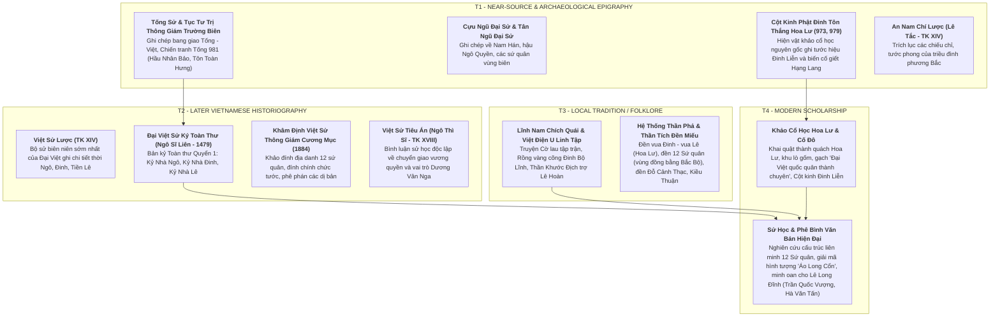

# Khảo Cứu Nguồn Thư Tịch & Thẩm Định Học Thuật: Giai Đoạn 939–1009 SCN

> [!IMPORTANT]
> **Nguyên Tắc Thẩm Định Nguồn (Task `VS-NDPL-00`)**:
> - Tài liệu này cung cấp bức tranh toàn cảnh về thư tịch học, đánh giá độ tin cậy và phân tầng nguồn học thuật cho toàn bộ tiến trình lịch sử Việt Nam từ khi Ngô Quyền xưng Vương (939), qua thời kỳ Loạn 12 Sứ Quân, triều Đinh, triều Tiền Lê đến cuộc chuyển giao quyền lực sang nhà Lý (1009).
> - Bắt buộc phân định rạch ròi giữa **Ghi chép gần thời / Văn bia khảo cổ (T1)**, **Chính sử trung đại Đại Việt (T2)**, **Huyền tích dân gian & Thần phả (T3)** và **Nghiên cứu khảo cổ / Sử học hiện đại (T4)**.
> - Tuyệt đối không biến truyền thuyết dân gian, giai thoại văn học hoặc thiên kiến của sử quan thời sau thành dữ kiện lịch sử đã được xác thực (historical fact).

---

## 1. Hệ Thống Thư Tịch Khảo Cứu Theo 4 Tầng

---

## 2. Phân Tích Chuyên Sâu Các Điểm Tranh Luận Lịch Sử

### 2.1. Cấu Trúc & Danh Sách 12 Sứ Quân (965–968 SCN)

* **Hiện trạng thư tịch**:
  * **T2 — *Việt Sử Lược* & *Đại Việt Sử Ký Toàn Thư***: Ghi nhận sau khi Nam Tấn Vương Ngô Xương Văn mất (965), các đại thần và hào trưởng nổi dậy tranh giành quyền lực, lập ra 12 vùng cát cứ độc lập.
  * Danh sách 12 Sứ quân được T2 định hình ổn định:
    1. **Ngô Xương Xí** giữ Bình Kiều (Triệu Sơn, Thanh Hóa) — Dòng dõi nhà Ngô.
    2. **Đỗ Cảnh Thạc** xưng Đỗ Cảnh Công, giữ Đỗ Động Giang (Quốc Oai / Thanh Oai, Hà Nội) — Tướng cũ Dương Đình Nghệ & Ngô Quyền.
    3. **Phạm Bạch Hổ** xưng Phạm Phòng Át, giữ Đằng Châu (Kim Động, Hưng Yên) — Tướng cũ nhà Ngô.
    4. **Kiều Thuận** xưng Kiều Lệnh Công, giữ Hồi Hồ (Cẩm Khê, Phú Thọ) — Dòng dõi Kiều Công Tiễn.
    5. **Kiều Tri Hựu** xưng Kiều Tướng Công, giữ Phong Châu (Bạch Hạc, Phú Thọ).
    6. **Nguyễn Khoan** xưng Nguyễn Thái Bình, giữ Tam Đái (Vĩnh Tường, Vĩnh Phúc).
    7. **Nguyễn Siêu** xưng Nguyễn Hữu Công, giữ Tây Phù Liệt (Thanh Trì, Hà Nội).
    8. **Nguyễn Thủ Tiệp** xưng Nguyễn Lệnh Công, giữ Tiên Du (Bắc Ninh).
    9. **Lã Đường** xưng Lã Tá Công, giữ Tế Giang (Văn Giang, Hưng Yên).
    10. **Lý Khuê** xưng Lý Lãng Công, giữ Siêu Loại (Thuận Thành, Bắc Ninh).
    11. **Ngô Nhật Khánh** xưng Ngô Lãm Công, giữ Đường Lâm (Hà Nội) — Hoàng thân nhà Ngô.
    12. **Lý Xử Bình** (hoặc Lã Xử Bình / Lã Tá Công biến thể) giữ Cổ Loa.
* **Đánh giá học thuật (T4)**:
  * Bản chất "Loạn 12 Sứ quân" không thuần túy là tình trạng hỗn loạn vô chính phủ, mà là quá trình **phân rã tự nhiên của chính quyền trung ương non trẻ sau khi thủ lĩnh tối cao (Ngô Quyền) qua đời**, rơi vào tay các thế lực hào tộc địa phương (hào trưởng) và các tướng lĩnh công thần nắm quân đội.
  * Các sứ quân phân bố tập trung ở vùng châu thổ sông Hồng và lưu vực sông Đáy, tạo thành các cụm phòng thủ kiên cố.
  * Đinh Bộ Lĩnh thống nhất đất nước không chỉ bằng chiến tranh quân sự đơn thuần mà kết hợp chặt chẽ với **liên hiệp chính trị, hôn nhân ngoại giao** (thu phục Phạm Bạch Hổ, Trần Lãm; gả con gái cho Ngô Nhật Khánh; lấy mẹ Ngô Nhật Khánh...).

---

### 2.2. Huyền Tích "Cờ Lau Tập Trận" & Rồng Vàng (T3 Folklore vs Fact)

* **Hiện trạng sử liệu**:
  * **T2 — *Toàn Thư***: Ghi lại chuyện Đinh Bộ Lĩnh thuở nhỏ chăn trâu ở động Hoa Lư, cùng lũ trẻ cùng làng bẻ hoa lau làm cờ rước đi, lũ trẻ khoanh tay làm kiệu cho ông ngồi. Lớn lên, người trong làng theo phục, suy tôn làm thủ lĩnh.
  * **T3 — *Lĩnh Nam Chích Quái* & Dân gian**: Huyền thoại hóa Đinh Bộ Lĩnh là con rái cá / thần nhân, bị chú đuổi chém chạy qua sông Hoàng Long có rồng vàng nổi lên cõng qua sông; mẹ nhìn thấy mộ cha có điềm rồng bèn táng hài cốt vào hàm rồng.
* **Đánh giá học thuật (T4)**:
  * **Phân tầng nghiêm ngặt**: Chuyện "cờ lau tập trận" và "rồng vàng cõng qua sông" là **giai thoại dân gian và biểu tượng văn học mang tính thần thoại hóa (T3)** nhằm giải thích thiên mệnh của vị vua khai quốc.
  * **Sự thật lịch sử (T1/T2 Fact)**: Đinh Bộ Lĩnh là con trai của Đinh Công Trứ (Thứ sử Hoan Châu thời Dương Đình Nghệ và Ngô Quyền). Ông có xuất thân quý tộc hào trưởng danh giá, kế thừa uy tín chính trị và căn cứ địa hiểm trở tại Động Hoa Lư, có tài thao lược quân sự và tầm nhìn chiến lược vượt trội.

---

### 2.3. Cột Kinh Phật Đỉnh Tôn Thắng (973, 979) — Chứng Tích Khảo Cổ Học T1 Vô Giá

* **Hiện vật khảo cổ học (T1/T4 Fact)**:
  * Khai quật tại Hoa Lư (Ninh Bình) phát hiện hơn 20 cột kinh Phật bằng đá bát giác khắc bài chú *Phật Đỉnh Tôn Thắng Đà La Ni*.
  * Minh văn trên cột kinh ghi rõ niên đại: năm Quý Dậu (973) và năm Kỷ Mão (979), do **Nam Việt Vương Đinh Liễn** (con trưởng Đinh Tiên Hoàng) tạo lập.
* **Giá trị lịch sử đặc biệt**:
  * Xác nhận tước hiệu chính thức của Đinh Liễn: *"Đại Cồ Việt quốc Đô hộ Phủ quân sủng phụng ban Tĩnh Hải quân Tiết độ sứ phụ quốc Đại tướng quân Nam Việt Vương Đinh Khuông Liễn"*.
  * Minh văn năm 979 xác thực trực tiếp bi kịch hoàng gia: Đinh Liễn cho dựng kinh cầu siêu sau khi đã giết hại em trai là **Hạng Lang** (Đại Việt Quốc thái tử) vì tranh đoạt quyền thừa kế ngai vàng.
  * Đây là bằng chứng văn tự khảo cổ đương thời (T1 epigraphy) hiếm hoi xác thực chính xác biên niên sử và các mối quan hệ quyền lực triều Đinh.

---

### 2.4. Thái Hậu Dương Vân Nga & Nghi Thức "Trao Áo Long Cổn" (980 SCN)

* **Hiện trạng sử liệu**:
  * **T2 — *Toàn Thư* (Kỷ Nhà Lê)**: Ghi lại sự kiện mùa thu năm Canh Thìn (980), khi quân Tống chuẩn bị tràn sang xâm lược, triều đình Hoa Lư rơi vào khủng hoảng (Vua Đinh Toàn mới 6 tuổi). Phạm Cự Lạng cùng các tướng sĩ vào cung tâu: *"Nay giặc Tống sắp đến, bọn ta liều chết đánh giặc để lập công thì ai biết cho? Chi bằng trước hết tôn Thập đạo tướng quân làm Thiên tử, sau đó sẽ xuất quân"*. Quân sĩ đồng thanh reo hò "Vạn tuế".
  * Thái hậu Dương thị thấy lòng người quy phục, bèn sai **lấy áo Long Cổn (áo long bào của Hoàng đế) khoác lên người Lê Hoàn**, chính thức nhường ngôi báu cho Lê Hoàn.
* **Đánh giá học thuật (T4)**:
  * **Sử quan Nho giáo trung đại (T2)**: Ngô Sĩ Liên trong *Toàn Thư* đã chỉ trích gay gắt Dương Vân Nga về mặt lễ giáo Nho gia ("thất tiết", "lấy hai đời vua").
  * **Sử học hiện đại (T4)**: Nhìn nhận hành động của Dương Vân Nga và triều thần Hoa Lư là một **quyết định chính trị sáng suốt, dũng cảm và thực tế bậc nhất trong lịch sử Việt Nam**. Trong bối cảnh họa xâm lăng đại quy mô của đế chế Tống cận kề, việc chuyển giao quyền lực quân sự tối cao cho viên đại tướng tài ba nhất (Lê Hoàn) đã cứu quốc gia Đại Cồ Việt khỏi nguy cơ bị tái đồng hóa sau chưa đầy 40 năm độc lập.
  * Nghi thức "khoác áo Long Cổn" phản ánh hình thức tôn vương quân sự kinh điển thời trung đại (tương tự như binh biến Trần Kiều khoác hoàng bào tôn Triệu Khuông Dẫn lên ngôi lập ra nhà Tống năm 960 ở Trung Hoa).

---

### 2.5. Diễn Biến Chiến Tranh Kháng Tống Năm 981: Đối Chiếu Tống Sử (T1) & Toàn Thư (T2)

* **Sử liệu T1 — *Tống Sử* (Quyển 488 — Giao Chỉ truyện) & *Tục Tư Trị Thông Giám Trường Biên***:
  * Ghi nhận tháng 7 năm Thái Bình Hưng Quốc thứ 5 (980), Tống Thái Tông hạ chiếu xâm lược Giao Châu.
  * Bố trí binh lực:
    - **Cánh quân bộ chính**: Do Lĩnh Nam đông lộ chuyển vận sứ **Hầu Nhân Bảo** cùng Tôn Toàn Hưng, Trần Khâm Tộ, Thôi Lượng chỉ huy tiến theo đường Lạng Sơn.
    - **Cánh thủy quân**: Do Thứ sử Ngang Châu **Lưu Trừng**, Giả Đam dẫn theo đường biển vào cửa sông Bạch Đằng.
  * Kết cục theo *Tống Sử*: Tháng 4 năm 981, Hầu Nhân Bảo tiến sâu vào, rơi vào ổ phục kích trên sông, bị giết tại trận; Lưu Trừng và Tôn Toàn Hưng nghe tin kinh hoàng rút chạy; Trần Khâm Tộ bị truy đuổi tan tác tại Tây Kết. Tống Thái Tông hạ lệnh chém đầu Lưu Trừng và Giả Đam vì tội rút lui hèn nhát.
* **Sử liệu T2 — *Toàn Thư***:
  * Lê Hoàn tự làm tướng, sai đóng cọc ngăn sông Bạch Đằng, cho quân mai phục khắp các hiểm địa.
  * Lê Hoàn dùng kế trá hàng: Sai người dâng thư giả vờ đầu hàng để dụ Hầu Nhân Bảo mất cảnh giác, sau đó dốc toàn lực thủy bộ bất ngờ đánh úp, chém chết Hầu Nhân Bảo tại sông Bạch Đằng, bắt sống tướng Tống là Quách Quân Biện, Triệu Phụng Huân.
* **Kết luận học thuật**: Cuộc kháng chiến chống Tống năm 981 là **chiến công phòng thủ chiến lược hiển hách** được sử thư hai phía xác nhận hoàn toàn đồng thuận, bảo vệ vững chắc nền độc lập non trẻ của Đại Cồ Việt.

---

### 2.6. Nhân Vật Lê Long Đĩnh: "Ngọa Triều" Nằm Coi Chầu (T2 Thiên Kiến) vs Khảo Cứu Thực Chứng (T4)

* **Hiện trạng sử liệu T2 — *Toàn Thư* & *Cương Mục***:
  * Chép Lê Long Đĩnh (Khai Minh Vương) giết anh đoạt ngôi, tính tình bạo ngược, tàn độc, ham mê tửu sắc quá độ đến mức phát bệnh trĩ nặng không ngồi được, phải **nằm mà thiết triều**, nên dân gian gọi là **Lê Ngọa Triều**.
  * Chép hàng loạt hành vi tàn bạo: róc mía trên đầu sư Quách Ngang, bắt tù nhân leo cây rồi chặt gốc, thả người vào chuồng cọp...
* **Đánh giá và Giải ảo học thuật (T4)**:
  * **Thiên kiến chính trị của sử quan thời sau**: *Toàn Thư* do các sử quan triều Lê biên soạn dựa trên các tư liệu triều Lý và Trần — những triều đại có nhu cầu chính trị hợp thức hóa tính chính danh của cuộc chuyển giao vương quyền từ họ Lê sang họ Lý năm 1009. Việc khắc họa vua cuối triều Tiền Lê như một bạo chúa vô đạo là mô-típ quen thuộc của sử học phong kiến Đông Á.
  * **Hành trạng thực tế được chính T1/T2 ghi nhận**:
    1. **Quân sự**: Lê Long Đĩnh là một chỉ huy quân sự dũng cảm, liên tục thân chinh cầm quân đánh dẹp các cuộc nổi loạn của các thổ hào vùng biên ải hiểm trở (châu Cử Long, châu Án Nột, sông Đà, Đô Lương...).
    2. **Kinh tế & Thương mại**: Năm 1007, ông chủ động cử sứ giả sang nhà Tống xin mở chợ trao đổi hàng hóa tại châu Ung (Quảng Tây), thúc đẩy kinh tế mậu dịch đường biên.
    3. **Văn hóa & Tôn giáo**: Năm 1008, ông cử em trai là Lê Minh Đề sang sứ Tống xin bộ **Cửu Kinh** và **Đại Tạng Kinh** đồ sộ về cho đất nước, đặt nền móng văn hóa và Phật giáo rực rỡ cho thời Lý sau này.
    4. **Trọng dụng nhân tài**: Ông tin cậy giao phó trọng trách cấm quân (Thân vệ Điện tiền Chỉ huy sứ) cho Lý Công Uẩn — người sau này kế vị ngai vàng.
  * **Kết luận**: Danh xưng "Ngọa Triều" và những câu chuyện rùng rợn phản ánh một phần bệnh tật thể chất và thiên kiến sử liệu; thực tế Lê Long Đĩnh là một vị vua có nhiều hoạt động trị quốc năng động trong 4 năm trị vì ngắn ngủi trước khi qua đời ở tuổi 24.

---

## 3. Bảng Tổng Hợp Phân Tầng Nguồn Giai Đoạn 939–1009 SCN

| Sự Kiện / Nhân Vật | Nguồn Thư Tịch Chính | Tầng | Đánh Giá Độ Tin Cậy Học Thuật |
|---|---|:---:|---|
| Ngô Quyền xưng Vương, định đô Cổ Loa (939) | *Tân Ngũ Đại Sử*, *Toàn Thư* | **T1/T2** | **Fact lịch sử** mở đầu kỷ nguyên độc lập. |
| Dương Tam Kha cướp ngôi, xưng Bình Vương (944) | *Toàn Thư*, *Cương Mục* | **T2** | **Fact lịch sử** về biến động hậu Ngô Quyền. |
| Ngô Xương Ngập & Xương Văn (Nam Tấn & Thiên Sách) | *Toàn Thư*, *Việt Sử Lược* | **T2** | **Fact lịch sử** về chế độ nhị vương cùng trị vì. |
| Loạn 12 Sứ Quân phân chia cát cứ (965–968) | *Việt Sử Lược*, *Toàn Thư*, *Cương Mục* | **T2** | **Fact lịch sử**; cấu trúc địa bàn được khảo cổ và địa danh học xác nhận. |
| Truyền thuyết Cờ lau tập trận & Rồng vàng cõng vua | *Lĩnh Nam Chích Quái*, *Toàn Thư* | **T3/T2** | **Folklore / Giai thoại dân gian**; biểu tượng văn học, không phải tiểu sử chuẩn xác. |
| Đinh Bộ Lĩnh thống nhất, lập nước Đại Cồ Việt (968) | *Tống Sử*, *Toàn Thư*, *Việt Sử Lược* | **T1/T2** | **Fact lịch sử vĩ đại**; định đô Hoa Lư, đặt niên hiệu Thái Bình. |
| Cột kinh Phật Đỉnh Tôn Thắng (973, 979) | Hiện vật khảo cổ Cột kinh Hoa Lư | **T1/T4** | **Hiện vật nguyên gốc T1**; chứng thực tước vị Đinh Liễn và vụ án Hạng Lang. |
| Đỗ Thích ám sát Đinh Tiên Hoàng & Đinh Liễn (979) | *Tống Sử*, *Toàn Thư*, *Việt Sử Lược* | **T1/T2** | **Fact lịch sử** về bi kịch cung đình. |
| Thái hậu Dương Vân Nga trao Áo Long Cổn cho Lê Hoàn (980) | *Toàn Thư*, *Việt Sử Tiêu Án* | **T2/T4** | **Fact lịch sử về nghi thức chuyển giao quyền lực**; quyết định chính trị thực tế cứu quốc gia. |
| Kháng chiến chống Tống đại thắng 981 | *Tống Sử*, *Tục Tư Trị Thông Giám Trường Biên*, *Toàn Thư* | **T1/T2** | **Fact lịch sử vững chắc**; Hầu Nhân Bảo bị chém chết, quân Tống đại bại. |
| Lê Hoàn thân chinh phạt Champa (982) | *Tống Sử*, *Toàn Thư* | **T1/T2** | **Fact lịch sử**; chém Bê Mê Thuế, san phẳng thành Indrapura. |
| Lễ Tịch Điền & Đào kênh Nhà Lê | *Toàn Thư*, *Cương Mục*, Di tích khảo cổ | **T2/T4** | **Fact lịch sử & Khảo cổ học**; chính sách khuyến nông và giao thông thủy lợi. |
| Lê Long Đĩnh & Bức tranh "Ngọa Triều" | *Tống Sử*, *Toàn Thư*, Phê bình sử học hiện đại | **T1/T2/T4** | Bệnh tật và thiên kiến sử quan (T2); thực tế là vua năng động quân sự và ngoại giao (T1/T4). |
| Chuyển giao vương quyền sang Lý Công Uẩn (1009) | *Tống Sử*, *Toàn Thư*, *Việt Sử Lược* | **T1/T2** | **Fact lịch sử hòa bình**; sự đồng thuận của triều đình và tăng lữ Phật giáo. |
