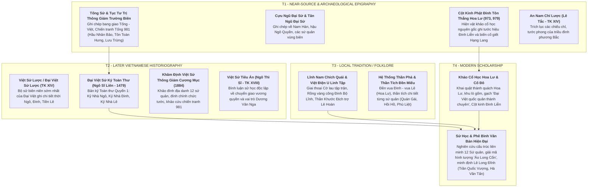

# Khảo Cứu Nguồn Thư Tịch & Thẩm Định Học Thuật: Giai Đoạn 939–1009 SCN

> [!IMPORTANT]
> **Nguyên Tắc Thẩm Định Nguồn (Task `VS-NDPL-00`)**:
> - Tài liệu này cung cấp bức tranh toàn cảnh về thư tịch học, đánh giá độ tin cậy và phân tầng nguồn học thuật cho toàn bộ tiến trình lịch sử Việt Nam từ khi Ngô Quyền xưng Vương (939), qua thời kỳ Loạn 12 Sứ Quân, triều Đinh, triều Tiền Lê đến cuộc chuyển giao quyền lực sang nhà Lý (1009).
> - Bắt buộc phân định rạch ròi giữa **Ghi chép gần thời / Văn bia khảo cổ (T1)**, **Chính sử trung đại Đại Việt (T2)**, **Huyền tích dân gian & Thần phả (T3)** và **Nghiên cứu khảo cổ / Sử học hiện đại (T4)**.
> - Tuyệt đối không biến truyền thuyết dân gian, giai thoại văn học hoặc thiên kiến của sử quan thời sau thành dữ kiện lịch sử đã được xác thực (historical fact).

---

## 1. Hệ Thống Thư Tịch Khảo Cứu Theo 4 Tầng



---

## 2. Phân Tích Chuyên Sâu Các Điểm Tranh Luận Lịch Sử

### 2.1. Cấu Trúc & Danh Sách 12 Sứ Quân (965/966–968 SCN)

* **Niên biểu bùng nổ (965 vs 966 SCN)**:
  * **965 SCN (T2 — *Việt Sử Lược*)**: Ngô Xương Văn mất khi đánh thôn Đường, Nguyễn ở Thái Bình; các tướng lĩnh công thần và hào trưởng bắt đầu phân liệt cát cứ.
  * **966 SCN (T2 — *Toàn Thư*)**: *Toàn Thư* mở đầu kỷ "Mười Hai Sứ Quân" tính từ năm Bính Dần (966) đến năm 968 khi Đinh Bộ Lĩnh hoàn thành thống nhất.
* **Danh sách chuẩn tắc theo *Đại Việt Sử Ký Toàn Thư* (Canonical Toàn Thư List — T2)**:
  1. **Ngô Xương Xí** — xưng Ngô Sứ Quân, giữ Bình Kiều (Triệu Sơn, Thanh Hóa).
  2. **Kiều Công Hãn** — xưng Kiều Tam Chế, giữ Phong Châu (Bạch Hạc, Phú Thọ).
  3. **Nguyễn Khoan** — xưng Nguyễn Thái Bình, giữ Tam Đái (Vĩnh Tường, Vĩnh Phúc).
  4. **Ngô Nhật Khánh** — xưng Ngô Lãm Công, giữ Đường Lâm (Ba Vì, Hà Nội).
  5. **Đỗ Cảnh Thạc** — xưng Đỗ Cảnh Công, giữ Đỗ Động Giang (Quốc Oai / Thanh Oai, Hà Nội).
  6. **Lý Khuê** — xưng Lý Lãng Công, giữ Siêu Loại (Thuận Thành, Bắc Ninh).
  7. **Nguyễn Thủ Tiệp** — xưng Nguyễn Lệnh Công (Vũ Ninh Vương), giữ Tiên Du (Bắc Ninh).
  8. **Lã Đường** — xưng Lã Tá Công, giữ Tế Giang (Văn Giang, Hưng Yên).
  9. **Nguyễn Siêu** — xưng Nguyễn Hữu Công, giữ Tây Phù Liệt (Thanh Trì, Hà Nội).
  10. **Kiều Thuận** — xưng Kiều Lệnh Công, giữ Hồi Hồ (Cẩm Khê, Phú Thọ).
  11. **Phạm Bạch Hổ** — xưng Phạm Phòng Át, giữ Đằng Châu (Kim Động, Hưng Yên).
  12. **Trần Lãm** — xưng Trần Minh Công, giữ Bố Hải Khẩu (Kỳ Bố, Thái Bình).

> [!CAUTION]
> **Đính chính quan trọng về số hiệu #12**:
> - Danh sách chuẩn tắc 12 Sứ quân của *Toàn Thư* (T2) **bắt buộc bao gồm Trần Lãm (Trần Minh Công)**.
> - **TUYỆT ĐỐI KHÔNG ĐƯA Lý Xử Bình (hoặc Lã Xử Bình) vào danh sách chuẩn 12 Sứ quân**. Lý Xử Bình / Lã Xử Bình là tướng lĩnh tham gia tranh chấp tại triều đình Cổ Loa năm 965 sau khi Ngô Xương Văn mất, không phải một trong 12 sứ quân cát cứ độc lập được *Toàn Thư* định danh.

* **Bảng đối chiếu biến thể văn bản giữa các nguồn sử liệu (Textual Variants Table)**:

| STT | *Đại Việt Sử Ký Toàn Thư* (T2 Canonical) | *Việt Sử Lược* / *Đại Việt Sử Lược* (T2 Variant) | Địa Bàn Khảo Đính |
|:---:|---|---|---|
| 1 | **Ngô Xương Xí** (Ngô Sứ Quân) | Ngô Xương Xí | Bình Kiều (Triệu Sơn, Thanh Hóa) |
| 2 | **Kiều Công Hãn** (Kiều Tam Chế) | **Kiều Tri Hựu** (Kiều Tướng Công) | Phong Châu (Bạch Hạc, Phú Thọ) |
| 3 | **Nguyễn Khoan** (Nguyễn Thái Bình) | Nguyễn Khoan | Tam Đái (Vĩnh Tường, Vĩnh Phúc) |
| 4 | **Ngô Nhật Khánh** (Ngô Lãm Công) | Ngô Nhật Khánh | Đường Lâm (Ba Vì, Hà Nội) |
| 5 | **Đỗ Cảnh Thạc** (Đỗ Cảnh Công) | Đỗ Cảnh Thạc | Đỗ Động Giang (Quốc Oai, Hà Nội) |
| 6 | **Lý Khuê** (Lý Lãng Công) | Lý Khuê | Siêu Loại (Thuận Thành, Bắc Ninh) |
| 7 | **Nguyễn Thủ Tiệp** (Nguyễn Lệnh Công) | Nguyễn Thủ Tiệp | Tiên Du (Bắc Ninh) |
| 8 | **Lã Đường** (Lã Tá Công) | Lã Đường | Tế Giang (Văn Giang, Hưng Yên) |
| 9 | **Nguyễn Siêu** (Nguyễn Hữu Công) | Nguyễn Siêu | Tây Phù Liệt (Thanh Trì, Hà Nội) |
| 10 | **Kiều Thuận** (Kiều Lệnh Công) | Kiều Thuận | Hồi Hồ (Cẩm Khê, Phú Thọ) |
| 11 | **Phạm Bạch Hổ** (Phạm Phòng Át) | Phạm Phòng Át | Đằng Châu (Kim Động, Hưng Yên) |
| 12 | **Trần Lãm** (Trần Minh Công) | Trần Lãm (Trần Minh Công) | Bố Hải Khẩu (Kỳ Bố, Thái Bình) |
| *Phụ* | *Lã Xử Bình (tướng tranh chấp Cổ Loa năm 965)* | *Lã Xử Bình (cùng thứ sử các châu nổi loạn)* | Cổ Loa (Đông Anh, Hà Nội) |

* **Đánh giá chiến dịch dẹp loạn của Đinh Bộ Lĩnh**:
  * **Sử liệu T2 (*Toàn Thư*) chỉ ghi nhận khái quát**: Đinh Bộ Lĩnh cùng con trai Đinh Liễn khởi binh từ Hoa Lư, liên hiệp Trần Lãm ở Bố Hải Khẩu, dùng tài thao lược đánh dẹp và thu phục các sứ quân. *Toàn Thư* **không chép chi tiết tường tận từng trận phục kích cá nhân**.
  * **Các diễn biến trận đánh chi tiết từng nơi** (như chuyện Đỗ Cảnh Thạc bị bắn trúng tai ở Quán Gái rồi qua đời; Nguyễn Siêu đắm thuyền ở Phù Liệt; Kiều Công Hãn chạy lên Thao Giang bị đâm chết...): Đây là **ngọc phả, thần phả làng xã và dã sử địa phương (T3)** hoặc **phục dựng sử học hiện đại (T4)**, cần ghi nhãn phân tầng chính xác, không được đồng nhất với văn bản chính sử T1/T2.

---

### 2.2. Huyền Tích "Cờ Lau Tập Trận" & Biểu Tượng Vương Quyền (T3 Legend in T2 Historiography)

* **Hiện trạng sử liệu**:
  * **T2 — *Toàn Thư***: Ghi lại chuyện Đinh Bộ Lĩnh thuở nhỏ chăn trâu ở động Hoa Lư, cùng lũ trẻ trong làng bẻ hoa lau làm cờ rước đi, lũ trẻ khoanh tay làm kiệu cho ông ngồi. Lớn lên, người trong làng theo phục, tôn làm thủ lĩnh.
  * **T3 — *Lĩnh Nam Chích Quái* & Dân gian**: Huyền thoại hóa Đinh Bộ Lĩnh là con rái cá / thần nhân, bị chú đuổi chém chạy qua sông Hoàng Long có rồng vàng nổi lên cõng qua sông; mẹ nhìn thấy mộ cha có điềm rồng bèn táng hài cốt vào hàm rồng.
* **Đánh giá học thuật (T4)**:
  * **Phân tầng nghiêm ngặt**: Chuyện "cờ lau tập trận" và "rồng vàng cõng qua sông" là **mô-típ huyền thoại dân gian (Legendary motif) được chính sử trung đại bảo lưu (T3 preserved in T2)** nhằm thiêng hóa thiên mệnh của vị vua khai quốc, **KHÔNG PHẢI sự kiện lịch sử xác thực (T1 fact)**.
  * **Sự thật lịch sử (T1/T2 Fact)**: Đinh Bộ Lĩnh là con trai của Đinh Công Trứ (Thứ sử Hoan Châu thời Dương Đình Nghệ và Ngô Quyền). Ông có xuất thân quý tộc hào trưởng danh giá, kế thừa uy tín chính trị và căn cứ địa hiểm trở tại Động Hoa Lư, có tài thao lược quân sự và tầm nhìn chiến lược vượt trội.

---

### 2.3. Cột Kinh Phật Đỉnh Tôn Thắng (973, 979) — Chứng Tích Khảo Cổ Học T1 Vô Giá

* **Hiện vật khảo cổ học (T1/T4 Fact)**:
  * Khai quật tại Hoa Lư (Ninh Bình) phát hiện hơn 20 cột kinh Phật bằng đá bát giác khắc bài chú *Phật Đỉnh Tôn Thắng Đà La Ni*.
  * Minh văn trên cột kinh ghi rõ niên đại: năm Quý Dậu (973) và năm Kỷ Mão (979), do **Nam Việt Vương Đinh Liễn** (con trưởng Đinh Tiên Hoàng) tạo lập.
* **Giá trị lịch sử đặc biệt**:
  * Xác nhận tước hiệu chính thức của Đinh Liễn: *"Đại Cồ Việt quốc Đô hộ Phủ quân sủng phụng ban Tĩnh Hải quân Tiết độ sứ phụ quốc Đại tướng quân Nam Việt Vương Đinh Khuông Liễn"*.
  * Minh văn năm 979 xác thực trực tiếp bi kịch hoàng gia: Đinh Liễn cho dựng kinh sám hối sau khi đã giết hại em trai là **Hạng Lang** (Đại Việt Quốc thái tử) vì tranh đoạt quyền thừa kế ngai vàng.
  * Đây là bằng chứng văn tự khảo cổ đương thời (T1 epigraphy) hiếm hoi xác thực chính xác biên niên sử và các mối quan hệ quyền lực triều Đinh.

---

### 2.4. Thái Hậu Dương Vân Nga & Sự Kiện Trao Áo Long Cổn (980 SCN)

* **Hiện trạng sử liệu**:
  * **T2 — *Toàn Thư* (Kỷ Nhà Lê)**: Ghi lại sự kiện mùa thu năm Canh Thìn (980), khi quân Tống chuẩn bị tràn sang xâm lược, triều đình Hoa Lư rơi vào khủng hoảng (Vua Đinh Toàn mới 6 tuổi). Phạm Cự Lạng cùng các tướng sĩ vào cung đề nghị suy tôn Thập đạo tướng quân Lê Hoàn làm Thiên tử để thống lĩnh ba quân đánh giặc.
  * Thái hậu Dương thị thấy lòng người quy phục, bèn sai **lấy áo Long Cổn (áo long bào của Hoàng đế) khoác lên người Lê Hoàn**, chính thức trao vương quyền cho Lê Hoàn.
* **Phân định giữa Sử liệu gốc và Đánh giá thời sau**:
  * **Sự kiện lịch sử (T2 Record)**: Ghi nhận sự kiện chuyển giao quyền lực thực tế tại triều đình Hoa Lư năm 980 để đối phó hiểm họa ngoại xâm.
  * **Lời bình phẩm đạo đức Nho giáo thời sau (T2 Historiographical Evaluation)**: Ngô Sĩ Liên trong *Toàn Thư* (thế kỷ XV) đã chỉ trích gay gắt Dương Vân Nga dưới góc nhìn lễ giáo phong kiến ("thất tiết", "lấy hai đời vua").
  * **Sử học hiện đại (T4 Modern Analysis)**: Đánh giá hành động của Dương Vân Nga và triều thần Hoa Lư là một **quyết định chính trị thực tế, dũng cảm và sáng suốt bậc nhất**. Trong bối cảnh đại quân Tống cận kề biên ải, việc đưa viên đại tướng tài ba nhất lên nắm quyền tối cao đã cứu Đại Cồ Việt thoát khỏi nguy cơ mất nước sau chưa đầy 40 năm độc lập.

---

### 2.5. Diễn Biến Chiến Tranh Kháng Tống Năm 981: Phân Tích & Đối Chiếu Độc Lập Giữa Các Nguồn

```mermaid
flowchart TD
    subgraph CHIẾN DỊCH KHÁNG TỐNG 981 - TÁCH BẠCH CÁC CÁNH QUÂN & MẶT TRẬN
        subgraph CÁNH THỦY QUÂN TỐNG (BẠCH ĐẰNG)
            WQ1["Thủy quân Tống do Lưu Trừng, Cổ Lượng, Giả Thực chỉ huy"] --> WQ2["Tiến vào cửa sông Bạch Đằng (Đầu năm 981)"]
            WQ2 --> WQ3["Giao chiến với thủy quân Đại Cồ Việt & bị cầm chân"]
            WQ3 --> WQ4["Nghe tin đạo quân bộ Hầu Nhân Bảo bị diệt bèn rút chạy"]
        end

        subgraph CÁNH BỘ BINH TỐNG (HẦU NHÂN BẢO)
            LQ1["Bộ binh Tống do Hầu Nhân Bảo, Tôn Toàn Hưng, Trần Khâm Tộ chỉ huy"] --> LQ2["Tiến từ Lạng Sơn vào nội địa (hướng Chi Lăng / sông Lục Đầu / Bình Lỗ)"]
            LQ2 --> LQ3["Hầu Nhân Bảo tiến trước, bị cô lập và rơi vào trận địa trá hàng phục kích"]
            LQ3 --> LQ4["Hầu Nhân Bảo bị chém chết (Tháng 4/981)"]
        end

        subgraph TRUY KÍCH TÀN QUÂN & KẾT CỤC
            LQ4 --> TR1["Lê Hoàn dốc quân truy kích tàn quân Trần Khâm Tộ, Tôn Toàn Hưng"]
            TR1 --> TR2["Trận đánh tàn quân tại Tây Kết [T2 Toàn Thư]"]
            TR2 --> TR3["Bắt sống Quách Quân Biện, Triệu Phụng Huân; tàn quân Tống tháo chạy về nước"]
        end
    end
```

* **Tách bạch 4 bình diện chiến sự năm 981**:

  1. **Mặt trận thủy quân Bạch Đằng & Vấn đề đóng cọc ngăn sông**:
     - *Thủy quân Tống*: Do Thứ sử Ngang Châu **Lưu Trừng**, Giả Đam, Cổ Lượng chỉ huy theo đường biển tiến vào cửa sông Bạch Đằng đầu năm 981.
     - *Ghi chép của Toàn Thư (T2)*: *Toàn Thư* ghi nhận Lưu Trừng đến sông Bạch Đằng; Lê Hoàn sai quân sĩ **đóng cọc ngăn sông Chi Lăng** (*"sai quân sĩ cắm cọc ngăn sông Chi Lăng"*).
     - > [!WARNING]
       > **Về giả thuyết "bãi cọc Bạch Đằng năm 981"**: Văn bản *Toàn Thư* (T2) ghi rõ cắm cọc ở **sông Chi Lăng**. Việc một số sách phổ thông hiện đại miêu tả Lê Hoàn đóng cọc ở sông Bạch Đằng là **`[T4 MODERN RECONSTRUCTION / DISPUTED]`** (suy diễn liên hệ từ trận Bạch Đằng 938 của Ngô Quyền và 1288 của Trần Hưng Đạo), **không phải dữ kiện T1/T2 fact**.

  2. **Mặt trận bộ binh của Hầu Nhân Bảo (Land Army of Hou Renbao)**:
     - Do Lĩnh Nam đông lộ chuyển vận sứ **Hầu Nhân Bảo**, Tôn Toàn Hưng, Thôi Lượng, Trần Khâm Tộ chỉ huy tiến theo đường bộ Lạng Sơn.
     - Hầu Nhân Bảo chủ chiến, thúc quân tiến sâu vào trước, không phối hợp nhịp nhàng với cánh Tôn Toàn Hưng và thủy quân Lưu Trừng, ngày càng cạn kiệt lương thảo.

  3. **Cái chết của Hầu Nhân Bảo & Khác biệt giữa các nguồn**:
     - **T1 Song sources (*Tống Sử*, *Tục Tư Trị Thông Giám Trường Biên*)**: Quân Tống ban đầu báo tin thắng ở cửa Bạch Đằng; sau đó Hầu Nhân Bảo dẫn quân tiến trước, bị đối phương dùng kế trá hàng dụ và bị giết vào tháng 4 năm 981. *Tống Sử* không khẳng định Hầu Nhân Bảo chết tại cửa sông Bạch Đằng; trận thủy chiến Bạch Đằng và cái chết của Hầu Nhân Bảo là các sự kiện riêng biệt.
     - **T2 *Toàn Thư***: Ghi lại chi tiết Lê Hoàn dùng kế trá hàng, dâng thư giả hàng dụ Hầu Nhân Bảo mất cảnh giác, sau đó dốc quân đánh úp chém chết Hầu Nhân Bảo. Văn bản T2 **không khóa cố định địa điểm cái chết thành cửa sông Bạch Đằng**.

  4. **Trận đánh tàn quân tại Tây Kết & Địa danh liên quan**:
     - **Tây Kết**: Chi tiết truy kích tàn quân Trần Khâm Tộ tại Tây Kết và bắt sống các tướng Quách Quân Biện, Triệu Phụng Huân xuất xứ từ **Chính sử Việt Nam (T2 — *Toàn Thư*, *Cương Mục*)** `[SOURCE CHECK / T2]`. Không tự ý nâng cấp thành đồng thuận T1 nếu thiếu trích dẫn nguyên bản từ thư tịch Tống.
     - **Chi Lăng**: *Toàn Thư* (T2) ghi nhận địa danh sông Chi Lăng trong bố phòng cắm cọc ngăn giặc của Lê Hoàn.

---

### 2.6. Nhân Vật Lê Long Đĩnh: Khảo Cứu Thực Chứng (T1/T4) vs Ghi Chép Trung Đại (T2)

* **Hiện trạng sử liệu T2 — *Toàn Thư* & *Cương Mục***:
  * Chép Lê Long Đĩnh (Khai Minh Vương) giết anh đoạt ngôi (1005), tính tình bạo ngược, tàn độc, ham mê tửu sắc quá độ đến mức phát bệnh trĩ nặng không ngồi được, phải **nằm mà thiết triều**, nên gọi là **Lê Ngọa Triều**.
  * Chép nhiều câu chuyện hành hình rùng rợn (róc mía trên đầu nhà sư, ném người vào chuồng cọp...).
* **Phân định học thuật & Đánh giá thực chứng (T1/T4)**:
  * **Bối cảnh chính trị của văn bản T2**: *Toàn Thư* được biên soạn dựa trên các tư liệu kế thừa từ thời Lý và Trần — các triều đại kế tiếp có nhu cầu khẳng định tính chính danh của cuộc chuyển giao vương quyền năm 1009. Mô-típ "vị vua cuối cùng bạo ngược mất nước" là một quy ước biên soạn quen thuộc của sử học Nho giáo Đông Á.
  * **Hành trạng thực tế được chính T1 (*Tống Sử*) và T2 xác thực**:
    1. **Quân sự**: Lê Long Đĩnh là một thủ lĩnh quân sự xông xáo, liên tục thân chinh cầm quân đánh dẹp các cuộc nổi dậy ở các vùng biên ải hiểm trở (châu Cử Long, châu Án Nột, sông Đà, Đô Lương...).
    2. **Kinh tế & Thương mại**: Năm 1007, ông chủ động cử sứ giả sang nhà Tống xin mở chợ trao đổi hàng hóa tại châu Ung (Quảng Tây), thúc đẩy mậu dịch biên mậu quốc gia.
    3. **Văn hóa & Tôn giáo**: Năm 1008, ông cử em trai là Lê Minh Đề sang sứ Tống xin bộ **Cửu Kinh** và **Đại Tạng Kinh** đồ sộ về cho Đại Cồ Việt, tạo tiền đề văn hóa và Phật giáo rực rỡ cho thời Lý kế nghiệp.
    4. **Trọng dụng nhân tài**: Ông tin cậy giao phó trọng trách cấm quân (Thân vệ Điện tiền Chỉ huy sứ) cho Lý Công Uẩn — người sau này kế vị ngai vàng lập ra triều Lý.

---

## 3. Bảng Tổng Hợp Phân Tầng Nguồn Giai Đoạn 939–1009 SCN

| Sự Kiện / Nhân Vật | Nguồn Thư Tịch Chính | Tầng Nguồn | Đánh Giá Độ Tin Cậy Học Thuật |
|---|---|:---:|---|
| Ngô Quyền xưng Vương, định đô Cổ Loa (939) | *Tân Ngũ Đại Sử*, *Toàn Thư* | **T1/T2** | **Fact lịch sử** mở đầu kỷ nguyên độc lập. |
| Dương Tam Kha cướp ngôi, xưng Bình Vương (944) | *Toàn Thư*, *Cương Mục* | **T2** | **Fact lịch sử** về biến động hậu Ngô Quyền. |
| Ngô Xương Ngập & Xương Văn (Nam Tấn & Thiên Sách) | *Toàn Thư*, *Việt Sử Lược* | **T2** | **Fact lịch sử** về chế độ nhị vương cùng trị vì (950–965). |
| Loạn 12 Sứ Quân phân chia cát cứ (965/966–968) | *Việt Sử Lược*, *Toàn Thư*, *Cương Mục* | **T2** | **Fact lịch sử**; danh sách 12 sứ quân chuẩn tắc của *Toàn Thư* (bao gồm Trần Lãm, không có Lý Xử Bình). |
| Truyền thuyết Cờ lau tập trận & Rồng vàng cõng vua | *Lĩnh Nam Chích Quái*, *Toàn Thư* | **T3/T2** | **Legendary motif** được ghi lại trong T2; không phải T1 fact. |
| Đinh Bộ Lĩnh thống nhất, lập nước Đại Cồ Việt (968) | *Tống Sử*, *Toàn Thư*, *Việt Sử Lược* | **T1/T2** | **Fact lịch sử vĩ đại**; định đô Hoa Lư, đặt niên hiệu Thái Bình. |
| Cột kinh Phật Đỉnh Tôn Thắng (973, 979) | Hiện vật khảo cổ Cột kinh Hoa Lư | **T1/T4** | **Hiện vật nguyên gốc T1**; chứng thực tước vị Đinh Liễn và bi kịch giết Hạng Lang. |
| Đỗ Thích ám sát Đinh Tiên Hoàng & Đinh Liễn (979) | *Tống Sử*, *Toàn Thư*, *Việt Sử Lược* | **T1/T2** | **Fact lịch sử** về biến cố cung đình Hoa Lư. |
| Thái hậu Dương Vân Nga trao Áo Long Cổn cho Lê Hoàn (980) | *Toàn Thư*, *Việt Sử Tiêu Án* | **T2/T4** | **Fact lịch sử về chuyển giao quyền lực**; tách bạch khỏi lời bình phẩm đạo đức Nho giáo thời sau. |
| Kháng chiến chống Tống đại thắng năm 981 | *Tống Sử*, *Tục Tư Trị Thông Giám Trường Biên*, *Toàn Thư* | **T1/T2** | **Fact lịch sử vững chắc**; tách bạch thủy quân Bạch Đằng, cắm cọc sông Chi Lăng (T2), Hầu Nhân Bảo bị trá hàng giết chết, trận Tây Kết `[SOURCE CHECK / T2]`. |
| Lê Hoàn thân chinh phạt Champa (982) | *Tống Sử*, *Toàn Thư* | **T1/T2** | **Fact lịch sử**; chém Bê Mê Thuế, san phẳng kinh đô Indrapura. |
| Lễ Tịch Điền & Đào kênh Nhà Lê | *Toàn Thư*, *Cương Mục*, Di tích khảo cổ | **T2/T4** | **Fact lịch sử & Khảo cổ học**; chính sách khuyến nông và giao thông thủy lợi. |
| Lê Long Đĩnh (1005–1009) | *Tống Sử*, *Toàn Thư*, Phê bình sử học hiện đại | **T1/T2/T4** | Tách bạch ghi chép T2 (bệnh tật, bạo ngược) với ghi chép thực chứng T1/T4 (quân sự, mậu dịch, rước Đại Tạng Kinh). |
| Chuyển giao vương quyền sang Lý Công Uẩn (1009) | *Tống Sử*, *Toàn Thư*, *Việt Sử Lược* | **T1/T2** | **Fact lịch sử hòa bình**; sự đồng thuận của triều đình và tăng lữ Phật giáo. |
