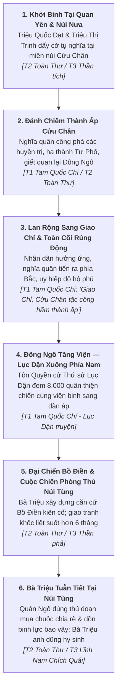

# Bối Cảnh Lịch Sử & Niên Biểu: Khởi Nghĩa Bà Triệu (248 SCN)

**Tài liệu**: `docs/drafts/viet-su/ba-trieu-248/historical-context-and-timeline.md`
**Chương Lịch Sử**: `ARC-BT-01: Bà Triệu — Khởi Nghĩa Núi Nưa` (Working Title)
**Giai đoạn Lịch sử**: Năm 248 SCN (Thế kỷ III SCN — Thời kỳ Đông Ngô)
**Trạng thái**: Production Narrative Spine & Chronology Foundation

---

## 1. Bối Cảnh Lịch Sử Thế Kỷ III SCN (Historical Background)

### 1.1. Ách Thống Trị Khắc Nghiệt Của Nhà Đông Ngô (Thời Tam Quốc)
* Sau khi Sĩ Nhiếp qua đời năm 226 SCN, triều đình Đông Ngô (Ngô chủ Tôn Quyền) quyết định bãi bỏ quyền tự trị của họ Sĩ, chia đất Giao Châu thành hai châu: Quảng Châu (đất Lưỡng Quảng) và Giao Châu (miền Bắc và Bắc Trung Bộ Việt Nam ngày nay).
* Tướng Ngô là Lữ Đại đàn áp dã man cuộc nổi dậy của con Sĩ Nhiếp là Sĩ Huy, tàn sát hàng vạn dân chúng và quan lại địa phương, chính thức áp đặt chế độ cai trị trực trị hà khắc.
* Các quan lại Đông Ngô liên tục bóc lột tô thuế nặng nề, bắt người Lạc Việt đi lặn ngọc trai, tìm ngà voi, sừng tê giác, đồi mồi, hương liệu và quặng kim loại để cống nạp về kinh đô Kiến Nghiệp (Nam Kinh ngày nay), đẩy mâu thuẫn dân tộc và xã hội lên đỉnh điểm.

### 1.2. Vùng Đất Cửu Chân — Cái Nôi Bùng Nổ Khởi Nghĩa
* Quận Cửu Chân (vùng đất Thanh Hóa ngày nay) có truyền thống văn hóa Đông Sơn lâu đời, địa hình hiểm trở với sự kết hợp giữa rừng núi đá vôi, đồi gò và hệ thống sông ngòi (sông Mã, sông Chu).
* Tầng lớp hào trưởng Lạc Việt bản địa tại Cửu Chân vẫn giữ được uy tín và lực lượng tự vệ nhất định, là chỗ dựa vững chắc cho các phong trào kháng cự chống ngoại bang.

---

## 2. Diễn Biến Cuộc Khởi Nghĩa Năm 248 SCN (The Year 248 CE)

---

## 3. Khảo Cứu Các Mắt Xích Lịch Sử Trọng Tâm

### 3.1. Danh Tính & Hình Tượng Bà Triệu
* **Nguồn T1 (*Tam Quốc Chí*, *Giao Châu ký*)**: Sử liệu phương Bắc thời Tấn - Lục Triều chép tên bà là "Triệu Ẩu" (chữ "Ẩu" 嫗 nghĩa là người phụ nữ/người đàn bà họ Triệu, thể hiện thái độ miệt thị của sử gia phong kiến phương Bắc).
* **Nguồn T2 (*Toàn Thư*, *Cương Mục*)**: *Toàn Thư* bảo lưu chép "Triệu Ẩu"; đến đời Nguyễn, *Khâm Định Việt Sử Thông Giám Cương Mục* khảo đính ghi rõ: *"Bà Triệu tên thật là Triệu Thị Trinh, người huyện Quan Yên, quận Cửu Chân"*. Dân gian tôn xưng là *Triệu Trinh Nương*, *Bà Triệu*, *Lệ Hải Bà Vương*.
* **Hình tượng cưỡi voi đánh trận**: Nguồn T1 (*Giao Châu ký* trích dẫn) và T2 (*Toàn Thư*) đều xác nhận bà Triệu có thể hình dũng mãnh, cưỡi voi trực tiếp chỉ huy tác chiến, khiến quân Ngô kinh hồn bạt vía.

### 3.2. Vai Trò Của Triệu Quốc Đạt (Anh Trai Bà Triệu)
* Triệu Quốc Đạt là hào trưởng có thế lực lớn tại huyện Quan Yên (vùng Yên Định, Thanh Hóa ngày nay). Ban đầu ông cùng em gái chiêu mộ nghĩa binh dấy cờ khởi nghĩa.
* Trong giai đoạn đầu chiến dịch, Triệu Quốc Đạt không may ốm mất (hoặc tử trận theo dã sử T3); nghĩa binh đồng lòng tôn phục Bà Triệu lên làm chủ soái lĩnh đạo toàn quân.

### 3.3. Tướng Ngô Lục Dận (Lu Yin) & Biện Pháp Đàn Áp Của Đông Ngô
* **Thân thế Lục Dận**: Cháu của danh tướng Lục Tốn (Thừa tướng Đông Ngô), được Tôn Quyền phong làm Giao Châu thứ sử kiêm An Nam hiệu úy, mang theo khoảng 8.000 quân tinh nhuệ sang tiếp viện.
* **Chiến thuật của Lục Dận**: Kết hợp giữa **Áp lực quân sự quy mô lớn** với **Chính sách mua chuộc ngoại giao (Ân tín chiêu dụ)**: gửi thư dụ hàng, dùng vàng bạc gấm vóc mua chuộc các tộc trưởng, hào trưởng nhẹ dạ để cô lập căn cứ của Bà Triệu.

### 3.4. Câu Nói Khí Phách Bất Hủ
> `[SOURCE-BACKED: Toàn Thư / Lĩnh Nam Chích Quái (T2/T3)]`
> *"Tôi muốn cưỡi cơn gió mạnh, đạp luồng sóng dữ, chém cá kình ở biển Đông, quét sạch bờ cõi, để cứu dân ra khỏi nơi đắm đuối, chứ không thèm bắt chước người đời cúi đầu luồn cúi làm tì thiếp người ta!"*
* Đây là biểu tượng bất hủ cho ý chí tự tôn độc lập và tinh thần quật khởi của phụ nữ Việt Nam thế kỷ III SCN.

---

## 4. Bảng Niên Biểu Biên Niên Khởi Nghĩa (Chronological Table)

| Mốc Thời Gian | Sự Kiện Lịch Sử | Địa Bàn Địa Lý | Phân Tầng Nguồn | Đánh Giá Độ Tin Cậy & Bản Chất Kịch Bản |
|---|---|---|:---:|---|
| **Đầu năm 248** | Triệu Quốc Đạt & Triệu Thị Trinh tập hợp nghĩa binh tại căn cứ Núi Nưa. | Quan Yên / Núi Nưa (Thanh Hóa) | **T2 / T3** | **CONFIRMED (Khởi nghĩa dấy lên tại Cửu Chân)**; chi tiết tế cờ luyện binh mang tính dã sử T3. |
| **Giữa năm 248** | Nghĩa quân tiến đánh hạ thành Tư Phố, tiêu diệt quân trú phòng Đông Ngô tại Cửu Chân. | Huyện Tư Phố (Thiệu Hóa, Thanh Hóa) | **T1 / T2** | **CONFIRMED**: *Tam Quốc Chí* ghi nhận quân khởi nghĩa công hãm thành ấp, chấn động giao giới. |
| **Hè năm 248** | Khởi nghĩa lan rộng ra Giao Chỉ (Đồng bằng sông Hồng), uy hiếp bộ máy đô hộ. | Cửu Chân $\rightarrow$ Giao Chỉ | **T1** | **CONFIRMED (T1 Tam Quốc Chí)**: Toàn bộ Giao Châu tao loạn, Tôn Quyền lo ngại phải cử tướng viện binh. |
| **Thu năm 248** | Lục Dận đem 8.000 quân Đông Ngô sang Giao Châu, vừa đánh vừa chiêu dụ mua chuộc. | Giao Châu / Cửu Chân | **T1** | **CONFIRMED (T1 Tam Quốc Chí - Lục Dận truyện)**: Lục Dận đem quân đàn áp kết hợp phân hóa. |
| **Cuối năm 248** | Đại chiến phòng thủ căn cứ Bồ Điền; Bà Triệu kiên cường chống giặc suốt nhiều tháng. | Bồ Điền / Phú Điền (Hậu Lộc) | **T2 / T3** | **CONFIRMED (Đại cục kháng cự)**; các trận địa công thủ cụ thể là phục dựng kịch bản (`COMPOSITE RECONSTRUCTION`). |
| **Cuối năm 248 (Mậu Thìn)** | Bị bao vây cô lập, Bà Triệu tuẫn tiết anh dũng tại Núi Tùng; cuộc khởi nghĩa khép lại. | Núi Tùng (Hậu Lộc, Thanh Hóa) | **T2 / T3** | **CONFIRMED (Cuộc khởi nghĩa bị dẹp yên cuối năm 248)**; chi tiết tuẫn tiết tại núi Tùng thuộc T2/T3. |
