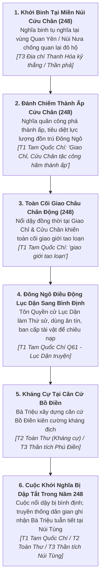

# Bối Cảnh Lịch Sử & Niên Biểu: Khởi Nghĩa Bà Triệu (248 SCN)

**Tài liệu**: `docs/drafts/viet-su/ba-trieu-248/historical-context-and-timeline.md`
**Chương Lịch Sử**: `ARC-BT-01: Bà Triệu — Khởi Nghĩa Núi Nưa` (Working Title)
**Giai đoạn Lịch sử**: Năm 248 SCN (Thế kỷ III SCN — Thời kỳ Đông Ngô)
**Trạng thái**: Production Narrative Spine & Chronology Foundation (Final Source Lock)

---

## 1. Bối Cảnh Lịch Sử Thế Kỷ III SCN (Historical Background)

### 1.1. Ách Thống Trị Khắc Nghiệt Của Nhà Đông Ngô (Thời Tam Quốc)
* Sau khi Thái thú Giao Chỉ Sĩ Nhiếp qua đời năm 226 SCN, triều đình Đông Ngô (Tôn Quyền) quyết định xóa bỏ tình trạng tự trị của dòng họ Sĩ, chia Giao Châu thành Quảng Châu và Giao Châu, cử Lữ Đại làm Giao Châu thứ sử.
* Khi con Sĩ Nhiếp là Sĩ Huy dấy binh chống cự rồi đầu hàng, Lữ Đại đã cho xử tử anh em Sĩ Huy (*Tam Quốc Chí* Q49). Trong các chiến dịch bình định tiếp theo tiến sâu vào Cửu Chân, quân Đông Ngô đã giao tranh khốc liệt, chém và bắt giữ hơn một vạn người (*"trảm hoạch vạn dư nhân"*), chính thức xác lập ách đô hộ trực trị hà khắc.
* Các quan lại Đông Ngô tiếp tục bóc lột tô thuế nặng nề, cưỡng bức thu gom sản vật quý hiếm (ngọc trai, ngà voi, sừng tê giác, đồi mồi, hương liệu) cống nạp về kinh đô Kiến Nghiệp, đẩy mâu thuẫn giữa nhân dân bản địa Lạc Việt – Cửu Chân với chính quyền đô hộ lên cao độ.

### 1.2. Vùng Đất Cửu Chân — Địa Bàn Khởi Phát Phong Trào
* Quận Cửu Chân (vùng đất Thanh Hóa ngày nay) là trung tâm văn hóa bản địa lâu đời, địa hình kết hợp giữa rừng núi hiểm trở và các thung lũng sông Mã, sông Chu.
* Tầng lớp hào trưởng bản địa tại các huyện (như Quan Yên) vẫn duy trì được ảnh hưởng xã hội sâu rộng trong cộng đồng làng xóm, trở thành hạt nhân lãnh đạo phong trào đấu tranh.

---

## 2. Diễn Biến Cuộc Khởi Nghĩa Năm 248 SCN (The Year 248 CE)

---

## 3. Khảo Cứu Các Mắt Xích Lịch Sử Trọng Tâm

### 3.1. Danh Tính Bà Triệu & Nguồn Thư Tịch
* **Nguồn T1 (*Tam Quốc Chí* Q47 & Q61)**: Xác nhận sự kiện phong trào nổi dậy năm 248 (Xích Ô thứ 11) tại Giao Chỉ, Cửu Chân nhưng **không chép đích danh tên thủ lĩnh**.
* **Nguồn Thứ Cấp Gần Thời (Near-Source — *Giao Châu ký*, *Nam Việt chí*)**: Ghi chép về nhân vật nữ thủ lĩnh "Triệu Ẩu" ở Cửu Chân có thể hình phi thường, cưỡi voi đốc chiến.
* **Nguồn Trung Đại T2 (*Toàn Thư*, *Cương Mục*)**: *Toàn Thư* chép danh xưng Triệu Ẩu; *Cương Mục* phần chính văn chép Triệu Ẩu, phần cẩn án/chú thích trích dẫn các tài liệu như *Thanh Hóa kỷ thắng* ghi nhận tên húy là **Triệu Thị Trinh**, người huyện Quan Yên, có anh trai là **Triệu Quốc Đạt**.

### 3.2. Vai Trò Của Triệu Quốc Đạt
* Theo truyền thống dã sử và địa chí địa phương (*Thanh Hóa kỷ thắng*, thần phả Thanh Hóa), Triệu Quốc Đạt là hào trưởng huyện Quan Yên, cùng em gái dấy binh tại Núi Nưa trước khi qua đời/tử trận ở giai đoạn đầu.
* Nhân vật này thuộc tầng **Truyền thống địa chí / Dã sử (T3)**, không xuất hiện trong thư tịch sơ cấp T1.

### 3.3. Tướng Ngô Lục Dận (Lu Yin) & Biện Pháp Bình Định
* **Thân thế Lục Dận**: Tên chữ Kính Tông, là tộc tử (con cháu trong họ / tộc nhân, em họ Lục Khải) của Thừa tướng Lục Tốn.
* **Chức vị**: Tôn Quyền phong Lục Dận làm Giao Châu thứ sử kiêm An Nam hiệu úy; sau khi dẹp yên được phong **An Nam tướng quân**.
* **Biện pháp của Lục Dận**: Theo *Tam Quốc Chí* (Q61), Lục Dận đến Giao Châu tuyên bố chính sách "ân tín", ban cấp tài vật để chiêu nạp các thủ lĩnh bất phục. *(Lưu ý: Chi tiết hơn 8.000 quân trong truyện Lục Dận thuộc về các hoạt động mộ quân/điều động mở rộng sau này trong sự nghiệp của Lục Dận, không phải quy mô đạo quân đàn áp Bà Triệu)*.

### 3.4. Ranh Giới Về Cái Chết Của Bà Triệu & Núi Tùng
* **Chính sử T2 (*Toàn Thư*)**: Chỉ ghi chép vắn tắt việc Lục Dận dẹp yên và Triệu Ẩu tử trận (*"Lục Dận dẹp yên, Triệu Ẩu tử trận"*).
* **Dã sử & Thần tích địa phương (T3)**: Lưu truyền chi tiết Bà Triệu rút về **Núi Tùng (Hậu Lộc)** và **anh dũng tuẫn tiết** để giữ trọn khí phách. Đây là chi tiết thuộc tầng T3, không phải xác thực từ *Toàn Thư*.

### 3.5. Câu Nói Khí Phách Văn Hóa
> `[TRADITIONAL / LATE HISTORIOGRAPHY: Thanh Hóa kỷ thắng / Dã sử]`
> *"Tôi muốn cưỡi cơn gió mạnh, đạp luồng sóng dữ, chém cá kình ở biển Đông, quét sạch bờ cõi, để cứu dân ra khỏi nơi đắm đuối, chứ không thèm bắt chước người đời cúi đầu luồn cúi làm tì thiếp người ta!"*
* Đây là kiệt tác văn học biểu trưng cho khí phách anh hùng bất khuất được lưu truyền trong truyền thống địa phương và các tài liệu dã sử thời muộn, được khuyến nghị sử dụng làm lời thoại văn hóa trong narrative nhưng không gán nhãn văn bản xác thực thế kỷ III.

---

## 4. Bảng Niên Biểu Biên Niên Khởi Nghĩa (Chronological Table)

*Lưu ý: Mọi sự kiện lịch sử cốt lõi diễn ra trọn vẹn trong năm 248 SCN. Việc phân chia giai đoạn (Đầu năm, Giữa năm, Cuối năm) mang tính chất phục dựng nhịp độ kịch bản trò chơi (`PRODUCTION GAMEPLAY RECONSTRUCTION`).*

| Tiến Trình Kịch Bản | Sự Kiện Lịch Sử & Kịch Bản | Địa Bàn Địa Lý | Phân Tầng Nguồn | Đánh Giá Độ Tin Cậy & Ranh Giới Kịch Bản |
|---|---|---|:---:|---|
| **Giai đoạn 1 (Khởi phát 248)** | Phong trào dấy binh chống quan lại Đông Ngô bùng nổ tại miền núi Cửu Chân. | Quan Yên / Núi Nưa (Thanh Hóa) | **T3 (Địa phương)** | **PLAUSIBLE**: Địa danh Núi Nưa và nhân vật Triệu Quốc Đạt thuộc truyền thống địa phương T3. |
| **Giai đoạn 2 (Tiến công 248)** | Quân nổi dậy công hãm các thành ấp, đánh đổ lực lượng đồn trú Đông Ngô tại Cửu Chân. | Huyện ấp Cửu Chân (Tư Phố...) | **T1 / T2** | **CONFIRMED (T1 Tam Quốc Chí)**: Nghĩa quân công hãm thành ấp; việc đánh thành Tư Phố cụ thể là phục dựng kịch bản. |
| **Giai đoạn 3 (Lan rộng 248)** | Nổi dậy đồng thời bùng phát ở Giao Chỉ và Cửu Chân, toàn cõi Giao Châu tao loạn. | Giao Chỉ & Cửu Chân | **T1** | **CONFIRMED (T1 Tam Quốc Chí)**: T1 xác nhận nổi dậy ở cả hai quận; không xác nhận lộ trình tiến quân một chiều Cửu Chân $\rightarrow$ Giao Chỉ. |
| **Giai đoạn 4 (Phản kích 248)** | Lục Dận đến Giao Châu, dùng ân tín chiêu dụ, ban cấp tài vật để phân hóa và dẹp loạn. | Giao Châu / Cửu Chân | **T1 (Tam Quốc Chí Q61)** | **CONFIRMED (T1)**: Lục Dận triển khai chính sách chiêu nạp và điều binh dẹp loạn. |
| **Giai đoạn 5 (Kháng cự 248)** | Nghĩa quân kiên cường chống cự tại căn cứ Bồ Điền trước sức ép quân số và chiến thuật chia rẽ. | Bồ Điền / Phú Điền (Hậu Lộc) | **T2 / T3** | **LOCAL TRADITION / RECONSTRUCTION**: Căn cứ Bồ Điền và các trận đánh cụ thể thuộc truyền thống địa phương. |
| **Giai đoạn 6 (Kết thúc 248)** | Cuộc khởi nghĩa bị dập tắt; Bà Triệu tuẫn tiết tại Núi Tùng. | Núi Tùng (Hậu Lộc, Thanh Hóa) | **T1 (Dẹp yên 248) / T2 / T3** | **CONFIRMED (Dẹp yên trong năm 248)**; địa danh Núi Tùng và hình thức tuẫn tiết thuộc tầng T3. |
