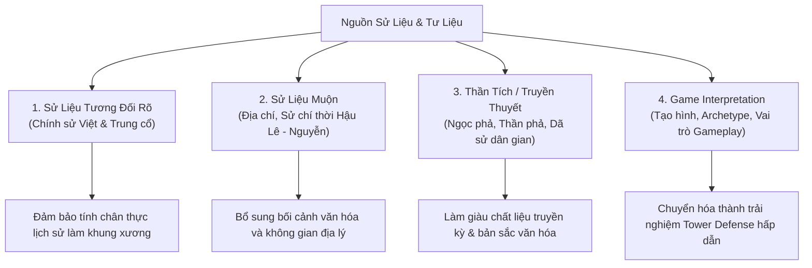

# Nghiên Cứu Lịch Sử & Thiết Kế Bối Cảnh: Thời Kỳ Khởi Nghĩa Bà Triệu (248 SCN)

> **Mã Nhiệm Vụ**: `VS-BT-01`  
> **Chủ Đề**: Bà Triệu Era — Historical Research Pack  
> **Phạm Vi Lưu Trữ**: `docs/drafts/viet-su/ba-trieu/**`  
> **Mục Tiêu**: Cung cấp gói nghiên cứu toàn diện về bối cảnh lịch sử cuộc khởi nghĩa Bà Triệu (năm 248 SCN, quận Cửu Chân, thời Đông Ngô/Tam Quốc); phân loại độ tin cậy của nhân vật; phân tích quân đội Đông Ngô; khảo cứu mỹ thuật/trang phục/vũ khí/địa hình; đề xuất định hướng Hero và Enemy/Boss archetypes phục vụ thiết kế game Huyền Sử TD.

---

## 1. Bối Cảnh Lịch Sử Tổng Quan

### 1.1. Thời Điểm & Địa Bàn Khởi Nghĩa
* **Thời gian**: Năm Mậu Thìn (248 SCN), vào thời kỳ Tam Quốc ở phương Bắc, nước Đông Ngô do Tôn Quyền trị vì.
* **Địa bàn bùng nổ**: Vùng Cửu Chân (nay thuộc tỉnh Thanh Hóa), sau đó lan rộng ra khắp Giao Chỉ và Nhật Nam, làm chấn động toàn bộ chính quyền đô hộ Giao Châu của nhà Đông Ngô.
* **Căn cứ địa chiến lược**:
  * **Núi Nưa (Ngàn Nưa)**: Nằm giữa huyện Triệu Sơn và Như Thanh (Thanh Hóa), là vùng rừng núi hiểm trở nơi Triệu Thị Trinh và anh trai Triệu Quốc Đạt tập hợp nghĩa sĩ, luyện binh, mài kiếm và thuần dưỡng voi chiến.
  * **Bồ Điền (Phú Điền - Hậu Lộc)**: Địa bàn đồng bằng ven sông, tựa lưng vào dãy núi Tùng, nơi nghĩa quân dựng đại bản doanh, đóng cọc lập lũy, khống chế tuyến giao thông thủy bộ huyết mạch.

### 1.2. Ách Đô Hộ Hà Khắc Của Nhà Đông Ngô
* **Chính sách bóc lột**: Nhà Đông Ngô thi hành chính sách vơ vét tài nguyên cùng kiệt (ngọc trai biển Nam Hải, ngà voi, sừng tê, đồi mồi, trầm hương, quế, vàng bạc) để phục vụ chiến tranh Tam Quốc chống Tào Ngụy và Thục Hán.
* **Đày ải nhân dân**: Cưỡng bức thợ thủ công tài hoa, bắt thanh niên sung lính sang Giang Đông làm bia đỡ đạn, bắt phụ nữ làm tì thiếp nô bộc. Quan lại Đông Ngô tại Giao Châu (Thái thú, Thứ sử) nổi tiếng tham tàn và tàn bạo, đẩy mâu thuẫn dân tộc lên đến đỉnh điểm.

### 1.3. Khí Phách Anh Hùng & Tuyên Ngôn Bất Hủ
Câu nói nổi tiếng được lưu truyền qua ngàn đời của Bà Triệu khắc họa ý chí độc lập tự chủ mãnh liệt của người phụ nữ Việt:
> *"Tôi muốn cưỡi cơn gió mạnh, đạp luồng sóng dữ, chém cá kình ở biển Đông, lấy lại giang sơn, dựng nền độc lập, cởi ách nô lệ, chứ không chịu khom lưng làm tì thiếp người ta!"*

---

## 2. Phương Pháp Luận & Phân Loại Độ Tin Cậy Sử Liệu

Dự án **Huyền Sử TD** tuân thủ nguyên tắc tôn trọng lịch sử, tách bạch rõ ràng giữa chính sử, sử liệu muộn, thần tích dân gian và yếu tố sáng tạo nghệ thuật trong game:

1. **Nhóm 1: Sử Liệu Tương Đối Rõ (Definite Historical Sources)**:
   * *Đại Việt Sử Ký Toàn Thư*, *Khâm Định Việt Sử Thông Giám Cương Mục*, *Việt Sử Tiêu Án*.
   * *Tam Quốc Chí* (Trần Thọ - Bùi Tùng Chi chú: Ngô Chí - Lục Dận truyện, Tôn Quyền truyện), *Tống Thư* (Châu Quận chí), *Giao Châu Ký*.
2. **Nhóm 2: Sử Liệu Muộn (Late Imperial Chronicles & Topographies)**:
   * *Đại Nam Nhất Thống Chí* (Tỉnh Thanh Hóa), *Lịch Triều Hiến Chương Loại Chí*, *Việt Điện U Linh Tập*, *Lĩnh Nam Chích Quái*, *Nam Hải Dị Nhân*.
3. **Nhóm 3: Thần Tích / Truyền Thuyết Dân Gian (Folklore & Temple Records)**:
   * Thần phả Đền Bà Triệu (thôn Phú Điền, xã Triệu Lộc, huyện Hậu Lộc, Thanh Hóa).
   * Thần tích đền Am Tiên / Đền Nưa (núi Nưa, Triệu Sơn, Thanh Hóa).
   * Truyền thuyết dân gian xứ Thanh về Bạch Tượng, Ba Vua, Đỗ Thúc, Bùi Thị Trinh.
4. **Nhóm 4: Game Interpretation (Sáng Tạo Nghệ Thuật Game)**:
   * Archetype chiến đấu trong Tower Defense, tạo hình vũ khí trực quan, phân vai trò Hero / Enemy / Boss phù hợp cơ chế hệ thống (không tự ý gán đây là sự thật lịch sử).

---

## 3. Danh Mục Tài Liệu Chi Tiết Trong Gói Nghiên Cứu

| Tài Liệu | Nội Dung Trọng Tâm |
|---|---|
| [historical-context-and-timeline.md](historical-context-and-timeline.md) | Bối cảnh lịch sử chi tiết, diễn biến chiến dịch, căn cứ Ngàn Nưa & Bồ Điền, chiến cuộc đối đầu Lục Dận, ý nghĩa lịch sử. |
| [character-roster-and-sources.md](character-roster-and-sources.md) | Danh sách 10–20 nhân vật liên quan kèm bảng phân loại độ tin cậy lịch sử 4 cấp độ và đánh giá nguồn dẫn chứng. |
| [eastern-wu-forces-and-tactics.md](eastern-wu-forces-and-tactics.md) | Nghiên cứu quân đội Đông Ngô (Lục Dận, trang bị giáp sắt, hoàn thủ đao, kích, nỏ quân dụng, thuyền chiến, mưu kế chia rẽ). |
| [visual-costumes-weapons-and-terrain.md](visual-costumes-weapons-and-terrain.md) | Khảo cứu mỹ thuật: Trang phục áo gấm/áo chàm, giáp hộ tâm phiến Đông Sơn muộn, vũ khí gươm/giáo/nỏ, tượng voi trắng, 4 vùng địa hình chiến trường. |
| [hero-and-enemy-archetypes-proposal.md](hero-and-enemy-archetypes-proposal.md) | Đề xuất 3–5 ứng viên Hero và Enemy/Boss archetypes cho gameplay Tower Defense (không tạo stats/code). |

---

## 4. Nguyên Tắc Giới Hạn Của Task (Constraints Reminder)

* **Không viết code logic gameplay / Core / Stats**: Không gán chỉ số cụ thể (HP/ATK) hay viết hàm skill cho Hero/Enemy.
* **Không sửa `src/**` hoặc `PROJECT_PLAN.md`**: Toàn bộ nội dung gói nghiên cứu chỉ nằm trong `docs/drafts/viet-su/ba-trieu/**`.
* **Không đồng nhất truyền thuyết thành lịch sử chắc chắn**: Mọi chi tiết dã sử/thần phả đều được ghi chú rõ ràng về nguồn gốc.
