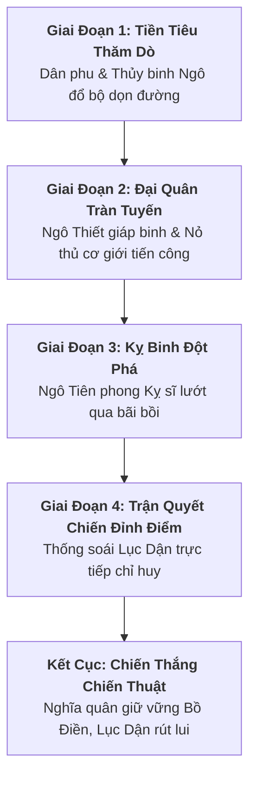

# Định Hướng Thiết Kế Chương Playable: Khởi Nghĩa Bà Triệu (Chapter Direction)

> [!IMPORTANT]
> **Ràng Buộc Phạm Vi Task `VS-BT-02`**:
> - Tài liệu này mang tính chất **Định Hướng Khái Niệm & Cốt Truyện Chương (Chapter Concept & Direction)**, chưa chốt Wave outline cụ thể.
> - **TUYỆT ĐỐI CHƯA**: Chốt chỉ số stats cụ thể, chốt Wave data, tạo Sprite/PNG, nhập data vào `src/**` hoặc sửa `PROJECT_PLAN.md`.
> - **Ràng Buộc Kết Thúc Màn Chơi (Victory Narrative)**: Kết thúc chiến thắng trong game là **chiến thắng chiến thuật của màn chơi** (nghĩa quân đẩy lùi đợt tiến công hiện tại, giữ vững phòng tuyến căn cứ Bồ Điền, Lục Dận bị đánh lui phải tạm thời rút khỏi chiến tuyến); không khẳng định thay đổi kết cục lịch sử chung.

---

## 1. Tổng Quan Chương Playable (Chapter Identity)

* **Tên chương đề xuất**: **Chương: Khúc Tráng Ca Bồ Điền** *(The Song of Bồ Điền / Cửu Chân 248 SCN)*
* **Thời kỳ lịch sử**: Năm 248 SCN (Thời kỳ Tam Quốc — Đông Ngô đô hộ Giao Châu).
* **Địa bàn tác chiến**: Vùng đồng bằng - đầm lầy Bồ Điền tựa lưng vào dãy núi Tùng (nay thuộc xã Triệu Lộc, huyện Hậu Lộc, tỉnh Thanh Hóa).
* **Nguồn tham chiếu & Phân loại sử liệu**:
  * *Nguồn gần thời*: *Tam Quốc Chí* (Ngô Chí - Lục Dận truyện) xác nhận cuộc nổi dậy năm 248 và việc cử Lục Dận sang dẹp loạn.
  * *Sử liệu trung đại & Địa phương*: *Toàn Thư*, *Cương Mục*, *Đại Nam Nhất Thống Chí*, thần phả đền Phú Điền và thần tích núi Tùng.

---

## 2. Bối Cảnh Bản Đồ & Không Gian Tác Chiến (Map Direction)

```text
+---------------------------------------------------------------------------------------------------+
|                     SƠ ĐỒ BỐI CẢNH BẢN ĐỒ: PHÒNG TUYẾN BỒ ĐIỀN - TÙNG SƠN                         |
+---------------------------------------------------------------------------------------------------+
|  [HẬU PHƯƠNG - NÚI TÙNG]           [ĐẠI BẢN DOANH NGHĨA QUÂN]         [TIỀN TUYẾN ĐẦM LẦY]        |
|  - Dãy núi đá vôi cheo leo         - Tường lũy đất nện ken cọc gỗ     - Bãi bồi lau sậy rậm rạp   |
|  - Rừng nguyên sinh hiểm trở       - Tháp canh nỏ phất cờ vàng        - Hào nước cắm chông ngầm   |
|  - Bàn đạp rút lui an toàn         - Vị trí đặt các Hero phòng thủ    - Điểm đổ bộ quân Đông Ngô  |
+---------------------------------------------------------------------------------------------------+
```

* **Chủ đề thị giác (Visual Theme)**: *Bình nguyên đồng bằng & Đầm lầy bán sơn địa nhiệt đới*.
* **Các tầng lớp địa hình (Environment Layers)**:
  * *Tiền tuyến (Vùng địch đổ bộ)*: Nhánh sông Lạch Trường và bãi lau sậy ngập nước phù sa; thuyền chiến Ngô cập bến đổ bộ bộ binh và kỵ binh.
  * *Trận địa trung tâm (Vùng chiến đấu chính)*: Hệ thống đường đất đắp cao uốn lượn qua các thửa ruộng lúa chín vàng; hai bên đường là hàng rào tre gai và hào nước cắm chông nứa vạt nhọn.
  * *Hậu phương (Khu vực bảo vệ)*: Cổng lũy đại bản doanh Bồ Điền bằng gỗ lim nẹp đai mây, phía sau là vách đá dựng đứng của dãy núi Tùng sừng sững trong mây chiều.

---

## 3. Tuyến Cốt Truyện & Diễn Biến Màn Chơi (Narrative & Tactical Flow)



### 3.1. Giai đoạn 1: Địch thăm dò & Đổ bộ tiền tiêu
* Quân Ngô lợi dụng đường thủy cho thuyền chiến thả lính thủy nhẹ và dân phu cưỡng bách tiến vào bờ nhằm phá dỡ chông gai, mở đường cho đại quân.
* Nghĩa quân tổ chức cản phá bằng bẫy chông và các đòn phục kích nhanh ven đầm lầy.

### 3.2. Giai đoạn 2: Đại quân thiết giáp & Hỏa lực tầm xa
* Khối bộ binh mang giáp phiến sắt sơn then đen kết hợp cùng đội nỏ thủ cơ giới lẫy đồng dàn hàng chữ nhật tiến công vững chắc.
* Đây là giai đoạn thử thách khả năng phòng thủ của Triệu Quốc Đạt (chặn đứng giáp sĩ) và uy lực sải gươm cưỡi voi của Bà Triệu.

### 3.3. Giai đoạn 3: Đợt xung kích tinh anh
* Kỵ binh tiên phong Đông Ngô cưỡi chiến mã lao nhanh qua các khe hẹp của bãi bồi nhằm đánh thọc sườn cứ điểm.
* Hero cần dồn sát thương nhanh chóng để triệt hạ mũi nhọn đột phá trước khi chúng tiếp cận cổng lũy.

### 3.4. Giai đoạn 4 & Kết cục: Quyết chiến cùng Thống soái Lục Dận
* Thứ sử Lục Dận xuất trận trên xe chỉ huy rực rỡ cờ hiệu, đốc thúc toán cận vệ thiết giáp dốc toàn lực công phá phòng tuyến.
* **Chiến thắng chiến thuật của màn chơi (Victory Narrative)**:
  * Sau hồi giao tranh kịch liệt, các Hero nghĩa quân đánh tan đội cận vệ giáp sắt, áp sát và đánh lui viên Thống soái Lục Dận.
  * Lục Dận trúng thương, buộc phải chống kiếm rút khỏi trận địa, hạ lệnh tạm lui quân về hạm đội để tái tập hợp lực lượng.
  * Nghĩa quân reo hò chiến thắng, giữ vững phòng tuyến căn cứ Bồ Điền trong trận chiến này.
  * *Ghi chú lịch sử*: Cuộc kháng chiến anh dũng của nhân dân Cửu Chân vẫn tiếp diễn sau trận đánh; màn chơi tôn vinh tinh thần kiên cường của nghĩa quân mà không khẳng định thay đổi kết cục chung của lịch sử.

---

## 4. Hệ Thống Roster Đề Xuất Cho Chương

| Phân Loại | Đơn Vị / Nhân Vật | Vai Trò & Archetype | Phân Loại Nguồn |
|---|---|---|---|
| **Hero 1** | **Triệu Thị Trinh** | *Mounted Vanguard / Frontline Sweeper* (Chiến tướng cưỡi Bạch Tượng) | Historical / Later / Folklore |
| **Hero 2** | **Triệu Quốc Đạt** | *Heavy Shield & Spear Guardian* (Hộ vệ khiên giáo) | Later source / Folklore |
| **Hero 3** | **Ba Vua Bồ Điền** *(hoặc DP: Sơn Nữ Ngàn Nưa)* | *Rapid Striker* (Bộ binh dũng cảm) / *Ranged Trapper* (Xạ thủ nỏ) | Folklore / Game interpretation |
| **Normal 1**| **Ngô Thiết Giáp Sĩ** | *Heavy Armored Footman* (Bộ binh mang khiên lớn) | Historical / Later source |
| **Normal 2**| **Ngô Nỏ Thủ Cơ Giới** | *Crossbow Soldier* (Nỏ binh bắn tỉa tầm xa) | Historical / Later source |
| **Normal 3**| **Thủy Binh & Dân Phu** | *Mariner / Runner* (Lính thủy cơ động, di chuyển nhanh) | Historical / Later source |
| **Elite** | **Ngô Tiên Phong Kỵ Sĩ** | *Shock Heavy Cavalry* (Kỵ binh đột phá tốc độ cao) | Historical / Later source |
| **Boss** | **Lục Dận (Lu Yin)** | *Tactical Commander* (Thống soái Đông Ngô) | Historical Fact (*Tam Quốc Chí*) |

---

## 5. Định Hướng Mỹ Thuật & Âm Thanh (Art & Audio Direction)

### 5.1. Bảng Màu Thị Giác (Color Palette)
* **Vàng Kim & Đỏ Son (Phe Ta)**: Màu cẩm bào áo lụa gấm vàng của Bà Triệu, cờ phướn chữ Triệu màu vàng tươi, ánh đồng thau Đông Sơn lấp lánh dưới nắng.
* **Xanh Ngọc & Nâu Đất (Môi Trường)**: Màu xanh bạt ngàn của đồng lau sậy và ruộng lúa Cửu Chân, màu nâu sẫm của đất nện lũy thành và cọc gỗ lim.
* **Xám Then & Đen Thép (Phe Địch)**: Giáp phiến sắt sơn đen bóng của quân Ngô, cờ quạt đen viền đỏ son thời Tam Quốc tạo cảm giác áp bức xâm lăng.

### 5.2. Âm Thanh & Âm Nhạc (Audio & Music Direction)
* **BGM Trận Chiến**: Tiếng trống đồng Đông Sơn loại I rền vang dồn dập hòa quyện cùng tiếng tù và sừng trâu hào sảng trên nền dàn nhạc cụ dân tộc truyền thống bi tráng.
* **SFX Đặc Trưng**: Tiếng voi gầm vang dội, tiếng kim khí va chạm giữa gươm đồng và giáp sắt, tiếng lẫy nỏ đồng bật dây đanh thép.
