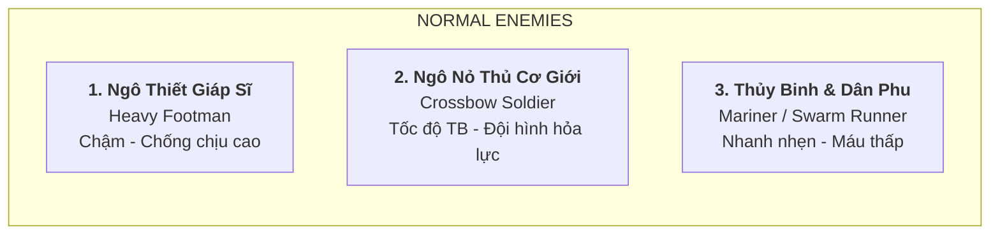
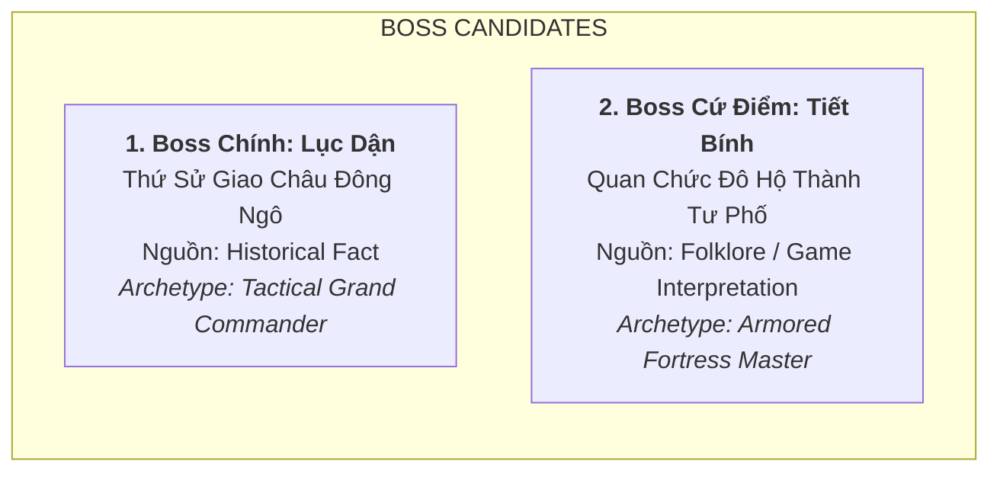

# Khái Niệm Kẻ Địch & Boss: Gói Khởi Nghĩa Bà Triệu (Enemy & Boss Concepts)

> [!IMPORTANT]
> **Ràng Buộc Cơ Chế Tower Defense Cốt Lõi**:
> - **Tuyệt đối KHÔNG thiết kế Enemy tấn công Hero**: Theo kiến trúc cốt lõi của Huyền Sử TD, **Enemy hiện chỉ di chuyển theo đường cố định (Fixed Path)** tiến về căn cứ/thành trì phe ta. Hero đứng yên trên tháp canh/vị trí đặt quân để tấn công kẻ địch đi ngang qua.
> - **Chưa khóa chỉ số Stats**: Không tự ý gán máu (HP), tốc chạy (Speed px/s) hay giáp số cụ thể; chỉ mô tả archetype định tính (chậm/bền, nhanh/yếu, cơ động...).
> - **Ràng buộc nguồn**: Mọi nhân vật đều phải ghi rõ nguồn gốc. Nhân vật **Tiết Bính** phải được ghi rõ là **Folklore / Game Interpretation** (không phải nhân vật lịch sử năm 248).
> - **Quy chuẩn Asset**: 128 × 128 px, Front View, 32-bit RGBA Transparent, Baseline tiếp đất **Y = 112 px**.

---

## 1. Hệ Thống 3 Kẻ Địch Thường (Normal Enemies)

### 1.1. Enemy 1: Ngô Thiết Giáp Sĩ (`ngo-thiet-giap`)
* **Phân loại nguồn**: **Historical / Later source** (Bộ binh thiết giáp tinh nhuệ tiêu chuẩn thời Tam Quốc của Đông Ngô).
* **Archetype**: *Heavy Armored Footman* (Bộ binh hạng nặng).
* **Hành vi trên đường đi (Path Behavior)**: Di chuyển chậm rãi (`~35 – 45 px/s`), bước đi đĩnh đạc và kiên cố, đóng vai trò lá chắn thịt đi đầu che chắn cho các đơn vị cơ động phía sau.
* **Tạo hình & Trang bị**:
  * Giáp phiến sắt sơn then đen bóng đan dây da bò chắc chắn, mũ sắt chỏm tròn có vành che gáy và má.
  * Tay trái mang Khiên chữ nhật lớn bằng gỗ bọc da nẹp sắt (Mộc thuẫn), tay phải cầm Kích sắt hoặc Hoàn Thủ đao ngắn.
* **Prompt Pixel Art (128×128 px, Baseline Y=112)**:
  > `pixel art character sprite of ancient Eastern Wu heavy armored foot soldier (Ngo Thiet Giap Si), walking forward facing front view, holding large rectangular iron-rimmed wooden tower shield in front, wearing black lamellar iron armor and iron helmet with red plume, feet firmly grounded on baseline Y=112 with contact shadow, 128x128 canvas, transparent background, crisp pixel art, clean historical Three Kingdoms aesthetic.`

---

### 1.2. Enemy 2: Ngô Nỏ Thủ Cơ Giới (`ngo-no-thu`)
* **Phân loại nguồn**: **Historical / Later source** (Nỏ binh quân dụng phương Bắc trang bị nỏ cơ khí lẫy đồng tinh xảo).
* **Archetype**: *Crossbow Soldier* (Nỏ binh hộ tống).
* **Hành vi trên đường đi (Path Behavior)**: Di chuyển với tốc độ trung bình (`~55 – 65 px/s`), đi theo cụm hỗ trợ phía sau các khối thiết giáp.
* **Tạo hình & Trang bị**:
  * Áo giáp nhẹ nẹp da đính đinh tán đồng, nón vải hoặc mũ sắt nhẹ có dây buộc cằm.
  * Hai tay mang Nỏ quân dụng gỗ cứng lẫy đồng, sau lưng đeo ống tên sắt đầu ba cạnh xuyên giáp.
* **Prompt Pixel Art (128×128 px, Baseline Y=112)**:
  > `pixel art character sprite of ancient Eastern Wu military crossbowman (Ngo No Thu), marching forward facing front view, carrying standard Han mechanical wooden crossbow with bronze trigger mechanism, quiver of iron bolts on back, light leather tunic with iron rivets, feet grounded on baseline Y=112, 128x128 canvas, transparent background, sharp pixel details.`

---

### 1.3. Enemy 3: Thủy Binh & Dân Phu Giang Đông (`thuy-binh-dan-phu`)
* **Phân loại nguồn**: **Historical / Later source** (Lực lượng thủy binh nhẹ và dân phu tạp dịch bị bắt ép mở đường, vận lương).
* **Archetype**: *Swarm Runner / Mariner* (Lính xung kích bầy đàn cơ động cao).
* **Hành vi trên đường đi (Path Behavior)**: Di chuyển rất nhanh (`~85 – 100 px/s`), xuất hiện theo từng đàn đông đảo nhằm áp đảo hệ thống phòng thủ bằng số lượng.
* **Tạo hình & Trang bị**:
  * Áo chẽn ngắn màu xám đất, quần túm ống gọn gàng, đầu chít khăn vải thô.
  * Cầm câu liêm ngắn hoặc giáo tre vạt nhọn, cơ thể nhẹ nhàng linh hoạt khi lội qua bãi bồi đầm lầy.
* **Prompt Pixel Art (128×128 px, Baseline Y=112)**:
  > `pixel art character sprite of ancient Eastern Wu naval conscript runner (Thuy Binh Dan Phu), running briskly facing front view, holding short hook-spear (cau liem), wearing simple grey tunic and cloth headband, light and agile, feet grounded on baseline Y=112 with motion shadow, 128x128 canvas, transparent background, clean pixel silhouette.`

---

## 2. Hệ Thống 1 Kẻ Địch Tinh Anh (Elite Enemy)

### 2.1. Elite Enemy: Ngô Tiên Phong Kỵ Sĩ (`ngo-tien-phong-ky-si`)
* **Phân loại nguồn**: **Historical / Later source** (Kỵ binh nhẹ xung kích của quân đội Đông Ngô thời Tam Quốc).
* **Archetype**: *Shock Heavy Cavalry* (Kỵ binh đột phá tốc độ cao).
* **Hành vi trên đường đi (Path Behavior)**: Di chuyển với tốc độ cực nhanh (`~110 – 130 px/s`), có khả năng lướt nhanh qua các đoạn đường cong nguy hiểm để tiếp cận cổng căn cứ nếu không bị dồn sát thương kịp thời.
* **Tạo hình & Trang bị**:
  * Cưỡi ngựa chiến Giang Đông dũng mãnh, ngực ngựa đeo yếm da bảo vệ.
  * Kỵ sĩ mặc giáp phiến sắt, đội mũ trụ đồng có gắn lông chim đỏ, tay cầm thương kích cán dài, cờ hiệu ngũ sắc tung bay sau lưng ngựa.
* **Prompt Pixel Art (128×128 px, Baseline Y=112)**:
  > `pixel art character sprite of ancient Eastern Wu elite shock cavalry commander (Ngo Tien Phong Ky Si) mounted on galloping warhorse facing front view, holding long iron halberd upright, rider wearing polished iron lamellar armor and helmet with crimson banner on back, horse hooves firmly grounded on baseline Y=112 with dust kick shadow, 128x128 canvas, transparent background, dynamic action pose, vivid pixel art.`

---

## 3. Hệ Thống 1–2 Ứng Viên Boss (Boss Candidates)

### 3.1. Boss Chính Số 1: Lục Dận (`boss-luc-dan`) — Thứ Sử Giao Châu Đông Ngô
* **Phân loại nguồn & Độ tin cậy**: **Historical Fact** (*Tam Quốc Chí* - Ngô Chí: Quyển 61, Lục Kháng phụ Lục Dận truyện).
* **Bối cảnh lịch sử**: Viên quan kinh lược phương Bắc tài ba, mưu mô được Tôn Quyền cử sang dẹp loạn năm 248 SCN; sử chép tổng quân lực thu phục/tập hợp trong toàn chiến dịch khoảng 8.000 người.
* **Archetype**: *Tactical Grand Commander* (Đại Thống Soái Mưu Lược).
* **Hành vi trên đường đi (Path Behavior)**:
  * Di chuyển chậm rãi, ung dung (`~30 – 40 px/s`) giữa toán quân hộ vệ.
  * Lượng máu (HP) cực kỳ dồi dào, là thử thách lớn nhất cho toàn bộ hệ thống Hero.
* **Tạo hình Visual**:
  * Mặc cẩm bào bằng lụa quý Giang Đông màu tím thẫm bên trong giáp phiến sắt viền đồng mạ vàng uy nghi.
  * Đội mũ quan võ thời Tam Quốc cánh chuồn chạm vàng, tay cầm thanh kiếm Hoàn Thủ chuôi vàng nạm ngọc.
  * Ánh mắt thâm sâu, phong thái quý tộc mưu lược của viên đại thần thống soái phương Bắc.
* **Prompt Pixel Art (128×128 px, Baseline Y=112)**:
  > `pixel art character sprite of grand general Lu Yin (Luc Dan), imperial governor of Eastern Wu, majestic boss character standing facing front view, wearing opulent purple silk robe underneath gold-gilded black iron lamellar armor, holding ornate golden ring-pommel sword (Huan Shou Dao), aristocratic commanding expression, feet grounded on baseline Y=112 with grand shadow, 128x128 canvas, transparent background, highly detailed boss pixel art.`

---

### 3.2. Boss Cứ Điểm Số 2: Tiết Bính (`boss-tiet-binh`) — Quan Chức Đô Hộ Thành Tư Phố
* **Phân loại nguồn & Độ tin cậy**: **Folklore / Game Interpretation**
  * *(Lưu ý bắt buộc: Trong chính sử năm 248 SCN không có ghi chép về nhân vật tên Tiết Bính đối đầu Bà Triệu. Đây là nhân vật giả định trong bối cảnh game đại diện cho tầng lớp quan lại đô hộ cố thủ trong thành lũy Tư Phố).*
* **Archetype**: *Armored Fortress Master* (Tướng Trấn Thủ Thành Lũy).
* **Hành vi trên đường đi (Path Behavior)**:
  * Di chuyển trên chiến xa nặng nề với tốc độ rất chậm (`~25 – 35 px/s`).
  * Khả năng chống chịu đòn đánh vật lý cực kỳ cao.
* **Tạo hình Visual**:
  * Tướng béo tốt mang giáp sắt dày cộp, trước ngực đeo gương hộ tâm phiến tròn lớn.
  * Đứng trên Chiến xa gỗ bọc sắt nẹp các thanh cọc nhọn đâm tua tủa xung quanh.
* **Prompt Pixel Art (128×128 px, Baseline Y=112)**:
  > `pixel art character sprite of tyrant fortress commander Tiet Binh (Folklore/Game Interpretation), heavily armored boss standing on spiked wooden war chariot facing front view, holding heavy iron mace, wearing bulky iron plate armor with large circular mirror chestplate, chariot wheels grounded on baseline Y=112, 128x128 canvas, transparent background, menacing villainous design.`
