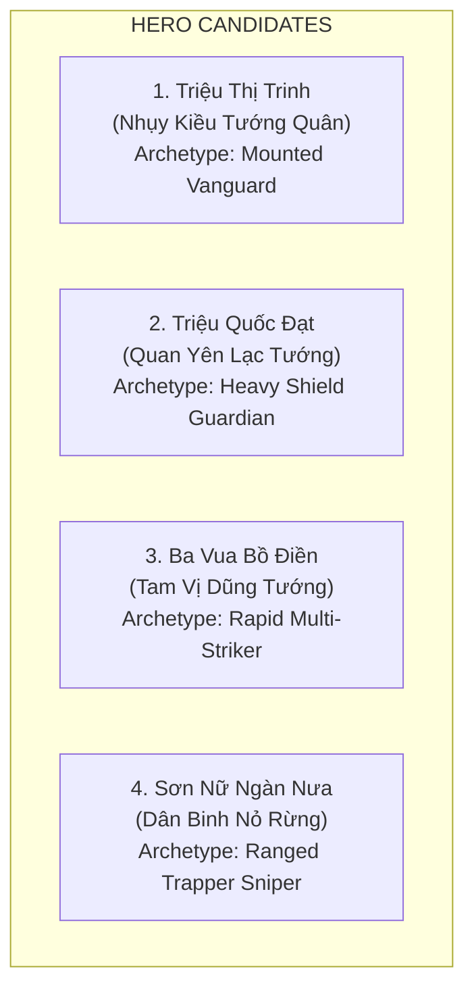
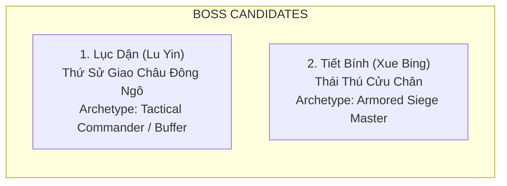

# Đề Xuất Ứng Viên Hero & Enemy Archetypes Thời Kỳ Bà Triệu

> [!IMPORTANT]
> **Ràng Buộc Thiết Kế Tuyệt Đối**:
> - Tài liệu này mang tính chất **Đề Xuất Ý Tưởng Tạo Hình & Định Hướng Lối Chơi (Conceptual Proposal)**, chưa chốt roster chính thức.
> - **Tuyệt đối KHÔNG tạo chỉ số gameplay (Stats HP/ATK cụ thể)**, **KHÔNG viết code Skill**, **KHÔNG can thiệp Core Architecture**.
> - Mọi đề xuất đều tuân thủ chặt chẽ nguyên tắc của dự án:
>   * Hero là Tower đứng yên, **không có chỉ số DEF**.
>   * Đòn đánh thường (Normal Attack): Single-target duy nhất (không có AoE/CC).
>   * Kỹ năng chủ động (Active Skill): Kích hoạt tự động sau **3 / 5 / 7 / 10** đòn đánh thường; sử dụng hệ hiệu ứng dùng chung (Damage, AoE, Slow, Stun, Root, MultiHit) qua framework của Core.
>   * Modifier phần trăm (%) chỉ dành riêng cho Passive khi đạt cảnh giới Huyền Sử.

---

## 1. Đề Xuất 4 Ứng Viên Hero (Hero Candidates)

### 1.1. Ứng Viên 1: Triệu Thị Trinh (Nhụy Kiều Tướng Quân / Lệ Hải Bà Vương)

* **Danh tính & Bối cảnh**: Nữ vương khởi nghĩa Cửu Chân năm 248 SCN; biểu tượng bất diệt của lòng dũng cảm và khí phách dân tộc.
* **Archetype**: *Chiến Tướng Cưỡi Voi Tiên Phong (Mounted Vanguard / Frontline Sweeper)*.
* **Định hướng tạo hình Visual**:
  * Trang phục gấm vàng lộng lẫy, ngực đeo Hộ tâm phiến đồng tròn Đông Sơn chạm hình Mặt trời, trâm vàng cài tóc.
  * Ngự trên bành gấm trên lưng Bạch Tượng (Voi trắng một ngà) dũng mãnh, tay cầm gươm dài Đông Sơn uy nghi.
* **Định hướng cơ chế Combat (Ý niệm)**:
  * *Tầm đánh*: Extended Melee (Tầm cận chiến mở rộng, sải gươm dài từ lưng voi).
  * *Đòn đánh thường*: Single-target gươm chém dứt khoát vào kẻ địch đối diện.
  * *Ý niệm Kỹ năng (Active Skill)*: Tiếng thét xung trận kết hợp dậm chân của Bạch Tượng tạo chấn động kinh hoàng (kích hoạt sau $N$ đòn đánh: Gây AoE Damage và Stun ngắn hạn lên nhóm kẻ địch lân cận qua Shared Skill Framework).
  * *Ý niệm Cảnh giới Huyền Sử*: Kích hoạt Passive hào quang vương giả (khuếch đại sức mạnh tấn công cho các Hero lân cận qua Shared Passive System).

---

### 1.2. Ứng Viên 2: Triệu Quốc Đạt (Quan Yên Lạc Tướng)

* **Danh tính & Bối cảnh**: Hào trưởng Quan Yên, anh trai Bà Triệu, người đồng khởi xướng phong trào và xây dựng căn cứ Ngàn Nưa ban đầu.
* **Archetype**: *Hộ Vệ Trận Địa Thiết Giáp (Heavy Shield Guardian / Area Controller)*.
* **Định hướng tạo hình Visual**:
  * Thân hình cao lớn vạm vỡ, giáp da thú rừng nẹp viền đồng, hộ tâm phiến tròn trước ngực, khăn vấn sẫm màu.
  * Tay trái mang Khiên gỗ bọc đồng chạm hoa văn thú dữ kiên cố, tay phải cầm Giáo búp đa mũi đồng sáng quắc.
* **Định hướng cơ chế Combat (Ý niệm)**:
  * *Tầm đánh*: Melee cận chiến tiêu chuẩn.
  * *Đòn đánh thường*: Đâm giáo single-target dũng mãnh.
  * *Ý niệm Kỹ năng (Active Skill)*: Đập khiên trấn thủ làm rung chuyển mặt đất (kích hoạt sau $N$ đòn: Gây hiệu ứng Root / Slow cầm chân kẻ địch đi đầu, hỗ trợ đồng đội tiêu diệt qua Shared Skill Framework).
  * *Ý niệm Cảnh giới Huyền Sử*: Mở khóa Passive kiên cố phòng tuyến (tăng cường khả năng chống đỡ cho cứ điểm phòng thủ).

---

### 1.3. Ứng Viên 3: Ba Vua Bồ Điền (Tam Vị Tiên Phong)

* **Danh tính & Bối cảnh**: Ba vị dũng tướng phò tá đắc lực của Bà Triệu tại căn cứ Bồ Điền, được lưu truyền trong thần tích và địa chí xứ Thanh.
* **Archetype**: *Tốc Kích Đột Phá (Rapid Multi-Striker / Skirmisher)*.
* **Định hướng tạo hình Visual**:
  * Chiến binh trẻ tuổi nhanh nhẹn, áo chàm vạt ngắn túm gọn gàng, xăm mình giao long, sử dụng song đao hoặc trường kích linh hoạt.
* **Định hướng cơ chế Combat (Ý niệm)**:
  * *Tầm đánh*: Melee cận chiến tốc độ cao.
  * *Đòn đánh thường*: Chém đao nhanh single-target.
  * *Ý niệm Kỹ năng (Active Skill)*: Tung ra liên hoàn trảm chớp nhoáng (kích hoạt sau $N$ đòn: Thực hiện MultiHit liên tiếp vào mục tiêu đơn lẻ, dồn sát thương cực mạnh).
  * *Ý niệm Cảnh giới Huyền Sử*: Tăng tốc độ xuất chiêu toàn diện qua Shared Passive System.

---

### 1.4. Ứng Viên 4: Sơn Nữ Ngàn Nưa (Thủ Lĩnh Nỏ Rừng)

* **Danh tính & Bối cảnh**: Đại diện cho lực lượng nữ binh và thợ săn tinh nhuệ vùng rừng núi Ngàn Nưa hưởng ứng lời kêu gọi cứu nước của Bà Triệu.
* **Archetype**: *Xạ Thủ Tầm Xa Nỏ Rừng (Ranged Sniper & Trapper)*.
* **Định hướng tạo hình Visual**:
  * Nữ thợ săn nhanh nhẹn trong bộ trang phục vải chàm gọn gàng, nón lá cọ nẹp mây, đeo ống tên nứa sau lưng, cầm cây Nỏ Lạc Việt thân gỗ nẹp gân trâu dẻo dai.
* **Định hướng cơ chế Combat (Ý niệm)**:
  * *Tầm đánh*: Ranged tầm xa.
  * *Đòn đánh thường*: Bắn mũi tên nứa bịt đồng single-target tầm xa chính xác.
  * *Ý niệm Kỹ năng (Active Skill)*: Bắn loạt tên độc đầm lầy (kích hoạt sau $N$ đòn: Gây Slow diện rộng làm giảm tốc độ di chuyển của đoàn quân địch trong vùng ảnh hưởng).
  * *Ý niệm Cảnh giới Huyền Sử*: Khai mở Passive tăng tầm quan sát và tỷ lệ bạo kích tầm xa.

---

## 2. Đề Xuất Ứng Viên Boss (Boss Candidates)

### 2.1. Boss 1: Lục Dận (Thứ Sử Giao Châu — Thống Soái Đông Ngô)
* **Vai trò trong cốt truyện**: Kẻ thù chính của chương truyện Bà Triệu; viên tướng mưu mô mang 8.000 quân sang đàn áp và thực hiện kế sách mua chuộc phân hóa.
* **Định hướng tạo hình**: Mặc cẩm bào quý tộc Đông Ngô bên trong giáp phiến sắt mạ vàng, đội mũ cánh chuồn tướng lĩnh, tay cầm gươm Hoàn Thủ đao nạm ngọc, vẻ mặt thâm hiểm.
* **Định hướng cơ chế Boss (Ý niệm)**:
  * *Lượng máu & Tốc độ*: Máu rất dày, di chuyển chậm rãi, ung dung.
  * *Cơ chế Khí thế Đông Ngô (Troop Morale Buff)*: Định kỳ phát hào quang trống trận, tăng tốc độ di chuyển và sát thương cho toàn bộ binh lính Ngô xung quanh.
  * *Cơ chế Triệu hồi Giáp Sĩ*: Gọi thêm toán lính thiết giáp hộ vệ khi lượng máu giảm xuống các mốc nhất định.
  * *Cơ chế Mua chuộc / Phân hóa*: Định kỳ làm vô hiệu hóa tạm thời hiệu ứng hỗ trợ của một trụ phòng thủ ngẫu nhiên.

---

### 2.2. Boss 2: Tiết Bính (Thái Thú Cửu Chân)
* **Vai trò trong cốt truyện**: Quan đô hộ địa phương tàn bạo, cố thủ trong thành lũy Tư Phố trước khi bị nghĩa quân công phá.
* **Định hướng tạo hình**: Tướng giáp sắt hộ tâm kính lớn, đứng trên Chiến xa gỗ bọc sắt nẹp cọc nhọn.
* **Định hướng cơ chế Boss (Ý niệm)**:
  * *Lượng máu & Phòng thủ*: Chống chịu đòn đánh vật lý cực tốt, miễn nhiễm với hiệu ứng Stun nhẹ.
  * *Hỏa lực tầm xa*: Trang bị dàn nỏ lớn trên chiến xa bắn phá các vị trí tiền tiêu.

---

## 3. Đề Xuất Kẻ Địch Tiêu Chuẩn (Enemy Archetypes)

| Kẻ Địch | Archetype | Đặc Điểm Nhận Dạng & Hành Vi Tác Chiến |
|---|---|---|
| **Ngô Thiết Giáp Sĩ** | *Heavy Armored Infantry* | Mang giáp phiến sắt, khiên chữ nhật lớn; bước đi chậm chạp, lượng máu cao, là lá chắn cản đường cho các đơn vị phía sau. |
| **Ngô Tiên Phong Kỵ** | *Fast Shock Cavalry* | Kỵ binh nhẹ cưỡi ngựa chiến Giang Đông, tốc độ di chuyển cực nhanh, chuyên bứt phá vượt qua tuyến hỏa lực. |
| **Ngô Nỏ Thủ Cơ Giới** | *Crossbow Sniper* | Binh lính mang nỏ cơ khí lẫy đồng; có thể dừng lại ngắm bắn từ cự ly xa, tạo áp lực lớn lên hàng phòng ngự. |
| **Sứ Giả Mua Chuộc / Đốc Chiến Quan** | *Support / Buffer Unit* | Quan lại mang tráp vàng và cờ hiệu; không trực tiếp tấn công mạnh nhưng liên tục buff tăng tốc và hồi phục cho lính xung quanh. |
| **Dân Phu Cưỡng Bách & Thủy Binh** | *Swarm / Fast Runner* | Lính tạp dịch và thủy binh nhẹ; lượng máu thấp nhưng xuất hiện theo từng đàn đông đảo, gây rối loạn trận địa. |
