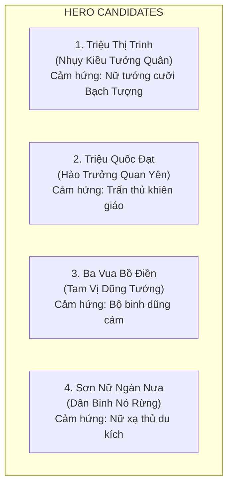
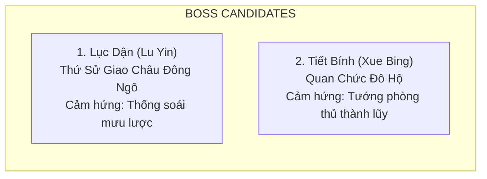

# Đề Xuất Ứng Viên Hero & Kẻ Địch Thời Kỳ Bà Triệu (Visual & Historical Inspiration)

> [!IMPORTANT]
> **Ràng Buộc Nghiên Cứu Lịch Sử & Mỹ Thuật**:
> - Tài liệu này mang tính chất **Khảo Cứu Nhân Vật & Đề Xuất Ý Tưởng Tạo Hình (Visual & Historical Inspiration)**, chưa chốt roster chính thức.
> - **TUYỆT ĐỐI KHÔNG TẠO CHỈ SỐ STATS (HP/ATK)**, **KHÔNG THIẾT KẾ ACTIVE SKILL CHI TIẾT**, **KHÔNG THIẾT KẾ LEGENDARY PASSIVE**, **KHÔNG THIẾT KẾ BOSS ABILITY / SUMMON / BUFF / DEBUFF**.
> - Mọi đề xuất chỉ đóng vai trò tư liệu cảm hứng lịch sử - mỹ thuật phục vụ đội ngũ thiết kế sau này.

---

## 1. Đề Xuất 4 Ứng Viên Hero (Hero Candidates — Visual & Historical Inspiration)

### 1.1. Ứng Viên 1: Triệu Thị Trinh (Nhụy Kiều Tướng Quân / Lệ Hải Bà Vương)

* **Danh tính & Bối cảnh**: Nữ vương khởi nghĩa Cửu Chân năm 248 SCN; biểu tượng bất diệt của lòng dũng cảm và khí phách dân tộc.
* **Mức độ tin cậy nguồn**: Nguồn Trung Hoa gần thời (*Tam Quốc Chí* - Ngô Chí) xác nhận cuộc nổi dậy năm 248 tại Giao Chỉ–Cửu Chân và hoạt động của Lục Dận (không trực tiếp xác nhận tên/tiểu sử Triệu Thị Trinh trong đoạn sử đó); nhân vật Bà Triệu/Triệu Ẩu cùng các thông tin tiểu sử cụ thể được nhận diện, lưu truyền qua truyền thống/sử liệu Việt về sau (*Giao Châu Ký*, *Toàn Thư*, *Cương Mục*, thần phả địa phương).
* **Định hướng tạo hình Visual & Cảm hứng lịch sử**:
  * Trang phục lụa gấm vàng rực rỡ bên trong giáp ngực da thuộc nẹp viền đồng thau, ngực đeo Hộ tâm phiến đồng tròn Đông Sơn chạm hình Mặt trời, trâm vàng cài tóc.
  * Ngự trên bành gấm trên lưng Bạch Tượng (Voi trắng một ngà) dũng mãnh, tay cầm gươm dài Đông Sơn uy nghi.
  * Phong thái: Nữ vương chỉ huy trận địa, toát lên khí phách hào hùng *"đạp luồng sóng dữ, chém cá kình ở biển Đông"*.

---

### 1.2. Ứng Viên 2: Triệu Quốc Đạt (Hào Trưởng Quan Yên)

* **Danh tính & Bối cảnh**: Hào trưởng Quan Yên, anh trai Bà Triệu, người đồng khởi xướng phong trào và xây dựng căn cứ Ngàn Nưa ban đầu.
* **Mức độ tin cậy nguồn**: Sử liệu trung đại Việt Nam (*Toàn Thư*, *Cương Mục*) và thần tích làng Quan Yên (không có trong sử Ngô gần thời).
* **Định hướng tạo hình Visual & Cảm hứng lịch sử**:
  * Thân hình cao lớn vạm vỡ, giáp da thú rừng nẹp viền đồng, hộ tâm phiến tròn trước ngực, khăn vấn sẫm màu.
  * Tay trái mang Khiên gỗ bọc đồng chạm hoa văn thú dữ kiên cố, tay phải cầm Giáo búp đa mũi đồng sáng quắc.
  * Phong thái: Lạc tướng hộ vệ kiên cường, dạn dày kinh nghiệm chỉ huy và tập hợp nghĩa sĩ.

---

### 1.3. Ứng Viên 3: Ba Vua Bồ Điền (Tam Vị Dũng Tướng)

* **Danh tính & Bối cảnh**: Ba vị dũng tướng phò tá đắc lực của Bà Triệu tại căn cứ Bồ Điền.
* **Mức độ tin cậy nguồn**: **Folklore / Local Legend Candidate** (Thần tích đền Ba Vua thôn Phú Điền, *Đại Nam Nhất Thống Chí*).
* **Định hướng tạo hình Visual & Cảm hứng lịch sử**:
  * Chiến binh trẻ tuổi nhanh nhẹn, áo chàm vạt ngắn túm gọn gàng, xăm mình giao long, sử dụng song đao hoặc trường kích linh hoạt.
  * Phong thái: Đội quân xung kích dũng cảm xông pha cản phá các đợt tiến quân của giặc.

---

### 1.4. Ứng Viên 4: Sơn Nữ Ngàn Nưa (Nữ Xạ Thủ Nỏ Rừng)

* **Danh tính & Bối cảnh**: Đại diện cho lực lượng nữ binh và thợ săn tinh nhuệ vùng rừng núi Ngàn Nưa hưởng ứng lời kêu gọi cứu nước của Bà Triệu.
* **Mức độ tin cậy nguồn**: **Game Interpretation / Nghệ thuật hóa truyền thống dân gian**.
* **Định hướng tạo hình Visual & Cảm hứng lịch sử**:
  * Nữ thợ săn nhanh nhẹn trong bộ trang phục vải chàm gọn gàng, nón lá cọ nẹp mây, đeo ống tên nứa sau lưng, cầm cây Nỏ Lạc Việt thân gỗ nẹp gân trâu dẻo dai.
  * Phong thái: Xạ thủ cơ động, đại diện cho tinh thần quật khởi của nhân dân các vùng rừng núi.

---

## 2. Đề Xuất Ứng Viên Kẻ Địch Thường (Normal Enemy Candidates — Visual Inspiration)

| Kẻ Địch | Binh Chủng & Cảm Hứng Lịch Sử | Đặc Điểm Tạo Hình Visual |
|---|---|---|
| **Ngô Thiết Giáp Sĩ** | Bộ binh nặng Đông Ngô | Mang giáp phiến sắt sơn then đen, khiên chữ nhật lớn, tay cầm kích sắt; bước đi chậm chạp, vững vàng. |
| **Ngô Nỏ Thủ Cơ Giới** | Nỏ binh quân dụng Đông Ngô | Binh lính mang nỏ quân dụng lẫy đồng tiêu chuẩn phương Bắc, đeo ống tên sắt sau lưng. |
| **Dân Phu & Thủy Binh Giang Đông** | Phu phen tạp dịch & Lính thủy nhẹ | Lính áo chẽn gọn gàng, mang giáo ngắn hoặc câu liêm; di chuyển nhanh nhẹn trên địa hình sông nước. |

---

## 3. Đề Xuất Ứng Viên Kẻ Địch Tinh Anh (Elite Enemy Candidates — Visual Inspiration)

| Kẻ Địch Tinh Anh | Cảm Hứng Lịch Sử | Đặc Điểm Tạo Hình Visual |
|---|---|---|
| **Ngô Tiên Phong Kỵ Sĩ** | Kỵ binh nhẹ Đông Ngô | Kỵ binh cưỡi ngựa chiến Giang Đông mang giáo dài, cờ quạt chỉnh tề; phong thái cơ động nhanh. |
| **Đốc Chiến Quan Đông Ngô** | Quan lại chỉ huy tiền tuyến | Mặc áo thụng lụa ngoài giáp nhẹ, tay cầm cờ lệnh đốc thúc binh sĩ. |
| **Thủy Quân Kích Thủ** | Lực lượng thủy chiến đặc nhiệm | Lính thủy mang giáp da bơi lội giỏi, trang bị câu liêm kích chuyên leo phá đồn bốt ven sông. |

---

## 4. Đề Xuất Ứng Viên Boss (Boss Candidates — Visual & Historical Inspiration)

### 4.1. Boss 1: Lục Dận (Thứ Sử Giao Châu — Thống Soái Đông Ngô)
* **Bối cảnh lịch sử**: Viên tướng do triều đình Tôn Quyền cử sang Giao Châu dẹp yên phong trào năm 248 SCN; sử chép tổng quân lực ông tập hợp trong chiến dịch khoảng 8.000 người.
* **Mức độ tin cậy nguồn**: Nguồn chính sử tương đối rõ (*Tam Quốc Chí* - Ngô Chí).
* **Định hướng tạo hình Visual**:
  * Mặc cẩm bào quý tộc Đông Ngô bên trong giáp phiến sắt viền đồng mạ vàng, đội mũ quan võ thời Tam Quốc, tay cầm gươm Hoàn Thủ đao nạm ngọc.
  * Phong thái: Viên quan kinh lược thâm trầm, mưu mô, đại diện cho sức mạnh quân sự và thủ đoạn phân hóa của nhà Đông Ngô.

---

### 4.2. Boss 2: Tiết Bính (Quan Chức Đô Hộ Phương Bắc)
* **Bối cảnh**: Nhân vật giả định trong bối cảnh game đại diện cho quan chức đô hộ cố thủ trong thành lũy Tư Phố.
* **Mức độ tin cậy nguồn**: **Folklore / Unverified Candidate (Nhân vật giả định trong game)**.
* **Định hướng tạo hình Visual**:
  * Tướng giáp sắt mang khiên hộ tâm lớn, đứng trên Chiến xa gỗ bọc sắt nẹp cọc nhọn.
  * Phong thái: Tướng trấn thủ đồn lũy kiên cố, đại diện cho hệ thống cứ điểm phòng ngự của chính quyền đô hộ.
