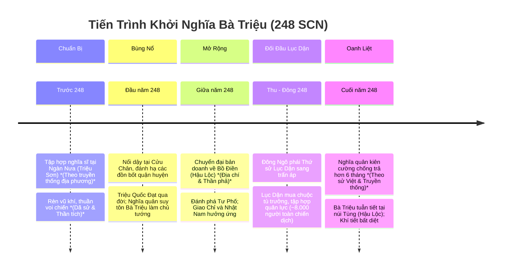

# Bối Cảnh Lịch Sử & Diễn Biến Khởi Nghĩa Bà Triệu (Năm 248 SCN)

## 1. Bối Cảnh Chính Trị — Xã Hội Thời Đông Ngô

### 1.1. Tình Hình Phương Bắc Thời Tam Quốc
* Đầu thế kỷ III SCN, Trung Hoa bước vào cục diện phân tranh Tam Quốc giữa ba tập đoàn phong kiến: Tào Ngụy ở phương Bắc, Thục Hán ở Tây Nam và Đông Ngô (Tôn Quyền) ở phương Nam / Đông Nam.
* Để phục vụ cho các chiến dịch quân sự tốn kém chống Tào Ngụy và Thục Hán, triều đình Đông Ngô tăng cường vơ vét tối đa nguồn lực người và của từ các vùng đất phụ thuộc, trong đó Giao Châu (bao gồm các quận Giao Chỉ, Cửu Chân, Nhật Nam) trở thành đối tượng bóc lột trọng điểm.

### 1.2. Chính Sách Thống Trị & Ách Bóc Lột Tại Giao Châu
* **Bóc lột kinh tế**: Bắt cống nạp định kỳ những sản vật quý hiếm vùng nhiệt đới như sừng tê giác, ngà voi, ngọc trai, đồi mồi, lông chim trả, quế, trầm hương, bạc, đồng.
* **Áp bức xã hội & Cưỡng bức lao dịch**: Bắt hàng ngàn thợ thủ công khéo léo đưa về thủ phủ Kiến Nghiệp; cưỡng bách thanh niên sung lính sang phục vụ hạm đội thủy quân Đông Ngô; bắt phụ nữ làm nô tì.
* **Bộ máy quan lại tham tàn**: Các Thứ sử Giao Châu và Thái thú Cửu Chân do triều đình Tôn Quyền bổ nhiệm đa phần là quan lại tàn bạo, chỉ lo làm giàu cá nhân và khủng bố nhân dân bản địa bằng hình phạt khốc liệt.

---

## 2. Niên Biểu Diễn Biến Cuộc Khởi Nghĩa (Năm 248 SCN)

> [!NOTE]
> **Lưu ý phân loại nguồn**: Nguồn Trung Hoa gần thời như *Tam Quốc Chí* xác nhận biến động/nổi dậy năm 248 tại Giao Chỉ–Cửu Chân và hoạt động của Lục Dận (không trực tiếp xác nhận tên/tiểu sử Triệu Thị Trinh trong đoạn sử đó). Nhân vật Bà Triệu/Triệu Ẩu cùng các chi tiết cụ thể về căn cứ Ngàn Nưa, Bồ Điền, thuần voi chiến, đánh phá Tư Phố, thời gian kháng cự hơn 6 tháng và sự hy sinh tuẫn tiết tại núi Tùng được nhận diện, lưu truyền và mô tả cụ thể qua truyền thống/sử liệu Việt về sau (*Toàn Thư*, *Cương Mục*, *Đại Nam Nhất Thống Chí*, thần tích/truyền thuyết dân gian địa phương).

### 2.1. Giai Đoạn 1: Xây Dựng Lực Lượng Tại Ngàn Nưa *(Theo Truyền Thống Địa Phương & Dã Sử)*
* Bà Triệu (Triệu Thị Trinh) sinh năm Bính Ngọ (226 SCN) tại miền núi Quan Yên (thuộc huyện Yên Định, Thanh Hóa ngày nay).
* Sớm mồ côi cha mẹ, bà cùng anh trai là Triệu Quốc Đạt (một hào trưởng địa phương theo sử Việt) tập hợp nghĩa sĩ về vùng núi Nưa hiểm trở.
* Tại Ngàn Nưa, theo thần tích và truyền thuyết dân gian, nghĩa quân tổ chức luyện võ, rèn vũ khí bằng đồng và sắt, lập kho lương và thuần dưỡng voi rừng thành thớt voi chiến.

### 2.2. Giai Đoạn 2: Khởi Nghĩa Bùng Nổ Khắp Cửu Chân
* Năm Mậu Thìn (248 SCN), mâu thuẫn giữa nhân dân và chính quyền đô hộ bùng nổ. Cuộc nổi dậy chính thức phát động từ Cửu Chân.
* Nghĩa quân đánh phá các đồn bốt của quân Ngô quanh lưu vực sông Chu, sông Mã.
* Trong quá trình khởi nghĩa, Triệu Quốc Đạt qua đời vì bệnh (hoặc tử trận theo một số dã sử). Nghĩa quân suy tôn Triệu Thị Trinh làm chủ tướng, đời sau tôn kính với danh hiệu **Nhụy Kiều Tướng Quân** hay **Lệ Hải Bà Vương**.

### 2.3. Giai Đoạn 3: Tiến Ra Bồ Điền & Thanh Thế Chấn Động Toàn Giao Châu *(Theo Địa Chí & Thần Phả)*
* Nhận thấy vùng núi Nưa địa thế hẹp, khó phát triển lực lượng cơ động lớn, Bà Triệu chuyển đại bản doanh ra vùng **Bồ Điền** (nay là làng Phú Điền, xã Triệu Lộc, huyện Hậu Lộc, Thanh Hóa).
* Bồ Điền có vị trí chiến lược: Lưng tựa vào dãy núi Tùng, mặt nhìn ra đồng bằng ven biển, kiểm soát tuyến đường giao thông Bắc - Nam.
* Tại Bồ Điền, nghĩa quân xây dựng hệ thống đồn lũy liên hoàn bằng gỗ đá, cọc tre. Theo sử Việt và truyền thống địa phương, nghĩa quân tiến công phá tan căn cứ quân Ngô, đánh phá thành **Tư Phố** (thủ phủ quận Cửu Chân).
* Phong trào nhanh chóng lan rộng: Dân chúng khắp Giao Chỉ, Cửu Chân, Nhật Nam đồng loạt hưởng ứng.

### 2.4. Giai Đoạn 4: Lục Dận Sang Đàn Áp & Kế Sách Phân Hóa Của Quân Ngô
* Nhận được tin cấp báo từ Giao Châu, Tôn Quyền cử **Lục Dận** (cháu của Lục Tốn, giữ chức Thứ sử Giao Châu kiêm An Nam hiệu úy) sang dẹp yên phong trào.
* **Về quân lực của Lục Dận**: Nguồn sử liệu về Lục Dận (*Tam Quốc Chí* - Lục Dận truyện) ghi nhận trong quá trình hành quân và phủ dụ, tổng số quân lực mà Lục Dận chiêu tập, tập hợp được trong toàn chiến dịch đạt khoảng **8.000 người** (bao gồm cả các lực lượng quy phục địa phương); không coi đây là số quân viễn chinh xuất phát ban đầu từ Giang Đông nếu nguồn không chứng minh.
* Lục Dận thi hành chính sách phân hóa:
  * **Mua chuộc & Chiêu dụ**: Lục Dận mang nhiều của cải, ban thưởng chức tước để lung lạc, phân hóa các hào trưởng, tù trưởng bản địa.
  * **Cô lập nghĩa quân**: Nhiều lực lượng địa phương dao động quy hàng, khiến căn cứ Bồ Điền rơi vào thế cô lập, cạn kiệt tiếp tế.
  * **Bao vây phong tỏa**: Quân Ngô siết chặt vòng vây, phong tỏa các ngả đường sông và ven biển.

### 2.5. Giai Đoạn 5: Khúc Tráng Ca Núi Tùng *(Theo Sử Liệu Trung Đại & Thần Tích)*
* Bị bao vây cô lập, nghĩa quân Bồ Điền dưới sự chỉ huy của Bà Triệu vẫn kiên cường chống cự trong hơn 6 tháng (theo ghi chép của sử Việt và thần tích địa phương).
* Trước quân số áp đảo và thế trận bất lợi, để giữ trọn khí tiết của người thủ lĩnh không rơi vào tay giặc, Bà Triệu đã tuẫn tiết trên đỉnh **núi Tùng** (xã Triệu Lộc, Hậu Lộc) vào năm 248 SCN, khi mới 23 tuổi.

---

## 3. Không Gian Địa Lý Quân Sự Trọng Yếu *(Theo Địa Chí Muộn & Truyền Thống Địa Phương)*

| Địa Danh Lịch Sử | Vị Trí Hiện Nay | Đặc Điểm Chiến Lược Trong Khởi Nghĩa | Căn Cứ Tư Liệu |
|---|---|---|---|
| **Căn cứ Ngàn Nưa (Núi Nưa)** | Huyện Triệu Sơn & Như Thanh, Thanh Hóa | Địa hình rừng núi trùng điệp, nhiều hang động; bàn đạp bí mật xây dựng lực lượng, rèn vũ khí và thuần voi ban đầu. | *Đại Nam Nhất Thống Chí*, thần tích đền Am Tiên. |
| **Thành Cổ Tư Phố** | Làng Giàng, xã Thiệu Dương, TP. Thanh Hóa | Thủ phủ chính trị - quân sự của quận Cửu Chân thời Bắc thuộc; cứ điểm bị nghĩa quân tiến đánh. | *Thủy Kinh Chú*, di chỉ khảo cổ học Thiệu Dương. |
| **Căn cứ Bồ Điền** | Thôn Phú Điền, xã Triệu Lộc, Hậu Lộc, Thanh Hóa | Căn cứ địa trung tâm của cuộc khởi nghĩa; hệ thống đồn lũy liên hoàn án ngữ ngã ba sông và đường thiên lý. | *Đại Nam Nhất Thống Chí*, thần phả đền Phú Điền. |
| **Núi Tùng (Tùng Sơn)** | Xã Triệu Lộc, Hậu Lộc, Thanh Hóa | Dãy núi đá vôi cheo leo bảo vệ phía sau Bồ Điền; nơi diễn ra trận chiến cuối cùng và nơi yên nghỉ của Bà Triệu. | *Toàn Thư*, *Cương Mục*, di tích lăng mộ núi Tùng. |
| **Lưu Vực Sông Mã & Sông Chu** | Tỉnh Thanh Hóa | Tuyến vận tải đường thủy quan trọng cho thuyền bè tiếp tế và chiến đấu cơ động. | Thư tịch địa chí và khảo cổ học. |

---

## 4. Ý Nghĩa Lịch Sử & Giá Trị Biểu Tượng Văn Hóa

1. **Tiếp nối ngọn lửa Mê Linh**: Nối tiếp truyền thống quật khởi của Hai Bà Trưng, khẳng định ý chí quật cường, không chịu khuất phục trước bất kỳ thế lực ngoại bang bạo tàn nào.
2. **Khẳng định vai trò người phụ nữ Việt**: Hình ảnh người nữ anh hùng 19 tuổi cầm gươm thề cứu nước, 23 tuổi oanh liệt hy sinh trở thành tượng đài bất hủ của lòng yêu nước và nữ quyền trong lịch sử dân tộc.
3. **Bài học về phân hóa lực lượng & Xây dựng khối đoàn kết**: Cuộc khởi nghĩa để lại bài học sâu sắc về sự nguy hiểm của các thủ đoạn mua chuộc, chia rẽ nội bộ từ kẻ thù xâm lược.
