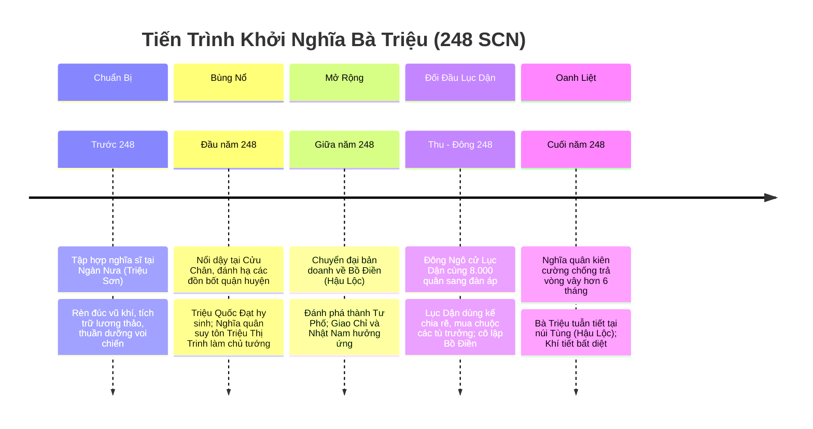

# Bối Cảnh Lịch Sử & Diễn Biến Khởi Nghĩa Bà Triệu (Năm 248 SCN)

## 1. Bối Cảnh Chính Trị — Xã Hội Thời Đông Ngô

### 1.1. Tình Hình Phương Bắc Thời Tam Quốc
* Đầu thế kỷ III SCN, Trung Hoa bước vào cục diện phân tranh Tam Quốc giữa ba tập đoàn phong kiến: Tào Ngụy ở phương Bắc, Thục Hán ở Tây Nam và Đông Ngô (Tôn Quyền) ở phương Nam / Đông Nam.
* Để phục vụ cho các chiến dịch quân sự tốn kém chống Tào Ngụy và Thục Hán, triều đình Đông Ngô tăng cường vơ vét tối đa nguồn lực người và của từ các vùng đất phụ thuộc, trong đó Giao Châu (bao gồm các quận Giao Chỉ, Cửu Chân, Nhật Nam) trở thành đối tượng bóc lột trọng điểm.

### 1.2. Chính Sách Thống Trị & Ách Bóc Lột Tại Giao Châu
* **Bóc lột kinh tế**: Bắt cống nạp định kỳ những sản vật quý hiếm vùng nhiệt đới như sừng tê giác, ngà voi, ngọc trai, đồi mồi, lông chim trả, quế, trầm hương, bạc, đồng.
* **Áp bức xã hội & Cưỡng bức lao dịch**: Bắt hàng ngàn thợ thủ công khéo léo đưa về thủ phủ Kiến Nghiệp; cưỡng bách thanh niên sung lính sang phục vụ hạm đội thủy quân Đông Ngô; bắt phụ nữ làm nô tì.
* **Bộ máy quan lại tham tàn**: Các Thứ sử Giao Châu và Thái thú Cửu Chân do triều đình Tôn Quyền bổ nhiệm đa phần là quan lại tàn bạo, chỉ lo làm giàu cá nhân và khủng bố nhân dân bản địa bằng hình phạt khốc liệt.

---

## 2. Niên Biểu Diễn Biến Cuộc Khởi Nghĩa (Năm 248 SCN)

### 2.1. Giai Đoạn 1: Xây Dựng Lực Lượng Tại Ngàn Nưa
* Bà Triệu (Triệu Thị Trinh) sinh năm Bính Ngọ (226 SCN) tại miền núi Quan Yên (thuộc huyện Yên Định, Thanh Hóa ngày nay).
* Sớm mồ côi cha mẹ, bà cùng anh trai là Triệu Quốc Đạt (một thủ lĩnh danh vọng trong vùng) bí mật chiêu mộ trai tráng, hào kiệt khắp nơi về vùng núi Nưa hiểm trở.
* Tại Ngàn Nưa, nghĩa quân tổ chức thao trường luyện võ, rèn vũ khí bằng đồng và sắt, lập kho lương, bắt và thuần dưỡng voi rừng thành thớt voi chiến dũng mãnh.

### 2.2. Giai Đoạn 2: Khởi Nghĩa Bùng Nổ Khắp Cửu Chân
* Năm Mậu Thìn (248 SCN), mâu thuẫn giữa nhân dân và chính quyền đô hộ bùng nổ. Hai anh em Triệu Quốc Đạt và Triệu Thị Trinh chính thức phát lệnh khởi nghĩa từ Ngàn Nưa.
* Nghĩa quân nhanh chóng quét sạch các đồn bốt, huyện lỵ của quân Ngô quanh lưu vực sông Chu, sông Mã.
* Trong một trận đánh ác liệt, Triệu Quốc Đạt chẳng may lâm bệnh qua đời (hoặc tử trận theo một số truyền thuyết). Nghĩa quân một lòng cảm phục tài năng và ý chí của Triệu Thị Trinh, đồng thanh suy tôn bà làm chủ tướng, tôn vinh là **Nhụy Kiều Tướng Quân** (Vị tướng kiều diễm như nhụy hoa) hay **Lệ Hải Bà Vương** (Bà chúa vùng biển đẹp).

### 2.3. Giai Đoạn 3: Tiến Ra Bồ Điền & Thanh Thế Chấn Động Toàn Giao Châu
* Nhận thấy vùng núi Nưa địa thế hẹp, khó phát triển lực lượng cơ động lớn, Bà Triệu quyết định dời đại bản doanh ra vùng **Bồ Điền** (nay là làng Phú Điền, xã Triệu Lộc, huyện Hậu Lộc, Thanh Hóa).
* Bồ Điền có vị trí chiến lược đặc biệt: Lưng tựa vào dãy núi Tùng hiểm trở, mặt nhìn ra đồng bằng màu mỡ và các dòng sông dẫn thẳng ra biển, kiểm soát huyết mạch giao thông Bắc - Nam.
* Tại Bồ Điền, nghĩa quân xây dựng căn cứ gồm nhiều đồn lũy liên hoàn bằng gỗ lim, cọc tre, hào sâu. Từ đây, nghĩa quân mở các cuộc tiến công đánh tan lực lượng quân Ngô, công phá thành **Tư Phố** (thủ phủ quận Cửu Chân).
* Cuộc khởi nghĩa nhanh chóng lan rộng: Nhân dân Giao Chỉ, Cửu Chân, Nhật Nam đồng loạt nổi dậy hưởng ứng, quan lại đô hộ phương Bắc hoảng sợ bỏ chạy hoặc bị tiêu diệt.

### 2.4. Giai Đoạn 4: Lục Dận Sang Đàn Áp & Kế Sách Phân Hóa Của Quân Ngô
* Nhận được tin cấp báo từ Giao Châu, Tôn Quyền vô cùng kinh động, vội vã cử **Lục Dận** (cháu của danh tướng Lục Tốn, giữ chức Thứ sử Giao Châu kiêm An Nam hiệu úy) dẫn theo 8.000 quân thủy bộ tinh nhuệ sang đàn áp.
* Lục Dận là viên tướng thâm độc, hiểu rằng không thể dùng vũ lực thuần túy để đè bẹp tinh thần ngoan cường của người Việt:
  * **Chính sách mua chuộc & Chiêu dụ**: Lục Dận mang theo nhiều vàng bạc, gấm vóc, ban chức tước của nhà Ngô để lung lạc, phân hóa các tù trưởng, hào trưởng địa phương.
  * **Cô lập nghĩa quân**: Nhiều thủ lĩnh địa phương dao động bỏ hàng, khiến nghĩa quân Bà Triệu tại Bồ Điền rơi vào thế đơn độc, mất dần nguồn tiếp tế từ các vùng phụ cận.
  * **Chiến thuật bao vây & Tiêu hao**: Quân Ngô tổ chức vây hãm tầng tầng lớp lớp căn cứ Bồ Điền, phong tỏa đường sông và đường biển.

### 2.5. Giai Đoạn 5: Khúc Tráng Ca Núi Tùng
* Bị bao vây cô lập, thiếu thốn lương thảo, nghĩa quân Bồ Điền dưới sự chỉ huy của Bà Triệu vẫn ngoan cường chiến đấu trong hơn 6 tháng ròng rã, đẩy lùi nhiều đợt công kích dữ dội của quân Ngô.
* Trong trận chiến quyết liệt cuối cùng tại căn cứ Bồ Điền, trước quân số áp đảo của giặc, để giữ trọn khí tiết của người thủ lĩnh không rơi vào tay quân thù, Bà Triệu đã rút gươm tuẫn tiết trên đỉnh **núi Tùng** (xã Triệu Lộc, Hậu Lộc) vào năm 248 SCN, khi mới 23 tuổi.

---

## 3. Không Gian Địa Lý Quân Sự Trọng Yếu

| Địa Danh Lịch Sử | Vị Trí Hiện Nay | Đặc Điểm Chiến Lược Trong Khởi Nghĩa |
|---|---|---|
| **Căn cứ Ngàn Nưa (Núi Nưa)** | Huyện Triệu Sơn & Như Thanh, Thanh Hóa | Địa hình rừng núi trùng điệp, nhiều hang động, nguồn nước dồi dào; bàn đạp bí mật xây dựng lực lượng, rèn vũ khí và thuần voi ban đầu. |
| **Thành Cổ Tư Phố** | Làng Giàng, xã Thiệu Dương, TP. Thanh Hóa | Thủ phủ chính trị - quân sự của quận Cửu Chân thời Bắc thuộc; cứ điểm kiên cố bị nghĩa quân Bà Triệu đánh hạ. |
| **Căn cứ Bồ Điền** | Thôn Phú Điền, xã Triệu Lộc, Hậu Lộc, Thanh Hóa | Căn cứ địa trung tâm của cuộc khởi nghĩa; hệ thống đồn lũy liên hoàn án ngữ ngã ba sông Lạch Trường và trục đường thiên lý Bắc - Nam. |
| **Núi Tùng (Tùng Sơn)** | Xã Triệu Lộc, Hậu Lộc, Thanh Hóa | Dãy núi đá vôi cheo leo bảo vệ phía sau Bồ Điền; nơi diễn ra trận chiến cuối cùng và là nơi yên nghỉ ngàn thu của Nữ vương Triệu Thị Trinh. |
| **Lưu Vực Sông Mã & Sông Chu** | Tỉnh Thanh Hóa | Tuyến vận tải đường thủy quan trọng cho thuyền bè tiếp tế và chiến đấu cơ động. |

---

## 4. Ý Nghĩa Lịch Sử & Giá Trị Biểu Tượng Văn Hóa

1. **Tiếp nối ngọn lửa Mê Linh**: Nối tiếp truyền thống quật khởi của Hai Bà Trưng, khẳng định ý chí quật cường, không chịu khuất phục trước bất kỳ thế lực ngoại bang bạo tàn nào.
2. **Khẳng định vai trò người phụ nữ Việt**: Hình ảnh người nữ anh hùng 19 tuổi cầm gươm thề cứu nước, 23 tuổi oanh liệt hy sinh trở thành tượng đài bất hủ của lòng yêu nước và nữ quyền trong lịch sử dân tộc.
3. **Bài học về phân hóa lực lượng & Xây dựng khối đoàn kết**: Cuộc khởi nghĩa để lại bài học sâu sắc về sự nguy hiểm của các thủ đoạn mua chuộc, chia rẽ nội bộ từ kẻ thù xâm lược.
