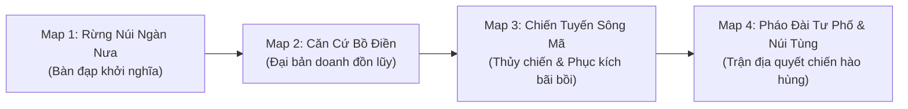

# Khảo Cứu Mỹ Thuật, Trang Phục, Vũ Khí, Kiến Trúc & Địa Hình Thời Kỳ Bà Triệu

## 1. Định Vị Văn Hóa & Mỹ Thuật (Thời Kỳ Giao Thoa Văn Hóa Đông Sơn Muộn)

* **Giai đoạn lịch sử**: Thế kỷ III SCN (khoảng 248 SCN) là thời kỳ người Việt chịu ách đô hộ của phương Bắc, nhưng nền tảng văn hóa bản địa Lạc Việt — Văn hóa Đông Sơn muộn vẫn giữ sức sống mãnh liệt.
* **Đặc trưng thị giác**:
  * Sự kết hợp hài hòa giữa chất liệu kim khí truyền thống (**đồng thau Đông Sơn**) với kỹ thuật luyện kim sắt đúc/rèn mới nổi.
  * Họa tiết trang trí chủ đạo: **Mặt trời tỏa tia sáng, chim Lạc bay, giao long/rồng nước cách điệu, hoa văn sóng nước và hình học kỷ hà**.
  * Tinh thần thẩm mỹ: Mạnh mẽ, phóng khoáng, gắn liền với sông nước, núi rừng và đầm lầy nhiệt đới.

---

## 2. Khảo Cứu Trang Phục & Giáp Trụ

```text
+---------------------------------------------------------------------------------------------------+
|                     HỆ THỐNG TRANG PHỤC & GIÁP TRỤ CHIẾN TRẬN BÀ TRIỆU                            |
+---------------------------------------------------------------------------------------------------+
|  [BÀ TRIỆU - THỦ LĨNH]            [TRIỆU QUỐC ĐẠT - LẠC TƯỚNG]     [NGHĨA BINH & DÂN QUÂN]         |
|  - Áo gấm vàng / Giáp vàng lộng lẫy - Áo nẹp da thuộc viền đồng     - Áo chàm vạt chéo túm gọn     |
|  - Trâm vàng cài tóc, guốc cong     - Hộ tâm phiến đồng tròn        - Váy xẻ / Quần túm cơ động    |
|  - Hộ tâm phiến chạm mặt trời       - Khăn vấn đầu màu sẫm          - Xăm mình họa tiết Giao long  |
|  - Ngự trên bành gấm Bạch Tượng     - Quấn xà cạp ống chân          - Hộ uyển da cổ tay            |
+---------------------------------------------------------------------------------------------------+
```

### 2.1. Tạo Hình Nữ Vương Triệu Thị Trinh
* **Chiến bào & Giáp phục**:
  * Sử sách dân gian khắc họa hình ảnh: *"Đầu voi phất ngọn cờ vàng, mặc áo giáp vàng, đi guốc cong, cài trâm vàng"*.
  * *Tạo hình trong game*: Mặc chiến bào bằng lụa gấm vàng rực rỡ bên trong, bên ngoài khoác áo giáp ngực bằng da thuộc nẹp viền đồng thau mạ vàng.
  * Trước ngực đeo **Hộ tâm phiến tròn bằng đồng thau Đông Sơn** chạm nổi hình Mặt trời 12 tia và đôi chim Lạc vút bay.
* **Phụ kiện & Thần thái**:
  * Tóc búi cao uy nghi cài cây trâm đồng/vàng chạm hình đuôi chim phượng.
  * Chân mang hài chiến bằng da thú hoặc guốc gỗ mũi cong nẹp quai da chắc chắn.
  * Ánh mắt kiên định, toát lên khí phách thủ lĩnh phi thường và uy quyền vương giả.

### 2.2. Tạo Hình Triệu Quốc Đạt & Các Hào Trưởng
* **Giáp trụ**: Áo giáp nẹp bằng nhiều lớp da thú rừng thuộc kỹ (da trâu rừng, da hổ) nẹp viền đồng; vai đeo giáp hộ kiên bằng đồng đúc hoa văn thú dữ.
* **Trang phục**: Khăn vấn đầu bản lớn màu chàm đậm hoặc nâu đất; đai lưng bằng da bản rộng có móc khóa đúc đồng; ống chân quấn xà cạp vải gai cơ động khi lội bùn.

### 2.3. Tạo Hình Nghĩa Binh Dân Quân & Nữ Binh Ngàn Nưa
* **Trang phục hàng ngày & Tác chiến**:
  * Áo ngắn vạt chéo màu chàm (nhuộm từ cây chàm rừng) hoặc nâu gụ nhuộm vỏ củ nâu.
  * Váy ngắn xẻ hai bên tà hoặc quần ống túm ngắn trên đầu gối, giúp di chuyển thần tốc trong lau sậy và đầm lầy.
  * Tục xăm mình họa tiết giao long/thủy quái trên ngực và cánh tay theo truyền thống Lạc Việt cổ để phòng ngừa thủy quái và thể hiện lòng dũng cảm.
* **Bảo hộ thân thể**: Bọc cổ tay (hộ uyển) bằng da thuộc quấn dây gai, đội nón chóp đan bằng lá cọ nẹp mây.

---

## 3. Khảo Cứu Vũ Khí Của Nghĩa Quân Lạc Việt

| Loại Vũ Khí | Chất Liệu & Đặc Điểm Cấu Tạo | Vai Trò Tác Chiến Trong Nghĩa Quân |
|---|---|---|
| **Gươm Đông Sơn Cán Hình Người / Thú** | Lưỡi đồng hoặc kiếm sắt rèn hai lưỡi; chuôi gươm đúc hình tượng nữ chiến binh hoặc thú thần uy mãnh. | Vũ khí cận chiến chỉ huy của Bà Triệu và các tướng lĩnh cao cấp. |
| **Dao Găm Cán Chữ T (Đông Sơn Dagger)** | Đồng thau nguyên khối, lưỡi hình tam giác nhọn, cán chữ T có hoa văn hình học. | Vũ khí tùy thân linh hoạt cho cận chiến tầm cực gần và ám sát. |
| **Giáo Búp Đa & Lao Phóng** | Mũi giáo bằng đồng hoặc sắt hình búp sen phình to, có rãnh thoát máu; cán tre đực hoặc gỗ nghiến dài 2m. | Vũ khí chủ lực của khối bộ binh dàn hàng cản phá kỵ binh và giáp sĩ Ngô. |
| **Nỏ Lạc Việt (Cổ Loa Crossbow)** | Khung gỗ dẻo dai nẹp gân trâu, lẫy nỏ bằng đồng có chốt hãm chắc chắn; bắn tên đồng/sắt đầu ba cạnh. | Vũ khí tầm xa sát thương cao, chuyên phục kích trong rừng rậm Ngàn Nưa. |
| **Trống Đồng & Tù Và Sừng Trâu** | Trống đồng loại I Heger (Trống Đông Sơn) chạm khắc hoa văn đoàn thuyền chiến và vũ sĩ. | Nhạc cụ chỉ huy chiến trận, phát hiệu lệnh công thủ và khích lệ tinh thần nghĩa binh. |

---

## 4. Hình Tượng Chiến Thú — Bạch Tượng (Voi Trắng Một Ngà)

Hình ảnh Bà Triệu cưỡi voi trắng ra trận là một trong những biểu tượng nghệ thuật hào hùng nhất của dân tộc:

* **Đặc điểm hình thể**: Voi rừng khổng lồ màu xám trắng uy nghi, có một ngà dài nhọn vươn cong dũng mãnh (hoặc ngà quặp).
* **Trang bị bành voi & Hộ giáp**:
  * Trên lưng voi đặt **Bành voi bằng gỗ quý bọc gấm thêu hoa văn chỉ vàng**, có lọng che màu vàng thắm rủ viền tua rua.
  * Đầu voi đeo **Tấm giáp hộ trán bằng đồng đúc** che chở trước làn tên mũi nỏ của địch.
  * Cổ voi đeo vòng lục lạc đồng phát ra âm thanh vang dội rền vang núi rừng mỗi khi xuất trận.

---

## 5. Khảo Cứu Kiến Trúc Thời Kỳ Thế Kỷ III SCN

```text
+---------------------------------------------------------------------------------------------------+
|                     KHẢO CỨU CÁC LOẠI HÌNH KIẾN TRÚC PHỤC VỤ ART & MAP                            |
+---------------------------------------------------------------------------------------------------+
|  [NHÀ SÀN MÁI CONG ĐÔNG SƠN]      [ĐỒN LŨY CĂN CỨ BỒ ĐIỀN]        [DOANH TRẠI QUÂN ĐÔNG NGÔ]      |
|  - Cột gỗ lim kê chân đá tảng     - Lũy đất nện, cọc gỗ lim       - Hàng rào chấn mộc cọc chéo    |
|  - Sàn tre cách đất chống ẩm      - Rào tre gai nhiều lớp         - Lều bạt quân dụng màu xám đen |
|  - Mái cong hình thuyền vút cao   - Hào nước cắm chông tre ngầm   - Tháp canh nỏ nhiều tầng gỗ    |
|  - Cầu thang gỗ khắc hoa văn      - Chòi quan sát nỏ liên hoàn    - Đài chỉ huy cắm cờ tướng Ngô  |
+---------------------------------------------------------------------------------------------------+
```

### 5.1. Kiến Trúc Dân Cư Lạc Việt: Nhà Sàn Mái Cong Hình Thuyền
* **Đặc trưng**: Dựa trên hoa văn khắc trên thạp đồng Đào Thịnh và trống đồng Ngọc Lũ: Nhà sàn có mái uốn cong vút lên như hình mũi thuyền, hai đầu mái có gắn biểu tượng đầu chim hoặc sừng thú.
* **Vật liệu**: Cột bằng thân gỗ lim hoặc nghiến, sàn ghép bằng thân tre đực hoặc ván gỗ, mái lợp nhiều lớp lá cọ hoặc cỏ tranh dày dặn.
* **Cầu thang**: Bằng thân gỗ nguyên khối đẽo bậc, đầu cầu thang chạm khắc hình đôi bầu vú (biểu tượng tín ngưỡng phồn thực mẫu hệ) hoặc đầu giao long.

### 5.2. Kiến Trúc Quân Sự Bản Địa: Đồn Lũy Căn Cứ Bồ Điền
* **Tường lũy & Hào phòng thủ**: Tường lũy đắp bằng đất nện kết hợp ken cọc gỗ lim dày đặc; bên ngoài bao bọc bởi nhiều lớp hàng rào tre gai rậm rạp; hào sâu dẫn nước đầm lầy cắm chông nứa vạt nhọn ngầm dưới nước bùn.
* **Chòi quan sát & Cổng trại**: Chòi canh dựng bằng thân cau rừng hoặc gỗ lim cao vượt ngọn cây, trang bị dàn nỏ lớn; cổng chính làm bằng hai cánh gỗ dày buộc đai mây bện.

### 5.3. Kiến Trúc Quân Sự Phương Bắc: Doanh Trại & Thành Cổ Quân Ngô
* **Thành Tư Phố**: Thành đất nện kiên cố hình chữ nhật, có hào nước bao bọc bốn phía, cổng thành bằng gỗ lim nẹp sắt bản rộng.
* **Doanh trại dã chiến quân Ngô**: Hệ thống rào chấn mộc (cọc gỗ nhọn bắt chéo hình chữ X), lều bạt hình chóp quân dụng màu xám đen viền đỏ son; đài chỉ huy cao tầng dựng cờ thêu chữ "Ngô" và "Lục".

---

## 6. Khảo Cứu 4 Vùng Địa Hình Chiến Trường (Level & Map Design Concept)



### 6.1. Map 1: Rừng Núi Ngàn Nưa (Triệu Sơn)
* **Bối cảnh**: Vùng rừng nguyên sinh đại ngàn thâm u, núi đá vôi vách dựng đứng, nhiều hang động bí mật và khe suối thác ghềnh chảy xiết.
* **Yếu tố môi trường**: Sương mù bảng lảng buổi sớm, thảm thực vật dương xỉ và cây cổ thụ rậm rạp; thích hợp cho bẫy đá lăn, bẫy chông nứa phục kích đoàn xe vận lương của giặc.
* **Palette màu sắc**: Xanh rêu đậm, xám đá ẩm ướt, nâu đất rừng, ánh nắng vàng rọi qua kẽ lá.

### 6.2. Map 2: Căn Cứ Bồ Điền (Phú Điền - Hậu Lộc)
* **Bối cảnh**: Vùng bán sơn địa trù phú, mặt trước là đồng lúa và đầm lầy lau sậy mênh mông, mặt sau tựa vào dãy núi đá Tùng Sơn hiểm trở.
* **Yếu tố công trình**: Hệ thống doanh trại bằng gỗ lim, hào sâu cắm cọc tre vạt nhọn, hàng rào tre gai kiên cố, tháp canh bằng thân cau rừng và lầu chỉ huy trung tâm phất cờ vàng.
* **Palette màu sắc**: Vàng tươi lúa chín, xanh ngọc lau sậy, nâu gỗ trầm, cờ phướn vàng kim rực rỡ.

### 6.3. Map 3: Chiến Tuyến Sông Mã — Sông Chu (Thủy Trận)
* **Bối cảnh**: Lưu vực sông lớn cuồn cuộn phù sa, bãi bồi bạt ngàn lau sậy rậm rạp; bến sông nơi thuyền độc mộc của nghĩa quân đối đầu với Lâu thuyền và Mông xung của hạm đội Đông Ngô.
* **Yếu tố môi trường**: Cầu phao tre ghép, bãi cọc ngầm ven sông, ngọn lửa cháy bập bùng từ hỏa công thiêu thuyền địch.
* **Palette màu sắc**: Đỏ gạch phù sa sông, trắng bạc hoa lau sậy, đỏ cam rực lửa hỏa công, xanh lam mặt nước.

### 6.4. Map 4: Pháo Đài Cổ Tư Phố & Đỉnh Núi Tùng
* **Bối cảnh**: Tòa thành cổ Tư Phố đắp bằng đất nện kiên cố kết hợp lũy gỗ lim; đỉnh núi Tùng cheo leo với những tảng đá khổng lồ nhìn bao quát toàn bộ vùng biển Lạch Trường.
* **Yếu tố môi trường**: Khói lửa trận mạc mịt mù, mũi tên cắm dày đặc trên tường lũy, cờ trận rách bay phấp phới trong gió biển lồng lộng.
* **Palette màu sắc**: Đỏ hoàng hôn bi tráng, xám đen khói lửa, vàng đồng giáp phục, ánh hoàng hôn chiếu rọi đỉnh núi Tùng thiêng liêng.
