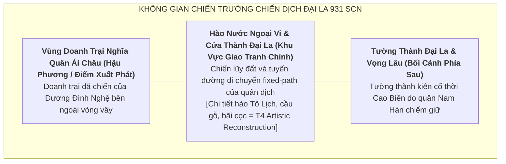

# Định Hướng Bối Cảnh & Không Gian Map: Chapter Khúc Gia & Dương Đình Nghệ (905–937 SCN)

> [!IMPORTANT]
> **Ràng Buộc Định Hướng Map (Task `VS-KDN-01`)**:
> - Tài liệu này xác lập định hướng không gian chiến trường, phân tầng địa danh học và bầu không khí nghệ thuật cho Chapter tập trung vào trận chiến giải phóng thành Đại La năm 931.
> - **TUYỆT ĐỐI KHÔNG**:
>   - Không vẽ tọa độ đường đi (path coordinates) cụ thể.
>   - Không viết kịch bản wave hay thứ tự đợt xuất hiện của kẻ địch.
>   - Không gán chỉ số stats hay thuộc tính môi trường tác động lên combat.
>   - Không nâng các chi tiết phục dựng nghệ thuật (T4 Artistic Reconstruction) lên mức T1/T2 fact.

---

## 1. Tổng Quan Không Gian Chiến Trường (Map Theme)

* **Tên Định Hướng Primary Map**: **Chiến Lũy Đại La — Giải Phóng Phủ Thành (931 SCN)**.
* **Bối cảnh thời gian**: Năm 931 SCN (Giai đoạn cao trào quân dân Ái Châu bao vây hạ thành Đại La và tiêu diệt viện binh Nam Hán).
* **Không gian địa lý**: Khu vực ngoại vi và cửa thành Đại La (khu vực nội thành Hà Nội ngày nay — T1/T2 confirmed toponym).
* **Vị trí của Ái Châu (Thanh Hóa)**: Đóng vai trò **Narrative Origin / Prelude** (căn cứ khởi binh tụ nghĩa), không xây dựng thành map chiến đấu độc lập để tập trung toàn bộ trọng tâm gameplay vào trận địa Đại La.

---

## 2. Phân Tầng Địa Danh Học & Tính Xác Thực Lịch Sử

Để đảm bảo tính trung thực học thuật, các yếu tố không gian được phân định theo 3 cấp độ rõ ràng:

### 2.1. Địa Danh Ghi Nhận Trong Chính Sử (T1/T2 Historical Toponyms)
* **Thành Đại La (La Thành / 大羅城)**: Trọng trấn trung tâm của Giao Châu / Tĩnh Hải quân (T1/T2), nơi Thứ sử Nam Hán Lý Tiến đóng quân và bị nghĩa quân Dương Đình Nghệ đánh chiếm năm 931.
* **Ái Châu (愛州 — Thanh Hóa)**: Vùng đất khởi nghiệp và tập hợp lực lượng của Dương Đình Nghệ (T1/T2), đóng vai trò Narrative Origin của chiến dịch.
* **Sông Tô Lịch (Tô Lịch Giang)**: Hào lũy tự nhiên bao bọc phía Tây và Bắc thành Đại La (T1/T2).

### 2.2. Khảo Cứu Khảo Cổ Thực Địa & Bối Cảnh Vật Chất (T4 Archaeological Context)
* **Quy mô thành Đại La**: Khảo cổ học Thăng Long xác định dấu tích các tầng văn hóa thời Đường — Ngũ Đại (thế kỷ IX–X) với tường thành đắp đất nện kiên cố, chân thành kè gạch, hào sâu bao quanh, kết nối với mạng lưới sông ngòi tự nhiên.

### 2.3. Tái Dựng Nghệ Thuật Trong Gameplay (T4 Artistic Reconstruction)

> [!WARNING]
> **Phân biệt rõ T4 Artistic Reconstruction với T1/T2 Historical Fact**:
> Các chi tiết tái dựng cụ thể dưới đây — bao gồm bố cục hào Tô Lịch trên map, cầu gỗ, bãi cọc rào, vị trí đặt cờ xí, chi tiết kiến trúc tường thành — là **`[T4 / Artistic Reconstruction]`** phục vụ trải nghiệm trực quan 2D Tower Defense, không được trình bày hoặc hiểu như dữ kiện địa lý/quân sự T1/T2 xác thực.

* **Cảnh quan visual** `[T4 / Artistic Reconstruction]`:
  - Tông màu chủ đạo: Không khí sục sôi của trận công thành mùa thu năm 931, màu đất phù sa sông Tô Lịch, tường thành gạch đất phủ rêu phong, cờ xí nghĩa quân Ái Châu tung bay trong gió.
  - Công trình phòng thủ: Hào nước ngoại vi, ụ đất dã chiến và chòi canh bằng gỗ ngoài cổng thành.
* **Đối lập thị giác giữa hai phe** `[T4 / Artistic Interpretation]`:
  - **Nghĩa quân Ái Châu**: Trang phục áo nâu dũng tướng, khiên đồng thô mộc, tinh thần quật cường, vũ khí truyền thống Việt cổ kết hợp gươm đao thời Ngũ Đại.
  - **Quân Nam Hán**: Giáp phiến đồng sẫm màu, cờ hiệu rồng lửa phương Nam mang niên hiệu Đại Hữu, vũ khí trường kích sắc lạnh.

---

## 3. Định Hướng Bối Cảnh Chiến Thuật & Ý Nghĩa Gameplay (Narrative Flow)

* **Hướng tiến công của Enemy (Fixed-Path Map Direction)**:
  - Bối cảnh map mô phỏng hai luồng áp lực:
    1. *Giai đoạn 1*: Thủ quân Nam Hán dưới quyền Thứ sử Lý Tiến cố thủ và phá vây mở đường máu chạy về phía sông khi Đại La bị vây.
    2. *Giai đoạn 2*: Đạo quân tiếp viện Nam Hán do Thừa chỉ **Trình Bảo (程寶)** thống lĩnh tràn vào giải cứu thành, tạo nên trận ác chiến quyết định ngay trước cửa phủ thành.
* **Bố trí trận địa phòng thủ (Hero Deployment Concept)**:
  - Người chơi triển khai các Hero tại các ụ đất cao, mỏm đê ven hào và cửa ngõ giao cắt trọng yếu để khống chế toàn bộ tuyến đường tiến thoái của giặc.
* **Ý Nghĩa Chiến Thắng Trong Màn Chơi (Historical & Gameplay Victory)**:
  - **Chiến thắng trọn vẹn của chiến dịch**: Đánh đuổi Lý Tiến, tiêu diệt hoàn toàn viện binh Trình Bảo, chính thức giải phóng phủ thành Đại La năm 931.
  - **Ý nghĩa lịch sử**: Khôi phục nền độc lập tự chủ toàn vẹn của Tĩnh Hải quân, Dương Đình Nghệ xưng Tiết độ sứ, đặt dấu chấm hết cho mưu đồ thôn tính lần thứ nhất của nhà Nam Hán.
* **Cầu nối Epilogue (Epilogue Bridge)**:
  - Kết thúc Chapter với phân đoạn biến cố năm 937 (Kiều Công Tiễn ám hại Dương Đình Nghệ), mở ra trực tiếp bối cảnh hịch văn của Ngô Quyền tiến quân ra Bắc chuẩn bị cho đại thắng Bạch Đằng 938.

---

## 4. Tóm Tắt Định Hướng Phát Triển Tiếp Theo

1. **Giai đoạn tiếp theo (VS-KDN-02 / Playable Concepts)**: Viết concept chi tiết cho các Hero (Dương Đình Nghệ — LOCK; Ngô Quyền / Đinh Công Trứ — PROVISIONAL) và Enemy archetypes sau khi Roster được duyệt PASS, tuân thủ nguyên tắc không gán balance stats.
2. **Visual Art Direction**: Tập trung vào phong thái dũng tướng Ái Châu kiêu hùng của Dương Đình Nghệ, trang phục đặc trưng thời Ngũ Đại Thập Quốc của quân Nam Hán (Lý Tiến, Trình Bảo).
