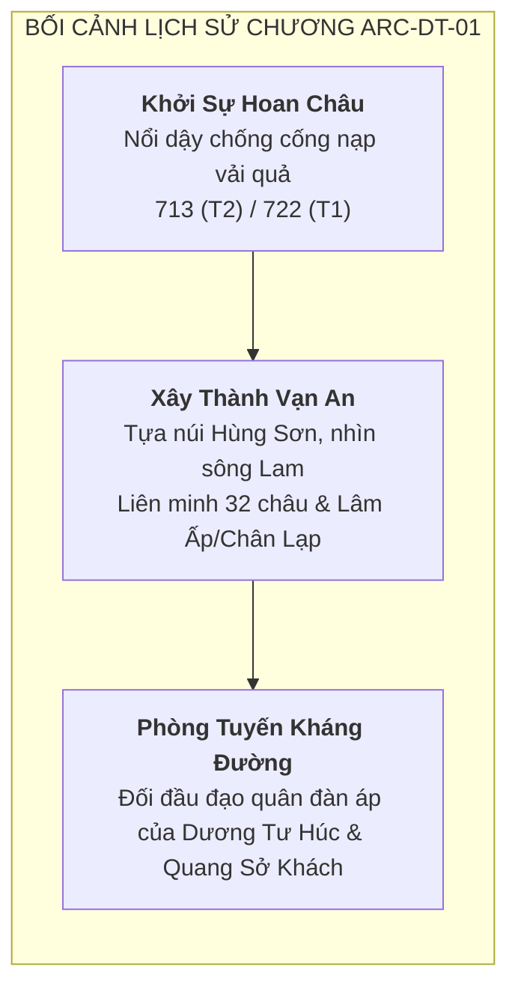

# Chapter ARC-DT-01: Quật Khởi Hoan Châu — Mai Hắc Đế (~713/722 SCN)

> [!IMPORTANT]
> **Ràng Buộc Nhiệm Vụ (Task `VS-MTL-01`)**:
> - Đây là tài liệu **Đề Xuất Tuyển Chọn Roster (Roster Selection Proposal)** và **Định Hướng Bối Cảnh Map (Chapter Direction)** cho Chapter `ARC-DT-01` thuộc chuỗi nội dung lịch sử Giai đoạn 602–938.
> - Sử dụng tài liệu nghiên cứu đã được Audit PASS `docs/drafts/viet-su/602-938/**` làm cơ sở sử liệu chuẩn (historical baseline).
> - **TUYỆT ĐỐI CHƯA LÀM**:
>   - Không khóa chỉ số stats (HP, ATK, Range, AttackSpeed).
>   - Không thiết kế Skill, Passive, hay TriggerHits.
>   - Không viết Wave outline hay cơ chế Enemy combat.
>   - Không tạo prompt asset, sprite hay file PNG.
>   - Không sửa `src/**` hoặc `PROJECT_PLAN.md`.

---

## 1. Mục Tiêu & Phạm Vi Chương (Chapter Scope)

Chapter `ARC-DT-01` tái hiện cao trào phong trào khởi nghĩa của nhân dân Hoan Châu (Nghệ Tĩnh) chống lại ách đô hộ của nhà Đường vào đầu thế kỷ VIII dưới sự lãnh đạo của **Mai Thúc Loan (Mai Hắc Đế)**.

---

## 2. Cấu Trúc Hồ Sơ Tài Liệu

Tập hồ sơ tuyển chọn nội dung cho Chapter Mai Thúc Loan gồm 2 tài liệu thành phần chính:

| Tài Liệu | Nội Dung Trọng Tâm |
|---|---|
| [roster-selection.md](roster-selection.md) | Khảo cứu và đề xuất danh sách 3 Playable Hero (kèm 2 phương án Fallback), 3 Normal Enemy Archetypes, 1 Elite Unit và 2 Boss Candidates (Dương Tư Húc, Quang Sở Khách); phân tầng nguồn T1/T2/T3/T4 và mức độ tin cậy. |
| [chapter-direction.md](chapter-direction.md) | Định hướng bối cảnh không gian chiến trường thành Vạn An — thung lũng sông Lam, phân định rạch ròi giữa địa danh lịch sử, khảo cổ và tái dựng nghệ thuật; xác định phạm vi chiến thắng chiến thuật (local victory) trong gameplay. |

---

## 3. Nguyên Tắc Lịch Sử Cốt Lõi (Historical Guardrails)

1. **Niên đại song hành (Dual Chronology)**: Ghi nhận `713–722 SCN (T2)` vs `722 SCN (T1)`. Không gượng ép thành một mốc thời gian duy nhất.
2. **Quy mô quân số**: Con số "30–40 vạn liên quân" trong thư tịch cổ là ước lệ phóng đại (rhetorical exaggeration); không sử dụng làm quy mô enemy trong game.
3. **Liên minh phương Nam**: Liên minh với Lâm Ấp (Champa) và Chân Lạp (Khmer) là sự thật lịch sử (T1 Fact), nhưng không tự tạo danh tướng hư cấu đại diện cho họ khi chưa có sử liệu xác nhận.
4. **Phân loại nguồn nghiêm ngặt**:
   - Nhân vật có trong chính sử gần thời / trung đại: Mai Thúc Loan (T1/T2).
   - Nhân vật chỉ tồn tại trong thần tích địa phương: Phạm Thị Uyển, Mai Kỳ Sơn (T3) $\rightarrow$ Giữ trạng thái **PROVISIONAL**, không biến thành T1 fact.
   - Boss phương Bắc: Dương Tư Húc (T1), Quang Sở Khách (T1 — chuẩn hóa canonical name, cấm dùng "Nguyên Sở Khách").
