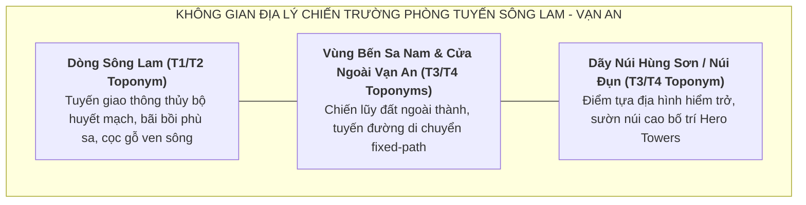

# Định Hướng Bối Cảnh & Không Gian Map: Chapter ARC-DT-01

> [!IMPORTANT]
> **Ràng Buộc Định Hướng Map (Task `VS-MTL-01`)**:
> - Tài liệu này xác lập định hướng không gian chiến trường, phân tầng địa danh học và bầu không khí nghệ thuật cho Chapter `ARC-DT-01` ("Quật Khởi Hoan Châu — Mai Hắc Đế").
> - **TUYỆT ĐỐI KHÔNG**:
>   - Không vẽ tọa độ đường đi (path coordinates) cụ thể.
>   - Không viết kịch bản wave hay thứ tự đợt xuất hiện của kẻ địch.
>   - Không gán chỉ số stats hay thuộc tính môi trường tác động lên combat.

---

## 1. Tổng Quan Không Gian Chiến Trường (Map Theme)

* **Tên Định Hướng Map**: **Phòng Tuyến Sông Lam — Vạn An** (hoặc **Chiến Lũy Vạn An — Núi Hùng Sơn**).
* **Bối cảnh thời gian**: Khoảng 713/722 SCN (Giai đoạn quật khởi Hoan Châu và chống đạo quân đàn áp của nhà Đường).
* **Không gian địa lý**: Vùng thung lũng sông núi ven sông Lam, thuộc châu Hoan (khu vực huyện Nam Đàn, tỉnh Nghệ An ngày nay theo khảo cứu địa lý lịch sử).

---

## 2. Phân Tầng Địa Danh Học & Tính Xác Thực Lịch Sử

Để đảm bảo tính trung thực học thuật, các yếu tố không gian được phân định theo 3 cấp độ rõ ràng:

### 2.1. Địa Danh Ghi Nhận Trong Chính Sử (T1/T2 Historical Toponyms — Near-Source Supported)
* **Hoan Châu (Châu Hoan / 驩州)**: Đơn vị hành chính trọng yếu ở phía Nam An Nam đô hộ phủ thời Đường (**T1/T2**), trung tâm bùng nổ cuộc khởi nghĩa của Mai Thúc Loan (near-source supported).
* **An Nam Đô Hộ Phủ (安南都護府)**: Cơ cấu cai trị của triều Đường tại Giao Châu (**T1**).
* **Sông Lam (Lam Giang / Sông Cả)**: Dòng sông huyết mạch lớn của xứ Nghệ (**T1/T2**), đóng vai trò trục giao thông thủy chiến và bối cảnh tự nhiên của vùng khởi nghĩa.

### 2.2. Địa Danh Dân Gian & Khảo Cứu Thực Địa / Tái Dựng Lịch Sử (T3/T4 Toponyms)
* **Thành Vạn An**: Căn cứ địa trung tâm của Mai Hắc Đế, được lưu truyền qua **truyền thuyết dân gian địa phương (T3)** và được các công trình **khảo cứu thực địa / sử học hiện đại (T4)** (Đào Duy Anh, Phan Huy Lê, Hà Văn Tấn) xác định tại vùng thung lũng xã Vân Diên và thị trấn Nam Đàn (Nghệ An); **không phải địa danh xuất hiện trực tiếp trong văn bản T1/T2**.
* **Núi Đụn (Hùng Sơn)**: Ngọn núi đất đá tự nhiên cao hơn 400m cạnh sông Lam, nơi đặt đại bản doanh và mộ vua Mai Hắc Đế theo **truyền thống địa phương T3** và **khảo cứu thực địa T4**.
* **Sa Nam**: Vùng bến sông trù phú thuộc huyện Nam Đàn, gắn liền với **truyền tích dân gian T3** về nơi Mai Thúc Loan tập hợp dân phu gánh vải dấy binh.
* **Mối liên hệ không gian Sông Lam — Vạn An — Hùng Sơn**: Là kết quả **tổng hợp địa lý lịch sử và khảo cổ học hiện đại (T4)**, không tự nâng lên thành Fact chính sử T1/T2.

### 2.3. Tái Dựng Nghệ Thuật Trong Gameplay (Artistic Game Reconstruction — Game Interpretation)
* **Cảnh quan visual**:
  - Tông màu chủ đạo: Nắng gió miền Trung, màu xanh thẫm của rừng núi Hùng Sơn, màu đỏ gạch phù sa sông Lam, màu áo chàm thô mộc của nghĩa binh nông dân Hoan Châu.
  - Công trình phòng ngự: Lũy tre, tường đắp đất nện thô sơ, bãi chông gỗ và cổng ngoài căn cứ.
* **Đối lập thị giác với phe xâm lược Đường**:
  - Quân Đường: Trang phục giáp trụ kim loại sẫm màu, cờ xí mang niên hiệu Khai Nguyên triều Đường, vũ khí đồng bộ sắc lạnh, thể hiện sự áp chế quy củ của đế chế phương Bắc.
  - *Lưu ý*: Toàn bộ chi tiết phục dựng mỹ thuật là **Game Interpretation (T4)**, không biến thành T1 fact.

---

## 3. Định Hướng Bối Cảnh Chiến Thuật (Map Context & Guardrails)

* **Không gian đường tiến quân (Fixed-Path Map Direction)**:
  - Bối cảnh map mô phỏng hướng hành quân men theo bờ sông Lam và thung lũng Sa Nam tiến về phía cổng căn cứ Vạn An.
  - Tuyến đường cố định (fixed path) đi qua các bãi cọc gỗ, hàng rào tre phòng ngự và chân núi Hùng Sơn.
* **Bố trí trận địa phòng thủ (Hero Deployment Concept)**:
  - Người chơi triển khai các Hero (Mai Hắc Đế, Phạm Thị Uyển, Mai Kỳ Sơn) tại các mỏm đá tự nhiên, gò đất cao và chiến lũy ven sông để kiểm soát tầm đường đi của quân địch.
* **Ý Nghĩa Chiến Thắng Trong Màn Chơi (Local Victory Guardrail)**:
  - **Mục tiêu gameplay**: Chặn đứng các đợt tiến công của quân Đường, bảo vệ an toàn cổng căn cứ trong phạm vi màn chơi.
  - **Ý nghĩa lịch sử**: Đây là chiến thắng chiến thuật cục bộ (tactical in-stage victory) tôn vinh tinh thần quật khởi của nghĩa quân Hoan Châu; hoàn toàn không thay đổi đại cục lịch sử năm 722 (sự hy sinh anh dũng của Mai Hắc Đế trước đại quân viễn chinh của Dương Tư Húc).

---

## 4. Tóm Tắt Định Hướng Phát Triển Tiếp Theo

1. **Giai đoạn tiếp theo (VS-MTL-02 / Playable Concepts)**: Sau khi Roster được duyệt PASS, sẽ tiến hành viết concept chi tiết cho 3 Hero chính và Enemy archetypes mà không gán balance stats.
2. **Visual Asset Concept**: Tập trung vào sắc thái áo chàm (đức Thủy), phong thái dũng tướng miền Trung của Mai Thúc Loan và phục trang triều Đường thế kỷ VIII của Dương Tư Húc / Quang Sở Khách dưới dạng Game Interpretation.
