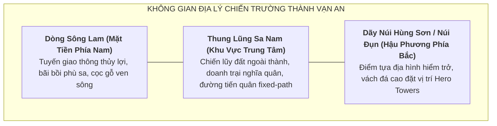

# Định Hướng Bối Cảnh & Không Gian Map: Chapter ARC-DT-01

> [!IMPORTANT]
> **Ràng Buộc Định Hướng Map (Task `VS-MTL-01`)**:
> - Tài liệu này xác lập định hướng không gian chiến trường, phân tầng địa danh học và bầu không khí nghệ thuật cho Chapter `ARC-DT-01` ("Quật Khởi Hoan Châu — Mai Hắc Đế").
> - **TUYỆT ĐỐI KHÔNG**:
>   - Không vẽ tọa độ đường đi (path coordinates) cụ thể.
>   - Không viết kịch bản wave hay thời gian spawn.
>   - Không gán chỉ số stats hay thuộc tính môi trường tác động lên combat.

---

## 1. Tổng Quan Không Gian Chiến Trường (Map Theme)

* **Tên Định Hướng Map**: **Phòng Tuyến Vạn An — Thung Lũng Sông Lam** (hoặc **Chiến Lũy Vạn An — Núi Hùng Sơn**).
* **Bối cảnh thời gian**: Khoảng 713/722 SCN (Giai đoạn quật khởi và đối đầu đạo quân viễn chinh nhà Đường).
* **Không gian địa lý**: Vùng thung lũng hiểm yếu Sa Nam kẹp giữa dòng sông Lam hùng vĩ và dãy núi Hùng Sơn (núi Đụn), thuộc châu Hoan (nay là huyện Nam Đàn, tỉnh Nghệ An).

---

## 2. Phân Tầng Địa Danh Học & Tính Xác Thực Lịch Sử

Để đảm bảo tính trung thực học thuật, các yếu tố không gian được phân định theo 3 cấp độ:

### 2.1. Địa Danh Ghi Nhận Trong Chính Sử (T1/T2 Historical Toponyms)
* **Hoan Châu (Châu Hoan / 驩州)**: Đơn vị hành chính trọng yếu ở phía Nam An Nam đô hộ phủ thời Đường, trung tâm bùng nổ cuộc khởi nghĩa của Mai Thúc Loan.
* **An Nam Đô Hộ Phủ (安南都護府)**: Cơ cấu cai trị của triều Đường, nơi nghĩa quân Mai Thúc Loan từng tiến quân giải phóng phủ thành Tống Bình.
* **Sông Lam (Lam Giang)**: Dòng sông huyết mạch của xứ Nghệ, đóng vai trò tuyến vận tải và chiến trường thủy bộ của khởi nghĩa.

### 2.2. Địa Danh Khảo Cứu Thực Địa & Dân Gian (T3/T4 Archaeological & Local Toponyms)
* **Thành Vạn An**: Căn cứ địa trung tâm của Mai Hắc Đế, được các nhà sử học và khảo cổ học hiện đại (Đào Duy Anh, Phan Huy Lê) xác định nằm ở vùng thung lũng sông núi xã Vân Diên và thị trấn Nam Đàn (Nghệ An).
* **Núi Đụn (Hùng Sơn)**: Ngọn núi đất đá hiểm trở cao hơn 400m, nơi đặt đại bản doanh và mộ vua Mai Hắc Đế.
* **Bến Sa Nam**: Vùng bến sông trù phú, nơi Mai Thúc Loan tập hợp dân phu gánh vải nổi dậy dấy binh.

### 2.3. Tái Dựng Nghệ Thuật Trong Gameplay (Artistic Game Reconstruction)
* **Cảnh quan visual**:
  - Tông màu chủ đạo: Nắng gió miền Trung, màu xanh thẫm của núi rừng Hùng Sơn, màu đỏ gạch phù sa sông Lam, màu áo chàm thô mộc của nghĩa binh nông dân Hoan Châu.
  - Công trình phòng ngự: Lũy tre, tường đắp đất nện thô sơ, bãi chông gỗ và cổng gỗ ngoài thành Vạn An.
* **Đối lập thị giác với phe xâm lược Đường**:
  - Quân Đường: Trang phục giáp trụ kim loại sẫm màu, cờ xí mang niên hiệu Khai Nguyên triều Đường, vũ khí đồng bộ sắc lạnh, thể hiện sự áp chế quy củ của đế chế phương Bắc.

---

## 3. Định Hướng Dòng Trận Đấu & Ý Nghĩa Chiến Thuật (Narrative Flow)

* **Hướng tiến công của Enemy (Fixed-Path Concept)**:
  - Tái hiện lại mũi hành quân bất ngờ của Phiêu kỵ tướng quân Dương Tư Húc: men theo đường bờ biển và dọc bãi bồi thung lũng sông Lam tiến sâu vào cửa ngõ thành Vạn An.
  - Các đợt tiến quân của giặc gồm bộ binh giáp nhẹ, kỵ binh trinh sát và sĩ quan thiết giáp nối tiếp nhau tạo sức ép liên tục trên cung đường tiến quân duy nhất.
* **Bố trí trận địa phòng thủ (Hero Deployment Concept)**:
  - Người chơi triển khai các Hero (Mai Húc Đế, Phạm Thị Uyển, Mai Kỳ Sơn) tại các mỏm đá tự nhiên, gò đất cao và chiến lũy ven sông để khóa chặt tầm di chuyển của giặc.
* **Ý Nghĩa Chiến Thắng Trong Màn Chơi (Local Victory Guardrail)**:
  - **Mục tiêu gameplay**: Chặn đứng các đợt xung phong của tiên phong quân Đường, bảo vệ an toàn cổng thành Vạn An trong giai đoạn quật khởi (713–722 SCN).
  - **Ý nghĩa lịch sử**: Đây là chiến thắng chiến thuật cục bộ nhằm tôn vinh khí phách kiên cường bất khuất của nghĩa quân Hoan Châu, không làm thay đổi đại cục lịch sử năm 722 (sự hy sinh anh dũng của Mai Hắc Đế trước cuộc đàn áp tàn bạo của Dương Tư Húc).

---

## 4. Tóm Tắt Định Hướng Phát Triển Tiếp Theo

1. **Giai đoạn tiếp theo (VS-MTL-02 / Playable Concepts)**: Sau khi Roster được duyệt PASS, sẽ tiến hành viết concept chi tiết cho 3 Hero chính và Enemy archetypes mà không gán balance stats.
2. **Visual Asset Concept**: Tập trung vào sắc thái áo chàm (đức Thủy), dáng dấp dũng tướng miền Trung của Mai Thúc Loan và phục trang triều Đường thế kỷ VIII của Dương Tư Húc / Quang Sở Khách.
