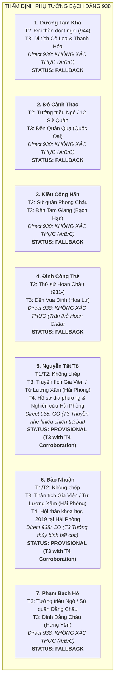

# Báo Cáo Thẩm Định Chi Tiết Từng Ứng Viên Phụ Tướng (Task `VS-NQ-02A`)

> [!IMPORTANT]
> **Quy Chuẩn Thẩm Định Từng Ứng Viên**:
> - Tài liệu này cung cấp hồ sơ nghiên cứu thực chứng độc lập cho từng nhân vật được khảo sát nhằm tìm kiếm ứng viên cho **Hero Slot 2** và **Hero Slot 3** của Chapter Bạch Đằng 938.
> - **Tiêu chí phân định cốt lõi**:
>   - **A. Phục vụ Ngô Quyền**
>   - **B. Sống cùng thời**
>   - **C. Tướng lĩnh vương triều Ngô**
>   - **D. Trực tiếp tham chiến trận Bạch Đằng 938**
>   $$\text{A / B / C} \not\Rightarrow \text{D (Chỉ xem xét PROVISIONAL khi có chứng cứ thực chiến D)}$$

---

## 1. Bản Đồ Tổng Quan Các Ứng Viên Khảo Sát

---

## 2. Thẩm Định Chi Tiết Từng Ứng Viên

### 2.1. Ứng Viên 1: Dương Tam Kha (楊三哥)

* **Identity**: Tướng lĩnh Ái Châu, em vợ Ngô Quyền (em ruột Dương Hoàng Hậu), con trai thứ của Tiết độ sứ Dương Đình Nghệ.
* **T1 Evidence**: **Hoàn toàn KHÔNG ghi nhận** (*Tân Ngũ Đại Sử* Q65, *Tư Trị Thông Giám* Q281 đều không chép tên Dương Tam Kha).
* **T2 Evidence**:
  * *Đại Việt Sử Ký Toàn Thư* (Ngoại kỷ Quyển 5, Kỷ Nhà Ngô) & *Khâm Định Việt Sử Thông Giám Cương Mục* (Tiền biên Q5):
    - Ghi chép hành trạng chính trị và vương triều về sau: Năm 944, Ngô Quyền lâm chung ủy thác phụ chính; Tam Kha cướp ngôi xưng Dương Bình Vương (944–950), nhận Ngô Xương Văn làm con nuôi. Năm 950 bị giáng làm Chương Dương sứ.
    - **T2 HOÀN TOÀN KHÔNG CHÉP việc Dương Tam Kha tham gia trận Bạch Đằng năm 938**.
* **T3 Evidence (Di tích & Thần tích định danh cụ thể)**:
  * **Di tích 1**: Đền thờ Dương Tam Kha tại làng Thành Đạt (xã Thiệu Phú, huyện Thiệu Hóa, tỉnh Thanh Hóa) — Thờ cúng công đức khai khẩn sau năm 950.
  * **Di tích 2**: Miếu thờ Dương Tam Kha tại Cổ Loa (xã Cổ Loa, huyện Đông Anh, TP. Hà Nội).
  * **Nội dung ghi nhận**: Khẳng định ông là con Dương Đình Nghệ, phụ chính triều Ngô tại Cổ Loa. Không có văn bản T3 nào ghi chép chi tiết việc ông cầm quân tại trận Bạch Đằng 938.
* **T4 Evidence**: Các công trình nghiên cứu của Viện Sử học đánh giá vai trò của Dương Tam Kha trong vương triều Ngô (944–950).
* **Direct 938 Evidence?**: **NO (Hoàn toàn không có chứng cứ tham chiến trực tiếp 938)**.
  - Thuộc nhóm **A (Quan hệ thân cận với Ngô Quyền)**, **B (Sống cùng thời)**, **C (Đại thần triều Ngô)**.
* **Contradictions / Uncertainties**: Suy đoán phổ thông gán ông đi trả thù cho cha không có cơ sở văn bản học.
* **Confidence**: `Low / Unverified for 938 Battlefield`.
* **Recommendation**: **`FALLBACK / UNVERIFIED 938 PARTICIPATION`**.

---

### 2.2. Ứng Viên 2: Đỗ Cảnh Thạc (杜景碩)

* **Identity**: Hào trưởng đất Đỗ Động Giang (Thanh Oai, Hà Nội), tướng lĩnh thời Ngô, sau này là Đỗ Cảnh Công trong 12 Sứ Quân.
* **T1 Evidence**: **Hoàn toàn KHÔNG ghi nhận**.
* **T2 Evidence**:
  * *Đại Việt Sử Ký Toàn Thư* (Ngoại kỷ Q5): Ghi nhận là đại tướng thời Ngô Vương, sau năm 965 chiếm Đỗ Động Giang làm sứ quân xưng Đỗ Cảnh Công. **T2 HOÀN TOÀN KHÔNG GHI NHẬN ông tham gia trận Bạch Đằng năm 938**.
* **T3 Evidence (Di tích & Thần tích định danh cụ thể)**:
  * **Di tích 1**: Đền Quán Quạ (chân núi Sài Sơn, thôn Sài Khê, xã Sài Sơn, huyện Quốc Oai, TP. Hà Nội) — Di tích Lịch sử cấp Quốc gia.
  * **Di tích 2**: Đình làng Bình Đà (xã Bình Minh, huyện Thanh Oai, TP. Hà Nội).
  * **Nội dung ghi nhận**: Thần tích ghi ông theo Ngô Quyền diệt Kiều Công Tiễn tại Đại La, sau làm tướng giữ Cổ Loa. Không có miêu tả tác chiến thủy binh tại bãi cọc Bạch Đằng 938.
* **T4 Evidence**: Các khảo cứu khảo cổ học về căn cứ thành lũy Đỗ Động Giang thời 12 Sứ Quân.
* **Direct 938 Evidence?**: **NO (Không có chứng cứ thực chiến trực tiếp 938)**.
  - Thuộc nhóm **A (Theo Ngô Quyền diệt Kiều Công Tiễn)**, **B (Cùng thời)**, **C (Đại tướng triều Ngô)**.
* **Confidence**: `Low / Unverified for 938 Battlefield`.
* **Recommendation**: **`FALLBACK / UNVERIFIED 938 PARTICIPATION`**.

---

### 2.3. Ứng Viên 3: Kiều Công Hãn (矯公罕 / 嶠公罕)

* **Identity**: Hào trưởng đất Phong Châu (Bạch Hạc, Phú Thọ), cháu nội của Kiều Công Tiễn, sau này là Kiều Tam Chế trong 12 Sứ Quân.
* **T1 Evidence**: **Hoàn toàn KHÔNG ghi nhận**.
* **T2 Evidence**: *Đại Việt Sử Ký Toàn Thư* (Ngoại kỷ Q5) ghi nhận là sứ quân Phong Châu (Kiều Tam Chế). **T2 không chép việc ông tham chiến Bạch Đằng 938**.
* **T3 Evidence**: Đền Tam Giang / Đền Bạch Hạc (phường Bạch Hạc, TP. Việt Trì, Phú Thọ) — Ngọc phả chép ông bất bình với ông nội nên theo Ngô Quyền, đóng giữ ngã ba sông Hạc. Không có ghi chép ra cửa biển Bạch Đằng năm 938.
* **T4 Evidence**: Khảo cứu di tích Bạch Hạc - Tam Giang của Sở VHTTDL tỉnh Phú Thọ.
* **Direct 938 Evidence?**: **NO (Không có chứng cứ thực chiến trực tiếp 938)**.
* **Confidence**: `Low / Unverified for 938 Battlefield`.
* **Recommendation**: **`FALLBACK / UNVERIFIED 938 PARTICIPATION`**.

---

### 2.4. Ứng Viên 4: Đinh Công Trứ (丁公著)

* **Identity**: Hào trưởng đất Hoa Lư (Ninh Bình), Thứ sử Hoan Châu, thân phụ của Đinh Bộ Lĩnh.
* **T1 Evidence**: **Hoàn toàn KHÔNG ghi nhận**.
* **T2 Evidence**: *Toàn Thư* và *Cương Mục* xác nhận ông là nha tướng của Dương Đình Nghệ, được giao chức Thứ sử Hoan Châu từ năm 931 và trấn thủ Hoan Châu liên tục qua thời Ngô Vương cho đến khi mất. **T2 xác nhận ông ở Hoan Châu, không có mặt tại Bạch Đằng 938**.
* **T3 Evidence**: Đền thờ Vua Đinh (Cố đô Hoa Lư, Ninh Bình) và Lăng miếu họ Đinh (Gia Phương, Gia Viễn, Ninh Bình).
* **Direct 938 Evidence?**: **REJECTED FOR 938 (Chứng cứ lịch sử khẳng định ông ở Hoan Châu)**.
* **Confidence**: `Reject for 938 Battlefield`.
* **Recommendation**: **`FALLBACK / UNVERIFIED 938 PARTICIPATION`**.

---

### 2.5. Ứng Viên 5: Nguyễn Tất Tố (阮必素)

* **Identity**: Nhân vật dã sử / truyền thống dân gian, được lưu truyền là danh tướng thủy binh bơi lội giỏi quê ở làng Gia Viên (Da Viên, nay thuộc quận Ngô Quyền, TP. Hải Phòng), phò tá Ngô Quyền trong chiến dịch Bạch Đằng 938.
* **T1 Evidence**: **Hoàn toàn KHÔNG có** (*Tân Ngũ Đại Sử* Q65, *Tư Trị Thông Giám* Q281 không chép tên ông).
* **T2 Evidence**: **Hoàn toàn KHÔNG có** (*Toàn Thư*, *Cương Mục*, *Việt Sử Lược*, *An Nam Chí Lược* đều không ghi danh).
* **T3 Evidence (Truyền thống địa phương & Di tích Hải Phòng)**:
  * **Cơ sở địa phương**: Làng cổ **Gia Viên** (tên nôm là **làng Da** / Da Viên, nay thuộc phường Gia Viên, quận Ngô Quyền, TP. Hải Phòng) — khu vực căn cứ đóng quân và đại bản doanh tiền tiêu của Ngô Quyền trước trận Bạch Đằng 938.
  * **Cụm di tích liên quan**:
    - **Từ Lương Xâm** (phường Nam Hải, quận Hải An, TP. Hải Phòng — Di tích Quốc gia đặc biệt): Nơi thờ Ngô Quyền cùng các tướng lĩnh bản địa phò tá đại thắng 938.
    - **Đình / Đền Gia Viên** (phường Gia Viên, quận Ngô Quyền, Hải Phòng): Nơi phụng thờ các danh tướng địa phương tham gia nghĩa quân Ngô Quyền.
  * **Nội dung truyền tích T3 ghi nhận**:
    - Nguyễn Tất Tố là người làng Gia Viên có tài bơi lặn siêu đẳng, thông thuộc con nước và luồng lạch cửa sông Bạch Đằng.
    - Khi Ngô Quyền lập đại bản doanh tại vùng Gia Viên / Lương Xâm để chuẩn bị đón đánh quân Nam Hán, Nguyễn Tất Tố đã cùng các tráng đinh bản địa gia nhập nghĩa quân.
    - **Hành trạng thực chiến trực tiếp 938**: Được Ngô Quyền giao trọng trách chỉ huy toán cảm tử chèo **thuyền nhẹ (`輕舟`)** ra cửa biển khiêu chiến với hạm đội của Lưu Hoằng Thao khi nước triều đang dâng cao; sau đó **giả vờ rút chạy (`僞遁`)** để nhử toàn bộ đoàn thuyền chiến giặc vượt qua bãi cọc ngầm lọt sâu vào trận địa mai phục.
* **T4 Evidence (Nghiên cứu & Ấn phẩm Lịch sử Địa phương)**:
  * **Hồ sơ đặt tên đường phố & Địa chí Hải Phòng**: Hồ sơ khoa học đặt tên phố Nguyễn Tất Tố của Hội đồng Đặt tên đường phố TP. Hải Phòng.
  * **Tài liệu Thư viện Khoa học Tổng hợp Hải Phòng**: Các công trình nghiên cứu lịch sử địa phương Hải Phòng về các danh tướng thời Ngô Quyền trên địa bàn thành phố cảng.
  * **Công trình sử học địa phương**: Sách *"Hải Phòng — Di tích lịch sử và danh thắng"* (Sở Văn hóa Thông tin Hải Phòng), sách *"Bạch Đằng — Những trang sử hào hùng"*.
* **Hiệu đính thư tịch học (Retraction Note)**:
  - *Đã loại bỏ các trích dẫn chưa được kiểm chứng độc lập về Đình Gia Thượng / Đình Bắc Biên (Long Biên) và mã ký hiệu `AE.a9/24`*. Trọng tâm nguồn gốc thực sự của truyền thuyết Nguyễn Tất Tố là vùng đất lịch sử **Gia Viên / Từ Lương Xâm (Hải Phòng)**.
* **Direct 938 Evidence?**: **YES (T3 BATTLEFIELD ROLE WITH T4 LOCAL CORROBORATION)**.
  - T1/T2 không chép tên; nhưng truyền tích T3 địa phương và khảo cứu T4 tại Hải Phòng ghi nhận vai trò tác chiến trực tiếp: chỉ huy thuyền nhẹ khiêu chiến và trá bại.
* **Contradictions / Uncertainties**:
  - Không có trong chính sử T1/T2.
  - Tồn tại ở tầng nguồn dã sử T3 kết hợp ấn phẩm địa phương T4.
* **Confidence**: `Moderate (T3 Local Tradition with T4 Local History Corroboration)`.
* **Recommendation**: **`PROVISIONAL — T3 TRADITION WITH T4 CORROBORATION (Hero Slot 2 Candidate)`**.

---

### 2.6. Ứng Viên 6: Đào Nhuận (陶潤)

* **Identity**: Danh tướng thủy binh người làng Gia Viên (Da Viên, nay thuộc quận Ngô Quyền, TP. Hải Phòng), phò tá Ngô Quyền lập đại bản doanh và tác chiến trong chiến dịch Bạch Đằng 938.
* **T1 Evidence**: **Hoàn toàn KHÔNG có**.
* **T2 Evidence**: **Hoàn toàn KHÔNG có**.
* **T3 Evidence (Truyền thống địa phương & Di tích Hải Phòng)**:
  * **Cơ sở địa phương**: Làng cổ **Gia Viên** (Da Viên, quận Ngô Quyền, TP. Hải Phòng) và vùng phụ cận cửa sông Bạch Đằng.
  * **Di tích phụng thờ**:
    - **Đình Gia Viên / Đền Gia Viên (quận Ngô Quyền, Hải Phòng)**: Nơi phối thờ danh tướng Đào Nhuận cùng các bậc tiền nhân có công với làng xã và đất nước.
    - Cụm di tích liên quan đại bản doanh Ngô Quyền tại vùng **Từ Lương Xâm** (Hải An, Hải Phòng).
  * **Nội dung truyền tích T3 ghi nhận**:
    - Đào Nhuận sinh ra tại trang Gia Viên, là bậc hào kiệt dũng mãnh, tinh thông nghề sông nước và thủy triều vùng cửa biển.
    - Khi Ngô Quyền tiến quân về đóng đồn tại Gia Viên để bày trận địa cọc trên sông Bạch Đằng, Đào Nhuận đã đem lực lượng dân binh và gia tộc theo phò tá; ông có công lớn trong việc tuyển mộ tráng đinh, đẵn gỗ, vót cọc bịt sắt cắm ngầm dưới lòng sông và tham gia trực tiếp vào đội hình đánh chặn thủy quân Nam Hán.
* **T4 Evidence (Hội Thảo Khoa Học & Nghiên Cứu Lịch Sử Địa Phương)**:
  * **Hội thảo khoa học năm 2019**: Hội thảo khoa học chuyên đề *"Danh tướng Đào Nhuận trong chiến thắng Bạch Đằng năm 938"* do Hội Khoa học Lịch sử Hải Phòng phối hợp cùng UBND quận Ngô Quyền tổ chức (năm 2019 tại TP. Hải Phòng).
  * **Các công trình nghiên cứu địa phương**: Ấn phẩm lịch sử Đảng bộ và nhân dân phường Gia Viên, các bài tham luận khoa học của các nhà nghiên cứu lịch sử Hải Phòng ghi nhận hành trạng phụ tướng Đào Nhuận trong hệ thống di sản lịch sử Bạch Đằng 938 trên địa bàn thành phố.
* **Direct 938 Evidence?**: **YES (T3 BATTLEFIELD ROLE WITH T4 SCIENTIFIC CONFERENCE CORROBORATION)**.
  - T1/T2 không chép tên; vai trò trực tiếp gắn liền với trận đánh 938 được ghi nhận qua thần tích bản địa T3 và hội thảo khoa học T4 năm 2019.
* **Contradictions / Uncertainties**:
  - Không có trong thư tịch cổ T1/T2.
  - Cần phân biệt rõ: Kết luận của hội thảo T4 năm 2019 là nghiên cứu khoa học địa phương, **tuyệt đối không được đồng nhất với dữ kiện chính sử T1/T2**.
* **Confidence**: `Moderate (T3 Local Tradition with T4 Scholarly Conference Corroboration)`.
* **Recommendation**: **`PROVISIONAL — T3 TRADITION WITH T4 CORROBORATION (Hero Slot 3 Candidate)`**.

---

### 2.7. Ứng Viên 7: Phạm Bạch Hổ (范白虎)

* **Identity**: Tướng lĩnh vùng Đằng Châu (Kim Động, Hưng Yên), con của Phạm Phòng Át, sau xưng Phạm Phòng Át trong Loạn 12 Sứ Quân.
* **T1 Evidence**: Không ghi nhận.
* **T2 Evidence**: *Toàn Thư* (Ngoại kỷ Q5) ghi nhận là nha tướng phò Ngô Quyền; sau năm 965 chiếm giữ Đằng Châu làm sứ quân, sau quy thuận Đinh Bộ Lĩnh được phong Thân vệ Đại tướng quân. **T2 không chép việc ông trực tiếp tham chiến tại Bạch Đằng 938**.
* **T3 Evidence**: Đền Mây / Đình Đằng Châu (Hưng Yên) — Thờ công đức hào trưởng địa phương. Không có mô tả về thủy chiến Bạch Đằng 938.
* **Direct 938 Evidence?**: **NO (Thuộc nhóm A/B/C)**.
* **Confidence**: `Low / Unverified for 938`.
* **Recommendation**: **`FALLBACK / UNVERIFIED 938 PARTICIPATION`**.

---

## 3. Bảng Ma Trận Tổng Hợp Thẩm Định Ứng Viên

| Tên Ứng Viên | Tầng Nguồn Ghi Nhận | Di Tích & Địa Bàn Gắn Liền | Vai Trò Được Ghi Nhận | Có Bằng Chứng Trực Tiếp 938? (Direct 938) | Mức Độ Tin Cậy (CONFIDENCE) | Quyết Định Đề Xuất (STATUS) |
|---|:---:|---|---|:---:|:---:|:---:|
| **Ngô Quyền** | **T1 + T2** | Đền Đường Lâm (Hà Nội), Lăng Ngô Quyền, Đền Lương Xâm (Hải Phòng) | Tiết độ sứ, Chủ tướng tối cao chỉ huy toàn thắng 938, Ngô Vương (939) | **CÓ (T1/T2 Fact)** | **High (Well-attested)** | **`LOCK CANDIDATE` (Hero 1)** |
| **Nguyễn Tất Tố** | **T3 + T4** | Làng Gia Viên (Da Viên, Hải Phòng), Từ Lương Xâm (Hải An) | Chỉ huy đội cảm tử thuyền nhẹ (`輕舟`) khiêu chiến, trá bại nhử giặc vào bãi cọc | **CÓ (T3/T4 Thực chiến 938)** | **Moderate (T3/T4 Corroborated)** | **`PROVISIONAL` (Hero 2 Candidate)** |
| **Đào Nhuận** | **T3 + T4** | Làng Gia Viên (quận Ngô Quyền, Hải Phòng), Cụm di tích Lương Xâm | Tướng thủy binh Gia Viên, hỗ trợ dựng đại bản doanh, cắm cọc ngầm và đánh chặn giặc | **CÓ (T3/T4 Thực chiến 938)** | **Moderate (T3/T4 Corroborated)** | **`PROVISIONAL` (Hero 3 Candidate)** |
| **Dương Tam Kha** | **T2 + T3** | Đền làng Thành Đạt (Thiệu Hóa, Thanh Hóa), Miếu Cổ Loa (Đông Anh, Hà Nội) | Con Dương Đình Nghệ, phụ chính triều Ngô, Dương Bình Vương (944), Chương Dương sứ (950) | **KHÔNG (Nhóm A/B/C)** | **Low (Unverified for 938)** | **`FALLBACK`** |
| **Đỗ Cảnh Thạc** | **T2 + T3** | Đền Quán Quạ (Sài Sơn, Quốc Oai), Đình Bình Đà (Thanh Oai, Hà Nội) | Đại tướng triều Ngô, Sứ quân Đỗ Động Giang xưng Đỗ Cảnh Công thời 12 Sứ Quân | **KHÔNG (Nhóm A/B/C)** | **Low (Unverified for 938)** | **`FALLBACK`** |
| **Kiều Công Hãn** | **T2 + T3** | Đền Tam Giang (Bạch Hạc, Việt Trì, Phú Thọ) | Hào trưởng Phong Châu theo Ngô Quyền diệt Kiều Công Tiễn; Sứ quân Kiều Tam Chế | **KHÔNG (Nhóm A/B/C)** | **Low (Unverified for 938)** | **`FALLBACK`** |
| **Đinh Công Trứ** | **T2 + T3** | Đền Vua Đinh (Cố đô Hoa Lư, Ninh Bình), Lăng miếu họ Đinh (Gia Phương, Gia Viễn) | Nha tướng Dương Đình Nghệ, Thứ sử Hoan Châu (931–), thân phụ Đinh Bộ Lĩnh | **KHÔNG (Trấn thủ Hoan Châu)** | **Reject for 938** | **`FALLBACK`** |
| **Phạm Bạch Hổ** | **T2 + T3** | Đền Mây (Đằng Châu, TP. Hưng Yên) | Hào trưởng Đằng Châu phò Ngô Quyền, Sứ quân thời 12 Sứ Quân, tướng thời Đinh | **KHÔNG (Nhóm A/B/C)** | **Low (Unverified for 938)** | **`FALLBACK`** |
