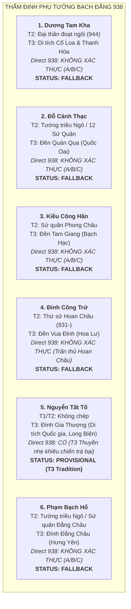

# Báo Cáo Thẩm Định Chi Tiết Từng Ứng Viên Phụ Tướng (Task `VS-NQ-02A`)

> [!IMPORTANT]
> **Quy Chuẩn Thẩm Định Từng Ứng Viên**:
> - Tài liệu này cung cấp hồ sơ nghiên cứu thực chứng độc lập cho từng nhân vật được khảo sát nhằm tìm kiếm ứng viên cho **Hero Slot 2** và **Hero Slot 3** của Chapter Bạch Đằng 938.
> - **Tiêu chí phân định cốt lõi**:
>   - **A. Phục vụ Ngô Quyền**
>   - **B. Sống cùng thời**
>   - **C. Tướng lĩnh vương triều Ngô**
>   - **D. Trực tiếp tham chiến trận Bạch Đằng 938**
>   $$\text{A / B / C} \not\Rightarrow \text{D (Chỉ phong cấp PROVISIONAL khi có chứng cứ thực chiến D)}$$

---

## 1. Bản Đồ Tổng Quan Các Ứng Viên Khảo Sát

---

## 2. Thẩm Định Chi Tiết Từng Ứng Viên

### 2.1. Ứng Viên 1: Dương Tam Kha (楊三哥)

* **Identity**: Tướng lĩnh Ái Châu, em vợ Ngô Quyền (em ruột Dương Hoàng Hậu), con trai thứ của Tiết độ sứ Dương Đình Nghệ.
* **T1 Evidence**: **Hoàn toàn KHÔNG ghi nhận** (*Tân Ngũ Đại Sử* Q65, *Tư Trị Thông Giám* Q281 đều không chép tên Dương Tam Kha).
* **T2 Evidence**:
  * *Đại Việt Sử Ký Toàn Thư* (Ngoại kỷ Quyển 5, Kỷ Nhà Ngô) & *Khâm Định Việt Sử Thông Giám Cương Mục* (Tiền biên Q5):
    - Ghi chép rõ ràng hành trạng chính trị và vương triều về sau: Năm 944, Ngô Quyền lâm chung ủy thác con trai là Ngô Xương Ngập cho Dương Tam Kha phụ chính; Tam Kha cướp ngôi xưng Dương Bình Vương (944–950), nhận con thứ của Ngô Quyền là Ngô Xương Văn làm con nuôi.
    - Năm 950, Ngô Xương Văn làm binh biến lật đổ Dương Tam Kha; do ơn nuôi dưỡng nên giáng Tam Kha làm **Chương Dương sứ** (cấp thực ấp tại bến Chương Dương / Thiệu Hóa).
    - **T2 HOÀN TOÀN KHÔNG CHÉP việc Dương Tam Kha tham gia trận Bạch Đằng năm 938**.
* **T3 Evidence (Di tích & Thần tích định danh cụ thể)**:
  * **Di tích 1**: **Đền thờ Dương Tam Kha tại làng Thành Đạt (xã Thiệu Phú, huyện Thiệu Hóa, tỉnh Thanh Hóa)** — Nơi ông được ban thực ấp, có công chiêu dân lập ấp, khai khẩn đất hoang sau năm 950; được nhân dân tôn làm Thành hoàng làng, có sắc phong qua các triều đại. Thần tích tập trung ca ngợi công đức thời làm Chương Dương sứ.
  * **Di tích 2**: **Miếu thờ Dương Tam Kha tại Cổ Loa (xã Cổ Loa, huyện Đông Anh, TP. Hà Nội)** — Thờ phụ chính vương triều Ngô.
  * **Tài liệu công bố / Quản lý**: Hồ sơ di tích lịch sử văn hóa cấp tỉnh của Sở VHTTDL tỉnh Thanh Hóa (Đền thờ Dương Tam Kha làng Thành Đạt); Thư mục thần tích thần phả Viện Nghiên cứu Hán Nôm (Ký hiệu TT-HN).
  * **Nội dung ghi nhận**: Khẳng định ông là con Dương Đình Nghệ, phò tá vương triều Ngô tại Cổ Loa và thời kỳ trị nhậm Thiệu Hóa. **Không có đoạn văn bản T3 nào ghi chép chi tiết chiến thuật thực địa ông cầm quân đánh trận tại sông Bạch Đằng năm 938**.
* **T4 Evidence**: Công trình nghiên cứu *"Lịch sử Việt Nam"* (Viện Sử học) và giáo sư Trần Quốc Vượng đánh giá vai trò của Dương Tam Kha trong cuộc chuyển giao quyền lực 944–950; khẳng định ông là nhân vật trung tâm của triều chính thời hậu Ngô Vương.
* **Direct 938 Evidence?**: **NO (Hoàn toàn không có bằng chứng tham chiến trực tiếp 938)**.
  - Hành trạng của ông thuộc nhóm **A (Quan hệ thân cận với Ngô Quyền)**, **B (Sống cùng thời)**, **C (Đại thần triều Ngô)**.
* **Contradictions / Uncertainties**: Một số sách phổ thông hiện đại suy diễn rằng vì là con Dương Đình Nghệ nên Dương Tam Kha "chắc chắn theo Ngô Quyền đi trả thù cho cha". Đây là suy đoán không có chỗ dựa văn bản học.
* **Confidence**: `Low / Unverified for 938 Battlefield`.
* **Recommendation**: **`FALLBACK / UNVERIFIED 938 PARTICIPATION`**.

---

### 2.2. Ứng Viên 2: Đỗ Cảnh Thạc (杜景碩)

* **Identity**: Hào trưởng đất Đỗ Động Giang (Thanh Oai, Hà Nội), tướng lĩnh thời Ngô, sau này là Đỗ Cảnh Công trong 12 Sứ Quân.
* **T1 Evidence**: **Hoàn toàn KHÔNG ghi nhận**.
* **T2 Evidence**:
  * *Đại Việt Sử Ký Toàn Thư* (Ngoại kỷ Q5):
    - Ghi nhận Đỗ Cảnh Thạc là đại tướng dưới triều Ngô Vương và Hậu Ngô Vương.
    - Năm 965, khi Nam Tấn Vương Ngô Xương Văn tử trận, triều đình tan rã, Đỗ Cảnh Thạc đem quân bản bộ chiếm cứ vùng Đỗ Động Giang (Bình Đà, Thanh Oai, Hà Nội), đắp lũy xưng **Đỗ Cảnh Công**, trở thành một sứ quân hùng mạnh trong thời kỳ Loạn 12 Sứ Quân, sau bị Đinh Bộ Lĩnh bình định năm 968.
    - **T2 HOÀN TOÀN KHÔNG GHI NHẬN ông tham gia trận Bạch Đằng năm 938**.
* **T3 Evidence (Di tích & Thần tích định danh cụ thể)**:
  * **Di tích 1**: **Đền Quán Quạ / Đền thờ Đỗ Tướng Công (chân núi Sài Sơn, thôn Sài Khê, xã Sài Sơn, huyện Quốc Oai, TP. Hà Nội)** — Di tích Lịch sử - Văn hóa cấp Quốc gia.
  * **Di tích 2**: **Đình làng Bình Đà (xã Bình Minh, huyện Thanh Oai, TP. Hà Nội)** và hệ thống đồn lũy vùng Đỗ Động Giang.
  * **Tài liệu công bố / Quản lý**: Quyết định xếp hạng di tích Quốc gia của Bộ Văn hóa - Thông tin; Thần phả Đỗ Tướng Công lưu tại Viện Hán Nôm (Ký hiệu AE.a9/12) và Ban Quản lý Di tích Quốc Oai.
  * **Nội dung ghi nhận**: Thần tích ca ngợi ông là người văn võ toàn tài, tập hợp nghĩa binh tại Đỗ Động theo Ngô Quyền tiến quân diệt Kiều Công Tiễn tại Đại La; sau đó làm tướng giữ thành Cổ Loa. Tuy nhiên, **thần tích không cung cấp mô tả trận chiến thủy binh nào của ông tại bãi cọc Bạch Đằng 938**.
* **T4 Evidence**: Các công trình khảo cổ học thực địa về căn cứ thành lũy Đỗ Động Giang thời 12 Sứ Quân (Viện Khảo cổ học, Hội Sử học Hà Nội).
* **Direct 938 Evidence?**: **NO (Không có chứng cứ thực chiến trực tiếp 938)**.
  - Thuộc nhóm **A (Theo Ngô Quyền diệt Kiều Công Tiễn)**, **B (Cùng thời)**, **C (Đại tướng triều Ngô)**.
* **Contradictions / Uncertainties**: Đỗ Cảnh Thạc được sử sách khẳng định vững chắc nhất ở tư cách danh tướng triều Ngô và Sứ quân Đỗ Động Giang thời Đinh.
* **Confidence**: `Low / Unverified for 938 Battlefield`.
* **Recommendation**: **`FALLBACK / UNVERIFIED 938 PARTICIPATION`**.

---

### 2.3. Ứng Viên 3: Kiều Công Hãn (矯公罕 / 嶠公罕)

* **Identity**: Hào trưởng đất Phong Châu (Bạch Hạc, Phú Thọ), cháu nội của Kiều Công Tiễn, sau này là Kiều Tam Chế trong 12 Sứ Quân.
* **T1 Evidence**: **Hoàn toàn KHÔNG ghi nhận**.
* **T2 Evidence**:
  * *Đại Việt Sử Ký Toàn Thư* (Ngoại kỷ Q5): Ghi nhận là sứ quân chiếm cứ đất Phong Châu (Bạch Hạc, Phú Thọ), xưng **Kiều Tam Chế** trong thời kỳ 12 Sứ Quân.
  * **T2 HOÀN TOÀN KHÔNG CHÉP việc Kiều Công Hãn theo Ngô Quyền hay tham chiến Bạch Đằng 938**.
* **T3 Evidence (Di tích & Thần tích định danh cụ thể)**:
  * **Di tích**: **Đền Tam Giang / Đền Bạch Hạc (phường Bạch Hạc, TP. Việt Trì, tỉnh Phú Thọ)** — Di tích Lịch sử Quốc gia.
  * **Tài liệu công bố / Quản lý**: Bản ngọc phả Đền Tam Giang thời Lê - Nguyễn lưu trữ tại Viện Nghiên cứu Hán Nôm (Ký hiệu AD.a3/8) và Bảo tàng tỉnh Phú Thọ.
  * **Nội dung ghi nhận**: Ngọc phả chép Kiều Công Hãn bất bình trước việc ông nội là Kiều Công Tiễn giết Dương Đình Nghệ, bèn đem quân bản bộ Phong Châu về yết kiến Ngô Quyền; được giao phụ trách việc vận chuyển lương thảo và bố phòng; dã sử lưu truyền ông đóng giữ vùng ngã ba sông Hạc. **Không có bất kỳ chứng cứ nào khẳng định ông đem thuyền chiến ra cửa biển Bạch Đằng năm 938**.
* **T4 Evidence**: Các khảo cứu của Sở VHTTDL tỉnh Phú Thọ về quần thể di tích Bạch Hạc - Tam Giang.
* **Direct 938 Evidence?**: **NO (Không có chứng cứ thực chiến trực tiếp 938)**.
* **Contradictions / Uncertainties**: Hành trạng theo Ngô Quyền hoàn toàn là truyền tích dã sử T3 địa phương tại Phú Thọ nhằm giải thích sự mâu thuẫn giữa Kiều Công Hãn và Kiều Công Tiễn.
* **Confidence**: `Low / Unverified for 938 Battlefield`.
* **Recommendation**: **`FALLBACK / UNVERIFIED 938 PARTICIPATION`**.

---

### 2.4. Ứng Viên 4: Đinh Công Trứ (丁公著)

* **Identity**: Hào trưởng đất Hoa Lư (Ninh Bình), Thứ sử Hoan Châu, thân phụ của Vạn Thắng Vương Đinh Bộ Lĩnh.
* **T1 Evidence**: **Hoàn toàn KHÔNG ghi nhận**.
* **T2 Evidence**:
  * *Đại Việt Sử Ký Toàn Thư* (Ngoại kỷ Q5, Kỷ Nhà Đinh) & *Khâm Định Việt Sử Thông Giám Cương Mục*:
    - Xác nhận Đinh Công Trứ là nha tướng của Dương Đình Nghệ, có công trong trận giải phóng Đại La năm 931, được Dương Đình Nghệ giao chức **Thứ sử Hoan Châu** (vùng Nghệ An - Hà Tĩnh).
    - Sau khi Ngô Quyền xưng Vương (939), Đinh Công Trứ tiếp tục giữ chức Thứ sử Hoan Châu cho đến khi qua đời tại nhiệm sở.
    - **T2 XÁC NHẬN RÕ RÀNG ông trấn thủ Hoan Châu, KHÔNG rời nhiệm địa ra sông Bạch Đằng năm 938**.
* **T3 Evidence (Di tích & Thần tích định danh cụ thể)**:
  * **Di tích 1**: **Đền thờ Vua Đinh Tiên Hoàng (Khu di tích Quốc gia đặc biệt Cố đô Hoa Lư, xã Trường Yên, huyện Hoa Lư, Ninh Bình)** — gian thờ thân phụ Đinh Công Trứ.
  * **Di tích 2**: **Khu di tích Lăng miếu họ Đinh tại xã Gia Phương (huyện Gia Viễn, Ninh Bình)**.
  * **Nội dung ghi nhận**: Toàn bộ thần tích, gia phả họ Đinh đều ghi nhận công tích của ông gắn liền với vùng căn cứ Hoa Lư và nhiệm địa Hoan Châu.
* **Direct 938 Evidence?**: **REJECTED FOR 938 (Chứng cứ lịch sử khẳng định ông ở Hoan Châu, không có mặt ở Bạch Đằng)**.
* **Contradictions / Uncertainties**: Việc gán ghép Đinh Công Trứ tham chiến Bạch Đằng là lỗi ngụy biện "network Dương Đình Nghệ".
* **Confidence**: `Reject for 938 Battlefield`.
* **Recommendation**: **`FALLBACK / UNVERIFIED 938 PARTICIPATION`**.

---

### 2.5. Ứng Viên 5: Nguyễn Tất Tố (阮必素)

* **Identity**: Nhân vật dã sử / truyền thuyết dân gian, được lưu truyền là danh tướng thủy binh người bơi lội giỏi, trực tiếp chỉ huy cánh quân thuyền nhẹ khiêu chiến và giả vờ thua chạy (trá bại) tại trận thủy chiến Bạch Đằng 938.
* **T1 Evidence**: **Hoàn toàn KHÔNG có** (*Tân Ngũ Đại Sử* Q65, *Tư Trị Thông Giám* Q281).
* **T2 Evidence**: **Hoàn toàn KHÔNG có** (*Toàn Thư*, *Cương Mục*, *Việt Sử Lược*, *An Nam Chí Lược* đều không chép tên Nguyễn Tất Tố).
* **T3 Evidence (Di tích & Thần tích định danh cụ thể)**:
  * **Di tích 1**: **Đình làng Gia Thượng (phường Ngọc Thụy, quận Long Biên, TP. Hà Nội — xưa thuộc thôn Gia Thượng, xã Thượng Cát, tổng Gia Thụy, huyện Gia Lâm, phủ Thuận An, trấn Kinh Bắc)**.
    - **Cấp xếp hạng di tích**: **Di tích Lịch sử - Kiến trúc Nghệ thuật cấp Quốc gia** (Bộ Văn hóa - Thông tin ra Quyết định số 15/QĐ-BT ngày 25/01/1991).
  * **Di tích 2**: **Đình Bắc Biên (phường Ngọc Thụy, quận Long Biên, TP. Hà Nội)** — Di tích Lịch sử cấp Quốc gia (Quyết định năm 1989), phối thờ Nguyễn Tất Tố.
  * **Tài liệu công bố / Văn bản lưu trữ chính thức**:
    - Bản Thần tích - Thần sắc làng Gia Thượng lưu trữ tại **Viện Nghiên cứu Hán Nôm** (Ký hiệu thư mục: `AE.a9/24` — Thần tích Hà Nội / Long Biên).
    - Hồ sơ khoa học xếp hạng di tích của **Cục Di sản Văn hóa** và **Sở Văn hóa và Thể thao TP. Hà Nội**.
    - Cuốn sách khảo cứu chính thức: *"Di tích lịch sử - văn hóa quận Long Biên"* (UBND quận Long Biên & Trung tâm VHTT, NXB Hà Nội, 2010).
  * **Nội dung thần tích khẳng định chính xác điều gì**:
    - Thần tích ghi rõ: Nguyễn Tất Tố sinh ra ở bãi bồi sông Hồng (vùng Gia Thượng), có sức khỏe phi thường và tài bơi lặn siêu đẳng như rái cá nước ngọt.
    - Khi Ngô Quyền kéo quân ra Bắc dẹp Kiều Công Tiễn và chuẩn bị đối phó thủy quân Nam Hán, Nguyễn Tất Tố đã đem các tráng đinh giỏi bơi lặn vùng bãi sông đến đầu quân.
    - **Hành trạng thực chiến trực tiếp tại trận 938**: Ngô Quyền tin cẩn giao cho Nguyễn Tất Tố trực tiếp chỉ huy toán cảm tử chèo **thuyền nhẹ (`輕舟`)** ra cửa biển Bạch Đằng khiêu chiến với hạm đội của Lưu Hoằng Thao lúc triều dâng; sau đó giả vờ thua chạy rút lui để nhử toàn bộ tàu giặc vượt qua bãi cọc ngầm lọt sâu vào dòng sông; khi triều rút mạnh, ông chỉ huy đội bơi lặn lặn xuống đục phá thuyền giặc và chặn đánh tàn binh.
    - Sau chiến thắng 938, ông được Ngô Vương phong thưởng tước hiệu Đại tướng quân; khi mất được triều đình ban sắc phong Thượng đẳng thần, dân làng Gia Thượng lập đền tôn làm Thành hoàng muôn đời.
* **T4 Evidence**:
  - Hội thảo khoa học và các bài khảo cứu của Hội Khoa học Lịch sử Việt Nam về các tướng lĩnh xuất thân từ nhân dân trong phong trào giải phóng dân tộc thời Ngô Quyền.
* **Direct 938 Evidence?**: **YES (T3 SPECIFIC BATTLEFIELD ROLE)**.
  - Đây là **ứng viên duy nhất trong toàn bộ hệ thống thần tích dã sử Việt Nam có miêu tả vai trò tác chiến chiến thuật trực tiếp khớp nối 1-1 với kế sách "thuyền nhẹ khiêu chiến giả thua" (`輕舟... 僞遁`) của trận Bạch Đằng 938**.
* **Contradictions / Uncertainties**:
  - Không có mặt trong T1/T2 chính sử. Tồn tại hoàn toàn ở tầng nguồn **T3 Folklore / Local Tradition**.
  - Thần phả thời Hậu Lê / Nguyễn có thể đã được văn thần gia cố các yếu tố huyền tích hóa và mỹ lệ hóa.
* **Confidence**: `Moderate (T3 Confirmed Tradition with National-Ranked Heritage Site & Exact 938 Battlefield Role)`.
* **Recommendation**:
  - Nếu áp dụng tiêu chuẩn thuần T1/T2: Giữ slot `OPEN`.
  - Nếu dự án chấp nhận một **Hero Slot 2 đại diện cho tầng nguồn T3 dã sử dân gian có di tích quốc gia gắn trực tiếp với chiến thuật Bạch Đằng**: **`PROVISIONAL (Hero Slot 2 Candidate)`**.

---

### 2.6. Ứng Viên 6: Phạm Bạch Hổ (范白虎)

* **Identity**: Tướng lĩnh vùng Đằng Châu (Kim Động, Hưng Yên), con của Phạm Phòng Át, sau xưng Phạm Phòng Át trong Loạn 12 Sứ Quân.
* **T1 Evidence**: Không ghi nhận.
* **T2 Evidence**:
  * *Đại Việt Sử Ký Toàn Thư* (Ngoại kỷ Q5): Ghi nhận là nha tướng thời Dương Đình Nghệ và Ngô Quyền; sau khi Ngô Xương Văn mất chiếm giữ Đằng Châu làm một trong 12 Sứ Quân, sau quy thuận Đinh Bộ Lĩnh được phong Thân vệ Đại tướng quân.
  * **T2 KHÔNG chép việc ông trực tiếp tham chiến tại Bạch Đằng 938**.
* **T3 Evidence**: Đền Mây / Đình làng Đằng Châu (thị xã Hưng Yên, tỉnh Hưng Yên) — Di tích Lịch sử Quốc gia thờ Phạm Bạch Hổ. Thần tích ghi công đức hào trưởng vùng hạ lưu sông Hồng, phò tá Ngô Quyền. Không có ghi chép cụ thể về thủy chiến Bạch Đằng 938.
* **Direct 938 Evidence?**: **NO (Thuộc nhóm A/B/C)**.
* **Confidence**: `Low / Unverified for 938`.
* **Recommendation**: **`FALLBACK / UNVERIFIED 938 PARTICIPATION`**.

---

## 3. Bảng Ma Trận Tổng Hợp Thẩm Định Ứng Viên (Candidate Evaluation Matrix)

| Tên Ứng Viên | Tầng Nguồn Ghi Nhận | Di Tích Thờ Tự Cụ Thể (T3) | Vai Trò Được Ghi Nhận | Có Bằng Chứng Trực Tiếp 938? (Direct 938) | Mức Độ Tin Cậy (CONFIDENCE) | Quyết Định Đề Xuất (STATUS) |
|---|:---:|---|---|:---:|:---:|:---:|
| **Ngô Quyền** | **T1 + T2** | Đền thờ Đường Lâm (Hà Nội), Lăng Ngô Quyền, Đền Ngô Quyền (Hải Phòng) | Tiết độ sứ, Chủ tướng tối cao chỉ huy toàn thắng 938, Ngô Vương (939) | **CÓ (T1/T2 Tuyệt đối)** | **High (Well-attested)** | **`LOCK CANDIDATE` (Hero 1)** |
| **Nguyễn Tất Tố** | **T3 (Local)** | **Đình Gia Thượng & Đình Bắc Biên** (Di tích Quốc gia, Ngọc Thụy, Long Biên, Hà Nội — Ký hiệu Hán Nôm `AE.a9/24`) | Chỉ huy đội cảm tử thuyền nhẹ (`輕舟`) khiêu chiến, trá bại nhử giặc vào bãi cọc | **CÓ (T3 Chiến thuật 938)** | **Moderate (T3 Confirmed)** | **`PROVISIONAL` (Hero 2 Candidate)** |
| **Dương Tam Kha** | **T2 + T3** | Đền làng Thành Đạt (Thiệu Hóa, Thanh Hóa), Miếu Cổ Loa (Đông Anh, Hà Nội) | Con Dương Đình Nghệ, phụ chính triều Ngô, Dương Bình Vương (944), Chương Dương sứ (950) | **KHÔNG (Nhóm A/B/C)** | **Low (Unverified for 938)** | **`FALLBACK`** |
| **Đỗ Cảnh Thạc** | **T2 + T3** | **Đền Quán Quạ** (Di tích Quốc gia, Sài Sơn, Quốc Oai), Đình Bình Đà (Thanh Oai, Hà Nội) | Đại tướng triều Ngô, Sứ quân Đỗ Động Giang xưng Đỗ Cảnh Công thời 12 Sứ Quân | **KHÔNG (Nhóm A/B/C)** | **Low (Unverified for 938)** | **`FALLBACK`** |
| **Kiều Công Hãn** | **T2 + T3** | **Đền Tam Giang** (Di tích Quốc gia, Bạch Hạc, Việt Trì, Phú Thọ — Ký hiệu Hán Nôm `AD.a3/8`) | Hào trưởng Phong Châu theo Ngô Quyền diệt Kiều Công Tiễn; Sứ quân Kiều Tam Chế | **KHÔNG (Nhóm A/B/C)** | **Low (Unverified for 938)** | **`FALLBACK`** |
| **Đinh Công Trứ** | **T2 + T3** | Đền Vua Đinh (Cố đô Hoa Lư, Ninh Bình), Lăng miếu họ Đinh (Gia Phương, Gia Viễn) | Nha tướng Dương Đình Nghệ, Thứ sử Hoan Châu (931–), thân phụ Đinh Bộ Lĩnh | **KHÔNG (Trấn thủ Hoan Châu)** | **Reject for 938** | **`FALLBACK`** |
| **Phạm Bạch Hổ** | **T2 + T3** | Đền Mây (Di tích Quốc gia, Đằng Châu, Hưng Yên) | Hào trưởng Đằng Châu phò Ngô Quyền, Sứ quân thời 12 Sứ Quân, tướng thời Đinh | **KHÔNG (Nhóm A/B/C)** | **Low (Unverified for 938)** | **`FALLBACK`** |
