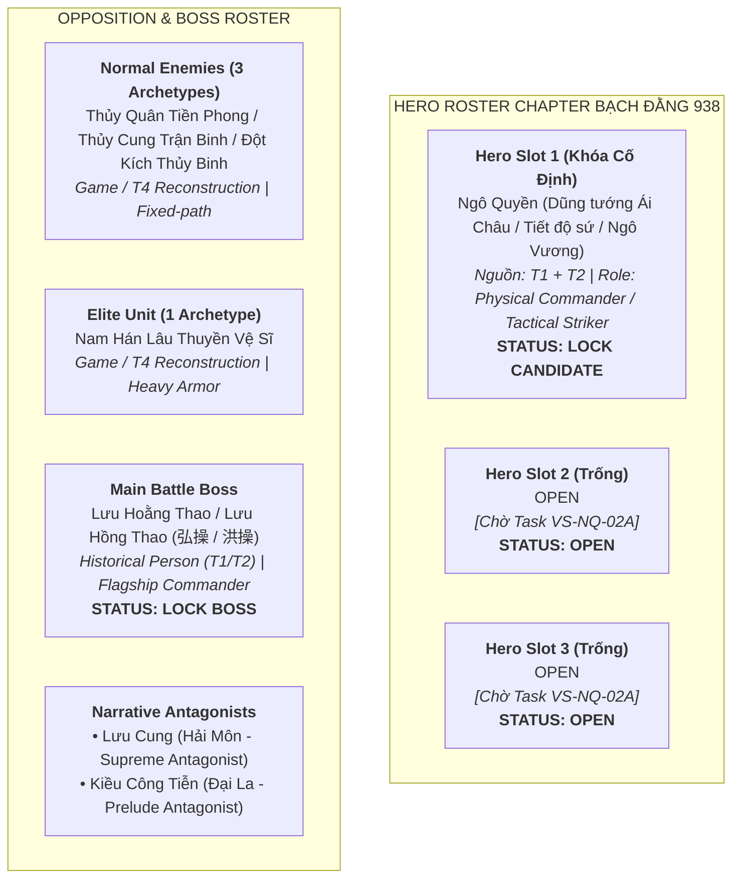

# Chapter ARC-DT-04: Ngô Quyền & Bạch Đằng 938 — Playable Concepts (Task `VS-NQ-02B`)

> [!IMPORTANT]
> **Ràng Buộc Thiết Kế Playable Concepts (Task `VS-NQ-02B`)**:
> - Tài liệu này xác lập hồ sơ thiết kế ý niệm chi tiết (**Playable Concepts**) cho **Ngô Quyền (Hero 1 — LOCK)**, **Tuyến Kẻ Địch Nam Hán (3 Generic, 1 Elite, 1 Main Boss)** và **Định Hướng Mỹ Thuật Bản Đồ (Map Art Direction)** cho trận thủy chiến Bạch Đằng năm 938.
> - **Kế thừa các thẩm định sử liệu đã PASS**:
>   - Source Matrix Pass: `antigravity/vs-nq-a01-938-source-matrix`
>   - Roster Pass: `antigravity/vs-nq-01-bach-dang-938-roster`
> - **QUY CHUẨN ENGINE & GAMEPLAY TD BẮT BUỘC**:
>   - **Hero = Tower / Card phòng thủ trên grid cố định**: Không di chuyển tự do (NOT free-moving RPG unit).
>   - **Normal Attack**: Luôn luôn là đơn mục tiêu (Single-target), **tuyệt đối không AoE, không Stun, không Slow, không Root, không Poison**.
>   - **Active Skill**: Sử dụng độc quyền các hiệu ứng thuộc hệ thống dùng chung (*Shared Combat Effects*: Damage, AoE, Slow, Stun, Root, MultiHit). **TriggerHits chỉ chọn một trong 4 mốc: 3 / 5 / 7 / 10**.
>   - **Không tạo engine riêng**: Không viết logic vật lý tàu bè (ship physics), không tạo cơ chế thủy triều cơ học (tide engine), không tạo cơ chế cắm cọc tương tác (stake-placement engine) hay path đặc biệt. Mọi yếu tố lịch sử Bạch Đằng được biểu đạt qua hiệu ứng mỹ thuật thị giác (Visual / VFX).
>   - **Enemy = Fixed-path với thanh HP**: Di chuyển theo tuyến đường cố định, **tuyệt đối không tấn công Hero**, không có AI hải chiến.
>   - **Hero Slot 2 & Slot 3**: Tiếp tục giữ trạng thái **`OPEN`** chờ hoàn tất thẩm định bổ sung (`VS-NQ-02A`).
>   - **Mọi thông số cân bằng (Damage, Duration, Radius, Cooldown)**: Giữ ở trạng thái **`[CONFIG / OPEN]`**.

---

## 1. Cấu Trúc Hồ Sơ Playable Concepts

Tập hồ sơ thiết kế ý niệm cho Chapter Ngô Quyền & Bạch Đằng 938 bao gồm 3 tài liệu thành phần:

| Tài Liệu | Nội Dung Trọng Tâm |
|---|---|
| [ngo-quyen-concept.md](ngo-quyen-concept.md) | Thiết kế ý niệm hoàn chỉnh cho **Ngô Quyền (Playable Hero 1 — LOCK)**: Phân tầng nhận diện lịch sử vs sáng tạo, Normal Attack (đơn mục tiêu), Active Skill (1 chính + 1 dự phòng, tuân thủ TriggerHits 3/5/7/10), Legendary Passive, chuẩn hóa Asset Sprite 128x128 Front View Y=112. |
| [enemy-concepts.md](enemy-concepts.md) | Thiết kế ý niệm cho **Quân Nam Hán**: 3 kẻ địch thường (Game / T4), 1 Elite (Game / T4), **Main Battle Boss Lưu Hoằng Thao / Hồng Thao (T1/T2)**, phân định vai trò dẫn truyện (Narrative) của Lưu Cung và Kiều Công Tiễn. |
| [map-art-direction.md](map-art-direction.md) | Định hướng mỹ thuật không gian **Cửa Biển Bạch Đằng (938 SCN)**: Fixed winding path, cảnh quan bùn lầy, cọc gỗ ngầm hiển thị dưới dạng visual storytelling, cảnh báo khảo cổ học 2026 (*The Holocene*). |

---

## 2. Tóm Tắt Khung Roster Đã Khóa (Roster Summary)

---

## 3. Nguyên Tắc Kỹ Thuật Sprite & Asset Contract

Mọi thiết kế ý niệm thị giác trong hồ sơ này tuân thủ nghiêm ngặt quy chuẩn kỹ thuật sprite của dự án:
* **Góc nhìn**: **Front View Only** (Trực diện $100\%$, không Isometric, không 2.5D nghiêng).
* **Kích thước khung hình (Canvas)**: **$128 \times 128\text{ px}$**.
* **Định dạng**: PNG trong suốt (**RGBA 32-bit**).
* **Đường gióng chân (Baseline Anchor)**: **$Y = 112\text{ px}$** (đảm bảo chân nhân vật đặt chuẩn trên ô lưới chiến thuật $128 \times 128$).
* **Quy chuẩn tài sản**: Tài liệu này **chỉ xây dựng Concept & Art Direction**, không sinh file asset PNG hay can thiệp mã nguồn (`src/**`).
