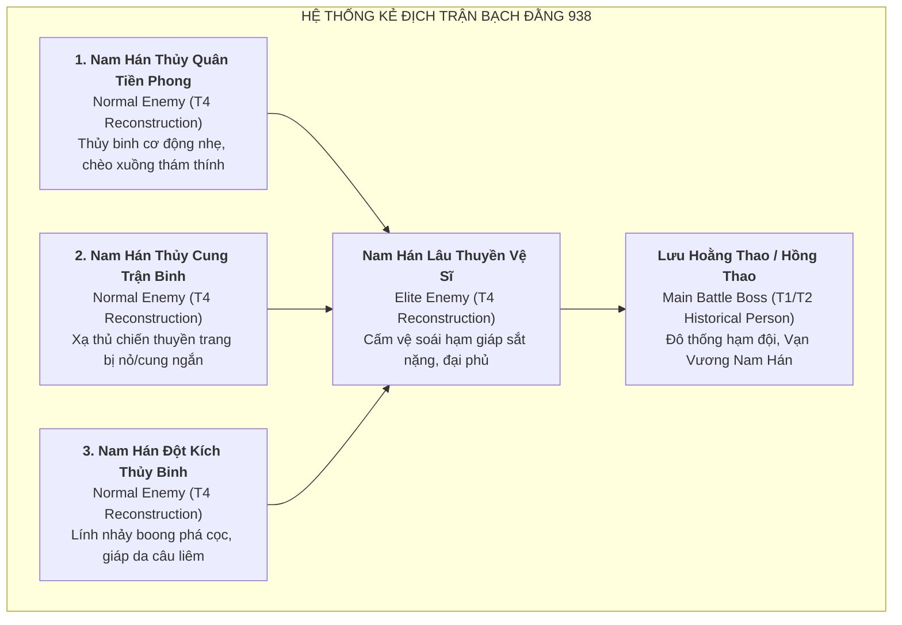

# Thiết Kế Ý Niệm Tuyến Kẻ Địch: Quân Nam Hán (Task `VS-NQ-02B`)

> [!IMPORTANT]
> **Ràng Buộc Thiết Kế Kẻ Địch (Enemy & Boss Architecture)**:
> - **Cơ chế chiến đấu**: Toàn bộ Enemy di chuyển trên **tuyến đường cố định (Fixed-path)**, sở hữu thanh máu (**HP**) và **TUYỆT ĐỐI KHÔNG TẤN CÔNG HERO**.
> - Không xây dựng AI điều khiển hải chiến hay cơ chế va chạm thuyền bè phức tạp.
> - **Main Battle Boss (Lưu Hoằng Thao / Hồng Thao)**: Sử dụng hoàn toàn **hệ thống Boss dùng chung (*Shared Enemy/Boss System*)**, phân biệt qua các thuộc tính: Lượng máu (HP cao), Tốc độ di chuyển (Move Speed), Kích thước hình thể (Visual Scale $1.3\times - 1.5\times$), Kháng khống chế cơ bản. Tuyệt đối **không có đòn tấn công Hero**.
> - **Phân định Boss cốt truyện (Narrative)**:
>   - **Lưu Cung**: Đóng quân ở Hải Môn làm thanh viện $\rightarrow$ **Narrative Supreme Antagonist**, không xuất hiện như Boss trên map Bạch Đằng.
>   - **Kiều Công Tiễn**: Bị diệt tại thành Đại La vào mùa thu 938 trước khi quân Nam Hán tới $\rightarrow$ **Narrative Prelude Antagonist / Optional Prelude Boss**, không xuất hiện trên map Bạch Đằng.
> - Mọi giá trị HP, Speed, Resistance cụ thể giữ ở trạng thái **`[CONFIG / OPEN]`**.

---

## 1. Cấu Trúc Tuyến Kẻ Địch Nam Hán



---

## 2. Thiết Kế Ý Niệm 3 Kẻ Địch Thường (Normal Enemies — `T4`)

### 2.1. Kẻ Địch 1: Nam Hán Thủy Quân Tiền Phong (Marine Vanguard)
* **Archetype**: Kẻ địch cơ động nhanh, máu mỏng (Fast / Swarm Runner).
* **Mô tả mỹ thuật (Visual Identity)**:
  - Lính thủy binh chèo xuồng nhẹ đi đầu thám thính luồng lạch. Mặc áo chẽn da thuộc chịu nước màu lam sẫm viền xám, đầu đội nón mây đan tròn hoặc chít khăn chàm, tay cầm đoản đao và khiên mây bọc da.
  - Chân đi hài vải chống trượt, động tác lướt nhanh trên mặt nước/bãi bồi.
* **Đặc tính gameplay (Shared Enemy Properties)**:
  - `Role`: Đơn vị đi đầu thử thách khả năng dọn dẹp mục tiêu nhanh của Hero.
  - `MovementSpeed`: Nhanh (`Fast`) `[CONFIG / OPEN]`.
  - `Health (HP)`: Thấp (`Low`) `[CONFIG / OPEN]`.
  - `Armor / Resistance`: Không giáp (`None`) `[CONFIG / OPEN]`.
  - `Behavior`: Di chuyển liên tục theo fixed-path, không dừng lại.

---

### 2.2. Kẻ Địch 2: Nam Hán Thủy Cung Trận Binh (Naval Crossbowman)
* **Archetype**: Kẻ địch tầm trung, tốc độ trung bình (Standard Marcher).
* **Mô tả mỹ thuật (Visual Identity)**:
  - Xạ thủ đóng trên sàn thuyền chiến nhỏ, khoác áo giáp vải bồi chống ẩm màu lam pha đồng, lưng đeo ống tên gỗ, tay cầm nỏ gỗ kiểu Ngũ Đại (visual only).
  - *Lưu ý*: Nỏ và cung chỉ là nhận diện thị giác thẩm mỹ, **đơn vị không thực hiện hành vi bắn hay tấn công Hero**.
* **Đặc tính gameplay (Shared Enemy Properties)**:
  - `Role`: Đơn vị bộ binh tiêu chuẩn xuất hiện với mật độ đều đặn trong các đợt tiến quân.
  - `MovementSpeed`: Trung bình (`Medium`) `[CONFIG / OPEN]`.
  - `Health (HP)`: Trung bình (`Medium`) `[CONFIG / OPEN]`.
  - `Armor / Resistance`: Giáp nhẹ (`Light`) `[CONFIG / OPEN]`.
  - `Behavior`: Di chuyển theo tuyến đường cố định.

---

### 2.3. Kẻ Địch 3: Nam Hán Đột Kích Thủy Binh (Boarding Raider)
* **Archetype**: Kẻ địch cận chiến áp sát, máu khá (Tough Infantry).
* **Mô tả mỹ thuật (Visual Identity)**:
  - Lính nhảy boong xung kích chuyên phá chướng ngại vật và mở đường cho hạm đội. Mặc giáp da bò cứng đính đinh tán đồng, đầu đội mũ chóp đồng có che tai, tay cầm câu liêm sắt dài hoặc trường đao trảm mã.
  - Thể hình vạm vỡ, bước chân chắc nịch lội qua vùng phù sa bãi bồi.
* **Đặc tính gameplay (Shared Enemy Properties)**:
  - `Role`: Đơn vị chống chịu cơ bản, tạo lá chắn che chở cho các đơn vị chạy nhanh phía sau.
  - `MovementSpeed`: Trung bình - Chậm (`Medium-Slow`) `[CONFIG / OPEN]`.
  - `Health (HP)`: Khá cao (`Medium-High`) `[CONFIG / OPEN]`.
  - `Armor / Resistance`: Giáp da vừa (`Medium Armor`) `[CONFIG / OPEN]`.
  - `Behavior`: Di chuyển theo tuyến đường cố định.

---

## 3. Thiết Kế Ý Niệm Kẻ Địch Tinh Anh: Nam Hán Lâu Thuyền Vệ Sĩ (Elite Enemy — `T4`)

* **Tên đơn vị**: **Nam Hán Lâu Thuyền Vệ Sĩ (Heavy Flagship Marine Guard)**.
* **Archetype**: Đơn vị chống chịu bọc thép hạng nặng (Heavy Armored Elite).
* **Mô tả mỹ thuật (Visual Identity)**:
  - Sĩ quan cấm vệ trực tiếp bảo vệ soái hạm Lưu Hoằng Thao. Thể hình cao lớn vạm vỡ (Visual scale $1.15\times$ so với lính thường).
  - Khoác bộ đại giáp phiến sắt màu đồng đen phủ kín thân mình, áo choàng ngắn màu đỏ thẫm xé rách dính bùn nước, mũ trụ sắt trang trí hình đầu rồng Nam Hán dữ tợn.
  - Tay cầm đại phủ (rìu chiến hai lưỡi lớn) hoặc thiết kích nặng nề vác trên vai (visual only).
* **Đặc tính gameplay (Shared Enemy Properties)**:
  - `Role`: Mini-boss / Elite unit xuất hiện ở các đợt cao trào, kiểm tra khả năng dồn sát thương của toàn bộ đội hình Hero.
  - `MovementSpeed`: Chậm (`Slow`) `[CONFIG / OPEN]`.
  - `Health (HP)`: Rất cao (`High`) `[CONFIG / OPEN]`.
  - `Armor / Resistance`: Giáp nặng kháng vật lý cao (`Heavy Armor`) `[CONFIG / OPEN]`.
  - `Status Interaction`: Có khả năng kháng giảm thời gian khống chế (CC Duration Reduction) theo chuẩn hệ thống chung `[CONFIG / OPEN]`.
  - `Behavior`: Di chuyển vững chắc trên fixed-path, không có đòn tấn công Hero.

---

## 4. Thiết Kế Ý Niệm Main Battle Boss: Lưu Hoằng Thao / Lưu Hồng Thao (`T1/T2`)

> [!IMPORTANT]
> **Quy Chuẩn Thiết Kế Main Boss Bạch Đằng**:
> - **Lưu Hoằng Thao (`劉弘操` T1/T2) / Lưu Hồng Thao (`劉洪操` T1)** là nhân vật lịch sử xác thực, hoàng tử Nam Hán được phong Giao Vương / Vạn Vương, trực tiếp chỉ huy hạm đội vượt biển và tử trận tại Bạch Đằng năm 938.
> - **Cơ chế Boss**: Vận hành hoàn toàn bằng **Shared Boss System**, tuyệt đối không tạo code riêng ngoài hệ thống.
> - **Tuyệt đối không tấn công Hero**: Boss chỉ di chuyển từ điểm xuất phát (Cửa biển / Đầu luồng lạch) đến điểm kết thúc (Phủ thành / Hậu phương) trên tuyến đường cố định. Nếu người chơi không hạ gục được Boss trước khi chạm đích, ván đấu sẽ thất bại theo luật Tower Defense thông thường.

```mermaid
graph LR
    subgraph MAIN BOSS LIFECYCLE (SHARED STATUS SYSTEM)
        B1["<b>Boss Xuất Hiện (Spawn)</b><br>Kích thước lớn (Scale 1.35x)<br>Thanh máu Boss hiển thị toàn màn hình"]
        B2["<b>Giai Đoạn Di Chuyển (Phase 1: Full Speed)</b><br>Tiến dọc theo luồng sông Bạch Đằng<br>Chịu sát thương từ các Hero đặt ven bờ"]
        B3["<b>Giai Đoạn Sa Lầy (Phase 2: Status Vulnerability)</b><br>Khi chịu Root/Slow từ Active Skill của Ngô Quyền<br>Bị khuếch đại sát thương từ Legendary Passive"]
        B4["<b>Bị Tiêu Diệt (Defeat)</b><br>Lưu Hoằng Thao tử trận<br>Hoàn thành màn chơi Bạch Đằng 938"]

        B1 --> B2
        B2 --> B3
        B3 --> B4
    end
```

* **Danh xưng & Tước hiệu**: **Vạn Vương Lưu Hoằng Thao / Giao Vương Lưu Hồng Thao (劉弘操 / 劉洪操)**.
* **Mô tả mỹ thuật (Visual Identity)**:
  - Soái tướng Nam Hán với khí thế ngạo mạn lúc đầu, dần chuyển sang hoảng loạn khi chiến thuyền sa lầy vào bãi cọc.
  - Thể hình uy dũng nổi bật (**Visual Scale $1.35\times$**), đứng trên mô hình sàn soái hạm mini hoặc đi bộ trực diện (Front View).
  - Khoác áo chiến bào lụa tím thêu chỉ vàng bên trong, bên ngoài mặc đại giáp khảm vàng sáng loáng mang phong cách hoàng gia Nam Hán, thắt đai ngọc, mũ miện vương giả đính lông trĩ dài phấp phới.
  - Tay cầm bội kiếm mạ vàng chuôi ngọc (visual identity).
* **Đặc tính gameplay (Shared Boss Attributes)**:
  - `Health (HP)`: Cực cao (`Boss Tier HP`) `[CONFIG / OPEN]`.
  - `MovementSpeed`: Chậm rãi nhưng kiên định (`Slow-Steady`) `[CONFIG / OPEN]`.
  - `Armor / Resistance`: Giáp hỗn hợp vật lý & phép cao (`Boss Armor Profile`) `[CONFIG / OPEN]`.
  - `CC Interaction`: Có thể bị áp dụng các hiệu ứng khống chế dùng chung (Slow, Root, Stun) từ kỹ năng của Ngô Quyền, nhưng thời gian duy trì giảm theo hệ số kháng Boss chuẩn `[CONFIG / OPEN]`.
  - `Visual Aura`: Vòng hào quang màu tím sẫm / lửa vương giả dưới chân để người chơi dễ dàng nhận diện vị trí trên đường đi.

---

## 5. Phân Định Các Nhân Vật Phản Diện Dẫn Truyện (Narrative Antagonists)

| Nhân Vật | Tự Dạng Chữ Hán | Tầng Nguồn | Định Vị Trong Game | Lý Do Thiết Kế Học Thuật |
|---|:---:|:---:|---|---|
| **Lưu Cung (Nam Hán Hoàng Đế)** | `劉龑` (T1) / `劉龔` (T2) | **T1/T2** | **Narrative Supreme Antagonist** | Đóng quân tại Hải Môn làm thanh viện, không vượt biển vào sông Bạch Đằng. Chỉ xuất hiện trong lời thoại dẫn nhập mở đầu và hoạt cảnh kết thúc (khóc than thu tàn quân rút chạy). **Không xuất hiện như một đơn vị chiến đấu trên map**. |
| **Kiều Công Tiễn** | `皎公羨` (T1) / `矯公羨` (T2) | **T1/T2** | **Narrative Prelude Antagonist / Optional Prelude Boss** | Bị nghĩa quân Ngô Quyền tiêu diệt tại thành Đại La vào mùa thu năm 938 trước khi quân Nam Hán kéo sang. **Tuyệt đối không đưa vào map Bạch Đằng**; nếu có chỉ xuất hiện trong màn dẫn nhập (Prologue / Chapter 0) tại Đại La. |

---

## 6. Bảng Tổng Hợp Thông Số Khung Tuyến Kẻ Địch

| Tên Đơn Vị Kẻ Địch | Loại Hình (Category) | Tốc Độ (Speed Profile) | Máu (HP Profile) | Giáp (Armor Profile) | Tỷ Lệ Kích Thước (Scale) | Ghi Chú Kỹ Thuật |
|---|:---:|:---:|:---:|:---:|:---:|---|
| **Nam Hán Thủy Quân Tiền Phong** | Normal Enemy (T4) | Fast | Low | None | $1.0\times$ (Standard) | Fixed-path, không tấn công Hero. |
| **Nam Hán Thủy Cung Trận Binh** | Normal Enemy (T4) | Medium | Medium | Light | $1.0\times$ (Standard) | Nỏ/cung là visual only, không bắn Hero. |
| **Nam Hán Đột Kích Thủy Binh** | Normal Enemy (T4) | Med-Slow | Med-High | Medium | $1.05\times$ | Đơn vị chống chịu tiền tuyến. |
| **Nam Hán Lâu Thuyền Vệ Sĩ** | Elite Enemy (T4) | Slow | High | Heavy | $1.15\times$ | Giảm thời gian khống chế chuẩn Elite. |
| **Lưu Hoằng Thao / Hồng Thao** | Main Battle Boss (T1/T2) | Slow-Steady | Boss Tier | Boss Profile | $1.35\times$ | Boss chính trận 938, không tấn công Hero. |
