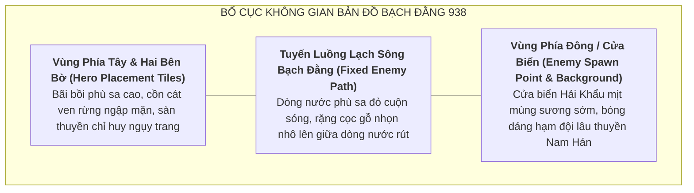

# Định Hướng Mỹ Thuật Bản Đồ: Cửa Biển Bạch Đằng 938 (Task `VS-NQ-02B`)

> [!IMPORTANT]
> **Ràng Buộc Định Hướng Mỹ Thuật Bản Đồ (Map Art Direction)**:
> - **Primary Map duy nhất**: **Cửa Biển Bạch Đằng — Đại Phá Nam Hán (938 SCN)**.
> - **Cơ chế tuyến đường**: Sử dụng **tuyến đường uốn lượn cố định (Fixed Winding Path)** theo chuẩn Tower Defense 2D.
> - **Tuyệt đối không xây dựng engine thủy triều cơ học**: Mọi yếu tố thủy triều, bãi cọc nhô lên và thuyền giặc vướng cọc được biểu đạt thông qua **kể chuyện môi trường thị giác (Environmental Visual Storytelling)** và nghệ thuật bối cảnh nền (Background Art), không tác động vào thuật toán pathfinding của engine.
> - **Cảnh báo học thuật khảo cổ 2026**: Tuyệt đối không đồng nhất bãi cọc trên bản đồ với các di chỉ cọc khảo cổ Yên Giang (1288) hay Cao Quỳ / Đầm Thượng (Đông Sơn muộn). Toàn bộ cảnh quan cọc trên bản đồ là **`[T4 / Artistic Reconstruction]`**.

---

## 1. Không Gian & Bầu Không Khí Mỹ Thuật (Atmosphere & Palette)

### 1.1. Bầu Không Khí Thị Giác (Visual Tone)
* **Thời gian & Thời tiết**: Một ngày mùa đông năm Mậu Tuất (938 SCN) nhiều gió bấc, mây xám giăng kín bầu trời phương Bắc, sóng nước cửa biển cuộn trào mang theo làn sương mù lạnh giá.
* **Bảng màu chủ đạo (Color Palette)**:
  - **Màu nền môi trường**: Xám tro của bầu trời mùa đông (`#4A5568`), nâu đất phù sa đỏ thẫm (`#7B341E`), xanh rêu sẫm của rừng ngập mặn cổ (`#22543D`).
  - **Màu sắc điểm nhấn (Accent Colors)**: Màu đỏ cờ lệnh của nghĩa quân Ngô Quyền (`#C53030`), màu vàng ánh đồng của giáp cấm vệ và soái hạm Lưu Hoằng Thao (`#D69E2E`), màu trắng xóa của bọt sóng vỡ quanh rặng cọc.

---

## 2. Phân Tầng Lớp Bối Cảnh (Map Layering & Visual Storytelling)

### 2.1. Lớp Nền Phía Dưới (Background Layer — Sông Nước & Bãi Bồi)
* **Dòng chảy sông Bạch Đằng**: Luồng nước uốn lượn từ mép phải màn hình (Cửa Biển / Hải Môn) sang mép trái màn hình (Thượng lưu / Căn cứ chỉ huy).
* **Mặt nước & Phù sa**: Sóng nước cuộn chảy xiết, xen lẫn những dải phù sa bồi tụ tạo nên những cồn bãi nhấp nhô giữa dòng.

### 2.2. Lớp Kể Chuyện Môi Trường (Environmental Storytelling — Trận Địa Cọc)
* **Rặng cọc gỗ ngầm bịt sắt** `[T4 / Artistic Reconstruction]`:
  - Dọc theo các khúc cua và bãi bồi hai bên tuyến đường, các cọc gỗ sẫm màu vót nhọn đầu, bịt bao sắt ánh xám đen nhô lên khỏi mặt nước đang rút cạn.
  - Một số cọc gỗ bị va chạm gãy đôi, xung quanh có mảnh ván thuyền vỡ vụn và cờ hiệu Nam Hán rách nát trôi nổi dạt vào mép bãi bồi.
  - *Ý nghĩa thị giác*: Giúp người chơi cảm nhận rõ ràng không khí chiến trường Bạch Đằng mà không cần đến code vật lý thủy triều phức tạp.

### 2.3. Lớp Tuyến Đường Chiến Đấu (Path & Tile Grid Layer)
* **Enemy Path (Tuyến đường di chuyển của kẻ địch)**:
  - Tuyến luồng lạch nước sâu uốn cong hình chữ S hoặc chữ U rộng, dẫn từ điểm xuất phát ở cửa biển qua trung tâm bãi cọc ngầm tới điểm đích phòng thủ.
* **Hero Placement Tiles (Ô lưới đặt tướng)**:
  - Các vị trí ô lưới đặt Hero được thiết kế mỹ thuật dưới dạng **bãi bồi phù sa cao**, **gò đất bọc rễ cây ngập mặn**, hoặc **sàn thuyền dã chiến kết bè ngụy trang lau sậy**.
  - Đảm bảo độ tương phản cao để người chơi dễ dàng nhận diện vị trí có thể triển khai Hero.

---

## 3. Cảnh Báo Học Thuật Khảo Cổ & Sử Liệu (Archaeology Guardrails)

> [!CAUTION]
> **Quy Tắc Phân Tầng Học Thuật Tuyệt Đối**:
> 1. **Chứng cứ văn bản học T1/T2**: Việc Ngô Quyền dùng cọc ngầm bịt sắt tại cửa biển đánh bại hạm đội Nam Hán là **Sự thật lịch sử vững chắc** (*Tân Ngũ Đại Sử* Q65, *Tư Trị Thông Giám* Q281, *Đại Việt Sử Ký Toàn Thư*).
> 2. **Cảnh báo về các di chỉ khảo cổ học**:
>    - Các bãi cọc khai quật tại Quảng Yên (Yên Giang, Má Ngựa, Vạn Muối) có niên đại C14 thế kỷ XIII, thuộc về **Chiến dịch Bạch Đằng năm 1288 thời Trần**.
>    - Các cọc gỗ tại Thủy Nguyên (Cao Quỳ, Đầm Thượng) theo công bố khoa học năm 2026 trên *The Holocene* (DOI: `10.1177/09596836261450824`) có niên đại AMS $^{14}\text{C}$ khoảng $2515 - 2301\text{ cal BP}$ (~$566 - 352\text{ TCN}$), là **dấu tích móng cọc nhà sàn thời Văn hóa Đông Sơn muộn**, KHÔNG PHẢI bãi cọc thủy chiến của Ngô Quyền năm 938.
> 3. **Ứng dụng trong thiết kế game**:
>    - Hình ảnh cọc ngầm trên bản đồ trò chơi hoàn toàn là **`[T4 / Artistic Reconstruction]`** dựa trên mô tả văn bản cổ, **tuyệt đối không tuyên bố là hình ảnh phục dựng nguyên bản từ các di chỉ khảo cổ cụ thể đã phát hiện**.

---

## 4. Bảng Quy Chuẩn Kỹ Thuật Map Assets (Technical Map Contract)

| Thông Số Bản Đồ | Quy Chuẩn Thiết Kế | Mục Đích & Ghi Chú Kỹ Thuật |
|---|:---:|---|
| **Góc nhìn (Perspective)** | **Top-down Front-oriented 2D** | Chuẩn 2D Tower Defense góc nhìn trực diện phối cảnh phẳng. |
| **Độ phân giải bản đồ** | **$1920 \times 1080\text{ px}$ (hoặc tỷ lệ chuẩn $16:9$)** | Tương thích giao diện Battle HUD màn hình ngang. |
| **Kích thước ô lưới (Grid Size)** | **$128 \times 128\text{ px / tile}$** | Đồng bộ kích thước footprint với Hero và Enemy sprite. |
| **Loại đường đi (Path Type)** | **Single Fixed Winding Path** | 1 tuyến đường uốn lượn duy nhất, đảm bảo tính dễ đọc (readability). |
| **Vị trí đặt Hero** | **$6 - 8$ Buildable Tiles ven bờ** | Bố trí dọc theo các khúc cua chiến lược bao quanh luồng sông. |
| **Hiệu ứng môi trường (Visual Only)** | Sương mù cuộn nhẹ, sóng nước trôi lững lờ | Shader / Texture loop nhẹ nhàng, không gây tụt khung hình. |
