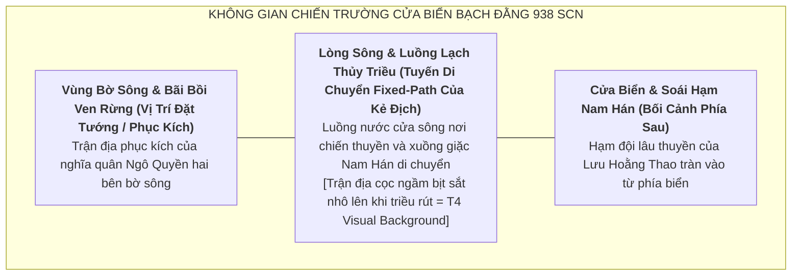

# Định Hướng Bối Cảnh & Không Gian Map: Chapter Ngô Quyền & Bạch Đằng (937–939 SCN)

> [!IMPORTANT]
> **Ràng Buộc Định Hướng Map (Task `VS-NQ-01`)**:
> - Tài liệu này xác lập định hướng không gian chiến trường, phân tầng địa danh học và bầu không khí nghệ thuật cho Flagship Chapter: **Trận Thủy Chiến Bạch Đằng Năm 938**.
> - **TUYỆT ĐỐI KHÔNG**:
>   - Không vẽ tọa độ đường đi (path coordinates) cụ thể.
>   - Không viết kịch bản wave hay thứ tự đợt xuất hiện của kẻ địch.
>   - Không tạo cơ chế gameplay con nước triều dâng/rút hay cơ chế cắm cọc tương tác.
>   - Không gán chỉ số stats hay thuộc tính môi trường tác động lên combat.
>   - Không nâng các chi tiết phục dựng nghệ thuật (T4 Artistic Reconstruction) lên mức T1/T2 fact.

---

## 1. Tổng Quan Không Gian Chiến Trường (Map Theme)

* **Tên Định Hướng Primary Map**: **Cửa Biển Bạch Đằng — Đại Phá Nam Hán (938 SCN)**.
* **Bối cảnh thời gian**: Mùa đông năm Mậu Tuất (938 SCN) — thời điểm hạm đội thủy quân Nam Hán vượt biển tiến vào cửa sông Bạch Đằng và bị đại phá.
* **Không gian địa lý**: Vùng cửa sông Bạch Đằng (khu vực giáp ranh Hải Phòng và Quảng Ninh ngày nay, nơi mạng lưới sông đổ ra vịnh Bắc Bộ — T1/T2 confirmed toponym).
* **Vị trí của Ái Châu & Thành Đại La**: Đóng vai trò **Narrative Prelude** (căn cứ khởi binh dấy nghĩa và nơi tiêu diệt phản thần Kiều Công Tiễn vào mùa thu 938), không xây dựng thành map chiến đấu độc lập để tập trung toàn bộ quy mô gameplay vào trận địa Bạch Đằng.

---

## 2. Phân Tầng Địa Danh Học & Tính Xác Thực Lịch Sử

### 2.1. Địa Danh Ghi Nhận Trong Chính Sử (T1/T2 Historical Toponyms)
* **Sông Bạch Đằng (Bạch Đằng Giang / 白藤江)**: Dòng sông huyết mạch cửa ngõ phía Đông Bắc đất nước, nơi diễn ra trận quyết chiến chiến lược đại phá thủy quân Nam Hán (T1/T2).
* **Cửa biển Hải Môn (海門)**: Nơi vua Nam Hán Lưu Cung đóng đại quân làm thanh viện yểm trợ từ xa (T1/T2).
* **Thành Đại La (La Thành / 大羅城)**: Nơi Ngô Quyền tiến quân ra Bắc chém đầu Kiều Công Tiễn trước trận Bạch Đằng (T1/T2 — Narrative Prelude).
* **Cổ Loa (古螺)**: Kinh đô cổ của An Dương Vương, nơi Ngô Quyền xưng Vương năm 939 (T2 — Epilogue).

---

### 2.2. Bối Cảnh Khảo Cổ Học & Địa Mạo Thủy Văn (T4 Context)
* **Quy luật thủy triều**: Vùng cửa sông Bạch Đằng có chế độ nhật triều điển hình với biên độ chênh lệch triều rất lớn (khoảng 3–4 mét). Khi triều lên, mặt nước mênh mông che lấp toàn bộ bãi cọc; khi triều rút mạnh, lòng sông thu hẹp để lộ bãi cọc nhọn nhô lên khỏi mặt nước.
* **Địa mạo bãi bồi**: Rừng cây ngập mặn cổ, lau sậy rậm rạp và các lạch sông phụ lưu tạo địa hình mai phục lý tưởng cho thuyền nhẹ.

---

### 2.3. Tái Dựng Nghệ Thuật Trong Gameplay (`[T4 / Artistic Reconstruction]`)

> [!WARNING]
> **Phân Biệt Rõ T4 Artistic Reconstruction Với T1/T2 Historical Fact**:
> - Các chi tiết cảnh quan thị giác dưới đây — bao gồm bố cục bãi cọc gỗ ngầm, hình dáng sàn thuyền dã chiến, vị trí cắm cờ xí nghĩa quân và chi tiết trang phục — là **`[T4 / Artistic Reconstruction]`** phục vụ trải nghiệm trực quan 2D Tower Defense, không được xem là bằng chứng khảo cổ hay dữ kiện lịch sử chắc chắn.

* **Cảnh quan thị giác 2D** `[T4 / Artistic Reconstruction]`:
  - Góc nhìn trực diện (Front View) chuẩn 2D Tower Defense.
  - **Tông màu chủ đạo**: Bầu trời mùa đông phương Bắc xám lạnh, sóng nước cuồn cuộn pha lẫn phù sa đỏ sẫm, rặng cọc gỗ sẫm màu nhô lên giữa dòng nước rút, khói lửa bốc lên từ các chiến thuyền giặc va cọc vỡ đắm.
  - **Đường đi của địch (Enemy Path)**: Tuyến luồng lạch uốn lượn giữa lòng sông và bãi cọc ngầm.
  - **Vị trí đặt tướng (Hero Slots)**: Các bãi bồi phù sa cao, mỏm đồi đất ven bờ, sàn thuyền chỉ huy ngụy trang ven rặng lau sậy.
* **Đối lập thị giác giữa hai phe** `[T4 / Artistic Interpretation]`:
  - **Nghĩa quân Ngô Quyền**: Áo chàm vải thô, đầu chít khăn đỏ hoặc đai da, tinh thần quật cường, sử dụng trường kiếm, nỏ ngắm và gươm ngắn phù hợp đánh thủy bộ.
  - **Thủy quân Nam Hán**: Áo giáp phiến sẫm màu pha ánh đồng, cờ hiệu rồng lửa Nam Hán rách nát trôi trên mặt nước, vẻ mặt kinh hoàng giữa trận địa cọc vỡ vụn.

---

## 3. Định Hướng Cốt Truyện & Ý Nghĩa Lịch Sử Toàn Thắng (Historical Outcome)

### 3.1. Ý Nghĩa Thắng Lợi Trong Gameplay & Lịch Sử (Historical Outcome)
* Khác với các chiến dịch thời kỳ đầu (như Hai Bà Trưng hay Bà Triệu vốn mang tính chất tactical resistance trước sức mạnh áp đảo của quân đô hộ), **Trận Bạch Đằng năm 938 là một chiến thắng quân sự mang tính bước ngoặt quyết định**:
  1. Quân Nam Hán đại bại; *Tư Trị Thông Giám* ghi binh sĩ chết chìm quá nửa (`覆溺者大半`).
  2. Chủ tướng giặc là Lưu Hoằng Thao / Hồng Thao tử trận.
  3. Vua Nam Hán Lưu Cung đóng ở Hải Môn nghe tin con chết bèn khóc lóc, thu nhặt số quân còn lại rút về nước (`收餘衆而還`), từ đó không dám đem quân sang nữa (*Tân Ngũ Đại Sử* Q65 ghi `自是不復出`).
* **Định nghĩa chiến thắng trong màn chơi**: Người chơi bảo vệ toàn vẹn trận địa phòng thủ, đánh lui toàn bộ các đợt thuyền giặc và hạ gục chủ tướng Lưu Hoằng Thao.

---

### 3.2. Đánh Giá Học Thuật Về Ý Nghĩa Lịch Sử
* **Chấm dứt thời kỳ Bắc thuộc**: Chiến thắng Bạch Đằng 938 đập tan hoàn toàn mưu đồ thôn tính của triều Nam Hán, mở ra bước ngoặt lịch sử chấm dứt hơn một nghìn năm Bắc thuộc.
* **Xác lập nền độc lập lâu dài**: Mở ra kỷ nguyên độc lập tự chủ lâu dài cho dân tộc Việt Nam, đặt tiền đề trực tiếp để Ngô Quyền xưng Vương vào mùa xuân năm 939, thiết lập triều đình độc lập tại Cổ Loa, mở đường cho các triều đại Đinh, Tiền Lê, Lý, Trần phát triển sau này.
* **Cẩn trọng học thuật**: Tránh các khẩu hiệu tuyệt đối hóa giản lược; trình bày chiến thắng 938 như đỉnh cao của quá trình đấu tranh bền bỉ qua nhiều thế hệ hào trưởng người Việt (từ Khúc Thừa Dụ 905, Dương Đình Nghệ 931 đến Ngô Quyền 938).

---

### 3.3. Phân Cảnh Kết Thúc (Epilogue Bridge: Ngô Quyền Xưng Vương 939 SCN)
* Sau chiến thắng vang dội trên sông Bạch Đằng, mùa xuân năm Kỷ Hợi (939 SCN), Ngô Quyền tiến về kinh đô Cổ Loa:
  - Chính thức **xưng Vương (Ngô Vương)**.
  - Bãi bỏ hoàn toàn các danh xưng quan chức đô hộ (như Tiết độ sứ Tĩnh Hải quân của nhà Đường / Ngũ Đại).
  - Thiết lập triều nghi, đặt trăm quan, định phẩm phục, xác lập thể chế quân chủ độc lập tự chủ hoàn toàn của nước Việt.
* Đóng lại trọn vẹn toàn bộ chuỗi Arc lịch sử 602–938.

---

## 4. Tóm Tắt Định Hướng Phát Triển Tiếp Theo

1. **Giai đoạn tiếp theo (VS-NQ-02 / Playable Concepts)**: Thiết kế chi tiết bộ kỹ năng visual và phong cách chiến đấu của Ngô Quyền (Hero 1 — LOCK) và các Hero dự bị (Dương Tam Kha, Đỗ Cảnh Thạc — PROVISIONAL), tuân thủ tuyệt đối quy chuẩn TD không gán số liệu balance.
2. **Visual Art Direction**: Xây dựng bảng màu hoành tráng cho trận Bạch Đằng — không khí khói lửa trên sóng nước mùa đông, cọc gỗ bịt sắt nhô lên trên dòng triều rút, soái hạm Lưu Hoằng Thao bị đâm thủng lật úp giữa sông.
