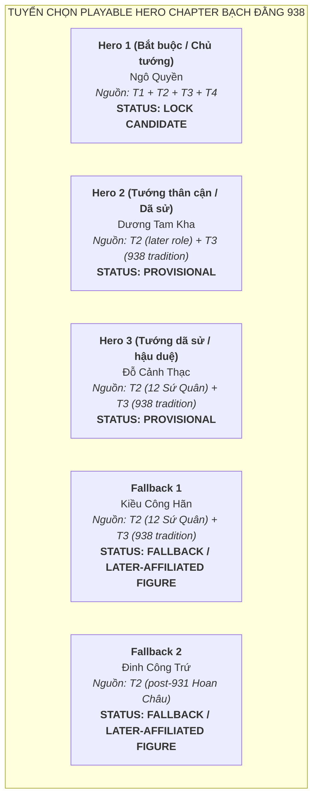

# Đề Xuất Tuyển Chọn Roster: Chapter Ngô Quyền & Bạch Đằng (937–939 SCN)

> [!IMPORTANT]
> **Ràng Buộc Tuyển Chọn Roster (Task `VS-NQ-01`)**:
> - Tài liệu này đề xuất danh sách **Playable Heroes** và **Enemy Opposition** cho Flagship Chapter lịch sử: **Chiến dịch Bạch Đằng năm 938** dưới sự lãnh đạo của **Ngô Quyền**, mở đầu từ biến cố 937 (Kiều Công Tiễn phản nghịch) và kết thúc ở mốc 939 (Ngô Quyền xưng Vương).
> - **Không đi sâu sang thời Ngô sau 939** (thời Ngô Xương Ngập, Ngô Xương Văn và 12 Sứ Quân thuộc về Chapter sau).
> - **TUYỆT ĐỐI KHÔNG**:
>   - Không thiết kế Normal Attack, Skill, Passive, stats, Range, AttackSpeed hay gameplay class.
>   - Không tạo cơ chế Enemy tấn công Hero (Enemy di chuyển trên fixed path và có HP).
>   - Không tự invent nhân vật lịch sử hư cấu để lấp đầy 3 slot Hero nếu sử liệu không đủ căn cứ xác thực.

---

## 1. Cơ Sở Sử Liệu & Phân Tầng Học Thuật (Baseline)

Dựa trên kết quả khảo cứu tại `docs/drafts/viet-su/602-938/sources.md` và `docs/drafts/viet-su/938-source-audit/source-evidence-matrix.md`:
* **T1 — Near-source Chronicles (Thư tịch gần thời)**:
  - ***Tân Ngũ Đại Sử* (Âu Dương Tu, Quyển 65 — Nam Hán thế gia)**: Ghi chép chính xác việc Kiều Công Tiễn giết Dương Đình Nghệ đoạt quyền (937) và cầu cứu Nam Hán; Ngô Quyền từ Ái Châu kéo quân diệt Kiều Công Tiễn; vua Nam Hán Lưu Cung sai con sang đánh; Ngô Quyền đón đánh, cắm cọc sắt ở biển (`植鐵橛海中`), thừa lúc nước triều rút ép thuyền giặc vướng cọc lật úp, giết chết chủ tướng Nam Hán Lưu Hồng Thao (`劉洪操`); Lưu Cung thu nhặt số quân còn lại rút về nước.
  - ***Tư Trị Thông Giám* (Tư Mã Quang, Quyển 281)**: Ghi chép chi tiết biến cố năm 937–938: Ngô Quyền sai cắm cọc gỗ lớn vạt nhọn bịt sắt ở cửa biển (`權先植大木于海門，闞其鋒以鐵`), dùng thuyền nhẹ ra đón đánh (`以輕舟出迎戰`), nước triều dâng ngập cọc (`潮滿漲，木溺不見`), giả thua chạy nhử giặc (`詐奔`), khi triều rút hạm giặc vướng cọc không tiến thoái được (`潮退，艦礙於木`), quân Nam Hán đại bại, binh sĩ chết chìm quá nửa (`覆溺者大半`), chém chết Vạn Vương Lưu Hoằng Thao (`劉弘操`); Lưu Cung thu tàn quân rút về.
* **T2 — Later Vietnamese Historiography (Chính sử Đại Việt)**:
  - ***Đại Việt Sử Ký Toàn Thư* (Ngoại kỷ Quyển 5) & *Khâm Định Việt Sử Thông Giám Cương Mục***: Ghi chép chi tiết xuất thân Ngô Quyền đất Đường Lâm; kế sách cọc gỗ bịt sắt vạt nhọn cắm dưới lòng sông Bạch Đằng (`權使人先於海門植大木，銳其端，冒之以鐵`); diễn biến dụ địch khi triều lên và phản công khi triều rút; việc xưng Vương năm 939 định đô Cổ Loa.
  - ***Việt Sử Lược* (Quyển 1)**: Bộ sử biên niên cổ nhất của Đại Việt ghi chép cô đọng về trận Bạch Đằng 938 và việc Ngô Vương dựng nước.
* **T3 — Local Tradition / Folklore (Dã sử & Thần tích địa phương)**: Thần phả, thần tích các đền thờ Ngô Quyền tại Đường Lâm (Hà Nội), đền thờ và miếu thờ tại Hải Phòng, Quảng Ninh; thần tích về các tướng lĩnh tham gia nghĩa quân (Dương Tam Kha, Đỗ Cảnh Thạc, Kiều Công Hãn...).
* **T4 — Modern Scholarship & Archaeology (Khảo cổ & Sử học hiện đại)**: Công trình nghiên cứu thực địa bãi cọc ven sông Bạch Đằng (Yên Giang, Đồng Má Ngựa, Cao Quỳ); nghiên cứu thành Cổ Loa thời Ngô Vương của các giáo sư Đào Duy Anh, Trần Quốc Vượng, Phan Huy Lê, Hà Văn Tấn.

---

## 2. Đánh Giá & Tuyển Chọn Playable Hero Roster



---

### 2.1. Đánh Giá Chi Tiết Các Playable Hero Candidates

#### Hero Slot 1 (Bắt Buộc): Ngô Quyền — `LOCK CANDIDATE`
* **Identity**: Tiết độ sứ Tĩnh Hải quân, Ngô Vương, hào trưởng đất Đường Lâm, anh hùng dân tộc lãnh tụ tối cao chiến thắng Bạch Đằng 938.
* **Historical Role**:
  * Tập hợp lực lượng quân dân từ Ái Châu kéo quân ra Bắc tiêu diệt phản thần Kiều Công Tiễn tại Đại La vào mùa thu 938.
  * Dự đoán chính xác mưu đồ và hướng tiến quân bằng đường thủy của giặc Nam Hán; sáng tạo trận địa cọc ngầm hiểm yếu nơi cửa biển Bạch Đằng.
  * Chỉ huy toàn quân đón đánh, nhử giặc vào bãi cọc khi nước triều lên và tổng phản công khi nước triều rút; quân Nam Hán đại bại, binh sĩ chết chìm quá nửa, chủ tướng giặc tử trận năm 938.
  * Năm 939, chính thức xưng Vương, bãi bỏ chức Tiết độ sứ của phong kiến phương Bắc, định đô tại Cổ Loa.
* **Source Tier**: **T1** (*Tân Ngũ Đại Sử* Q65, *Tư Trị Thông Giám* Q281) + **T2** (*Toàn Thư*, *Cương Mục*, *Việt Sử Lược*) + **T3** (Đền thờ Đường Lâm, Hải Phòng) + **T4** (Khảo cổ Bạch Đằng & Cổ Loa).
* **Direct Evidence for 938**: **Well-attested / Directly established Fact in T1 & T2**.
* **Historical Uncertainty**: Không có bất định về vai trò chỉ huy và chiến công 938. Điểm học thuật cần lưu ý là không dùng danh xưng "Ngô Vương" hay "áo long cổn" cho giai đoạn 938 (Ngô Quyền xưng Vương vào năm 939).
* **Đề xuất quyết định**: **LOCK CANDIDATE (Hero Slot 1 — Chủ tướng tối cao)**.

---

#### Hero Slot 2: Dương Tam Kha — `PROVISIONAL`
* **Identity**: Tướng lĩnh Ái Châu, em vợ Ngô Quyền, con trai thứ của Tiết độ sứ Dương Đình Nghệ.
* **Historical Role & Sử liệu**:
  * **T2 (*Toàn Thư*, *Cương Mục*)**: Xác nhận vai trò chính trị và vương triều về sau (đại thần triều Ngô, năm 944 đoạt ngôi của Ngô Xương Ngập xưng Dương Bình Vương). **T2 KHÔNG trực tiếp xác nhận ông tham chiến trận Bạch Đằng 938**.
  * **Direct 938 participation = NOT ESTABLISHED trong T1/T2**.
  * **T3 (Thần tích địa phương / dã sử)**: Thần phả một số làng xã Ái Châu và Cổ Loa lưu truyền Dương Tam Kha theo Ngô Quyền ra Bắc diệt Kiều Công Tiễn để báo thù cho cha và tham gia trận Bạch Đằng.
* **Source Tier**: **T2** (later political/dynastic role) + **T3** (938 local tradition).
* **Direct Evidence for 938**: Không có ghi chép T1/T2 trực tiếp cho trận đánh 938.
* **Historical Uncertainty**: Sự tham chiến trực tiếp năm 938 hoàn toàn dựa trên tầng nguồn dã sử T3.
* **Đề xuất quyết định**: **PROVISIONAL (Hero Slot 2)**.

---

#### Hero Slot 3: Đỗ Cảnh Thạc — `PROVISIONAL`
* **Identity**: Tướng lĩnh dưới quyền Ngô Quyền, hào trưởng đất Đỗ Động Giang.
* **Historical Role & Sử liệu**:
  * **T2 (*Toàn Thư*)**: Ghi nhận hành trạng ở thời kỳ sau (đại tướng thời Ngô Vương, sau khi Ngô Quyền mất đóng giữ Đỗ Động Giang và trở thành một trong 12 Sứ Quân).
  * **Direct 938 participation = NOT ESTABLISHED trong T1/T2**.
  * **T3 (Thần tích Đỗ Động Giang, Thanh Oai, Hà Nội)**: Lưu truyền Đỗ Cảnh Thạc theo Ngô Quyền từ những ngày đầu, tham gia bình định Kiều Công Tiễn và trận thủy chiến Bạch Đằng 938.
* **Source Tier**: **T2** (later career / 12 Sứ Quân) + **T3** (938 tradition).
* **Direct Evidence for 938**: Hoàn toàn không có ghi chép trực tiếp trong T1/T2; sự hiện diện tại trận 938 chỉ dựa trên truyền thống dã sử và thần tích địa phương (T3).
* **Historical Uncertainty**: Nổi bật hơn ở thời kỳ 12 Sứ Quân; việc tham chiến 938 là truyền thống T3.
* **Đề xuất quyết định**: **PROVISIONAL (Hero Slot 3)**.

---

### 2.2. Các Phương Án Hero Dự Phòng (Fallback Candidates)

#### Fallback 1: Kiều Công Hãn — `FALLBACK / LATER-AFFILIATED FIGURE`
* **Identity**: Hào trưởng đất Phong Châu (Bạch Hạc, Phú Thọ), cháu nội của Kiều Công Tiễn.
* **Source Tier**: **T2** (*Toàn Thư* — vai trò thời 12 Sứ Quân) + **T3** (Thần phả đền Bạch Hạc).
* **Lý do giữ FALLBACK**: Thần tích địa phương T3 lưu truyền Kiều Công Hãn không theo ông nội mà đem quân bản bộ theo Ngô Quyền đánh giặc. Tuy nhiên, T1 và T2 không có chứng cứ trực tiếp xác nhận ông tham chiến trận Bạch Đằng 938. Hành trạng của ông được ghi nhận rõ nét ở thời kỳ 12 Sứ Quân.
* **Đề xuất quyết định**: **FALLBACK / LATER-AFFILIATED FIGURE**.

#### Fallback 2: Đinh Công Trứ — `FALLBACK / LATER-AFFILIATED FIGURE`
* **Identity**: Hào trưởng đất Hoa Lư (Ninh Bình), Thứ sử Hoan Châu, thân phụ Đinh Bộ Lĩnh.
* **Source Tier**: **T2** (*Toàn Thư*, *Cương Mục* — ghi nhận nhiệm vụ quản Hoan Châu sau 931).
* **Lý do giữ FALLBACK**: Đinh Công Trứ là nha tướng thời Dương Đình Nghệ được giao quản trị Hoan Châu (931). Không có tài liệu T1 hay T2 nào chứng minh ông trực tiếp rời nhiệm địa Hoan Châu ra vùng cửa biển Bạch Đằng tham chiến năm 938. Tuyệt đối không dùng mối liên hệ trong mạng lưới Dương Đình Nghệ để suy diễn thành sự hiện diện tại Bạch Đằng 938.
* **Đề xuất quyết định**: **FALLBACK / LATER-AFFILIATED FIGURE**.

---

## 3. Đánh Giá Nhân Vật Phản Nghịch: Kiều Công Tiễn

```mermaid
graph TD
    subgraph TUYẾN ĐỐI ĐỊCH & PHẢN NGHỊCH (937 - 938 SCN)
        KT["<b>Kiều Công Tiễn (嶠公羨 / 矯公羨)</b><br>Nha tướng phản nghịch giết chủ (937)<br>Cầu viện Nam Hán (938) - Bị diệt tại Đại La<br><b>STATUS: NARRATIVE ANTAGONIST / PRELUDE BOSS</b>"]

        LC["<b>Lưu Cung (劉龑 - Nam Hán Hoàng Đế)</b><br>Chủ mưu xâm lược, đóng quân tại Hải Môn<br><b>STATUS: NARRATIVE SUPREME ANTAGONIST</b>"]

        HT["<b>Lưu Hoằng Thao / Hồng Thao (劉洪操 / 劉弘操)</b><br>Thống lĩnh hạm đội thủy quân Nam Hán<br>Tử trận trên sông Bạch Đằng (938)<br><b>STATUS: LOCK CANDIDATE (MAIN BATTLE BOSS)</b>"]

        KT -.->|Cầu viện mở đường xâm lược| LC
        LC -->|Sai đem hạm đội nam chinh| HT
    end
```

### 3.1. Phân Định Vai Trò Lịch Sử Của Kiều Công Tiễn
* **Identity**: Hào trưởng đất Phong Châu, nha tướng của Tiết độ sứ Dương Đình Nghệ.
* **Historical Role**:
  * Tháng 3/4 năm 937, phản nghịch sát hại chủ tướng Dương Đình Nghệ tại phủ thành Đại La để đoạt chức Tiết độ sứ.
  * Bị cô lập và căm phẫn tẩy chay; khi biết tin Ngô Quyền dấy binh từ Ái Châu kéo ra thảo phạt, Tiễn hoảng sợ sai sứ sang Nam Hán cầu cứu.
  * Mùa thu năm 938, trước khi đạo quân Nam Hán kéo đến cửa biển, Ngô Quyền đã tiến quân công phá Đại La, chém chết Kiều Công Tiễn, dẹp yên mối họa phản nghịch bên trong.
* **Source Tier**: **T1 (*Tân Ngũ Đại Sử* Q65, *Tư Trị Thông Giám* Q281) + T2 (*Toàn Thư*)**.
* **Định vị thiết kế gameplay**:
  * Kiều Công Tiễn bị tiêu diệt tại Đại La vào mùa thu năm 938, **hoàn toàn không có mặt trong trận thủy chiến Bạch Đằng diễn ra vào mùa đông năm 938**.
  * Do đó, **tuyệt đối không biến Kiều Công Tiễn thành Boss của trận Bạch Đằng**.
  * Nhân vật này phù hợp đóng vai trò **Narrative Antagonist (Kẻ phản nghịch trong màn dẫn nhập)** hoặc **Optional Prelude Boss (Boss phụ trong phân đoạn vượt thành Đại La mở đầu chiến dịch)**.
* **Đề xuất quyết định**: **NARRATIVE ANTAGONIST / OPTIONAL PRELUDE BOSS**.

---

## 4. Tuyến Kẻ Địch Nam Hán & Name Variant Matrix

### 4.1. Name Variant Matrix Cho Chủ Tướng Thủy Quân Nam Hán

| Thư Tịch / Tầng Nguồn | Nguyên Văn Chữ Hán | Phiên Âm Hán-Việt | Tước Hiệu / Chức Vụ Ghi Nhận | Ghi Chú Văn Bản Học |
|---|:---:|---|---|---|
| **T1: *Tân Ngũ Đại Sử* (Q65)** | `劉洪操` | **Lưu Hồng Thao** (hoặc Lưu Hồng Tháo) | Phong làm **Giao Vương (交王)**, thống lĩnh thủy quân sang Giao Châu | Sử dụng chữ **Hồng (洪)** (nghĩa là nước lớn/hồng thủy). |
| **T1: *Tư Trị Thông Giám* (Q281)** | `劉弘操` | **Lưu Hoằng Thao** | Phong làm **Vạn Vương (萬王)**, Tiết độ sứ Tĩnh Hải quân | Sử dụng chữ **Hoằng (弘)** (nghĩa là rộng lớn). |
| **T2: *Đại Việt Sử Ký Toàn Thư*** | `萬王弘操` | **Vạn Vương Hoằng Thao** | **Vạn Vương (萬王)**, Tiết độ sứ Tĩnh Hải quân | Sử dụng chữ **Hoằng (弘)**; chính sử Đại Việt chép tước hiệu Vạn Vương. |
| **T2: *Khâm Định Việt Sử Thông Giám Cương Mục*** | `弘操` | **Hoằng Thao** | Vạn Vương Hoằng Thao | Sử dụng chữ **Hoằng (弘)** theo truyền thống Toàn Thư. |
| **T4: Sử học hiện đại** | `Lưu Hoằng Thao / Lưu Hồng Thao` | **Lưu Hoằng Thao / Lưu Hồng Thao** | Hoàng tử Nam Hán, chỉ huy quân xâm lược | Tùy công trình phiên âm theo chữ 弘 (Hoằng) hoặc 洪 (Hồng). |

* **Định danh chuẩn hóa trong tài liệu**: Sử dụng **Lưu Hoằng Thao / Lưu Hồng Thao (劉洪操 / 劉弘操)**, ghi nhận đầy đủ hai dạng chữ Hán để đảm bảo tính chính xác học thuật cao nhất.

---

### 4.2. Đánh Giá Các Boss Lịch Sử Phe Nam Hán

#### A. Lưu Hoằng Thao / Lưu Hồng Thao (劉洪操 / 劉弘操) — `LOCK CANDIDATE (Main Battle Boss)`
* **Identity**: Hoàng tử Nam Hán (phong Giao Vương / Vạn Vương), Đô thống chỉ huy hạm đội thủy quân xâm lược Giao Châu năm 938.
* **Historical Role**:
  * Trực tiếp chỉ huy đoàn chiến thuyền vượt biển tiến vào cửa sông Bạch Đằng theo lệnh của cha là Lưu Cung.
  * Mắc mưu Ngô Quyền, cho chiến thuyền đuổi theo toán thuyền nhẹ khiêu chiến khi nước triều đang dâng cao, lọt sâu vào trận địa phục kích.
  * Khi nước triều rút mạnh, thuyền chiến Nam Hán quay đầu tháo chạy bị cọc ngầm đâm thủng vỡ toác, lật úp. Lưu Hoằng Thao tử trận tại khúc sông Bạch Đằng mùa đông năm 938.
* **Source Tier**: **T1 (*Tân Ngũ Đại Sử* Q65, *Tư Trị Thông Giám* Q281) + T2 (*Toàn Thư*, *Cương Mục*, *Việt Sử Lược*)** — *Historical Person xác thực*.
* **Vai trò gameplay**: **Main Battle Boss (Boss Chiến Đấu Chính Của Trận Bạch Đằng)**.
* **Đề xuất quyết định**: **LOCK CANDIDATE (Main Boss)**.

#### B. Lưu Cung (劉龑 — Hoàng Đế Nam Hán) — `NARRATIVE SUPREME ANTAGONIST`
* **Identity**: Hoàng đế khai quốc Nam Hán (ở ngôi 917–942), kẻ chủ mưu thôn tính Tĩnh Hải quân.
* **Historical Role**:
  * Sai con là Hoằng Thao đem thủy quân sang đánh, bản thân tự lĩnh đại quân đóng giữ ở **Hải Môn (海門)** làm thanh viện yểm trợ từ xa.
  * Khi nghe tin Hoằng Thao tử trận và quân Nam Hán đại bại, Lưu Cung đau đớn khóc lóc, thu nhặt số quân còn lại rút về nước (`收餘衆而還`), từ đó không dám đem quân sang nữa.
* **Source Tier**: **T1 + T2** — *Historical Person xác thực*.
* **Xử lý thiết kế**:
  * Lưu Cung không trực tiếp tiến vào vùng cửa sông Bạch Đằng nên **không xuất hiện như một combat boss cơ học trên map chiến đấu**.
  * Nhân vật này giữ vai trò **Narrative Supreme Antagonist (Kẻ thù tối cao phía sau câu chuyện)** trong các đoạn dẫn nhập và kết thúc của Chapter.
* **Đề xuất quyết định**: **NARRATIVE SUPREME ANTAGONIST**.

---

### 4.3. Tuyến Kẻ Địch Thường & Tinh Anh Phe Nam Hán (`GAME / T4 RECONSTRUCTION`)

> [!WARNING]
> **Quy Chuẩn Thiết Kế Enemy Thủy Quân Nam Hán**:
> - Các đơn vị quân dưới đây là **Game / T4 Reconstruction** (dựa trên mô hình thủy quân và trang bị thời Ngũ Đại Thập Quốc), tuyệt đối không tự gắn nhãn T1/T2 fact.
> - Toàn bộ Enemy di chuyển trên **fixed path**, có thanh máu (HP) và **không tấn công Hero**. Vũ khí chỉ đóng vai trò nhận diện mỹ thuật trực quan (visual identity).

```mermaid
flowchart LR
    subgraph QUÂN XÂM LƯỢC NAM HÁN (GAME RECONSTRUCTION - T4)
        N1["<b>1. Nam Hán Thủy Quân Tiền Phong</b><br>Normal Enemy (Thủy binh cơ động nhẹ - T4)"]
        N2["<b>2. Nam Hán Thủy Cung Trận Binh</b><br>Normal Enemy (Xạ thủ trên thuyền - T4)"]
        N3["<b>3. Nam Hán Đột Kích Thủy Binh</b><br>Normal Enemy (Lính phá cọc / xung kích - T4)"]

        E1["<b>Nam Hán Lâu Thuyền Vệ Sĩ</b><br>Elite Enemy (Cấm vệ soái hạm - T4)"]

        B1["<b>Lưu Hoằng Thao / Hồng Thao</b><br>Main Battle Boss (T1/T2)"]
    end

    N1 --> E1
    N2 --> E1
    N3 --> E1
    E1 --> B1
```

1. **Nam Hán Thủy Quân Tiền Phong (Nam Han Marine Vanguard)**:
   * *Định danh mỹ thuật*: Lính thủy binh chèo thuyền nhẹ đi đầu thám thính, mặc áo chẽn da thuộc chịu nước màu lam sẫm, tay cầm đoản đao và khiên mây bọc da.
   * *Phân tầng*: **Game / T4 Reconstruction**.
2. **Nam Hán Thủy Cung Trận Binh (Nam Han Naval Crossbowman)**:
   * *Định danh mỹ thuật*: Xạ thủ đóng trên sàn thuyền chiến, trang bị nỏ gỗ Nam Hán hoặc cung ngắn, áo giáp vải chống ẩm có bao tên sau lưng (visual only, không bắn Hero).
   * *Phân tầng*: **Game / T4 Reconstruction**.
3. **Nam Hán Đột Kích Thủy Binh (Nam Han Boarding Raiding Infantry)**:
   * *Định danh mỹ thuật*: Lính nhảy boong tác chiến cận chiến, trang bị câu liêm hoặc trường đao trảm mã, mũ chóp đồng, chuyên phá rào cản.
   * *Phân tầng*: **Game / T4 Reconstruction**.
4. **Nam Hán Lâu Thuyền Vệ Sĩ / Thiết Giáp Thủy Tướng (Nam Han Heavy Marine Flagship Guard)**:
   * *Định danh mỹ thuật*: Sĩ quan cấm vệ bảo vệ soái hạm Lưu Hoằng Thao, mặc giáp phiến kim loại dày sẫm màu, tay cầm đại phủ (rìu chiến lớn) hoặc đại thương, đội mũ đồng trang trí đầu rồng Nam Hán.
   * *Phân tầng*: **Game / T4 Reconstruction**.

---

## 5. Ràng Buộc Sử Liệu Về Trận Bạch Đằng 938 (Source Guardrails)

### 5.1. Chứng Cứ Thư Tịch Cổ & Khảo Chính Thuật Ngữ Cọc (Textual Evidence)
1. **Trận thủy chiến cửa sông hiểm yếu**: Cả *Tân Ngũ Đại Sử* (T1) và *Toàn Thư* (T2) đều xác nhận trận đánh diễn ra tại vùng cửa biển Bạch Đằng.
2. **Thuật ngữ cọc theo từng nguồn cụ thể (Source-Specific Stake Wording)**:
   * *Tân Ngũ Đại Sử* (T1 Q65) ghi: `植鐵橛海中` (cắm cọc sắt ở biển/nước).
   * *Tư Trị Thông Giám* (T1 Q281) ghi: cắm cọc gỗ lớn ở cửa biển, bịt sắt ở ngọn nhọn (`權先植大木于海門，闞其鋒以鐵`), dùng thuyền nhẹ ra đón đánh (`以輕舟出迎戰`), nước triều lên ngập cọc (`潮滿漲，木溺不見`), giả chạy nhử giặc (`詐奔`), triều rút hạm giặc vướng cọc (`潮退，艦礙於木`), đâm vỡ lật chìm.
   * *Toàn Thư* (T2) ghi: Ngô Quyền cho vạt nhọn đầu cọc gỗ lớn, bịt sắt rồi cắm ngầm ở cửa biển (`權使人先於海門植大木，銳其端，冒之以鐵`).
   * *Nguyên tắc*: Không gộp chi tiết của nguồn sau (*Tư Trị Thông Giám*, *Toàn Thư*) rồi gán ngược cho *Tân Ngũ Đại Sử*.
3. **Kết quả lịch sử (Historical Outcome)**:
   * Quân Nam Hán đại bại; *Tư Trị Thông Giám* ghi binh sĩ chết chìm quá nửa (`覆溺者大半`); Lưu Hoằng Thao tử trận; Lưu Cung thu nhặt số quân còn lại rút về nước (`收餘衆而還`), từ đó không dám đem quân sang nữa.
   * Tránh dùng các cụm từ tuyệt đối hóa như "hạm đội bị xóa sổ hoàn toàn" hay "vĩnh viễn từ bỏ mộng xâm lược" nếu không giải thích ngữ cảnh sử liệu.

---

### 5.2. Phân Định Khảo Cổ Học Hiện Đại (Modern Archaeology Context — T4)

> [!CAUTION]
> **Cảnh Báo Phân Tầng Khảo Cổ Học — Không Đồng Nhất Tuyệt Đối**:
> - Các phát hiện khảo cổ học về cọc gỗ ven sông Bạch Đằng (Bãi cọc Yên Giang, Đồng Má Ngựa tại Quảng Yên; Bãi cọc Cao Quỳ, Đầm Thượng tại Thủy Nguyên - Hải Phòng) với kết quả định tuổi C14 thuộc khung niên đại **thế kỷ X–XIII** cung cấp **bối cảnh vật chất quý giá (archaeological context)** chứng minh truyền thống quân sự cắm cọc ngầm chống giặc ngoại xâm.
> - Tuy nhiên, sông Bạch Đằng là chiến trường của **3 chiến dịch thủy chiến (938 thời Ngô Quyền, 981 thời Lê Hoàn, 1288 thời Trần Hưng Đạo)**.
> - Giới khảo cổ học và sử học hiện đại xác nhận các bãi cọc Yên Giang, Đồng Má Ngựa có niên đại C14 thế kỷ XIII (thuộc trận 1288); bãi cọc Cao Quỳ có niên đại phân tán rộng và việc gán cho riêng năm 938 là `DISPUTED / UNVERIFIED`.
> - Do đó, trong hồ sơ thiết kế, **tuyệt đối không khẳng định chắc chắn từng bãi cọc khảo cổ cụ thể là di tích nguyên bản duy nhất của trận 938**. Mọi miêu tả bãi cọc trên map đều thuộc phân loại **`[T4 / Artistic Reconstruction]`**.

---

## 6. Bảng Quyết Định Tuyển Chọn Roster Chuẩn Hóa (Output Decision Table)

| Vị Trí / Hạng Mục | Tên Thực Thể / Nhân Vật (NAME) | Phân Tầng Nguồn (SOURCE TIER) | Mức Độ Tin Cậy Sử Liệu (CONFIDENCE) | Trạng Thái Quyết Định (STATUS) | Ghi Chú Ràng Buộc Sử Liệu |
|---|---|:---:|:---:|:---:|---|
| **Hero Slot 1** | **Ngô Quyền** | **T1 + T2** | Well-attested T1 / T2 Fact | **LOCK CANDIDATE** | Bắt buộc; thủ lĩnh tối cao chiến thắng Bạch Đằng 938 (*Tân Ngũ Đại Sử* Q65, *Tư Trị Thông Giám* Q281, *Toàn Thư*). |
| **Hero Slot 2** | **Dương Tam Kha** | **T2 (later role) + T3 (938 tradition)** | T2 later dynastic role; 938 battle role = NOT ESTABLISHED in T1/T2 | **PROVISIONAL** | Em vợ Ngô Quyền; T2 ghi nhận vai trò chính trị về sau; tham gia trận 938 chỉ dựa trên dã sử/thần tích T3. |
| **Hero Slot 3** | **Đỗ Cảnh Thạc** | **T2 (12 Sứ Quân) + T3 (938 tradition)** | T2 later 12 Su Quan; 938 battle role = NOT ESTABLISHED in T1/T2 | **PROVISIONAL** | Tướng thân tín theo dã sử T3 tham chiến 938; T2 ghi nhận thời 12 Sứ Quân. |
| *Hero Fallback 1* | *Kiều Công Hãn* | *T2 (12 Sứ Quân) + T3 (938 tradition)* | Later-affiliated; no exact T1/T2 citation for 938 | *FALLBACK / LATER-AFFILIATED FIGURE* | Tướng đất Phong Châu; nổi bật thời 12 Sứ Quân; T3 ghi theo Ngô Quyền. |
| *Hero Fallback 2* | *Đinh Công Trứ* | *T2 (post-931 Hoan Châu)* | Later-affiliated; no 938 battlefield evidence | *FALLBACK / LATER-AFFILIATED FIGURE* | Thứ sử Hoan Châu; không có chứng cứ rời Hoan Châu ra Bạch Đằng năm 938. |
| **Narrative Antagonist** | **Kiều Công Tiễn** | **T1 + T2** | Well-attested T1 / T2 Fact | **OPTIONAL PRELUDE BOSS / NARRATIVE ANTAGONIST** | Phản thần giết Dương Đình Nghệ 937; bị Ngô Quyền diệt tại Đại La thu 938; không đưa vào map Bạch Đằng. |
| **Supreme Antagonist** | **Lưu Cung (Hoàng Đế Nam Hán)** | **T1 + T2** | Well-attested T1 / T2 Fact | **NARRATIVE SUPREME ANTAGONIST** | Chủ mưu xâm lược, đóng quân tại Hải Môn yểm trợ từ xa; không làm combat boss trên map. |
| **Main Battle Boss** | **Lưu Hoằng Thao / Lưu Hồng Thao (劉洪操 / 劉弘操)** | **T1 + T2** | Well-attested T1 / T2 Fact | **LOCK CANDIDATE** | Chủ tướng thống lĩnh thủy quân Nam Hán; tử trận tại sông Bạch Đằng năm 938 (*Tân Ngũ Đại Sử* Q65, *Tư Trị Thông Giám* Q281). |
| **Normal Enemy 1** | **Nam Hán Thủy Quân Tiền Phong** | **Game / T4** | Game / T4 Reconstruction | **LOCK CANDIDATE** | Thủy binh chèo xuồng nhẹ, đao khiên cơ động (visual only, fixed path). |
| **Normal Enemy 2** | **Nam Hán Thủy Cung Trận Binh** | **Game / T4** | Game / T4 Reconstruction | **LOCK CANDIDATE** | Xạ thủ chiến thuyền nỏ/cung (visual only, không bắn Hero). |
| **Normal Enemy 3** | **Nam Hán Đột Kích Thủy Binh** | **Game / T4** | Game / T4 Reconstruction | **LOCK CANDIDATE** | Lính nhảy boong phá rào cản, câu liêm/trảm mã đao (visual only). |
| **Elite Unit** | **Nam Hán Lâu Thuyền Vệ Sĩ** | **Game / T4** | Game / T4 Reconstruction | **LOCK CANDIDATE** | Cấm vệ soái hạm giáp nặng sẫm màu, đại phủ/trường kích (visual only). |
| **Primary Map** | **Cửa Biển Bạch Đằng (938 SCN)** | **T1/T2 + T4** | High (T1/T2 Confirmed Toponym + T4 Visual) | **LOCK PRIMARY MAP** | Không gian cửa sông Bạch Đằng, bãi bồi, rặng cọc ngầm nhô lên khi triều rút. |
