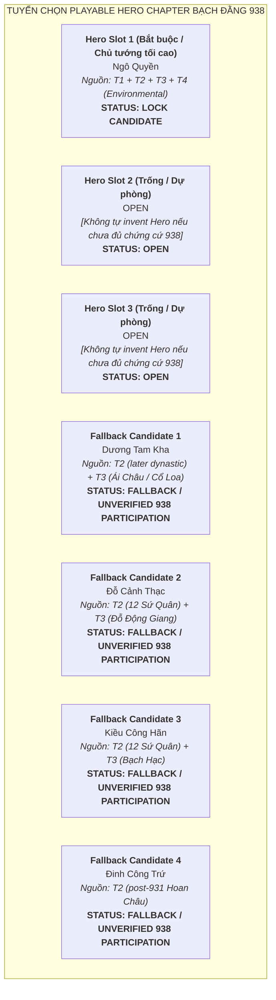

# Đề Xuất Tuyển Chọn Roster: Chapter Ngô Quyền & Bạch Đằng (937–939 SCN)

> [!IMPORTANT]
> **Ràng Buộc Tuyển Chọn Roster (Task `VS-NQ-01` — Final Evidence Sync)**:
> - Tài liệu này đề xuất danh sách **Playable Heroes** và **Enemy Opposition** cho Flagship Chapter lịch sử: **Chiến dịch Bạch Đằng năm 938** dưới sự lãnh đạo của **Ngô Quyền**, mở đầu từ biến cố 937 (Kiều Công Tiễn phản nghịch) và kết thúc ở mốc 939 (Ngô Quyền xưng Vương).
> - **Không đi sâu sang thời Ngô sau 939** (thời Ngô Xương Ngập, Ngô Xương Văn và 12 Sứ Quân thuộc về Chapter sau).
> - **TUYỆT ĐỐI KHÔNG**:
>   - Không thiết kế Normal Attack, Skill, Passive, stats, Range, AttackSpeed hay gameplay class.
>   - Không tạo cơ chế Enemy tấn công Hero (Enemy di chuyển trên fixed path và có HP).
>   - Không tự invent nhân vật lịch sử hư cấu để lấp đầy 3 slot Hero nếu sử liệu không đủ căn cứ xác thực.

---

## 1. Cơ Sở Sử Liệu & Phân Tầng Học Thuật (Baseline)

Dựa trên kết quả khảo cứu tại `docs/drafts/viet-su/602-938/sources.md` và `docs/drafts/viet-su/938-source-audit/`:
* **T1 — Near-source Chronicles (Thư tịch gần thời)**:
  - ***Tân Ngũ Đại Sử* (Âu Dương Tu, Quyển 65 — Nam Hán thế gia)**: Ghi chép việc Kiều Công Tiễn (`皎公羨`) giết Dương Đình Nghệ đoạt quyền (937) và cầu cứu Nam Hán; Ngô Quyền từ Ái Châu kéo quân diệt Kiều Công Tiễn; vua Nam Hán Lưu Cung sai con sang đánh; Ngô Quyền đón đánh, cắm cọc sắt ở biển (`植鐵橛海中`), thừa lúc nước triều rút ép thuyền giặc vướng cọc lật úp, giết chết chủ tướng Nam Hán Lưu Hồng Thao (`劉洪操`); Lưu Cung thu nhặt tàn quân rút về.
  - ***Tư Trị Thông Giám* (Tư Mã Quang, Quyển 281)**: Ghi chép biến cố năm 937–938: Ngô Quyền giết Kiều Công Tiễn (`皎公羨`); sai cắm cọc gỗ lớn vạt nhọn bịt sắt ở cửa biển (`權先植大木于海門，闞其鋒以鐵`), dùng thuyền nhẹ ra đón đánh (`以輕舟出迎戰`), nước triều dâng ngập cọc (`潮滿漲，木溺不見`), giả thua chạy nhử giặc (`詐奔`), khi triều rút hạm giặc vướng cọc không lui được (`潮退，艦礙於木`), quân Nam Hán đại bại, binh sĩ chết chìm quá nửa (`覆溺者大半`), chém chết Vạn Vương Lưu Hoằng Thao (`劉弘操`); Lưu Cung thu tàn quân rút về.
* **T2 — Later Vietnamese Historiography (Chính sử Đại Việt)**:
  - ***Đại Việt Sử Ký Toàn Thư* (Ngoại kỷ Quyển 5) & *Khâm Định Việt Sử Thông Giám Cương Mục***: Ghi chép xuất thân Ngô Quyền đất Đường Lâm; diệt phản thần Kiều Công Tiễn (`矯公羨`); kế sách cọc gỗ bịt sắt vạt nhọn cắm dưới lòng sông Bạch Đằng (`權使人先於海門植大木，銳其端，冒之以鐵`); diễn biến dụ địch khi triều lên và phản công khi triều rút; việc xưng Vương năm 939 định đô Cổ Loa.
  - ***Việt Sử Lược* (Quyển 1)** & ***An Nam Chí Lược* (Quyển 9)**: Ghi chép cô đọng về trận Bạch Đằng 938 và việc Ngô Vương dựng nước.
* **T3 — Local Tradition / Folklore (Dã sử & Thần tích địa phương)**: Thần phả, thần tích các đền thờ Ngô Quyền tại Đường Lâm (Hà Nội), đền thờ và miếu thờ tại Hải Phòng, Quảng Ninh; thần tích về các danh tướng, hào trưởng địa phương.
* **T4 — Modern Scholarship & Archaeology (Khảo cổ & Sử học hiện đại)**: Công trình nghiên cứu thực địa bãi cọc ven sông Bạch Đằng (Yên Giang, Đồng Má Ngựa); nghiên cứu khảo cổ học công bố năm 2026 (*The Holocene* DOI: `10.1177/09596836261450824`) về các cọc gỗ vùng cửa sông Bạch Đằng; nghiên cứu thành Cổ Loa thời Ngô Vương của các giáo sư Đào Duy Anh, Trần Quốc Vượng, Phan Huy Lê, Hà Văn Tấn.

---

## 2. Đánh Giá & Tuyển Chọn Playable Hero Roster



---

### 2.1. Đánh Giá Chi Tiết Hero Slot 1 (Khóa Cố Định): Ngô Quyền — `LOCK CANDIDATE`

* **Identity**: Tiết độ sứ Tĩnh Hải quân, Ngô Vương, hào trưởng đất Đường Lâm, anh hùng dân tộc lãnh tụ tối cao chiến thắng Bạch Đằng 938.
* **Historical Role**:
  * Tập hợp lực lượng quân dân từ Ái Châu kéo quân ra Bắc tiêu diệt phản thần Kiều Công Tiễn tại Đại La vào mùa thu 938.
  * Dự đoán chính xác mưu đồ và hướng tiến quân bằng đường thủy của giặc Nam Hán; sáng tạo trận địa cọc ngầm hiểm yếu nơi cửa biển Bạch Đằng.
  * Chỉ huy toàn quân đón đánh, nhử giặc vào bãi cọc khi nước triều lên và tổng phản công khi nước triều rút; quân Nam Hán đại bại, binh sĩ chết chìm quá nửa, chủ tướng giặc tử trận năm 938.
  * Năm 939, chính thức xưng Vương, bãi bỏ chức Tiết độ sứ của phong kiến phương Bắc, định đô tại Cổ Loa.
* **Source Tier**: **T1** (*Tân Ngũ Đại Sử* Q65, *Tư Trị Thông Giám* Q281) + **T2** (*Toàn Thư*, *Cương Mục*, *Việt Sử Lược*) + **T3** (Đền thờ Đường Lâm, Hải Phòng) + **T4** (Nghiên cứu Cổ Loa & môi trường Bạch Đằng).
* **Direct Evidence for 938**: **Well-attested / Directly established Fact in T1 & T2** (Thủ lĩnh duy nhất được thư tịch đồng thuận xác nhận chỉ huy trận đánh).
* **Historical Uncertainty**: Không có bất định về vai trò chỉ huy và chiến công 938. Điểm học thuật cần lưu ý là không dùng danh xưng "Ngô Vương" hay "áo long cổn" cho giai đoạn 938 (Ngô Quyền xưng Vương vào năm 939).
* **Đề xuất quyết định**: **LOCK CANDIDATE (Hero Slot 1 — Chủ tướng tối cao)**.

---

### 2.2. Đánh Giá Chi Tiết Hero Slot 2 & Slot 3: `OPEN` & Khảo Cứu Các Ứng Viên Dự Phòng

> [!CAUTION]
> **Nguyên Tắc Thẩm Định Bằng Chứng Thực Địa 938 Cho Hero Slot 2 & 3**:
> - Sử liệu T1 (*Tân Ngũ Đại Sử*, *Tư Trị Thông Giám*) và T2 (*Toàn Thư*, *Cương Mục*) **hoàn toàn không ghi nhận danh tính các tướng lĩnh cụ thể trực tiếp tham chiến dưới trướng Ngô Quyền tại trận Bạch Đằng năm 938**.
> - Không chấp nhận các cách diễn đạt mơ hồ như "một số thần phả", "truyền thống địa phương" để nâng nhân vật lên hàng Hero thực chiến.
> - Dự án chấp nhận để **Hero Slot 2 & Slot 3 ở trạng thái `OPEN`**, không tự tiện sáng tác thêm Hero hư cấu để lấp đầy 3 slot.

#### 1. Dương Tam Kha — `FALLBACK / UNVERIFIED 938 PARTICIPATION`
* **Identity**: Tướng lĩnh Ái Châu, em vợ Ngô Quyền, con trai thứ của Tiết độ sứ Dương Đình Nghệ.
* **Khảo cứu nguồn cụ thể**:
  * **T2 (*Toàn Thư*, *Cương Mục*)**: Chỉ xác nhận hành trạng chính trị và vương triều về sau (đại thần triều Ngô, năm 944 đoạt ngôi của Ngô Xương Ngập xưng Dương Bình Vương). **T2 hoàn toàn không chép việc ông tham gia trận Bạch Đằng 938**.
  * **T3 (Di tích cụ thể)**: Miếu thờ Dương Tam Kha tại Cổ Loa (Đông Anh, Hà Nội) và Đền thờ tại làng Thành Đạt (xã Thiệu Phú, huyện Thiệu Hóa, Thanh Hóa) ghi nhận ông là tướng lĩnh phò tá Ngô Quyền dựng triều Ngô; tuy nhiên văn bia và thần tích không cung cấp bằng chứng thực chứng về việc ông trực tiếp điều khiển cánh quân nào tại trận thủy chiến Bạch Đằng 938.
* **Đánh giá học thuật**: **Direct 938 participation = NOT ESTABLISHED**.
* **Đề xuất quyết định**: **FALLBACK / UNVERIFIED 938 PARTICIPATION**.

#### 2. Đỗ Cảnh Thạc — `FALLBACK / UNVERIFIED 938 PARTICIPATION`
* **Identity**: Hào trưởng đất Đỗ Động Giang, tướng lĩnh thời Ngô.
* **Khảo cứu nguồn cụ thể**:
  * **T2 (*Toàn Thư*)**: Chỉ ghi nhận hành trạng thời kỳ sau (đại tướng thời Ngô Vương, sau khi Ngô Quyền mất đóng giữ Đỗ Động Giang và trở thành một trong 12 Sứ Quân). **T2 hoàn toàn không chép việc ông tham gia trận Bạch Đằng 938**.
  * **T3 (Di tích cụ thể)**: Đền thờ Đỗ Tướng Công (Đền Quán Quạ tại chân núi Sài Sơn, huyện Quốc Oai, Hà Nội) và đình làng Bình Đà (Thanh Oai, Hà Nội) tôn vinh ông là thành hoàng, truyền tích dân gian kể ông từng theo Ngô Quyền dẹp loạn; tuy nhiên không có tư liệu cổ nào xác thực sự hiện diện của ông tại trận địa cọc Bạch Đằng 938.
* **Đánh giá học thuật**: **Direct 938 participation = NOT ESTABLISHED**.
* **Đề xuất quyết định**: **FALLBACK / UNVERIFIED 938 PARTICIPATION**.

#### 3. Kiều Công Hãn — `FALLBACK / UNVERIFIED 938 PARTICIPATION`
* **Identity**: Hào trưởng đất Phong Châu, cháu nội Kiều Công Tiễn.
* **Khảo cứu nguồn cụ thể**:
  * **T2 (*Toàn Thư*)**: Chỉ ghi nhận là một trong 12 Sứ Quân đóng tại Phong Châu (Kiều Tam Chế).
  * **T3 (Di tích cụ thể)**: Đền Tam Giang / đền Bạch Hạc (phường Bạch Hạc, TP. Việt Trì, Phú Thọ) thờ Kiều Công Hãn; dã sử địa phương lưu truyền ông bất hòa với ông nội nên theo Ngô Quyền; tuy nhiên không có chứng cứ sử liệu xác thực việc tham chiến tại Bạch Đằng 938.
* **Đề xuất quyết định**: **FALLBACK / UNVERIFIED 938 PARTICIPATION**.

#### 4. Đinh Công Trứ — `FALLBACK / UNVERIFIED 938 PARTICIPATION`
* **Identity**: Hào trưởng đất Hoa Lư (Ninh Bình), Thứ sử Hoan Châu, thân phụ Đinh Bộ Lĩnh.
* **Khảo cứu nguồn cụ thể**:
  * **T2 (*Toàn Thư*, *Cương Mục*)**: Ghi nhận là nha tướng thời Dương Đình Nghệ được cử cai quản Hoan Châu từ năm 931. Không có tài liệu T1 hay T2 nào chứng minh ông rời nhiệm địa Hoan Châu ra vùng cửa biển Bạch Đằng tham chiến năm 938.
* **Đề xuất quyết định**: **FALLBACK / UNVERIFIED 938 PARTICIPATION**.

---

## 3. Đánh Giá Nhân Vật Phản Nghịch: Kiều Công Tiễn

```mermaid
graph TD
    subgraph TUYẾN ĐỐI ĐỊCH & PHẢN NGHỊCH (937 - 938 SCN)
        KT["<b>Kiều Công Tiễn (皎公羨 T1 / 矯公羨 T2)</b><br>Nha tướng phản nghịch giết chủ (937)<br>Cầu viện Nam Hán (938) - Bị diệt tại Đại La<br><b>STATUS: NARRATIVE ANTAGONIST / PRELUDE BOSS</b>"]

        LC["<b>Lưu Cung (劉龑 - Nam Hán Hoàng Đế)</b><br>Chủ mưu xâm lược, đóng quân tại Hải Môn<br><b>STATUS: NARRATIVE SUPREME ANTAGONIST</b>"]

        HT["<b>Lưu Hoằng Thao / Hồng Thao (劉洪操 / 劉弘操)</b><br>Thống lĩnh hạm đội thủy quân Nam Hán<br>Tử trận trên sông Bạch Đằng (938)<br><b>STATUS: LOCK CANDIDATE (MAIN BATTLE BOSS)</b>"]

        KT -.->|Cầu viện mở đường xâm lược| LC
        LC -->|Sai đem hạm đội nam chinh| HT
    end
```

### 3.1. Phân Định Biến Thể Tự Dạng & Vai Trò Lịch Sử Của Kiều Công Tiễn
* **Biến thể chữ Hán chính xác**:
  * **T1 (*Tân Ngũ Đại Sử* Q65, *Tư Trị Thông Giám* Q281)**: `皎公羨` (chữ `皎` bộ Bạch `白`).
  * **T2 (*Đại Việt Sử Ký Toàn Thư*, *Khâm Định Việt Sử Thông Giám Cương Mục*)**: `矯公羨` (chữ `矯` bộ Thỉ `矢`).
  * *Loại bỏ biến thể `嶠公羨`* do không có chứng cứ văn bản gốc độc lập.
* **Historical Role**:
  * Tháng 3/4 năm 937, phản nghịch sát hại chủ tướng Dương Đình Nghệ tại phủ thành Đại La để đoạt chức Tiết độ sứ.
  * Bị cô lập và căm phẫn tẩy chay; khi biết tin Ngô Quyền dấy binh từ Ái Châu kéo ra thảo phạt, Tiễn hoảng sợ sai sứ sang Nam Hán cầu cứu.
  * Mùa thu năm 938, trước khi đạo quân Nam Hán kéo đến cửa biển, Ngô Quyền đã tiến quân công phá Đại La, chém chết Kiều Công Tiễn, dẹp yên mối họa phản nghịch bên trong.
* **Source Tier**: **T1 + T2** — *Historical Person xác thực*.
* **Định vị thiết kế gameplay**:
  * Kiều Công Tiễn bị tiêu diệt tại Đại La vào mùa thu năm 938, **hoàn toàn không có mặt trong trận thủy chiến Bạch Đằng diễn ra vào mùa đông năm 938**.
  * Do đó, **tuyệt đối không biến Kiều Công Tiễn thành Boss của trận Bạch Đằng**.
  * Nhân vật này phù hợp đóng vai trò **Narrative Antagonist (Kẻ phản nghịch trong màn dẫn nhập)** hoặc **Optional Prelude Boss (Boss phụ trong phân đoạn vượt thành Đại La mở đầu chiến dịch)**.
* **Đề xuất quyết định**: **NARRATIVE ANTAGONIST / OPTIONAL PRELUDE BOSS**.

---

## 4. Tuyến Kẻ Địch Nam Hán & Name Variant Matrix

### 4.1. Name Variant Matrix Cho Chủ Tướng Thủy Quân Nam Hán

| Thư Tịch / Tầng Nguồn | Nguyên Văn Chữ Hán | Phiên Âm Hán-Việt | Tước Hiệu / Chức Vụ Ghi Nhận | Ghi Chú Văn Bản Học |
|---|:---:|---|---|---|
| **T1: *Tân Ngũ Đại Sử* (Q65)** | `劉洪操` | **Lưu Hồng Thao** (hoặc Lưu Hồng Tháo) | Phong làm **Giao Vương (交王)**, thống lĩnh thủy quân sang Giao Châu | Sử dụng chữ **Hồng (洪)** (nghĩa là nước lớn/hồng thủy). |
| **T1: *Tư Trị Thông Giám* (Q281)** | `劉弘操` | **Lưu Hoằng Thao** | Phong làm **Vạn Vương (萬王)**, Tiết độ sứ Tĩnh Hải quân | Sử dụng chữ **Hoằng (弘)** (nghĩa là rộng lớn). |
| **T2: *Đại Việt Sử Ký Toàn Thư*** | `萬王弘操` | **Vạn Vương Hoằng Thao** | **Vạn Vương (萬王)**, Tiết độ sứ Tĩnh Hải quân | Sử dụng chữ **Hoằng (弘)**; chính sử Đại Việt chép tước hiệu Vạn Vương. |
| **T2: *Khâm Định Việt Sử Thông Giám Cương Mục*** | `弘操` | **Hoằng Thao** | Vạn Vương Hoằng Thao | Sử dụng chữ **Hoằng (弘)** theo truyền thống Toàn Thư. |
| **T4: Sử học hiện đại** | `Lưu Hoằng Thao / Lưu Hồng Thao` | **Lưu Hoằng Thao / Lưu Hồng Thao** | Hoàng tử Nam Hán, chỉ huy quân xâm lược | Tùy công trình phiên âm theo chữ 弘 (Hoằng) hoặc 洪 (Hồng). |

* **Định danh chuẩn hóa trong tài liệu**: Sử dụng **Lưu Hoằng Thao / Lưu Hồng Thao (劉洪操 / 劉弘操)**, ghi nhận đầy đủ hai dạng chữ Hán để đảm bảo tính chính xác học thuật cao nhất.

---

### 4.2. Đánh Giá Các Boss Lịch Sử Phe Nam Hán

#### A. Lưu Hoằng Thao / Lưu Hồng Thao (劉洪操 / 劉弘操) — `LOCK CANDIDATE (Main Battle Boss)`
* **Identity**: Hoàng tử Nam Hán (phong Giao Vương / Vạn Vương), Đô thống chỉ huy hạm đội thủy quân xâm lược Giao Châu năm 938.
* **Historical Role**:
  * Trực tiếp chỉ huy đoàn chiến thuyền vượt biển tiến vào cửa sông Bạch Đằng theo lệnh của cha là Lưu Cung.
  * Mắc mưu Ngô Quyền, cho chiến thuyền đuổi theo toán thuyền nhẹ khiêu chiến khi nước triều đang dâng cao, lọt sâu vào trận địa phục kích.
  * Khi nước triều rút mạnh, thuyền chiến Nam Hán quay đầu tháo chạy bị cọc ngầm đâm thủng vỡ toác, lật úp. Lưu Hoằng Thao tử trận tại khúc sông Bạch Đằng mùa đông năm 938.
* **Source Tier**: **T1 (*Tân Ngũ Đại Sử* Q65, *Tư Trị Thông Giám* Q281) + T2 (*Toàn Thư*, *Cương Mục*, *Việt Sử Lược*)** — *Historical Person xác thực*.
* **Vai trò gameplay**: **Main Battle Boss (Boss Chiến Đấu Chính Của Trận Bạch Đằng)**.
* **Đề xuất quyết định**: **LOCK CANDIDATE (Main Boss)**.

#### B. Lưu Cung (劉龑 — Hoàng Đế Nam Hán) — `NARRATIVE SUPREME ANTAGONIST`
* **Identity**: Hoàng đế khai quốc Nam Hán (ở ngôi 917–942), kẻ chủ mưu thôn tính Tĩnh Hải quân.
* **Historical Role**:
  * Sai con là Hoằng Thao đem thủy quân sang đánh, bản thân tự lĩnh đại quân đóng giữ ở **Hải Môn (海門)** làm thanh viện yểm trợ từ xa.
  * Khi nghe tin Hoằng Thao tử trận và quân Nam Hán đại bại, Lưu Cung đau đớn khóc lóc, thu nhặt số quân còn lại rút về nước (`收餘衆而還`), từ đó không dám đem quân sang nữa (*Tân Ngũ Đại Sử* Q65 ghi `自是不復出`).
* **Source Tier**: **T1 + T2** — *Historical Person xác thực*.
* **Xử lý thiết kế**:
  * Lưu Cung không trực tiếp tiến vào vùng cửa sông Bạch Đằng nên **không xuất hiện như một combat boss cơ học trên map chiến đấu**.
  * Nhân vật này giữ vai trò **Narrative Supreme Antagonist (Kẻ thù tối cao phía sau câu chuyện)** trong các đoạn dẫn nhập và kết thúc của Chapter.
* **Đề xuất quyết định**: **NARRATIVE SUPREME ANTAGONIST**.

---

### 4.3. Tuyến Kẻ Địch Thường & Tinh Anh Phe Nam Hán (`GAME / T4 RECONSTRUCTION`)

> [!WARNING]
> **Quy Chuẩn Thiết Kế Enemy Thủy Quân Nam Hán**:
> - Các đơn vị quân dưới đây là **Game / T4 Reconstruction** (dựa trên mô hình thủy quân và trang bị thời Ngũ Đại Thập Quốc), tuyệt đối không tự gắn nhãn T1/T2 fact.
> - Toàn bộ Enemy di chuyển trên **fixed path**, có thanh máu (HP) và **không tấn công Hero**. Vũ khí chỉ đóng vai trò nhận diện mỹ thuật trực quan (visual identity).

```mermaid
flowchart LR
    subgraph QUÂN XÂM LƯỢC NAM HÁN (GAME RECONSTRUCTION - T4)
        N1["<b>1. Nam Hán Thủy Quân Tiền Phong</b><br>Normal Enemy (Thủy binh cơ động nhẹ - T4)"]
        N2["<b>2. Nam Hán Thủy Cung Trận Binh</b><br>Normal Enemy (Xạ thủ trên thuyền - T4)"]
        N3["<b>3. Nam Hán Đột Kích Thủy Binh</b><br>Normal Enemy (Lính phá cọc / xung kích - T4)"]

        E1["<b>Nam Hán Lâu Thuyền Vệ Sĩ</b><br>Elite Enemy (Cấm vệ soái hạm - T4)"]

        B1["<b>Lưu Hoằng Thao / Hồng Thao</b><br>Main Battle Boss (T1/T2)"]
    end

    N1 --> E1
    N2 --> E1
    N3 --> E1
    E1 --> B1
```

1. **Nam Hán Thủy Quân Tiền Phong (Nam Han Marine Vanguard)**:
   * *Định danh mỹ thuật*: Lính thủy binh chèo thuyền nhẹ đi đầu thám thính, mặc áo chẽn da thuộc chịu nước màu lam sẫm, tay cầm đoản đao và khiên mây bọc da.
   * *Phân tầng*: **Game / T4 Reconstruction**.
2. **Nam Hán Thủy Cung Trận Binh (Nam Han Naval Crossbowman)**:
   * *Định danh mỹ thuật*: Xạ thủ đóng trên sàn thuyền chiến, trang bị nỏ gỗ Nam Hán hoặc cung ngắn, áo giáp vải chống ẩm có bao tên sau lưng (visual only, không bắn Hero).
   * *Phân tầng*: **Game / T4 Reconstruction**.
3. **Nam Hán Đột Kích Thủy Binh (Nam Han Boarding Raiding Infantry)**:
   * *Định danh mỹ thuật*: Lính nhảy boong tác chiến cận chiến, trang bị câu liêm hoặc trường đao trảm mã, mũ chóp đồng, chuyên phá rào cản.
   * *Phân tầng*: **Game / T4 Reconstruction**.
4. **Nam Hán Lâu Thuyền Vệ Sĩ / Thiết Giáp Thủy Tướng (Nam Han Heavy Marine Flagship Guard)**:
   * *Định danh mỹ thuật*: Sĩ quan cấm vệ bảo vệ soái hạm Lưu Hoằng Thao, mặc giáp phiến kim loại dày sẫm màu, tay cầm đại phủ (rìu chiến lớn) hoặc đại thương, đội mũ đồng trang trí đầu rồng Nam Hán.
   * *Phân tầng*: **Game / T4 Reconstruction**.

---

## 5. Ràng Buộc Sử Liệu Về Trận Bạch Đằng 938 (Source Guardrails)

### 5.1. Chứng Cứ Thư Tịch Cổ & Khảo Chính Thuật Ngữ Cọc (Textual Evidence)
1. **Trận thủy chiến cửa sông hiểm yếu**: Cả *Tân Ngũ Đại Sử* (T1) và *Toàn Thư* (T2) đều xác nhận trận đánh diễn ra tại vùng cửa biển Bạch Đằng.
2. **Thuật ngữ cọc theo từng nguồn cụ thể (Source-Specific Stake Wording)**:
   * *Tân Ngũ Đại Sử* (T1 Q65) ghi: `植鐵橛海中` (cắm cọc sắt ở biển/nước).
   * *Tư Trị Thông Giám* (T1 Q281) ghi: cắm cọc gỗ lớn ở cửa biển, bịt sắt ở ngọn nhọn (`權先植大木于海門，闞其鋒以鐵`), dùng thuyền nhẹ ra đón đánh (`以輕舟出迎戰`), nước triều lên ngập cọc (`潮滿漲，木溺不見`), giả chạy nhử giặc (`詐奔`), triều rút hạm giặc vướng cọc (`潮退，艦礙於木`), đâm vỡ lật chìm.
   * *Toàn Thư* (T2) ghi: Ngô Quyền cho vạt nhọn đầu cọc gỗ lớn, bịt sắt rồi cắm ngầm ở cửa biển (`權使人先於海門植大木，銳其端，冒之以鐵`).
   * *Nguyên tắc*: Không gộp chi tiết của nguồn sau (*Tư Trị Thông Giám*, *Toàn Thư*) rồi gán ngược cho *Tân Ngũ Đại Sử*.
3. **Kết quả lịch sử (Historical Outcome)**:
   * Quân Nam Hán đại bại; *Tư Trị Thông Giám* ghi binh sĩ chết chìm quá nửa (`覆溺者大半`); Lưu Hoằng Thao tử trận; Lưu Cung thu nhặt số quân còn lại rút về nước (`收餘衆而還`), từ đó không dám đem quân sang nữa.

---

### 5.2. Phân Định Khảo Cổ Học Hiện Đại (Modern Archaeology Context — T4)

> [!CAUTION]
> **Cập Nhật Khảo Cổ Học 2026 (*The Holocene*) & Cảnh Báo Phương Pháp Luận**:
> - **Nghiên cứu công bố năm 2026**:
>   * Công trình nghiên cứu trên *The Holocene* (ngày 26/05/2026, DOI: `10.1177/09596836261450824`) xác định: 8 mẫu định niên AMS $^{14}\text{C}$ tại di chỉ **Cao Quỳ** và **Đầm Thượng** (Thủy Nguyên, Hải Phòng) có niên đại tập trung trong khoảng **$2515 - 2301\text{ cal BP}$ (~$566 - 352\text{ TCN}$)**.
>   * Diễn giải khoa học: Đây là **dấu tích móng cọc nhà sàn / kiến trúc cư trú thời Văn hóa Đông Sơn muộn (Late Dong Son stilt-house foundations)**, KHÔNG PHẢI bãi cọc thủy chiến của các trận đánh năm 938, 981 hay 1288.
> - **Các bãi cọc thủy chiến thời trung đại**:
>   * Các bãi cọc Yên Giang, Đồng Má Ngựa, Đồng Vạn Muối (Quảng Yên, Quảng Ninh) có niên đại $^{14}\text{C}$ thế kỷ XIII, thuộc về **Chiến dịch Bạch Đằng năm 1288 thời Trần**.
> - **Nguyên tắc đối với Ngô Quyền 938**:
>   * Khảo cổ học cung cấp bối cảnh môi trường tự nhiên, thủy văn và kỹ thuật vật chất vùng cửa sông; **tuyệt đối không ngụ ý rằng các bãi cọc khảo cổ đã biết hiện nay là chứng tích vật thể trực tiếp chứng minh trận địa cụ thể của riêng Ngô Quyền năm 938**. Mọi miêu tả bãi cọc trên map đều thuộc phân loại **`[T4 / Artistic Reconstruction]`**.

---

## 6. Bảng Quyết Định Tuyển Chọn Roster Chuẩn Hóa (Output Decision Table)

| Vị Trí / Hạng Mục | Tên Thực Thể / Nhân Vật (NAME) | Phân Tầng Nguồn (SOURCE TIER) | Mức Độ Tin Cậy Sử Liệu (CONFIDENCE) | Trạng Thái Quyết Định (STATUS) | Ghi Chú Ràng Buộc Sử Liệu |
|---|---|:---:|:---:|:---:|---|
| **Hero Slot 1** | **Ngô Quyền** | **T1 + T2** | Well-attested T1 / T2 Fact | **LOCK CANDIDATE** | Bắt buộc; thủ lĩnh tối cao chiến thắng Bạch Đằng 938 (*Tân Ngũ Đại Sử* Q65, *Tư Trị Thông Giám* Q281, *Toàn Thư*). |
| **Hero Slot 2** | **OPEN** | — | — | **OPEN** | Để trống; không tự invent Hero khi chưa có chứng cứ thực chiến T1/T2 cho 938. |
| **Hero Slot 3** | **OPEN** | — | — | **OPEN** | Để trống; không tự invent Hero khi chưa có chứng cứ thực chiến T1/T2 cho 938. |
| *Hero Fallback 1* | *Dương Tam Kha* | *T2 (later dynastic) + T3 (Ái Châu / Cổ Loa)* | T2 later dynastic role; 938 battle role = NOT ESTABLISHED in T1/T2 | *FALLBACK / UNVERIFIED 938 PARTICIPATION* | Em vợ Ngô Quyền; T2 ghi nhận đoạt ngôi năm 944; miếu Cổ Loa/Thành Đạt thờ nhưng không có bằng chứng thực chiến 938. |
| *Hero Fallback 2* | *Đỗ Cảnh Thạc* | *T2 (12 Sứ Quân) + T3 (Đỗ Động Giang)* | T2 later 12 Su Quan; 938 battle role = NOT ESTABLISHED in T1/T2 | *FALLBACK / UNVERIFIED 938 PARTICIPATION* | T2 ghi thời 12 Sứ Quân; đền Sài Sơn/Bình Đà thờ nhưng không có bằng chứng tham chiến thủy trận 938. |
| *Hero Fallback 3* | *Kiều Công Hãn* | *T2 (12 Sứ Quân) + T3 (Bạch Hạc)* | Later-affiliated; no exact T1/T2 citation for 938 | *FALLBACK / UNVERIFIED 938 PARTICIPATION* | Tướng đất Phong Châu thời 12 Sứ Quân; đền Bạch Hạc thờ; không có chứng cứ thực chiến 938. |
| *Hero Fallback 4* | *Đinh Công Trứ* | *T2 (post-931 Hoan Châu)* | Later-affiliated; no 938 battlefield evidence | *FALLBACK / UNVERIFIED 938 PARTICIPATION* | Thứ sử Hoan Châu; không có chứng cứ rời Hoan Châu ra Bạch Đằng năm 938. |
| **Narrative Antagonist** | **Kiều Công Tiễn** | **T1 + T2** | Well-attested T1 / T2 Fact | **OPTIONAL PRELUDE BOSS / NARRATIVE ANTAGONIST** | Phản thần giết Dương Đình Nghệ 937 (`皎公羨` T1 / `矯公羨` T2); bị Ngô Quyền diệt tại Đại La thu 938; không đưa vào map Bạch Đằng. |
| **Supreme Antagonist** | **Lưu Cung (Hoàng Đế Nam Hán)** | **T1 + T2** | Well-attested T1 / T2 Fact | **NARRATIVE SUPREME ANTAGONIST** | Chủ mưu xâm lược, đóng quân tại Hải Môn yểm trợ từ xa; không làm combat boss trên map. |
| **Main Battle Boss** | **Lưu Hoằng Thao / Lưu Hồng Thao (劉洪操 / 劉弘操)** | **T1 + T2** | Well-attested T1 / T2 Fact | **LOCK CANDIDATE** | Chủ tướng thống lĩnh thủy quân Nam Hán; tử trận tại sông Bạch Đằng năm 938 (*Tân Ngũ Đại Sử* Q65, *Tư Trị Thông Giám* Q281). |
| **Normal Enemy 1** | **Nam Hán Thủy Quân Tiền Phong** | **Game / T4** | Game / T4 Reconstruction | **LOCK CANDIDATE** | Thủy binh chèo xuồng nhẹ, đao khiên cơ động (visual only, fixed path). |
| **Normal Enemy 2** | **Nam Hán Thủy Cung Trận Binh** | **Game / T4** | Game / T4 Reconstruction | **LOCK CANDIDATE** | Xạ thủ chiến thuyền nỏ/cung (visual only, không bắn Hero). |
| **Normal Enemy 3** | **Nam Hán Đột Kích Thủy Binh** | **Game / T4** | Game / T4 Reconstruction | **LOCK CANDIDATE** | Lính nhảy boong phá rào cản, câu liêm/trảm mã đao (visual only). |
| **Elite Unit** | **Nam Hán Lâu Thuyền Vệ Sĩ** | **Game / T4** | Game / T4 Reconstruction | **LOCK CANDIDATE** | Cấm vệ soái hạm giáp nặng sẫm màu, đại phủ/trường kích (visual only). |
| **Primary Map** | **Cửa Biển Bạch Đằng (938 SCN)** | **T1/T2 + T4** | High (T1/T2 Confirmed Toponym + T4 Visual) | **LOCK PRIMARY MAP** | Không gian cửa sông Bạch Đằng, bãi bồi, rặng cọc ngầm nhô lên khi triều rút. |
