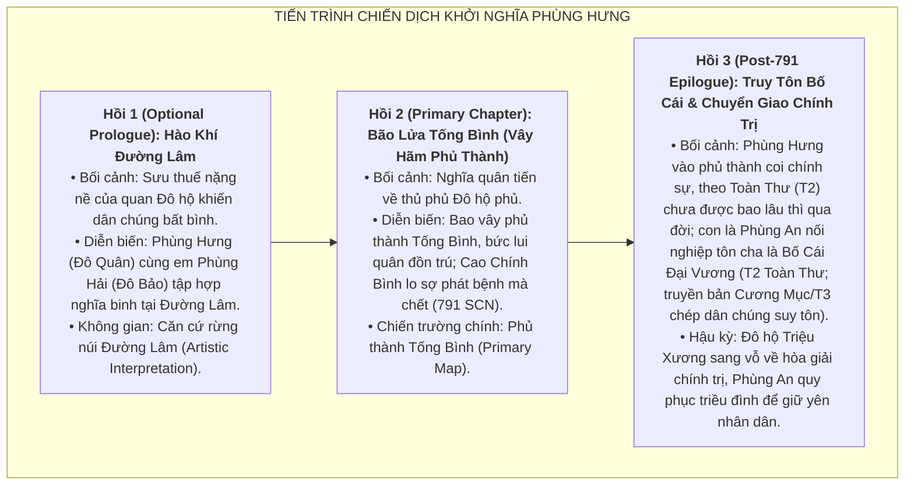

# Định Hướng Cốt Truyện & Phân Cảnh: Thời Kỳ Phùng Hưng (Task `VS-PH-01`)

> [!IMPORTANT]
> **Đặc Tả Định Hướng Chapter (`VS-PH-01`)**:
> - **Mục đích**: Phác thảo cấu trúc cốt truyện (Narrative Arc), lộ trình phân cảnh chiến dịch và định hướng mỹ thuật không gian chiến địa cho Historical Arc **Phùng Hưng** vào giai đoạn **cuối thế kỷ VIII** (với sự kiện trọng tâm năm 791 SCN và phân đoạn hậu kỳ sau đó).
> - **Ràng buộc học thuật**:
>   - Bảo toàn phân tầng nguồn: T1 (*Đường Thư* — Đỗ Anh Hàn, Cao Chính Bình, Triệu Xương) vs T2/T3 (*Toàn Thư*, Thần phả — Phùng Hưng, Phùng Hải, Phùng Dĩnh, Phùng An).
>   - Ghi nhận vị trí địa danh Đường Lâm cổ là `[DISPUTED / T4 interpretation]`, phục dựng cảnh quan mỹ thuật mang tính chất `[Artistic Interpretation]`.
>   - Map chiến dịch trọng tâm (Primary Map) là **Phủ thành Tống Bình (Siege)**; không gian Đường Lâm đóng vai trò màn khởi đầu / không gian mỹ thuật tự chọn (Optional Prologue).
> - **Ràng buộc Tower Defense**: Tuyệt đối không thiết kế Wave cụ thể, không gán chỉ số gameplay hay thiết kế skill. Kẻ địch di chuyển theo đường cố định (fixed path) + thanh máu (HP).

---

## 1. Cấu Trúc Tuyến Tính Cốt Truyện (Campaign Narrative Arc)



---

## 2. Định Hướng Mỹ Thuật & Không Gian Địa Lý (Art & Environment Direction)

### 2.1. Phân Cảnh Trọng Tâm (Primary Map): Phủ Thành Tống Bình (Tống Bình Fortress Siege)

* **Bối cảnh không gian**:
  * Thủ phủ hành chính và quân sự trung tâm của An Nam đô hộ phủ nhà Đường (khu vực nội thành Hà Nội ngày nay).
  * Kiến trúc mang đậm dấu ấn phong cách thành quách quan phủ trung kỳ Đường: Tường thành đất đắp cao kiên cố, cổng thành bọc sắt, hào nước bao quanh, nha môn và doanh trại cấm vệ quân.
* **Không khí trận chiến**:
  * Không khí khói lửa ngút trời của một cuộc công thành lịch sử. Nghĩa binh áo chàm từ khắp các châu huyện đổ về vây kín phủ thành, uy hiếp dinh Đô hộ của Cao Chính Bình.
* **Định hướng thị giác 2D**:
  * Góc nhìn trực diện (Front View) chuẩn 2D Tower Defense.
  * Đường đi của địch (Enemy Path): Tuyến hào giao thông quanh chân thành và cổng thành chính.
  * Vị trí đặt tướng (Hero Slots): Bờ lũy bao vây của nghĩa quân, các ụ đất cao và trận địa công thành.

---

### 2.2. Phân Cảnh Khởi Đầu Tự Chọn (Optional Prologue Map): Căn Cứ Rừng Núi Đường Lâm (Đường Lâm Forest & Base)

* **Bối cảnh không gian**:
  * Vùng đồi gò trung du với rừng cây rậm rạp, suối ngầm và đường mòn đất đỏ đặc trưng của châu thổ Bắc Bộ cổ.
  * Căn cứ của nghĩa quân gồm các hàng rào gỗ lũy tre, lều trại dã chiến, thao trường huấn luyện nghĩa binh và lò rèn vũ khí thô sơ.
* **Cảnh báo học thuật & Địa danh học**:
  * > [!WARNING]
    > Vị trí chính xác của đất Đường Lâm thời Phùng Hưng hiện vẫn là đề tài tranh luận trong giới khảo cổ và sử học (`[DISPUTED / T4 interpretation]`).
    > Việc thiết kế bối cảnh căn cứ trong game được xác định theo hình thức **`[Artistic Interpretation]`**, tôn vinh nét mộc mạc, kiên cường của xóm làng người Việt cổ thời thuộc Đường.
* **Định hướng thị giác 2D**:
  * Góc nhìn trực diện (Front View).
  * Đường đi của địch: Đường mòn xuyên qua các hẻm đồi và bìa rừng.
  * Vị trí đặt tướng: Các mỏm đồi đất, chòi canh gỗ và điểm mai phục ven đường.

---

## 3. Định Hướng Nhân Vật & Đối Kháng (Character Dynamics)

```mermaid
flowchart TD
    subgraph TRỤ CỘT TƯ TƯỞNG & ĐỐI KHÁNG
        subgraph PHE NGHĨA QUÂN ĐƯỜNG LÂM
            H1["<b>Phùng Hưng (Đô Quân)</b><br>Ý chí quật khởi, uy đức tập hợp lòng dân (T2/T3)"]
            H2["<b>Phùng Hải (Đô Bảo)</b><br>Dũng khí phi thường, tướng đồng mưu khởi sự (T2/T3)"]
            H3["<b>Phùng Dĩnh</b><br>Hào kiệt phò trợ theo dã sử (T3/T4 Provisional)"]
        end

        subgraph PHE QUAN ĐÔ HỘ ĐƯỜNG
            B1["<b>Cao Chính Bình</b><br>Đại diện ách đô hộ bóc lột, lo sợ phát bệnh chết (T1/T2)"]
            B2["<b>Triệu Xương</b><br>Đại diện ngoại giao ân uy mềm mỏng post-791 (T1/T2)"]
        end

        H1 ==>|Trực tiếp đối đầu & vây hãm phủ thành| B1
        H2 ==>|Đồng hành chỉ huy trận chiến| B1
        H3 -.->|Yểm trợ chiến dịch (Provisional)| B1
        B1 -.->|Chết năm 791 (T1/T2)| B2
    end
```

* **Thông điệp lịch sử trọng tâm**:
  * Khắc họa ý chí tự cường bền bỉ của người Việt thế kỷ VIII, dám đứng lên lật đổ ách thống trị của bộ máy đô hộ nhà Đường.
  * Danh hiệu **Bố Cái Đại Vương** được con trai Phùng An tôn xưng (T2 *Toàn Thư*) và dân chúng suy tôn (T2 *Cương Mục* / T3) là biểu tượng thiêng liêng cho sự tri ân đối với vị thủ lĩnh hết lòng vì nước, vì dân.
