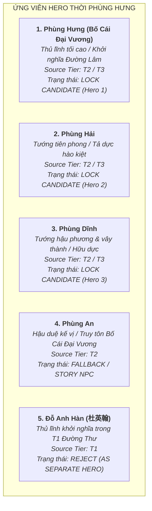

# Tuyển Chọn Roster Nhân Vật: Khởi Nghĩa Phùng Hưng (Task `VS-PH-01`)

> [!IMPORTANT]
> **Quy Chuẩn Tuyển Chọn Roster (Task `VS-PH-01`)**:
> - **Chủ đề**: Thiết lập danh mục Roster đề xuất cho Historical Arc **Phùng Hưng (Bố Cái Đại Vương)** — phong trào quật khởi chống ách đô hộ nhà Đường cuối thế kỷ VIII (khoảng 766/791–802 SCN).
> - **Ràng buộc học thuật cốt lõi (Guardrails)**:
>   - **T1 (*Cựu Đường Thư*, *Tân Đường Thư*) năm 791**: Ghi nhận các nhân vật **Đỗ Anh Hàn (杜英翰)**, **Cao Chính Bình (高正平)**, **Triệu Xương (趙昌)**. T1 **KHÔNG** trực tiếp ghi danh Phùng Hưng hay Phùng An.
>   - **Phùng Hưng Narrative**: Toàn bộ câu chuyện về hào trưởng Phùng Hưng dấy binh Đường Lâm, xưng Bố Cái Đại Vương, cùng các em Phùng Hải, Phùng Dĩnh và con trai Phùng An thuộc tầng **T2 (*Toàn Thư*, *Cương Mục*) / T3 (*Việt Điện U Linh Tập*, Thần phả)**.
>   - **Đỗ Anh Hàn vs Phùng Hưng**: Việc đồng nhất Đỗ Anh Hàn (T1) với Phùng Hưng (T2) là **`[T4 interpretation / unverified]`**, tuyệt đối không khẳng định là Fact lịch sử xác thực.
>   - **Đô hộ Triệu Xương**: Xuất hiện ở giai đoạn sau (791–802) với vai trò tái lập trật tự bằng ân uy hòa giải chính trị, Phùng An quy phục không qua giao chiến lớn; **không mặc định biến Triệu Xương thành combat Boss** nếu mốc thời gian không phù hợp.
> - **Ràng buộc Tower Defense Engine**:
>   - Tuyệt đối **KHÔNG** thiết kế Skill, Passive, Stats thuộc tính (HP/ATK/Range/AttackSpeed), Wave layout hay code logic.
>   - Kẻ địch di chuyển theo đường cố định (fixed path) + thanh máu (HP), không có cơ chế quái tấn công Hero. Vũ khí chỉ đóng vai trò nhận diện mỹ thuật trực quan (visual identity).

---

## 1. Đánh Giá Chuyên Sâu Các Ứng Viên Hero



---

### 1.1. Phùng Hưng (Bố Cái Đại Vương) — `LOCK CANDIDATE` (Hero 1)

* **Identity & Hình tượng**: Supreme Commander / Hào trưởng khởi nghĩa / Linh hồn của phong trào giải phóng Tống Bình.
* **Vai trò lịch sử (Historical role)**:
  * Hào trưởng danh vọng đất Đường Lâm, xuất thân quý tộc bản địa kế thừa cơ nghiệp nhiều đời.
  * Lãnh đạo nhân dân và nghĩa sĩ đứng lên đánh đuổi chính quyền đô hộ tham tàn của Cao Chính Bình, bao vây giải phóng phủ thành Tống Bình, lập nền tự chủ trong nhiều năm.
  * Sau khi qua đời, nhân dân và con cháu nhớ ơn suy tôn là **Bố Cái Đại Vương** (Đại vương như cha mẹ của dân).
* **Phân tầng nguồn gốc (Source tier)**: **T2 (*Toàn Thư*, *Việt Sử Lược*, *Cương Mục*) + T3 (*Việt Điện U Linh Tập*, Thần tích Đường Lâm)**.
* **Bất định lịch sử (Historical uncertainty)**:
  * Văn bản T1 phương Bắc gần thời (*Cựu Đường Thư*) không ghi tên Phùng Hưng mà ghi biến cố năm 791 gắn với **Đỗ Anh Hàn**.
  * Việc đồng nhất Đỗ Anh Hàn với Phùng Hưng là giả thuyết nghiên cứu **`[T4 interpretation / unverified]`**.
  * Niên biểu khởi nghĩa có độ vênh giữa cách chép khởi từ niên hiệu Đại Lịch (766–779) kéo dài đến 791 của *Toàn Thư* và sự kiện bùng phát năm 791 của *Cựu Đường Thư*.
  * Giai thoại tay không đánh hổ, vật trâu mộng bảo vệ dân làng thuộc tầng huyền tích dân gian **T3**.
* **Đánh giá vị thế thiết kế**: **LOCK CANDIDATE (Hero 1 — Chủ lực chiến dịch)**.

---

### 1.2. Phùng Hải — `LOCK CANDIDATE` (Hero 2)

* **Identity & Hình tượng**: Vanguard Commander / Tướng tiên phong dũng liệt / Cánh quân tả dực Đường Lâm.
* **Vai trò lịch sử (Historical role)**:
  * Em trai thứ hai của Phùng Hưng, cùng anh đồng mưu khởi nghĩa, thống lĩnh một đạo nghĩa binh tiến đánh các đồn bốt của quân đô hộ Đường, mở đường tiến về phủ thành Tống Bình.
  * Dân gian lưu truyền ông có sức khỏe phi thường, dũng cảm phi phàm, xông pha trận mạc.
* **Phân tầng nguồn gốc (Source tier)**: **T2 (*Toàn Thư*, *Cương Mục*) + T3 (Thần tích Đường Lâm, Đền thờ Phùng Hải)**.
* **Bất định lịch sử (Historical uncertainty)**:
  * Không xuất hiện trực tiếp trong thư tịch T1 phương Bắc; ghi chép chủ yếu dựa trên chính sử trung đại T2 và thần tích đền miếu T3.
  * Các câu chuyện về sức mạnh thần kỳ (gánh đá dời non) là mô-típ dân gian T3.
* **Đánh giá vị thế thiết kế**: **LOCK CANDIDATE (Hero 2 — Tướng tiên phong xung trận)**.

---

### 1.3. Phùng Dĩnh — `LOCK CANDIDATE` (Hero 3)

* **Identity & Hình tượng**: Defensive & Tactical Commander / Tướng hậu phương & công thành / Cánh quân hữu dực Đường Lâm.
* **Vai trò lịch sử (Historical role)**:
  * Em trai thứ ba của Phùng Hưng, cùng hai anh khởi xướng phong trào quật khởi, phụ trách bảo vệ căn cứ địa hậu phương Đường Lâm và chỉ huy cánh quân hữu dực tham gia vây hãm phủ thành Tống Bình.
* **Phân tầng nguồn gốc (Source tier)**: **T2 (*Toàn Thư*, *Cương Mục*) + T3 (Thần tích Đường Lâm)**.
* **Bất định lịch sử (Historical uncertainty)**:
  * Tên tuổi không xuất hiện trong T1 gần thời; hành trạng chiến đấu gắn liền với bộ ba anh em hào kiệt họ Phùng trong văn bản T2/T3.
* **Đánh giá vị thế thiết kế**: **LOCK CANDIDATE (Hero 3 — Tướng trấn thủ & yểm trợ chiến thuật)**.

---

### 1.4. Phùng An — `FALLBACK / STORY NPC`

* **Identity & Hình tượng**: Successor Political Figure / Nhân vật kế vị chính trị / Cầu nối chuyển giao.
* **Vai trò lịch sử (Historical role)**:
  * Con trai Phùng Hưng, kế vị cha cai quản phủ thành Tống Bình sau khi Phùng Hưng qua đời; là người chính thức truy tôn cha danh hiệu **Bố Cái Đại Vương** (T2).
  * Năm 791 (hoặc khoảng sau đó), trước sức ép quân sự và biện pháp vỗ về chính trị của Đô hộ Triệu Xương, Phùng An đã quyết định quy phục triều Đường để tránh cuộc can qua đổ máu cho nhân dân.
* **Phân tầng nguồn gốc (Source tier)**: **T2 (*Toàn Thư*, *Cương Mục*)**.
* **Bất định lịch sử (Historical uncertainty)**:
  * Không có tên trong văn bản T1; thời gian nắm quyền tương đối ngắn và kết thúc bằng giải pháp ngoại giao quy phục hòa bình, không có hành trạng chiến đấu nổi bật trên chiến trận.
* **Đánh giá vị thế thiết kế**: **FALLBACK / STORY NPC** (Ưu tiên làm nhân vật cốt truyện kết nối kết cục Arc, không đưa vào danh sách 3 Playable Hero chính thức).

---

### 1.5. Đỗ Anh Hàn (杜英翰) — `REJECT (AS SEPARATE HERO)`

* **Identity & Hình tượng**: Historical Insurgent Leader (T1 record).
* **Phân tầng nguồn gốc (Source tier)**: **T1 (*Cựu Đường Thư*, *Tân Đường Thư*)**.
* **Lý do không tạo Hero độc lập**:
  * T1 ghi nhận Đỗ Anh Hàn lãnh đạo cuộc nổi loạn năm 791 khiến Cao Chính Bình lo sợ mà chết.
  * Giả thuyết cho rằng Đỗ Anh Hàn và Phùng Hưng là cùng một người hoặc là đồng minh thân cận chỉ là **`[T4 interpretation / unverified]`**.
  * Việc tạo thêm một Hero mang tên Đỗ Anh Hàn song song với Phùng Hưng sẽ gây xung đột narrative và phân tán nhận diện văn hóa dân tộc. Nhân vật này được bảo lưu dưới dạng **đối chiếu học thuật / Narrative Lore**.
* **Đánh giá vị thế thiết kế**: **REJECT (AS SEPARATE HERO)**.

---

## 2. Thiết Kế Tuyến Kẻ Địch (Enemy Archetypes) & Boss Candidates

```mermaid
flowchart LR
    subgraph QUÂN ĐÔ HỘ NHÀ ĐƯỜNG (ENEMY FACTION)
        N1["<b>1. Đường Giáo Binh Phủ Thành</b><br>Normal Enemy (Bộ binh cản bước)"]
        N2["<b>2. Đường Cung Nỏ Sĩ Tống Bình</b><br>Normal Enemy (Tầm xa cơ bản)"]
        N3["<b>3. Đường Thiết Giáp Đao Thuẫn</b><br>Normal Enemy (Bộ binh giáp nặng)"]
        
        E1["<b>Đường Hiệu Úy Tiên Phong</b><br>Elite Enemy (Chỉ huy tiền tuyến)"]
        
        B1["<b>Cao Chính Bình (Đô Hộ An Nam)</b><br>Main Boss Candidate (T1/T2)"]
        B2["<b>Triệu Xương (Đô Hộ Kế Nhiệm)</b><br>Optional Story Boss / Narrative (T1)"]
    end

    N1 --> E1
    N2 --> E1
    N3 --> E1
    E1 --> B1
    B1 -.->|Chuyển giao chính trị hậu kỳ| B2
```

---

### 2.1. Nhóm Kẻ Địch Thường (3 Generic Tang Enemy Archetypes)
*(Quy chuẩn TD: Di chuyển theo đường cố định, vũ khí đóng vai trò nhận diện mỹ thuật)*

1. **Đường Giáo Binh Phủ Thành (Tang Garrison Pikeman)**:
   * *Định danh mỹ thuật*: Binh lính đồn trú thành Tống Bình, trang bị áo chẽn giáp da thuộc (leather lamellar), cầm trường thương/giáo sắt phòng ngự cơ bản.
   * *Nguồn gốc*: T1/T2 (Mô hình quân cấm vệ phủ Đô hộ thời Đường).
2. **Đường Cung Nỏ Sĩ Tống Bình (Tang Fortress Crossbowman)**:
   * *Định danh mỹ thuật*: Lực lượng phòng thủ tầm xa trên mặt thành, trang bị nỏ cơ giới thời Đường hoặc cung tên, áo giáp vải nhẹ có bao tên sau lưng.
   * *Nguồn gốc*: T1/T2.
3. **Đường Thiết Giáp Đao Thuẫn (Tang Armored Shieldbearer)**:
   * *Định danh mỹ thuật*: Đội quân giáp nặng bảo vệ nha môn Đô hộ phủ, trang bị khiên lớn bọc đồng (large shield) và đoản đao, giáp phiến sắt che ngực.
   * *Nguồn gốc*: T1/T2.

---

### 2.2. Kẻ Địch Tinh Anh (1 Elite Enemy)

* **Đường Hiệu Úy Tiên Phong / Đô Hộ Phủ Nha Tướng (Tang Vanguard Officer)**:
  * *Định danh mỹ thuật*: Sĩ quan chỉ huy phân đội tác chiến của phủ Đô hộ, mặc giáp trụ minh quang (Minh Quang Giáp phong cách trung kỳ Đường), đội mũ hộ đầu có lông vũ nhận diện, đốc thúc binh lính phòng giữ thành lũy.
  * *Nguồn gốc*: T1/T2.

---

### 2.3. Đánh Giá Các Ứng Viên Boss Lịch Sử (Historical Boss Candidates)

#### A. Cao Chính Bình (Quan Đô Hộ An Nam) — `LOCK BOSS CANDIDATE`
* **Vai trò lịch sử**:
  * Đô hộ An Nam dưới triều Đường Đức Tông, áp đặt chính sách bóc lột và thuế khóa hà khắc khiến nhân dân căm giận.
  * Đối đầu trực tiếp với cuộc khởi nghĩa của Phùng Hưng (T2) / Đỗ Anh Hàn (T1); bị nghĩa quân vây hãm nghiêm ngặt tại phủ thành Tống Bình, lo sợ phát bệnh mà chết năm 791.
* **Phân tầng nguồn gốc**: **T1 (*Cựu Đường Thư*) + T2 (*Toàn Thư*, *Cương Mục*)**.
* **Định danh mỹ thuật**: Viên quan đô hộ cao cấp mặc phẩm phục màu tía thời Đường, khoác áo choàng chỉ huy, vẻ mặt hoảng loạn cố thủ trong thành lũy.
* **Đánh giá vị thế thiết kế**: **LOCK BOSS CANDIDATE (Boss tối hậu của chiến dịch giải phóng Tống Bình)**.

#### B. Triệu Xương (Quan Đô Hộ Kế Nhiệm) — `OPTIONAL STORY BOSS / NARRATIVE OPPONENT`
* **Vai trò lịch sử**:
  * Kinh lược sứ / Đô hộ An Nam nổi tiếng mưu lược, được triều đình nhà Đường phái sang An Nam sau cái chết của Cao Chính Bình (791).
  * Áp dụng chính sách vỗ về, giảm thuế, chiêu an nhân tâm bản địa, khiến Phùng An quyết định đầu hàng quy phục triều đình mà không cần dùng đến đòn quân sự lớn.
* **Phân tầng nguồn gốc**: **T1 (*Cựu Đường Thư*, *Tân Đường Thư*) + T2 (*Toàn Thư*)**.
* **Xử lý thận trọng**:
  * Triệu Xương đại diện cho giải pháp ngoại giao và tái lập quyền cai trị mềm mỏng, không trực tiếp đem đại quân giao chiến đẫm máu với Phùng Hưng.
  * **KHÔNG mặc định biến Triệu Xương thành combat Boss cơ học** trong trận công thành Tống Bình. Nhân vật này phù hợp làm **Optional Story Boss / Narrative Opponent** trong kịch bản mở rộng (Epilogue) về sự kiện Phùng An quy phục.
* **Đánh giá vị thế thiết kế**: **OPTIONAL STORY BOSS / NARRATIVE OPPONENT**.

---

## 3. Định Hướng Không Gian Chiến Địa (Map Direction)

1. **Map 1: Căn Cứ Rừng Núi Đường Lâm (Đường Lâm Base)**:
   * *Bối cảnh*: Vùng đồi gò rừng rậm trung du, nơi ba anh em họ Phùng tập hợp lực lượng, huấn luyện nghĩa binh và tích trữ lương thảo.
   * > [!WARNING]
     > **Cảnh báo địa danh học**: Tuyệt đối **KHÔNG** mặc định vị trí Đường Lâm cổ thời Phùng Hưng trùng khớp hoàn toàn $100\%$ với xã Đường Lâm (thị xã Sơn Tây, Hà Nội) ngày nay như một fact lịch sử tuyệt đối. Học giới hiện đại còn tranh luận về các địa bàn Đường Lâm ở Sơn Tây vs vùng Ái Châu / Hà Tĩnh (`[DISPUTED / T4 interpretation]`). Phục dựng không gian mỹ thuật mang tính chất **`[Artistic Interpretation]`**.
2. **Map 2: Phủ Thành Tống Bình (Tống Bình Fortress Siege)**:
   * *Bối cảnh*: Trận công thành và vây hãm lịch sử tại thủ phủ An Nam đô hộ phủ (khu vực Hà Nội ngày nay), nơi nghĩa quân Đường Lâm đánh bại các đồn bốt ngoại vi và bức tử Cao Chính Bình.

---

## 4. Bảng Tổng Hợp Tuyển Chọn Roster Chuẩn Hóa (Standardized Summary Table)

| Hạng Mục | Tên Thực Thể / Định Danh (NAME) | Phân Tầng Nguồn (SOURCE TIER) | Độ Tin Cậy Học Thuật (CONFIDENCE) | Trạng Thái Thiết Kế (STATUS) |
|---|---|:---:|:---:|:---:|
| **Hero 1** | **Phùng Hưng (Bố Cái Đại Vương)** | **T2 / T3** | Cao (T2 Chính sử & T3 Dân gian; T1 ghi Đỗ Anh Hàn) | **LOCK CANDIDATE** |
| **Hero 2** | **Phùng Hải** | **T2 / T3** | Trung bình (T2 Chính sử & T3 Thần tích) | **LOCK CANDIDATE** |
| **Hero 3** | **Phùng Dĩnh** | **T2 / T3** | Trung bình (T2 Chính sử & T3 Thần tích) | **LOCK CANDIDATE** |
| **Fallback Hero** | **Phùng An** | **T2** | Trung bình (T2 Chính sử; vai trò quy phục hòa bình) | **FALLBACK / STORY NPC** |
| **Normal Enemy 1** | **Đường Giáo Binh Phủ Thành** | **T1 / T2** | Cao (Mô hình quân đồn trú thời Đường) | **LOCK CANDIDATE** |
| **Normal Enemy 2** | **Đường Cung Nỏ Sĩ Tống Bình** | **T1 / T2** | Cao (Lực lượng viễn chiến thời Đường) | **LOCK CANDIDATE** |
| **Normal Enemy 3** | **Đường Thiết Giáp Đao Thuẫn** | **T1 / T2** | Cao (Quân giáp nặng cấm vệ phủ Đô hộ) | **LOCK CANDIDATE** |
| **Elite Enemy** | **Đường Hiệu Úy Tiên Phong** | **T1 / T2** | Cao (Sĩ quan chỉ huy phân đội tác chiến) | **LOCK CANDIDATE** |
| **Boss** | **Cao Chính Bình (Quan Đô Hộ An Nam)** | **T1 / T2** | Tuyệt đối (T1 *Đường Thư* & T2 *Toàn Thư* xác nhận) | **LOCK BOSS CANDIDATE** |
| **Optional Boss** | **Triệu Xương (Quan Đô Hộ Kế Nhiệm)** | **T1 / T2** | Tuyệt đối (T1 xác nhận; giải pháp chính trị hòa giải) | **OPTIONAL STORY BOSS** |
| **Map Direction 1** | **Căn Cứ Rừng Núi Đường Lâm** | **T2 / T4** | Vị trí địa danh tranh luận `[DISPUTED / T4]` | **LOCK MAP CONCEPT (Artistic)** |
| **Map Direction 2** | **Phủ Thành Tống Bình (Siege)** | **T1 / T2** | Cao (Địa bàn phủ thành trung tâm Đô hộ phủ) | **LOCK MAP CONCEPT (Artistic)** |
