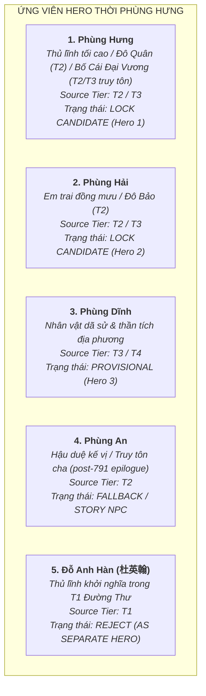

# Tuyển Chọn Roster Nhân Vật: Khởi Nghĩa Phùng Hưng (Task `VS-PH-01`)

> [!IMPORTANT]
> **Quy Chuẩn Tuyển Chọn Roster (Task `VS-PH-01`)**:
> - **Chủ đề**: Thiết lập danh mục Roster đề xuất cho Historical Arc **Phùng Hưng** — phong trào quật khởi chống ách đô hộ nhà Đường vào **cuối thế kỷ VIII** (với sự kiện trung tâm năm 791 SCN và giai đoạn hậu kỳ sau đó).
> - **Ràng buộc học thuật cốt lõi (Guardrails)**:
>   - **T1 (*Cựu Đường Thư*, *Tân Đường Thư*) năm 791**: Ghi nhận các nhân vật **Đỗ Anh Hàn (杜英翰)**, **Cao Chính Bình (高正平)**, **Triệu Xương (趙昌)**. T1 **KHÔNG** trực tiếp ghi danh Phùng Hưng hay Phùng An.
>   - **Phùng Hưng Narrative**: Câu chuyện về Phùng Hưng dấy binh Đường Lâm, xưng Đô Quân, em Phùng Hải xưng Đô Bảo, vây hãm phủ thành Tống Bình thuộc tầng **T2 (*Toàn Thư*, *Cương Mục*)**. Sau khi Phùng Hưng mất, con là Phùng An tôn cha là **Bố Cái Đại Vương** (T2 *Toàn Thư*), hoặc dân chúng suy tôn theo *Cương Mục* / T3.
>   - **Đỗ Anh Hàn vs Phùng Hưng**: Việc đồng nhất Đỗ Anh Hàn (T1) với Phùng Hưng (T2) là **`[T4 interpretation / unverified]`**, tuyệt đối không khẳng định là Fact lịch sử xác thực.
>   - **Phùng Dĩnh**: Không có trong nguyên văn chính sử T2 (*Toàn Thư* / *Cương Mục*); thuộc tầng **T3 (Thần tích / Dã sử) / T4**, do đó xếp trạng thái **`PROVISIONAL`** (không khóa cứng `LOCK`).
>   - **Đô hộ Triệu Xương**: Đại diện cho giai đoạn hậu kỳ sau năm 791 (post-791 epilogue), dùng chính sách vỗ về tiếp nhận sự quy phục của Phùng An; **không mặc định biến Triệu Xương thành combat Boss cơ học**.
> - **Ràng buộc Tower Defense Engine**:
>   - Tuyệt đối **KHÔNG** thiết kế Skill, Passive, Stats thuộc tính (HP/ATK/Range/AttackSpeed), Wave layout hay code logic.
>   - Kẻ địch di chuyển theo đường cố định (fixed path) + thanh máu (HP), không có cơ chế quái tấn công Hero. Vũ khí chỉ đóng vai trò nhận diện mỹ thuật trực quan (visual identity).

---

## 1. Đánh Giá Chuyên Sâu Các Ứng Viên Hero



---

### 1.1. Phùng Hưng — `LOCK CANDIDATE` (Hero 1)

* **Identity & Hình tượng**: Supreme Commander / Hào trưởng khởi nghĩa / Thủ lĩnh phong trào giải phóng Tống Bình.
* **Vai trò lịch sử (Historical role)**:
  * Hào trưởng danh vọng đất Đường Lâm, xuất thân quý tộc bản địa kế thừa thế lực nhiều đời.
  * Lãnh đạo nhân dân và nghĩa binh nổi dậy chống ách cai trị và sưu thuế hà khắc của Cao Chính Bình; tự xưng là **Đô Quân** (都君 — T2), cùng nghĩa quân vây hãm phủ thành Tống Bình, lật đổ chính quyền đô hộ của Cao Chính Bình. *Toàn Thư* (T2) ghi nhận sau khi vào phủ trị sự "chưa được bao lâu thì chết" (nếu nhắc truyền thống cai trị kéo dài 7 năm thì thuộc *Việt Điện U Linh* / dã sử T3 riêng biệt, không nhập vào T2 narrative).
  * Sau khi Phùng Hưng qua đời, con trai là Phùng An tôn cha là **Bố Cái Đại Vương** theo ghi chép của *Toàn Thư* (T2); truyền bản *Cương Mục* (T2) và thần tích dân gian (T3) chép dân chúng suy tôn ông vì kính trọng như cha mẹ (*Bố = Cha, Cái = Mẹ*). Cần phân biệt rõ hai dòng truyền thống này, không gộp thành một historical fact duy nhất.
* **Phân tầng nguồn gốc (Source tier)**: **T2 (*Đại Việt Sử Ký Toàn Thư*, *Khâm Định Việt Sử Thông Giám Cương Mục*) + T3 (*Việt Điện U Linh Tập*, Thần tích Đường Lâm)**.
* **Bất định lịch sử (Historical uncertainty)**:
  * Văn bản T1 phương Bắc gần thời (*Cựu Đường Thư*, *Tân Đường Thư*) không ghi tên Phùng Hưng mà ghi nhận biến cố năm 791 SCN gắn với thủ lĩnh **Đỗ Anh Hàn**.
  * Việc đồng nhất Đỗ Anh Hàn với Phùng Hưng là giả thuyết nghiên cứu hiện đại **`[T4 interpretation / unverified]`**, chưa có bằng chứng văn tự trực tiếp xác nhận.
  * Niên đại khởi nghĩa trong chính sử trung đại ghi chung là cuối thế kỷ VIII (khoảng niên hiệu Đại Lịch 766–779 / Trinh Nguyên 785–805), với mốc biến cố then chốt năm 791 SCN.
  * Giai thoại tay không đánh hổ, vật trâu mộng bảo vệ xóm làng là mô-típ huyền tích dân gian **T3**.
* **Đánh giá vị thế thiết kế**: **LOCK CANDIDATE (Hero 1 — Thủ lĩnh trung tâm chiến dịch)**.

---

### 1.2. Phùng Hải — `LOCK CANDIDATE` (Hero 2)

* **Identity & Hình tượng**: Military Commander / Tướng lĩnh đồng mưu / Sức mạnh thể chất dũng liệt.
* **Vai trò lịch sử (Historical role)**:
  * Em trai của Phùng Hưng, cùng anh đồng mưu dấy nghĩa từ Đường Lâm; tự xưng là **Đô Bảo** (都保 — T2).
  * Tham gia chỉ huy nghĩa quân tiến công vây hãm phủ thành Tống Bình, trực tiếp uy hiếp bộ máy đô hộ của Cao Chính Bình.
* **Phân tầng nguồn gốc (Source tier)**: **T2 (*Toàn Thư*, *Cương Mục*) + T3 (Thần tích đền thờ Phùng Hải)**.
* **Bất định lịch sử & Phân định vai trò**:
  * T2 ghi nhận danh xưng Đô Bảo và việc cùng Phùng Hưng khởi nghĩa. Các vai trò chiến thuật cụ thể (như "tướng tiên phong", "cánh quân tả dực", "chuyên phá đồn bốt") là **`[T3 / Game Interpretation]`**, không phải dữ kiện lịch sử T2 khẳng định.
  * Truyền thuyết dân gian T3 ca ngợi ông có sức khỏe phi thường (gánh đá dời non).
* **Đánh giá vị thế thiết kế**: **LOCK CANDIDATE (Hero 2 — Tướng chỉ huy đồng hành)**.

---

### 1.3. Phùng Dĩnh — `PROVISIONAL` (Hero 3)

* **Identity & Hình tượng**: Secondary Commander / Nhân vật dã sử & thần tích / Hào kiệt phò trợ.
* **Vai trò lịch sử & Nguồn gốc**:
  * Theo thần tích dân gian và các tài liệu dã sử muộn (T3), Phùng Dĩnh được lưu truyền là người em thứ ba của Phùng Hưng, cùng hai anh tham gia khởi sự và vây hãm Tống Bình.
* **Phân tầng nguồn gốc (Source tier)**: **T3 (Thần tích Đường Lâm / Dã sử dân gian) / T4 (Game Interpretation)**.
* **Lý do hạ mức xuống PROVISIONAL**:
  * **Không tìm thấy tên Phùng Dĩnh trong nguyên văn chính sử kinh điển T2** (*Toàn Thư* và *Cương Mục* chỉ chép hai anh em: *"Hưng cùng em là Hải... Hưng xưng là Đô Quân, Hải xưng là Đô Bảo"*).
  * Các chức năng chiến thuật (như "hữu dực", "hậu phương", "trấn thủ căn cứ") là suy diễn từ dã sử và thiết kế game `[Game Interpretation]`.
  * Do bằng chứng sử liệu chính khóa không đủ mạnh, nhân vật này được đặt ở trạng thái **`PROVISIONAL`** (Ứng viên tạm thời cho slot Hero thứ 3), không khóa cứng `LOCK`.
* **Đánh giá vị thế thiết kế**: **PROVISIONAL (Hero 3 — Ứng viên tạm thời)**.

---

### 1.4. Phùng An — `FALLBACK / STORY NPC`

* **Identity & Hình tượng**: Successor Political Figure / Hậu duệ kế vị / Nhân vật chuyển giao chính trị.
* **Vai trò lịch sử (Historical role)**:
  * Con trai của Phùng Hưng, kế vị cha cai quản Tống Bình sau khi Phùng Hưng qua đời; theo *Toàn Thư* (T2), Phùng An đã tôn cha là Bố Cái Đại Vương.
  * Trong giai đoạn hậu kỳ sau năm 791 (post-791 epilogue), trước sức ép chính trị và chính sách chiêu an mềm mỏng của Đô hộ Triệu Xương, Phùng An đã quyết định quy phục triều Đường để bảo toàn nhân dân, tránh họa binh đao.
* **Phân tầng nguồn gốc (Source tier)**: **T2 (*Toàn Thư*, *Cương Mục*)**.
* **Bất định lịch sử & Vị thế**:
  * Không xuất hiện trong T1; vai trò là người kế vị ngắn ngủi và kết thúc bằng thỏa hiệp ngoại giao hòa bình, không có hành trạng chiến đấu nổi bật.
* **Đánh giá vị thế thiết kế**: **FALLBACK / STORY NPC** (Phù hợp làm NPC cốt truyện trong phân cảnh kết thúc hoặc Hero dự phòng, không đưa vào đội hình chiến đấu chính thức).

---

### 1.5. Đỗ Anh Hàn (杜英翰) — `REJECT (AS SEPARATE HERO)`

* **Identity & Hình tượng**: Historical Insurgent Leader (Ghi chép T1 gần thời).
* **Phân tầng nguồn gốc (Source tier)**: **T1 (*Cựu Đường Thư*, *Tân Đường Thư*)**.
* **Lý do bác bỏ việc tạo Hero độc lập**:
  * T1 ghi nhận Đỗ Anh Hàn lãnh đạo cuộc nổi loạn năm 791 SCN khiến Cao Chính Bình lo sợ phát bệnh mà chết.
  * Giả thuyết cho rằng Đỗ Anh Hàn và Phùng Hưng là cùng một người chỉ là **`[T4 interpretation / unverified]`**.
  * Việc tạo thêm một Hero mang tên Đỗ Anh Hàn song song với Phùng Hưng sẽ gây trùng lặp và xung đột narrative. Nhân vật này được giữ nguyên trong **Tư liệu học thuật T1 / Narrative Lore**.
* **Đánh giá vị thế thiết kế**: **REJECT (AS SEPARATE PLAYABLE HERO)**.

---

## 2. Thiết Kế Tuyến Kẻ Địch (Enemy Archetypes) & Boss Candidates

```mermaid
flowchart LR
    subgraph QUÂN ĐÔ HỘ NHÀ ĐƯỜNG (GAME RECONSTRUCTION - T4)
        N1["<b>1. Đường Giáo Binh Phủ Thành</b><br>Normal Enemy (Bộ binh cản bước - T4)"]
        N2["<b>2. Đường Cung Nỏ Sĩ Tống Bình</b><br>Normal Enemy (Viễn chiến cơ bản - T4)"]
        N3["<b>3. Đường Thiết Giáp Đao Thuẫn</b><br>Normal Enemy (Bộ binh giáp nặng - T4)"]
        
        E1["<b>Đường Hiệu Úy Tiên Phong</b><br>Elite Enemy (Chỉ huy phân đội - T4)"]
        
        B1["<b>Cao Chính Bình (Quan Đô Hộ An Nam)</b><br>Main Combat Boss (T1/T2)"]
        B2["<b>Triệu Xương (Quan Đô Hộ Kế Nhiệm)</b><br>Narrative / Optional Story Opponent (T1/T2)"]
    end

    N1 --> E1
    N2 --> E1
    N3 --> E1
    E1 --> B1
    B1 -.->|Hậu kỳ sau 791 (post-791)| B2
```

---

### 2.1. Nhóm Kẻ Địch Thường (3 Generic Tang Enemy Archetypes — `GAME / T4 RECONSTRUCTION`)
*(Quy chuẩn TD: Di chuyển theo đường cố định, vũ khí đóng vai trò nhận diện mỹ thuật trực quan)*

1. **Đường Giáo Binh Phủ Thành (Tang Garrison Pikeman)**:
   * *Định danh mỹ thuật*: Lính đồn trú thành Tống Bình, trang bị áo chẽn giáp da thuộc (leather lamellar), cầm trường thương/giáo sắt phòng ngự cơ bản.
   * *Phân tầng*: **T4 Game Reconstruction** (dựa trên mô hình quân phục vụ Đô hộ phủ thời Đường).
2. **Đường Cung Nỏ Sĩ Tống Bình (Tang Fortress Crossbowman)**:
   * *Định danh mỹ thuật*: Lực lượng phòng thủ tầm xa trên mặt thành, trang bị nỏ hoặc cung tên, áo giáp vải nhẹ có bao tên sau lưng.
   * *Phân tầng*: **T4 Game Reconstruction**.
3. **Đường Thiết Giáp Đao Thuẫn (Tang Armored Shieldbearer)**:
   * *Định danh mỹ thuật*: Đội quân giáp nặng bảo vệ nha môn Đô hộ phủ, trang bị khiên lớn bọc đồng và đoản đao, giáp phiến sắt che ngực.
   * *Phân tầng*: **T4 Game Reconstruction**.

---

### 2.2. Kẻ Địch Tinh Anh (1 Elite Enemy — `GAME / T4 RECONSTRUCTION`)

* **Đường Hiệu Úy Tiên Phong / Đô Hộ Phủ Nha Tướng (Tang Vanguard Officer)**:
  * *Định danh mỹ thuật*: Sĩ quan chỉ huy phân đội tác chiến của phủ Đô hộ, mặc giáp trụ minh quang (Minh Quang Giáp phong cách trung kỳ Đường), đội mũ hộ đầu nhận diện, thúc giục binh lính giữ thành.
  * *Phân tầng*: **T4 Game Reconstruction**.

---

### 2.3. Đánh Giá Các Ứng Viên Boss Lịch Sử (Historical Boss Candidates)

#### A. Cao Chính Bình (Quan Đô Hộ An Nam) — `LOCK BOSS CANDIDATE`
* **Vai trò lịch sử (Historical role)**:
  * Đô hộ An Nam dưới triều Đường Đức Tông, áp đặt chính sách bóc lột và thuế khóa hà khắc khiến nhân dân căm phẫn.
  * Kình địch chính của cuộc khởi nghĩa; bị nghĩa quân vây hãm nghiêm ngặt tại phủ thành Tống Bình, lo sợ phát bệnh mà chết vào năm 791 SCN.
* **Phân tầng nguồn gốc**: **T1 (*Cựu Đường Thư*) + T2 (*Toàn Thư*, *Cương Mục*)** — *Historical Person xác thực*.
* **Định danh mỹ thuật**: Viên quan đô hộ cao cấp mặc phẩm phục màu tía thời Đường, áo choàng chỉ huy, vẻ mặt hoảng loạn cố thủ trong thành lũy.
* **Đánh giá vị thế thiết kế**: **LOCK BOSS CANDIDATE (Boss chiến đấu trung tâm của trận vây hãm Tống Bình)**.

#### B. Triệu Xương (Quan Đô Hộ Kế Nhiệm) — `OPTIONAL STORY BOSS / NARRATIVE OPPONENT`
* **Vai trò lịch sử (Historical role)**:
  * Kinh lược sứ / Đô hộ An Nam kế nhiệm sau khi Cao Chính Bình chết (791 SCN). Nổi tiếng mưu lược, dùng chính sách mềm mỏng xoa dịu nhân tâm, tiếp nhận sự quy phục hòa bình của Phùng An.
* **Phân tầng nguồn gốc**: **T1 (*Cựu Đường Thư*, *Tân Đường Thư*) + T2 (*Toàn Thư*)** — *Historical Person xác thực*.
* **Xử lý thận trọng**:
  * Triệu Xương xuất hiện ở giai đoạn hậu kỳ sau năm 791 (post-791 epilogue), đại diện cho giải pháp ngoại giao hòa giải và tái lập quyền cai trị mềm mỏng, không trực tiếp giao chiến đẫm máu với nghĩa quân Phùng Hưng.
  * **KHÔNG mặc định biến Triệu Xương thành combat Boss cơ học**. Nhân vật này phù hợp làm **Optional Story Boss / Narrative Opponent** trong kịch bản mở rộng về sự kiện Phùng An quy phục.
* **Đánh giá vị thế thiết kế**: **OPTIONAL STORY BOSS / NARRATIVE OPPONENT**.

---

## 3. Định Hướng Không Gian Chiến Địa (Map Direction)

1. **PRIMARY MAP: Phủ Thành Tống Bình (Tống Bình Fortress Siege)**:
   * *Bối cảnh chiến dịch chính*: Trận công thành và vây hãm lịch sử tại thủ phủ An Nam đô hộ phủ (khu vực Hà Nội ngày nay), nơi nghĩa quân Đường Lâm đánh bại các đồn bốt ngoại vi và bức tử Cao Chính Bình.
   * *Phân tầng*: **T1 / T2** (Địa bàn phủ thành xác thực) + **`[Artistic Interpretation]`**.
2. **OPTIONAL PROLOGUE MAP: Căn Cứ Rừng Núi Đường Lâm (Đường Lâm Base)**:
   * *Bối cảnh*: Vùng đồi gò rừng rậm trung du, nơi tập hợp nghĩa binh và tích trữ lương thảo thô sơ trước khi xuất quân.
   * *Cảnh báo địa danh học*: Vị trí chính xác của đất Đường Lâm thời Phùng Hưng vẫn còn nhiều tranh luận trong giới nghiên cứu khảo cổ và sử học (`[DISPUTED / T4 interpretation]`). Phục dựng không gian mỹ thuật mang tính chất **`[Artistic Interpretation]`**.

---

## 4. Bảng Tổng Hợp Tuyển Chọn Roster Chuẩn Hóa (Standardized Summary Table)

| Hạng Mục | Tên Thực Thể / Định Danh (NAME) | Phân Tầng Nguồn (SOURCE TIER) | Độ Tin Cậy Học Thuật (CONFIDENCE) | Trạng Thái Thiết Kế (STATUS) |
|---|---|:---:|:---:|:---:|
| **Hero 1** | **Phùng Hưng (Đô Quân / Bố Cái Đại Vương)** | **T2 / T3** | Cao (T2 Toàn Thư Phùng An tôn cha / Cương Mục, T3 dân chúng suy tôn; T1 ghi Đỗ Anh Hàn) | **LOCK CANDIDATE** |
| **Hero 2** | **Phùng Hải (Đô Bảo)** | **T2 / T3** | Trung bình - Cao (T2 Chính sử Toàn Thư xác nhận) | **LOCK CANDIDATE** |
| **Hero 3** | **Phùng Dĩnh** | **T3 / T4** | Thấp - Trung bình (Dã sử & Thần tích; không thấy trong T2) | **PROVISIONAL** |
| **Fallback Hero** | **Phùng An** | **T2** | Trung bình (T2 Chính sử; vai trò quy phục hòa bình post-791) | **FALLBACK / STORY NPC** |
| **Normal Enemy 1** | **Đường Giáo Binh Phủ Thành** | **T4 (Game Reconstruction)** | Khái niệm phục dựng (Quân đồn trú thời Đường) | **LOCK CANDIDATE** |
| **Normal Enemy 2** | **Đường Cung Nỏ Sĩ Tống Bình** | **T4 (Game Reconstruction)** | Khái niệm phục dựng (Viễn chiến thời Đường) | **LOCK CANDIDATE** |
| **Normal Enemy 3** | **Đường Thiết Giáp Đao Thuẫn** | **T4 (Game Reconstruction)** | Khái niệm phục dựng (Cấm vệ Đô hộ phủ) | **LOCK CANDIDATE** |
| **Elite Enemy** | **Đường Hiệu Úy Tiên Phong** | **T4 (Game Reconstruction)** | Khái niệm phục dựng (Sĩ quan chỉ huy phân đội) | **LOCK CANDIDATE** |
| **Boss** | **Cao Chính Bình (Quan Đô Hộ An Nam)** | **T1 / T2** | Cao (T1 *Đường Thư* & T2 *Toàn Thư* xác nhận) | **LOCK BOSS CANDIDATE** |
| **Optional Boss** | **Triệu Xương (Quan Đô Hộ Kế Nhiệm)** | **T1 / T2** | Cao (T1 xác nhận; giải pháp chính trị hòa giải post-791) | **OPTIONAL STORY BOSS** |
| **Map Direction (Primary)** | **Phủ Thành Tống Bình (Siege)** | **T1 / T2** | Cao (Thủ phủ Đô hộ phủ; Artistic Interpretation) | **LOCK PRIMARY MAP** |
| **Map Direction (Optional)** | **Căn Cứ Rừng Núi Đường Lâm** | **T2 / T4** | Vị trí địa danh tranh luận `[DISPUTED / T4]` | **OPTIONAL PROLOGUE MAP** |
