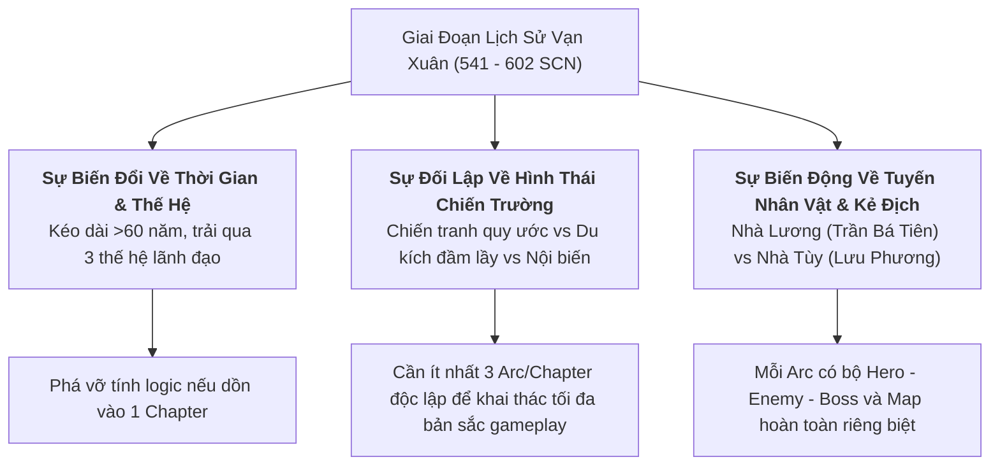
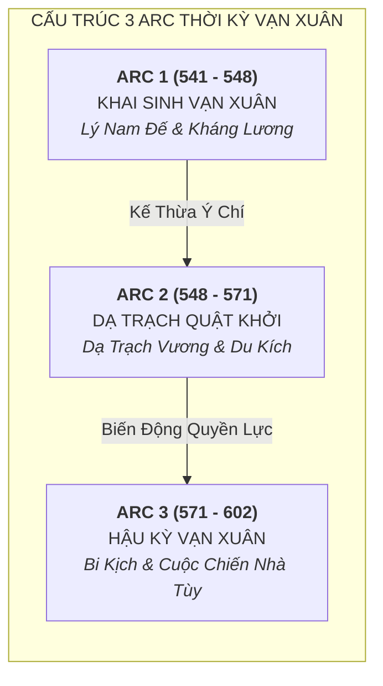
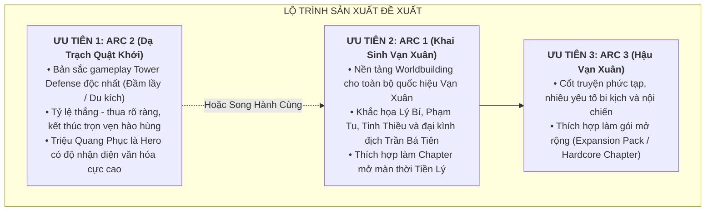

# Đề Xuất Phân Chia Chapter & Arc Cốt Truyện: Thời Kỳ Nước Vạn Xuân (541–602 SCN)

> [!IMPORTANT]
> **Ràng Buộc Nghiên Cứu & Cách Ly Ngữ Cảnh (Task `VS-VX-02`)**:
> - Tài liệu này phân tích cấu trúc tường thuật và đề xuất phân chia các Chapter/Arc chiến dịch cho thời kỳ Vạn Xuân (541–602 SCN).
> - **KHÔNG MẶC ĐỊNH 60 NĂM VẠN XUÂN LÀ MỘT CHAPTER DUY NHẤT**.
> - **TUYỆT ĐỐI KHÔNG LÀM GAMEPLAY CODE / STATS**: Không viết chỉ số cụ thể (HP/ATK), không tạo Skill/Passive logic, không tạo Asset PNG, không sửa `src/**` và `PROJECT_PLAN.md`.

---

## 1. Phân Tích: Vì Sao Không Thể Gộp 60 Năm Vạn Xuân Thành Một Chapter Duy Nhất?

Giai đoạn lịch sử nước Vạn Xuân (541–602 SCN) kéo dài hơn 60 năm, trải qua nhiều thế hệ lãnh đạo và hai triều đại phong kiến ngoại bang (Nhà Lương và Nhà Tùy). Việc gộp toàn bộ giai đoạn này vào một Chapter duy nhất sẽ phá vỡ tính logic lịch sử, nghèo nàn hóa chiều sâu chiến thuật và gây xung đột trầm trọng trong thiết kế game Tower Defense:

### 1.1. Biên Độ Thời Gian Quá Dài & Xung Đột Thế Hệ Nhân Vật
* Cuộc khởi nghĩa của **Lý Bí** nổ ra năm 541 SCN, trong khi sự sụp đổ của Hậu Lý Nam Đế trước nhà Tùy diễn ra vào năm 602 SCN.
* Các nhân vật khai quốc thế hệ đầu như **Phạm Tu, Tinh Thiều** đã anh dũng hy sinh vào các năm 545–548 SCN, không thể cùng xuất hiện trên chiến trường song hành cùng các nhân vật thế hệ sau như **Lý Phật Tử, Lưu Phương** (năm 602 SCN).

### 1.2. Hình Thái Chiến Thuật & Môi Trường Tác Chiến Hoàn Toàn Khác Biệt
* **Thời kỳ Lý Nam Đế (541–548)**: Mang tính chất **Chiến tranh công thủ thành lũy và thủy bộ quy ước** (Phòng tuyến sông Tô Lịch, đồn lũy Chu Diên, thủy chiến hồ Điển Triệt, căn cứ hang động Khuất Lão).
* **Thời kỳ Triệu Quang Phục (548–571)**: Mang tính chất **Chiến tranh du kích đầm lầy đặc thù (Asymmetric Marshland Warfare)** tại đầm Dạ Trạch (thuyền độc mộc luồn lách, cướp lương ban đêm, ẩn hiện trong lau sậy, vũ khí gắn liền biểu tượng Chử Đồng Tử).
* **Thời kỳ Hậu Vạn Xuân (571–602)**: Mang tính chất **Tranh chấp quyền lực chính trị nội bộ, phân chia ranh giới Bãi Quân** và đối đầu với đạo quân kỵ bộ viễn chinh khổng lồ của đế chế Tùy thống nhất Trung Hoa.

---

## 2. Đề Xuất Cấu Trúc 3 Chapter / Arc Chiến Dịch Chi Tiết

---

### 2.1. Arc 1: Khai Sinh Vạn Xuân & Kháng Lương (541–548 SCN)

* **Tên đề xuất**: *Chapter: Khai Sinh Vạn Xuân (The Dawn of Vạn Xuân)*
* **Chủ đề cốt truyện**: Tinh thần quật khởi lật đổ ách thống trị tàn bạo của nhà Lương (Tiêu Tư), thành lập nhà nước độc lập tự chủ đầu tiên mang quốc hiệu **Vạn Xuân**, đúc tiền đồng, dựng chùa Khai Quốc; và cuộc kháng chiến bi tráng chống lại đại quân tinh nhuệ phương Bắc do Trần Bá Tiên chỉ huy.
* **Không gian địa lý & Môi trường tác chiến (Map Concepts)**:
  * *Map 1.1*: Thành Long Biên & Dinh thự Tiêu Tư (Đô thị cổ, công phá dinh lũy đô hộ).
  * *Map 1.2*: Phòng tuyến sông Tô Lịch & Lũy Chu Diên (Chiến hào đất nện, cọc gỗ ven sông, trận địa chặn giặc).
  * *Map 1.3*: Thủy trại Hồ Điển Triệt (Mặt nước mênh mông, bãi lau sậy, hỏa công thuyền chiến).
  * *Map 1.4*: Đại Ngàn Khuất Lão (Vùng núi non Tam Nông - Phú Thọ, căn cứ rừng sâu hiểm trở).
* **Tuyến nhân vật chính (Phe Vạn Xuân)**:
  * **Lý Bí (Lý Nam Đế)** — Hoàng Đế Khai Quốc.
  * **Phạm Tu (Lão Tướng Phạm Lão Đổng)** — Thống Soái Quân Sự / Đại Tướng Tiên Phong.
  * **Tinh Thiều** — Thái Phó Văn Thần / Cố Vấn Triều Chính.
  * **Triệu Túc** — Lạc Tướng Chu Diên (Story NPC).
* **Tuyến đối phương (Phe Xâm Lược Nhà Lương & Phụ Trợ)**:
  * *Boss 1*: **Tiêu Tư** (Thứ sử Giao Châu tham tàn — Boss mở màn).
  * *Boss 2*: **Trần Bá Tiên** (Đại danh tướng nhà Lương — Boss tối hậu của Arc).
  * *Elite*: Lương Tiên Phong Kỵ Tướng.
  * *Normal Enemies*: Lương Thiết Giáp Sĩ, Lương Nỏ Thủ Cơ Giới, Lương Giáo Binh.
  * *Phe phụ*: Quân xâm lấn Lâm Ấp phương Nam (Bị Phạm Tu đánh tan năm 543).

---

### 2.2. Arc 2: Dạ Trạch Quật Khởi & Triệu Việt Vương (548–571 SCN)

* **Tên đề xuất**: *Chapter: Dạ Trạch Quật Khởi (The Marshland King)*
* **Chủ đề cốt truyện**: Giai đoạn kháng chiến gian lao và rực rỡ nhất trong lịch sử quân sự Vạn Xuân. Triệu Quang Phục rút quân vào đầm Dạ Trạch hiểm trở, phát triển nghệ thuật chiến tranh du kích đầm lầy, sử dụng thuyền độc mộc xuất quỷ nhập thần, kết hợp tín ngưỡng văn hóa Móng Rồng Chử Đồng Tử, cuối cùng chém chết tướng giặc Dương Sàn, giải phóng Long Biên.
* **Không gian địa lý & Môi trường tác chiến (Map Concepts)**:
  * *Map 2.1*: Đầm Lầy Dạ Trạch (Hưng Yên — Bãi bồi lau sậy ngập nước, bùn lầy lún sâu, mê lộ đường nước).
  * *Map 2.2*: Đảo Nổi Trung Tâm & Bến Thuyền Độc Mộc (Doanh trại dựng trên bãi bồi cọc gỗ, đài thờ Chử Đồng Tử).
  * *Map 2.3*: Trận Địa Phục Kích Ban Đêm Ven Sông Hồng (Sông nước tối mịt, lửa đuốc bập bùng, tấn công bất ngờ).
  * *Map 2.4*: Chiến Tuyến Tái Chiếm Thành Long Biên (Đại phản công quét sạch tàn quân Lương).
* **Tuyến nhân vật chính (Phe Vạn Xuân)**:
  * **Triệu Quang Phục (Dạ Trạch Vương / Triệu Việt Vương)** — Thủ Lĩnh Du Kích Đầm Lầy.
  * **Cảo Nương** — Nữ Tướng / Nhân vật truyền thuyết đồng hành (Ranged/Support Candidate).
  * **Dạ Trạch Ngư Binh** — Dũng sĩ đầm lầy / Thủy binh cơ động (Fast Striker Candidate).
* **Tuyến đối phương (Phe Quân Lương Vây Hãm)**:
  * *Boss*: **Dương Sàn** (Viên tướng thiện chiến của nhà Lương trấn thủ vòng vây — Bị chém đầu tại trận).
  * *Elite*: Lương Đầm Lầy Đốc Chiến Quan.
  * *Normal Enemies*: Lương Trục Thủy Binh, Lương Hỏa Xạ Thủ, Dân Phu Khai Kênh Vây Hãm.

---

### 2.3. Arc 3: Hậu Vạn Xuân & Cuộc Chiến Nhà Tùy (571–602 SCN)

* **Tên đề xuất**: *Chapter: Hậu Vạn Xuân (Shadows of Vạn Xuân)*
* **Chủ đề cốt truyện**: Giai đoạn đầy biến động và bi kịch chính trị. Sự trỗi dậy của Lý Thiên Bảo (Đào Lang Vương) tại Dã Năng, sự tranh chấp và mưu đồ đoạt quyền của Lý Phật Tử (Hậu Lý Nam Đế) dẫn đến cái chết đau thương của Triệu Việt Vương tại cửa biển Đại Nha; và trận chiến cuối cùng trước cuộc xâm lược quy mô lớn của nhà Tùy do đại tướng Lưu Phương chỉ huy năm 602 SCN.
* **Không gian địa lý & Môi trường tác chiến (Map Concepts)**:
  * *Map 3.1*: Vùng Núi Dã Năng (Ai Lao / Tây Bắc — Đồn trại miền sơn cước của Đào Lang Vương).
  * *Map 3.2*: Bãi Quân Chu Diên (Vùng giáp ranh phân chia quyền lực giữa Lý và Triệu).
  * *Map 3.3*: Cửa Biển Đại Nha (Cửa biển bi tráng nơi Triệu Việt Vương tuẫn tiết).
  * *Map 3.4*: Phòng Tuyến Sông Đỗ Sùng & Thành Ô Diên (Trận địa đối đầu đại quân viễn chinh nhà Tùy).
* **Tuyến nhân vật chính**:
  * **Lý Thiên Bảo (Đào Lang Vương)** — Thủ lĩnh vùng sơn cước.
  * **Lý Phật Tử (Hậu Lý Nam Đế)** — Nhân vật chính trị mưu mô / Anti-hero.
  * **Triệu Việt Vương (Giai đoạn Hậu kỳ Bi kịch)** — Story NPC.
  * **Nhã Lang & Cảo Nương** — Nhân vật bi kịch hôn nhân chính trị (Truyền thuyết).
* **Tuyến đối phương (Đế Chế Nhà Tùy)**:
  * *Boss*: **Lưu Phương** (Đại danh tướng viễn chinh nhà Tùy).
  * *Elite*: Tùy Thiết Kỵ Thảo Nguyên.
  * *Normal Enemies*: Tùy Giáp Sĩ Tinh Nhuệ, Tùy Thần Nỏ Thủ, Tùy Công Thành Phá Chướng.

---

## 3. Đánh Giá Ưu Tiên Sản Xuất (Production Priority & Rationale)

### 3.1. Phân Tích Chọn Lựa Giữa Arc 1 và Arc 2

| Tiêu Chí Đánh Giá | Arc 1 (Lý Nam Đế 541–548) | Arc 2 (Triệu Quang Phục 548–571) | Đánh Giá Thiết Kế |
|---|---|---|---|
| **Bản Sắc Gameplay (TD Mechanics)** | Thủ thành quy ước, công đồn, chiến hào, thủy trại sông ngòi. | **Du kích đầm lầy, sương mù, ẩn hiện trong lau sậy, bẫy nước**. | **Arc 2 vượt trội** về sự mới lạ trong trải nghiệm Tower Defense. |
| **Giá Trị Cốt Truyện & Worldbuilding** | **Khai sinh quốc hiệu Vạn Xuân, chùa Khai Quốc, dựng nước độc lập**. | Giữ nước, biểu tượng tâm linh Móng Rồng Chử Đồng Tử, phục quốc. | **Arc 1 vượt trội** về ý nghĩa mở màn kỷ nguyên Vạn Xuân. |
| **Cảm Xúc Người Chơi (Ending Tone)** | Bi tráng, thất bại tại Điển Triệt và Khuất Lão, trao quyền bính. | **Chiến thắng oanh liệt, chém chết tướng giặc Dương Sàn, quang phục Long Biên**. | **Arc 2 mang lại cảm xúc chiến thắng trọn vẹn hơn**. |
| **Độ Nhận Diện Nhân Vật** | Lý Nam Đế, Lão tướng Phạm Tu. | Triệu Việt Vương (Dạ Trạch Vương). | Cả hai đều có sức hút văn hóa rất cao. |

### 3.2. Đề Xuất Quyết Định Sản Xuất Chính Thức
1. **Lựa Chọn Tối Ưu Nhất**:
   * Phát triển **Arc 1 (Khai Sinh Vạn Xuân)** và **Arc 2 (Dạ Trạch Quật Khởi)** thành **2 Chapter liên hoàn** của cốt truyện Vạn Xuân.
   * Nếu bắt buộc phải chọn **đúng 1 Chapter sản xuất trước ngay trong đợt đầu**:
     * **Khuyến nghị chọn Arc 2 (Dạ Trạch Quật Khởi)**: Vì môi trường đầm lầy Dạ Trạch và chiến thuật du kích tạo nên một bước nhảy vọt về mặt gameplay mechanics và visual theme, mang lại dấu ấn độc bản cho dự án Huyền Sử TD.
     * **Hoặc chọn Arc 1 (Khai Sinh Vạn Xuân)** nếu muốn tôn trọng mạch phát triển biên niên sử tuyến tính từ khởi nghĩa Mê Linh (HBT) $\rightarrow$ Ngàn Nưa (Bà Triệu) $\rightarrow$ Khai Quốc Vạn Xuân (Lý Bí).
