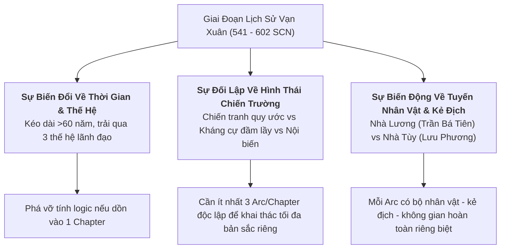
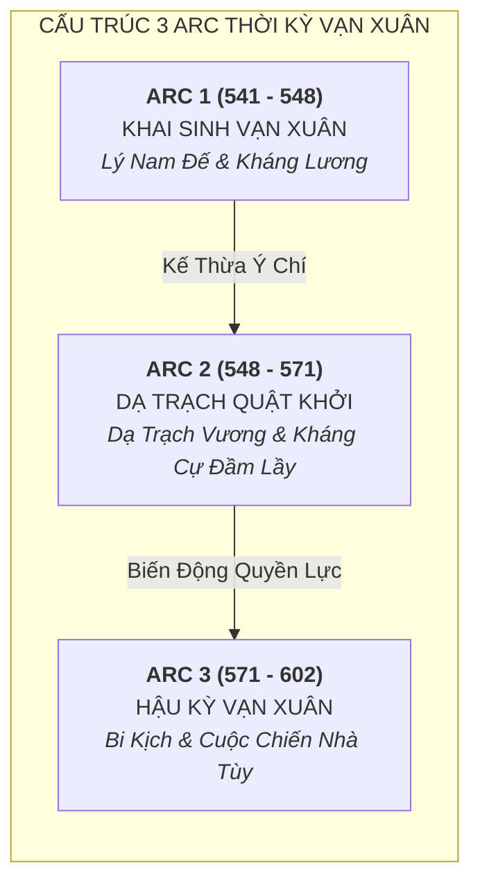
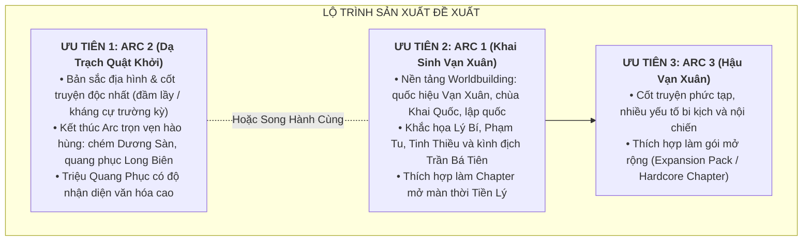

# Đề Xuất Phân Chia Chapter & Arc Cốt Truyện: Thời Kỳ Nước Vạn Xuân (541–602 SCN)

> [!IMPORTANT]
> **Ràng Buộc Nghiên Cứu & Cách Ly Ngữ Cảnh (Task `VS-VX-02`)**:
> - Tài liệu này phân tích cấu trúc tường thuật và đề xuất phân chia các Chapter/Arc chiến dịch cho thời kỳ Vạn Xuân (541–602 SCN).
> - **KHÔNG MẶC ĐỊNH 60 NĂM VẠN XUÂN LÀ MỘT CHAPTER DUY NHẤT**.
> - **TUYỆT ĐỐI KHÔNG LÀM GAMEPLAY CODE / STATS**: Không viết chỉ số cụ thể (HP/ATK), không tạo Skill/Passive logic, không tạo Asset PNG, không sửa `src/**` và `PROJECT_PLAN.md`.
> - **Historical source of truth**: [character-roster-and-sources.md](character-roster-and-sources.md) và [historical-context-and-timeline.md](historical-context-and-timeline.md) từ Task `VS-VX-01` (đã audit PASS).

> [!WARNING]
> **Ngôn ngữ thẩm định**: Mọi chi tiết chiến thuật, địa danh và số liệu đều được gắn nhãn tầng nguồn **(T1 / T2 / T3 / T4)** theo VS-VX-01. Địa điểm phục dựng trong Map Concept được ghi `[Artistic Interpretation]` khi vị trí lịch sử chưa xác định.

---

## 1. Phân Tích: Vì Sao Không Thể Gộp 60 Năm Vạn Xuân Thành Một Chapter Duy Nhất?

Giai đoạn lịch sử nước Vạn Xuân (541–602 SCN) kéo dài hơn 60 năm, trải qua nhiều thế hệ lãnh đạo và hai triều đại phong kiến ngoại bang (Nhà Lương và Nhà Tùy). Việc gộp toàn bộ giai đoạn này vào một Chapter duy nhất sẽ phá vỡ tính logic lịch sử và nghèo nàn hóa chiều sâu thiết kế:

### 1.1. Biên Độ Thời Gian Quá Dài & Xung Đột Thế Hệ Nhân Vật
* Cuộc khởi nghĩa của **Lý Bí** nổ ra năm 541 SCN, trong khi sự sụp đổ của Hậu Lý Nam Đế trước nhà Tùy diễn ra vào năm 602 SCN.
* Theo *Toàn Thư* (T2), các nhân vật khai quốc thế hệ đầu như **Phạm Tu, Tinh Thiều** được ngụ ý là đã ngã xuống trong giai đoạn 545–548 SCN — **tuy nhiên T1 (Lương Thư, Trần Thư) không xác nhận chi tiết này** `[T2 only; not confirmed by near-source]`. Dù theo nguồn nào, họ không thể cùng chiến đấu song hành với các nhân vật thế hệ sau như **Lý Phật Tử, Lưu Phương** (năm 602 SCN).

### 1.2. Hình Thái Chiến Trường Hoàn Toàn Khác Biệt
* **Thời kỳ Lý Nam Đế (541–548)**: Chiến tranh công thủ thành lũy và thủy bộ quy ước (Phòng tuyến sông Tô Lịch, đồn lũy Chu Diên, thủy trại hồ Điển Triệt `[vị trí tranh luận theo VS-VX-01]`, rút về vùng Khuất Lão/Khuất Nao `[tên gọi và vị trí bất định theo VS-VX-01]`).
* **Thời kỳ Triệu Quang Phục (548–571)**: Kháng cự trường kỳ trong địa hình đầm lầy tại Dạ Trạch (theo *Toàn Thư*, T2; chiến thuật ban đêm và thuyền độc mộc được mô tả trong T2/*Toàn Thư* và T3/*Lĩnh Nam Chích Quái* — **T1 không mô tả chi tiết chiến thuật này**).
* **Thời kỳ Hậu Vạn Xuân (571–602)**: Tranh chấp quyền lực chính trị nội bộ giữa các thế lực Tiền Lý và đối đầu với đạo quân viễn chinh của nhà Tùy (T1 — *Tùy Thư* xác nhận sự kiện 602 SCN).

---

## 2. Đề Xuất Cấu Trúc 3 Chapter / Arc Chiến Dịch Chi Tiết

---

### 2.1. Arc 1: Khai Sinh Vạn Xuân & Kháng Lương (541–548 SCN)

* **Tên đề xuất**: *Chapter: Khai Sinh Vạn Xuân (The Dawn of Vạn Xuân)*
* **Chủ đề cốt truyện**: Tinh thần quật khởi lật đổ ách thống trị của nhà Lương (Tiêu Tư bỏ chạy — T1 xác nhận), thành lập nhà nước độc lập tự chủ mang quốc hiệu **Vạn Xuân** và niên hiệu **Thiên Đức** (T2; Thiên Đức thông bảo = disputed attribution — chưa được khảo cổ xác nhận), dựng chùa Khai Quốc (T2); và cuộc kháng chiến chống lại đại quân phương Bắc do Trần Bá Tiên chỉ huy (T1).
* **Không gian địa lý & Map Concepts** *(địa điểm phục dựng ghi [Artistic Interpretation] khi vị trí chưa xác định)*:
  * *Map 1.1*: Thành Long Biên & vùng đô hộ (T2 ghi nghĩa quân chiếm Long Biên — `[T2 only]`).
  * *Map 1.2*: Phòng tuyến sông Tô Lịch & Chu Diên (T1 — *Trần Thư* xác nhận địa điểm chiến trận).
  * *Map 1.3*: Thủy trại hồ Điển Triệt (T1 — *Trần Thư* xác nhận tên; vị trí địa lý cụ thể = `[vị trí tranh luận; Artistic Interpretation]`).
  * *Map 1.4*: Vùng Khuất Lão / Khuất Nao (T1 — *Trần Thư*, tên gọi bất nhất giữa các bản; vị trí = `[bất định; Cương Mục T2 đề xuất Tam Nông - Phú Thọ nhưng chưa xác định bởi khảo cổ; Artistic Interpretation]`).
* **Tuyến nhân vật (Phe Vạn Xuân)**:
  * **Lý Bí (Lý Nam Đế)** — Hoàng Đế Khai Quốc, military commander identity (T1/T2).
  * **Phạm Tu** — Đại Tướng Quân đứng đầu ban võ, military figure (T2/T3).
  * **Tinh Thiều** — Thái Phó Ban Văn, scholar/official identity (T2).
  * **Triệu Túc** — Hào Trưởng Chu Diên, story candidate (T2).
* **Tuyến đối phương (Phe Nhà Lương & Lâm Ấp)**:
  * *Boss 1*: **Tiêu Tư** — Thứ sử Giao Châu (T1 xác nhận); boss mở màn theo cốt truyện.
  * *Boss 2*: **Trần Bá Tiên** — Tư mã nhà Lương (T1 xác nhận); boss tối hậu của Arc.
  * *Elite Enemy Candidate*: Lương Tiên Phong Kỵ Tướng `[T4 — Artistic Interpretation]`.
  * *Normal Enemy Candidates*: Lương Thiết Giáp Sĩ, Lương Nỏ Thủ Cơ Giới, Lương Giáo Binh `[tạo hình T4 dựa trên khảo cổ Nam Triều]`.
  * *Phe phụ*: Quân Lâm Ấp xâm lấn phương Nam (T1/T2 — bị Phạm Tu đánh tan năm 543 theo *Toàn Thư* T2; T1 xác nhận sự kiện Lâm Ấp xâm lấn nhưng không đề cập tên Phạm Tu).

---

### 2.2. Arc 2: Dạ Trạch Quật Khởi & Triệu Việt Vương (548–571 SCN)

* **Tên đề xuất**: *Chapter: Dạ Trạch Quật Khởi (The Marshland Resistance)*
* **Chủ đề cốt truyện**: Giai đoạn kháng cự trường kỳ tại đầm Dạ Trạch. Triệu Quang Phục nhận quyền từ Lý Nam Đế (T2), rút vào vùng đầm lầy, tổ chức kháng cự; chiến thuật ban đêm và thuyền độc mộc được ghi trong T2/*Toàn Thư* (cách sự kiện ~900 năm) và T3/*Lĩnh Nam Chích Quái*. Biểu tượng Móng Rồng Chử Đồng Tử gắn liền với nhân vật là **T3 Folklore** — không phải sự kiện lịch sử được xác nhận bởi T1 hoặc T2 độc lập. Kết thúc Arc: Triệu Quang Phục tổng phản công, chém tướng Dương Sàn (tên có trong T1, hoàn cảnh chết trận theo T2), tái chiếm Long Biên (T2).
* **Không gian địa lý & Map Concepts** *(địa điểm phục dựng ghi [Artistic Interpretation] khi vị trí chưa xác định)*:
  * *Map 2.1*: Đầm Lầy Dạ Trạch (T2 đặt tại vùng Khoái Châu, Hưng Yên — `[vị trí theo T2/T4; Artistic Interpretation]`).
  * *Map 2.2*: Bến Thuyền & Trại Nổi Bãi Bồi (chiến thuật thuyền độc mộc — T2/T3; `[Artistic Interpretation]`).
  * *Map 2.3*: Trận Địa Phục Kích Ban Đêm Ven Sông (chiến thuật ban đêm — T2/T3; `[Artistic Interpretation]`).
  * *Map 2.4*: Chiến Tuyến Tái Chiếm Long Biên (đại phản công — T2).
* **Tuyến nhân vật (Phe Vạn Xuân)**:
  * **Triệu Quang Phục (Dạ Trạch Vương / Triệu Việt Vương)** — military commander identity, thủ lĩnh kháng cự (T2/T3).
  * **Cảo Nương** — nhân vật truyền thuyết, story candidate **(T3 Folklore — không phải historical person được T1/T2 xác nhận)**.
  * **Dạ Trạch Ngư Binh** — khái niệm dân quân đầm lầy, story candidate **(T4 — Game Interpretation)**.
* **Tuyến đối phương (Phe Quân Lương Vây Hãm)**:
  * *Boss*: **Dương Sàn** — Tướng Lương trấn thủ (tên: T1; hoàn cảnh chết trận: T2).
  * *Elite Enemy Candidate*: Lương Đốc Chiến Quan `[T4 — Artistic Interpretation]`.
  * *Normal Enemy Candidates*: Lương Thủy Binh Vây Hãm, Lương Hỏa Xạ Thủ, Dân Phu Khai Kênh `[T4 — Artistic Interpretation]`.

---

### 2.3. Arc 3: Hậu Vạn Xuân & Cuộc Chiến Nhà Tùy (571–602 SCN)

* **Tên đề xuất**: *Chapter: Hậu Vạn Xuân (Shadows of Vạn Xuân)*
* **Chủ đề cốt truyện**: Giai đoạn đầy biến động. Lý Thiên Bảo (Đào Lang Vương) cát cứ tại vùng Dã Năng (T1 gián tiếp + T2); Lý Phật Tử kế vị (T2) và tranh chấp với Triệu Việt Vương; Triệu Việt Vương tử trận tại cửa biển Đại Nha năm 571 (T2). Câu chuyện Nhã Lang — Cảo Nương — Móng Rồng là **T3 Folklore**, không được T1/T2 xác nhận là sự kiện lịch sử — cần ghi nhãn rõ ràng khi khai thác trong cốt truyện game. Kết thúc Arc: nhà Tùy — Lưu Phương dẫn quân năm 602 SCN, Lý Phật Tử đầu hàng (T1 — *Tùy Thư* xác nhận).
* **Không gian địa lý & Map Concepts** *(địa điểm phục dựng ghi [Artistic Interpretation] khi vị trí chưa xác định)*:
  * *Map 3.1*: Vùng Dã Năng (Ai Lao / vùng núi Tây Bắc — T1/T2; `[Artistic Interpretation]`).
  * *Map 3.2*: Bãi Quân Chu Diên (vùng giáp ranh phân chia quyền lực — T2).
  * *Map 3.3*: Cửa Biển Đại Nha (nơi Triệu Việt Vương tử trận — T2; `[Artistic Interpretation]`).
  * *Map 3.4*: Phòng Tuyến Sông Đỗ Sùng & Thành Ô Diên (trận địa chống Tùy — T1/T2; `[Artistic Interpretation]`).
* **Tuyến nhân vật**:
  * **Lý Thiên Bảo (Đào Lang Vương)** — military figure, thủ lĩnh cát cứ (T1/T2).
  * **Lý Phật Tử (Hậu Lý Nam Đế)** — story candidate / nhân vật chính trị phức tạp (T1/T2).
  * **Triệu Việt Vương (Giai đoạn Hậu kỳ)** — story candidate (T2).
  * **Nhã Lang & Cảo Nương** — nhân vật truyền thuyết **(T3 Folklore — tách biệt hoàn toàn khỏi profile T1/T2 của Lý Phật Tử)**.
* **Tuyến đối phương (Đế Chế Nhà Tùy)**:
  * *Boss*: **Lưu Phương** — Đại Tướng Nhà Tùy (T1 — *Tùy Thư* xác nhận).
  * *Elite Enemy Candidate*: Tùy Thiết Kỵ `[T4 — Artistic Interpretation]`.
  * *Normal Enemy Candidates*: Tùy Giáp Sĩ, Tùy Nỏ Thủ, Tùy Công Thành Binh `[T4 — Artistic Interpretation]`.

---

## 3. Đánh Giá Ưu Tiên Sản Xuất (Production Priority & Rationale)

### 3.1. Phân Tích Chọn Lựa Giữa Arc 1 và Arc 2

| Tiêu Chí Đánh Giá | Arc 1 (Lý Nam Đế 541–548) | Arc 2 (Triệu Quang Phục 548–571) | Đánh Giá |
|---|---|---|---|
| **Bản Sắc Địa Hình & Không Gian** | Thành lũy sông ngòi, chiến hào, thủy trại. | **Đầm lầy Dạ Trạch, lau sậy, thuyền độc mộc (T2/T3)**. | **Arc 2 vượt trội** về sự mới lạ của bối cảnh. |
| **Giá Trị Cốt Truyện & Worldbuilding** | **Khai sinh quốc hiệu Vạn Xuân, chùa Khai Quốc, lập quốc (T2)**. | Giữ nước, kháng cự trường kỳ, phục quốc (T2). | **Arc 1 vượt trội** về ý nghĩa mở màn kỷ nguyên Vạn Xuân. |
| **Cảm Xúc Kết Thúc** | Bi tráng, thất bại tại Điển Triệt và Khuất Lão/Khuất Nao, trao quyền bính. | **Chiến thắng, chém tướng giặc Dương Sàn, tái chiếm Long Biên (T2)**. | **Arc 2 mang lại cảm xúc trọn vẹn hơn**. |
| **Độ Nhận Diện Nhân Vật** | Lý Nam Đế, Phạm Tu, Tinh Thiều. | Triệu Việt Vương (Dạ Trạch Vương). | Cả hai đều có sức hút văn hóa cao. |

### 3.2. Đề Xuất Quyết Định Sản Xuất

1. **Lựa Chọn Tối Ưu**: Phát triển **Arc 1** và **Arc 2** thành **2 Chapter liên hoàn** của cốt truyện Vạn Xuân.
2. Nếu bắt buộc chọn **đúng 1 Chapter sản xuất trước**:
   * **Khuyến nghị Arc 2 (Dạ Trạch Quật Khởi)**: Địa hình đầm lầy và bối cảnh kháng cự dài hạn tạo dấu ấn riêng biệt cho dự án Huyền Sử TD.
   * **Hoặc Arc 1 (Khai Sinh Vạn Xuân)** nếu muốn tôn trọng mạch phát triển biên niên sử tuyến tính từ khởi nghĩa Mê Linh (HBT) $\rightarrow$ Ngàn Nưa (Bà Triệu) $\rightarrow$ Khai Quốc Vạn Xuân (Lý Bí).
