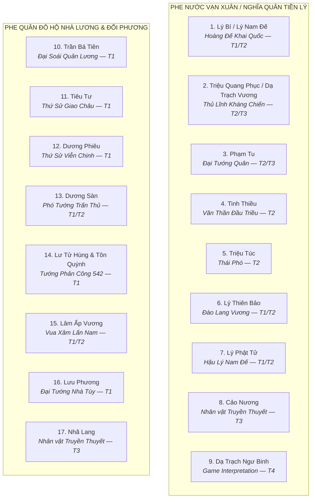

# Khảo Cứu Nhân Vật & Phân Loại Nguồn: Thời Kỳ Nước Vạn Xuân (541–602 SCN)

> [!IMPORTANT]
> **Ràng Buộc Nghiên Cứu Học Thuật (Task `VS-VX-01`)**:
> - Tài liệu này khảo cứu **17 ứng viên nhân vật** thuộc cả hai phe Vạn Xuân và Nhà Lương / Nhà Tùy.
> - **TUYỆT ĐỐI KHÔNG**: Chọn Roster 3 Hero, không thiết kế Stats (HP/ATK/Range/Speed), không thiết kế Skill/Passive/Boss Ability.
> - Mọi nhân vật đều được phân loại theo 4 tầng nguồn nghiêm ngặt: **T1** (Near-source Chinese chronicles) / **T2** (Later Vietnamese historiography) / **T3** (Local tradition / Folklore) / **T4** (Modern interpretation).

> [!WARNING]
> **Ngôn ngữ thẩm định**: Tài liệu này **không dùng các mức "Tuyệt đối", "Cực kỳ cao"**. Thay vào đó, từng nhân vật được ghi rõ **nguồn nào đề cập**, **tầng nguồn**, và **những gì vẫn còn hạn chế hoặc bất định** về mặt học thuật. Tham khảo [sources.md](sources.md) để hiểu đầy đủ tầng nguồn.

---

## 1. Bảng Tổng Hợp Danh Sách 17 Ứng Viên Nhân Vật

---

## 2. Chi Tiết Khảo Cứu Phe Nước Vạn Xuân (Tiền Lý)

### 2.1. Nhân vật 1: Lý Bí (Lý Nam Đế)

* **Danh xưng**: Lý Bí (Lý Bôn theo một số truyền thống), Lý Nam Đế.
* **Tầng nguồn chính**: **T1 (sự kiện khởi nghĩa) + T2 (chi tiết triều đình)**
* **Sử liệu ghi nhận**:
  * **T1 — *Lương Thư***: Ghi là "Giao Châu thổ hào Lý Bí nổi dậy, Tiêu Tư hành tiền cầu hòa rồi bỏ trốn". Xác nhận sự kiện 541 và tên Lý Bí.
  * **T1 — *Trần Thư***: Nhắc đến Lý Bí trong bối cảnh chiến dịch của Trần Bá Tiên.
  * **T2 — *Toàn Thư*, *Việt Sử Lược*, *Cương Mục***: Bổ sung danh hiệu Lý Nam Đế, quốc hiệu Vạn Xuân, niên hiệu Thiên Đức, tổ chức triều đình, cái chết tại Khuất Lão (548). **Những chi tiết này chỉ có trong T2; T1 không nhắc đến**.
* **Lưu ý học thuật**: Danh xưng "Lý Nam Đế" và quốc hiệu "Vạn Xuân" là T2; T1 chỉ nhắc tên Lý Bí (hoặc Lý Bôn). Cái chết tại Khuất Lão năm 548 dựa trên T2; năm sinh 503 SCN là suy đoán từ một số tài liệu T2/T4.
* **Visual concept (thông tin dừng ở đây — chưa có stats / skill)**:
  * Hoàng bào gấm đỏ, dáng dấp đế vương khai quốc — nguồn cảm hứng T2/T4.

---

### 2.2. Nhân vật 2: Triệu Quang Phục (Dạ Trạch Vương / Triệu Việt Vương)

* **Danh xưng**: Triệu Quang Phục; danh hiệu Dạ Trạch Vương, Triệu Việt Vương (T2); "Minh Hoàng Đế" (T3 — thần tích).
* **Tầng nguồn chính**: **T2 + T3**
* **Sử liệu ghi nhận**:
  * **T1**: *Lương Thư* và *Trần Thư* không đề cập tên Triệu Quang Phục trực tiếp trong các đoạn hiện còn tra cứu được.
  * **T2 — *Toàn Thư*, *Cương Mục*, *Việt Sử Tiêu Án***: Ghi nhận vai trò nhận quyền từ Lý Nam Đế, căn cứ Dạ Trạch, chém Dương Sàn, xưng Triệu Việt Vương.
  * **T3 — *Lĩnh Nam Chích Quái*, thần phả Hưng Yên**: Ghi truyện Móng Rồng Chử Đồng Tử (Folklore — xem nhân vật 18).
* **Lưu ý học thuật**: Toàn bộ thông tin về Triệu Quang Phục dựa vào T2 (cách sự kiện ~900 năm) và T3. Không có T1 nào xác nhận tên ông.
* **Visual concept**: Áo chàm chiến binh, nón đâu mâu — gợi ý T2/T4. Móng Rồng trên mũ là biểu tượng **T3 (Folklore)**, cần chú thích rõ khi dùng trong game.

---

### 2.3. Nhân vật 3: Phạm Tu

* **Danh xưng**: Phạm Tu; thụy phong "Đô Hồ Đại Vương" là T3 (thần tích địa phương).
* **Tầng nguồn chính**: **T2 + T3**
* **Sử liệu ghi nhận**:
  * **T1**: Không tìm thấy đoạn T1 nào nhắc tên Phạm Tu trực tiếp.
  * **T2 — *Toàn Thư*, *Cương Mục***: Ghi Phạm Tu đứng đầu ban võ triều Vạn Xuân; đánh tan Lâm Ấp năm 543.
  * **T3 — Thần phả Đình Thanh Liệt (Thanh Trì, Hà Nội)**: Tôn vinh Phạm Tu là Đô Hồ Đại Vương; ghi chi tiết hành trạng và cái chết.
* **Lưu ý học thuật**:
  * **Cái chết của Phạm Tu trong trận Tô Lịch (545)**: *Toàn Thư* ngụ ý nhưng không mô tả rõ ràng. **T1 không xác nhận** chi tiết này — `[T2 only; not confirmed by near-source]`.
  * Năm sinh "476 SCN" là suy đoán từ thần phả T3 (thọ ~70 tuổi); không có T1/T2 độc lập xác nhận.
  * Chức danh "Thái úy" là T2; có thể phản chiếu hệ quan chế trung đại hơn là thực tế thế kỷ VI.
* **Visual concept**: Lão tướng dũng mãnh, giáp da đồng — gợi ý T2/T4.

---

### 2.4. Nhân vật 4: Tinh Thiều

* **Tầng nguồn chính**: **T2**
* **Sử liệu ghi nhận**:
  * **T2 — *Toàn Thư*, *Cương Mục*, *Việt Sử Tiêu Án***: Ghi nhận Tinh Thiều là người học rộng, ra Bắc xin làm quan, được nhà Lương phong chức **Quảng Dương môn lang** (廣陽門郎), phẫn chí trở về tụ nghĩa cùng Lý Bí, đứng đầu ban văn triều Vạn Xuân.
  * **T1**: Không có đoạn T1 nào nhắc tên Tinh Thiều.
* **Lưu ý học thuật**:
  * > [!CAUTION]
    > Chức vụ chính xác theo T2 là **Quảng Dương môn lang** — tức viên lang coi giữ cửa Quảng Dương trong hệ thống hoàng thành nhà Lương. **Không dùng cụm từ "gác cổng Tây Viên"** — đây là diễn dịch thông tục không có trong nguyên văn.
  * **Cái chết trong trận Tô Lịch (545)**: *Toàn Thư* ngụ ý nhưng không ghi rõ. **T1 không xác nhận** — `[T2 only; not confirmed by near-source]`.

---

### 2.5. Nhân vật 5: Triệu Túc

* **Tầng nguồn chính**: **T2**
* **Sử liệu**: *Toàn Thư*, *Cương Mục* ghi Triệu Túc là hào trưởng quận Chu Diên, cha Triệu Quang Phục, được phong Thái phó.
* **Lưu ý**: Không có T1 xác nhận.

---

### 2.6. Nhân vật 6: Lý Thiên Bảo (Đào Lang Vương)

* **Tầng nguồn chính**: **T1 + T2**
* **Sử liệu**:
  * **T1 — *Lương Thư***: Nhắc đến một người trong gia tộc Lý Bí rút về miền núi phía Tây sau khi vỡ trận.
  * **T2 — *Toàn Thư*, *Cương Mục***: Đặt tên là Lý Thiên Bảo, danh hiệu Đào Lang Vương, căn cứ tại Dã Năng.
* **Lưu ý**: T1 có đề cập gián tiếp, T2 cung cấp tên và chi tiết cụ thể.

---

### 2.7. Nhân vật 7: Lý Phật Tử (Hậu Lý Nam Đế)

* **Tầng nguồn chính**: **T1 + T2**
* **Sử liệu**:
  * **T1 — *Tùy Thư* (Lưu Phương truyện)**: Ghi rõ "vua đang trị vì Giao Châu là Lý Phật Tử" đầu hàng năm 602.
  * **T2 — *Toàn Thư*, *Cương Mục***: Bổ sung bối cảnh tranh chấp với Triệu Việt Vương.
* **Lưu ý**: Sự kiện đầu hàng 602 có T1 xác nhận; các chi tiết trước đó (tranh chấp nội bộ) chủ yếu từ T2.

---

### 2.8. Nhân vật 8: Cảo Nương

* **Tầng nguồn chính**: **T3 — Folklore / Local Legend**
* **Sử liệu**: *Lĩnh Nam Chích Quái*, thần tích Đền Dạ Trạch. Nhân vật này **không xuất hiện trong T1 hay T2 độc lập**.
* **Lưu ý**: Cảo Nương là nhân vật truyền thuyết trong câu chuyện Nhã Lang — Cảo Nương (xem thêm nhân vật 17). **Không phải historical person được xác nhận bởi T1 hay T2.** Gắn nhãn rõ ràng là T3 / Folklore khi dùng trong game.

---

### 2.9. Nhân vật 9: Dạ Trạch Ngư Binh (Dân Binh Đầm Lầy)

* **Tầng nguồn chính**: **T4 — Game Interpretation** (lấy cảm hứng từ T2/T3)
* **Lưu ý**: Không có tên nhân vật lịch sử cụ thể cho "ngư binh đầm lầy". Đây là khái niệm tổng hợp từ mô tả chiến thuật T2 và bối cảnh địa lý T4.

---

## 3. Chi Tiết Khảo Cứu Phe Quân Đô Hộ Phương Bắc & Đối Phương

### 3.1. Nhân vật 10: Trần Bá Tiên (Chen Baxian)

* **Chức vị**: Tư mã Giao Châu → Đô đốc; sau trở thành Trần Vũ Đế lập nhà Trần.
* **Thời kỳ**: 503–559 SCN.
* **Tầng nguồn chính**: **T1 (xác nhận rõ ràng)**
* **Sử liệu**:
  * **T1 — *Lương Thư*, *Trần Thư* (Cao Tổ bản kỷ), *Nam Sử***: Ghi nhận chi tiết chiến dịch Giao Châu, các trận Chu Diên, Tô Lịch, Điển Triệt. Đây là nhân vật phương Bắc được tư liệu T1 ghi nhận đầy đủ nhất trong giai đoạn này.
* **Lưu ý học thuật**: Thông tin về Trần Bá Tiên đáng tin cậy ở tầng T1. Tuy nhiên, các mô tả chi tiết về "mưu lược", "chiến thuật" cụ thể trong từng trận có thể là T4 (học giả hiện đại suy luận từ kết quả trận đánh).
* **Visual concept**: Giáp trụ quân Lương thế kỷ VI — gợi ý từ khảo cổ học Nam Triều (T4).

---

### 3.2. Nhân vật 11: Tiêu Tư (Xiao Zi / Vũ Lâm Hầu)

* **Chức vị**: Thứ sử Giao Châu nhà Lương, thành viên hoàng tộc họ Tiêu.
* **Tầng nguồn chính**: **T1**
* **Sử liệu**:
  * **T1 — *Lương Thư***: Xác nhận Tiêu Tư là Thứ sử Giao Châu, "hành tiền cầu hòa" rồi bỏ chạy khi Lý Bí nổi dậy.
* **Lưu ý học thuật**:
  * T1 xác nhận tên và việc bỏ trốn của Tiêu Tư. **Các mô tả về "tàn bạo", "hàng trăm thứ thuế" là T2 / popular tradition** — không được T1 liệt kê chi tiết.
  * Mô tả "loại thuế cụ thể" (thuế cây cối, súc vật, vải vóc) là T2/T3 — cần ghi nhãn rõ.

---

### 3.3. Nhân vật 12: Dương Phiêu (Yang Piao)

* **Chức vị**: Thứ sử Giao Châu do Lương Vũ Đế cử năm 545, chỉ huy tổng lực cùng Trần Bá Tiên.
* **Tầng nguồn chính**: **T1**
* **Sử liệu**: *Lương Thư*, *Trần Thư* — xác nhận rõ ràng tên và vai trò.

---

### 3.4. Nhân vật 13: Dương Sàn (Yang Chan)

* **Chức vị**: Tướng Lương trấn thủ sau khi Trần Bá Tiên về nước.
* **Tầng nguồn chính**: **T1 (tên và sự hiện diện) + T2 (hoàn cảnh cái chết)**
* **Sử liệu**:
  * **T1 — *Trần Thư***: Tên Dương Sàn được đề cập trong các ghi chép về chiến dịch Giao Châu.
  * **T2 — *Toàn Thư***: Ghi Dương Sàn bị Triệu Quang Phục chém chết khi tổng phản công năm 550.
* **Lưu ý**: Hoàn cảnh cái chết cụ thể là T2; tên nhân vật có hỗ trợ từ T1.

---

### 3.5. Nhân vật 14: Lư Tử Hùng & Tôn Quýnh

* **Tầng nguồn chính**: **T1**
* **Sử liệu**: *Lương Thư* — Hai tướng được sai sang đàn áp năm 542 nhưng không tiến quân được; cả hai bị bãi chức.

---

### 3.6. Nhân vật 15: Lâm Ấp Vương

* **Tầng nguồn chính**: **T1 + T2**
* **Sử liệu**: *Lương Thư* đề cập Lâm Ấp xâm lấn biên giới; *Toàn Thư* (T2) bổ sung chi tiết trận đánh và vai trò Phạm Tu.
* **Lưu ý**: Tên cụ thể "Phạm Bi Văn" trong một số nguồn cần xác minh nguồn gốc — ghi là `[tên theo T2/T4; cần xác minh]`.

---

### 3.7. Nhân vật 16: Lưu Phương (Liu Fang)

* **Chức vị**: Tướng soái nhà Tùy, dẫn 27 doanh quân chinh phạt Giao Châu năm 602.
* **Tầng nguồn chính**: **T1**
* **Sử liệu**: *Tùy Thư* (Lưu Phương truyện) — xác nhận rõ ràng sự kiện 602 và tên nhân vật.

---

### 3.8. Nhân vật 17: Nhã Lang

* **Tầng nguồn chính**: **T3 — Folklore / Local Legend**
* **Sử liệu**: *Lĩnh Nam Chích Quái*, thần tích Dạ Trạch. **Không có T1 hay T2 độc lập xác nhận sự tồn tại của nhân vật này như một person lịch sử.**
* **Lưu ý**: Cùng với Cảo Nương, Nhã Lang là nhân vật truyền thuyết trong câu chuyện Móng Rồng. **Gắn nhãn T3 / Folklore bắt buộc khi dùng trong game.**

---

## 4. Bảng Tổng Hợp Tầng Nguồn Theo Nhân Vật

| # | Nhân Vật | Tầng Chính | Hỗ Trợ | Lưu Ý Bất Định |
|:---:|---|:---:|:---:|---|
| 1 | Lý Bí / Lý Nam Đế | T1 + T2 | — | Danh hiệu, niên hiệu chỉ T2 |
| 2 | Triệu Quang Phục | T2 + T3 | — | T1 không đề cập tên |
| 3 | Phạm Tu | T2 + T3 | — | Cái chết tại Tô Lịch: T2 only |
| 4 | Tinh Thiều | T2 | — | Chức Quảng Dương môn lang (T2); cái chết: T2 only |
| 5 | Triệu Túc | T2 | — | Không có T1 |
| 6 | Lý Thiên Bảo | T1 + T2 | — | T1 gián tiếp; tên theo T2 |
| 7 | Lý Phật Tử | T1 + T2 | — | Đầu hàng 602: T1 xác nhận |
| 8 | Cảo Nương | T3 | — | **Folklore; không phải historical person** |
| 9 | Dạ Trạch Ngư Binh | T4 | T2/T3 | **Game Interpretation** |
| 10 | Trần Bá Tiên | T1 | — | Tư liệu gần thời đầy đủ nhất |
| 11 | Tiêu Tư | T1 | T2 | Chi tiết thuế khóa là T2 |
| 12 | Dương Phiêu | T1 | — | Xác nhận rõ ràng |
| 13 | Dương Sàn | T1 + T2 | — | Cái chết cụ thể là T2 |
| 14 | Lư Tử Hùng & Tôn Quýnh | T1 | — | Xác nhận rõ ràng |
| 15 | Lâm Ấp Vương | T1 + T2 | — | Tên cụ thể cần xác minh |
| 16 | Lưu Phương | T1 | — | Tư liệu gần thời rõ ràng |
| 17 | Nhã Lang | T3 | — | **Folklore; không phải historical person** |
