# Khảo Cứu Nhân Vật & Bảng Phân Loại Nguồn: Thời Kỳ Nước Vạn Xuân (541–602 SCN)

> [!IMPORTANT]
> **Ràng Buộc Nghiên Cứu Học Thuật (Task `VS-VX-01`)**:
> - Tài liệu này khảo cứu toàn bộ danh sách **17 nhân vật lịch sử và truyền thuyết** thuộc cả hai phe Vạn Xuân và Nhà Lương / Nhà Tùy.
> - **TUYỆT ĐỐI KHÔNG**: Chọn Roster 3 Hero chính thức, không thiết kế Stats (HP/ATK/Range/Speed), không thiết kế Skill/Passive/Boss Ability.
> - Mọi nhân vật đều được gắn nhãn độ tin cậy nguồn gốc nghiêm ngặt:
>   * `Historical near-source` (Nguồn gần thời thế kỷ VI–VII)
>   * `Later historiography` (Chính sử trung đại Việt Nam)
>   * `Folklore / Local Legend` (Thần tích, truyền thuyết địa phương)
>   * `Game Interpretation` (Sáng tạo nghệ thuật của Game).

---

## 1. Bảng Tổng Hợp Danh Sách 17 Ứng Viên Nhân Vật

```mermaid
graph TD
    subgraph PHE NƯỚC VẠN XUÂN / NGHĨA QUÂN TIỀN LÝ
        H1["1. Lý Bí / Lý Nam Đế<br><i>Hoàng Đế Khai Quốc</i>"]
        H2["2. Triệu Quang Phục / Dạ Trạch Vương<br><i>Thủ Lĩnh Du Kích Đầm Lầy</i>"]
        H3["3. Phạm Tu / Lão Tướng Phạm Tu<br><i>Thái Úy - Đại Tướng Quân</i>"]
        H4["4. Tinh Thiều<br><i>Văn Thần Đầu Triều</i>"]
        H5["5. Triệu Túc<br><i>Thái Phó Khởi Nghĩa</i>"]
        H6["6. Lý Thiên Bảo<br><i>Đào Lang Vương</i>"]
        H7["7. Lý Phật Tử<br><i>Hậu Lý Nam Đế</i>"]
        H8["8. Cảo Nương<br><i>Công Chúa Truyền Tích</i>"]
        H9["9. Dạ Trạch Ngư Binh<br><i>Chiến Binh Du Kích Đầm Lầy</i>"]
    end
    subgraph PHE QUÂN ĐÔ HỘ NHÀ LƯƠNG & ĐỐI PHƯƠNG
        E1["10. Trần Bá Tiên<br><i>Đại Soái Mưu Lược Quân Lương</i>"]
        E2["11. Tiêu Tư (Vũ Lâm Hầu)<br><i>Thứ Sử Tàn Bạo Giao Châu</i>"]
        E3["12. Dương Phiêu<br><i>Thứ Sử Giao Châu Đô Hộ</i>"]
        E4["13. Dương Sàn<br><i>Tướng Trấn Thủ Cố Thủ</i>"]
        E5["14. Lư Tử Hùng & Tôn Quýnh<br><i>Tướng Viễn Chinh Phản Công</i>"]
        E6["15. Lâm Ấp Vương Phạm Bi Văn<br><i>Vua Xâm Lấn Phương Nam</i>"]
        E7["16. Lưu Phương<br><i>Đại Tướng Quân Nhà Tùy</i>"]
    end
```

---

## 2. Chi Tiết Khảo Cứu Phe Nước Vạn Xuân (Tiền Lý)

### 2.1. Nhân vật 1: Lý Bí (Lý Nam Đế) — Hoàng Đế Khai Quốc
* **Danh xưng & Thụy hiệu**: Lý Bí (Lý Bôn), Lý Nam Đế, Nam Việt Đế.
* **Thời kỳ**: 503–548 SCN (Lên ngôi Hoàng đế: 544 SCN).
* **Phân loại nguồn**: **Historical near-source / Later historiography** (Độ tin cậy: **Cực kỳ cao**).
* **Sử liệu ghi nhận**:
  * *Nguồn gần thời*: *Lương Thư* (Vũ Đế kỷ), *Trần Thư* (Cao Tổ kỷ) chép là *"Giao Châu thổ hào Lý Bí"*.
  * *Chính sử Việt Nam*: *Toàn Thư* (Ngoại kỷ 4), *Cương Mục*, *Việt Sử Lược*.
* **Vai trò lịch sử & Visual concept**:
  * Người lãnh đạo tối cao dấy binh khởi nghĩa đuổi Tiêu Tư, lập nên nước Vạn Xuân, xưng Hoàng đế ngang hàng phương Bắc, đặt niên hiệu Thiên Đức, lập chùa Khai Quốc.
  * Tạo hình: Hoàng bào gấm đỏ son thêu họa tiết mặt trời, kiếm lệnh Thiên Đức, dáng dấp đế vương quật cường và khai phóng.

---

### 2.2. Nhân vật 2: Triệu Quang Phục (Dạ Trạch Vương / Triệu Việt Vương)
* **Danh xưng & Thụy hiệu**: Triệu Quang Phục, Dạ Trạch Vương, Triệu Việt Vương, Minh Hoàng Đế.
* **Thời kỳ**: ?–571 SCN (Trị vì: 548–571 SCN).
* **Phân loại nguồn**: **Later historiography / Folklore** (Độ tin cậy: **Rất cao**).
* **Sử liệu ghi nhận**:
  * *Chính sử*: *Đại Việt Sử Ký Toàn Thư*, *Khâm Định Việt Sử Thông Giám Cương Mục*, *Việt Sử Tiêu Án*.
  * *Thần tích & Truyền thuyết*: *Lĩnh Nam Chích Quái* (Truyện Dạ Trạch Vương), Thần phả Đền thờ Dạ Trạch (Hưng Yên).
* **Vai trò lịch sử & Visual concept**:
  * Vị anh hùng kiệt xuất nhận quyền bính từ Lý Nam Đế, rút về đầm Dạ Trạch sáng tạo chiến thuật du kích đầm lầy ban đêm, chém Dương Sàn khôi phục đất nước.
  * Tạo hình: Áo chàm chiến binh, nón đâu mâu cài Móng Rồng hộ mệnh (Folklore), sử dụng giáo đồng và đoản kiếm lướt trên thuyền độc mộc.

---

### 2.3. Nhân vật 3: Lão Tướng Phạm Tu (Đô Hồ Đại Vương)
* **Danh xưng & Thụy hiệu**: Phạm Tu, Lão tướng Phạm Tu, Đô Hồ Đại Vương, Thái úy.
* **Thời kỳ**: 476–545 SCN (Thọ gần 70 tuổi).
* **Phân loại nguồn**: **Later historiography / Folklore** (Độ tin cậy: **Rất cao**).
* **Sử liệu ghi nhận**:
  * *Chính sử*: *Toàn Thư* (Ngoại kỷ 4), *Cương Mục*.
  * *Thần phả*: Thần phả Đình Thanh Liệt (Thanh Trì, Hà Nội), Thần tích Miếu Vực.
* **Vai trò lịch sử & Visual concept**:
  * Dũng tướng kỳ cựu đứng đầu ban võ triều Vạn Xuân; lập chiến công hiển hách đánh tan giặc Lâm Ấp xâm lấn phương Nam (543); anh dũng quyết tử chặn hậu tại chiến lũy Tô Lịch (545).
  * Tạo hình: Lão tướng râu tóc bạc phơ dũng mãnh, giáp da thú nẹp đồng, tay mang thiết chùy hoặc đại đao uy lực vô song.

---

### 2.4. Nhân vật 4: Tinh Thiều — Quan Văn Đầu Triều
* **Thời kỳ**: Thế kỷ VI.
* **Phân loại nguồn**: **Later historiography** (Độ tin cậy: **Cao**).
* **Sử liệu ghi nhận**: *Toàn Thư*, *Cương Mục*, *Việt Sử Tiêu Án*.
* **Vai trò lịch sử & Visual concept**:
  * Bác học thông kinh sử, căm phẫn chế độ sĩ tộc nhà Lương (bị ép làm quan gác cổng Tây Viên) mà về tụ nghĩa; đứng đầu ban văn, kiến lập thể chế triều chính Vạn Xuân. Hy sinh anh dũng trong trận phòng ngự Tô Lịch (545).
  * Tạo hình: Áo thụng nho sinh vải chàm, tay cầm thẻ tre và bảo kiếm, phong thái mưu sĩ cơ trí.

---

### 2.5. Nhân vật 5: Triệu Túc — Thái Phó Triều Đình
* **Thời kỳ**: Thế kỷ VI.
* **Phân loại nguồn**: **Later historiography** (Độ tin cậy: **Cao**).
* **Sử liệu ghi nhận**: *Toàn Thư*, *Cương Mục*.
* **Vai trò lịch sử**: Hào trưởng quận Chu Diên, cha của Triệu Quang Phục, đem toàn bộ gia binh hưởng ứng Lý Bí từ buổi đầu, được phong làm Thái phó.

---

### 2.6. Nhân vật 6: Lý Thiên Bảo (Đào Lang Vương)
* **Thời kỳ**: ?–555 SCN.
* **Phân loại nguồn**: **Historical near-source / Later historiography** (Độ tin cậy: **Rất cao**).
* **Sử liệu ghi nhận**: *Lương Thư*, *Toàn Thư*, *Cương Mục*.
* **Vai trò lịch sử**: Anh trai Lý Nam Đế, sau khi vỡ trận hồ Điển Triệt đã cùng Lý Phật Tử thu thập tàn quân lui về miền núi Dã Năng (Ai Lao/sông Mã) lập căn cứ và xưng Đào Lang Vương.

---

### 2.7. Nhân vật 7: Lý Phật Tử (Hậu Lý Nam Đế)
* **Thời kỳ**: Trị vì 571–602 SCN.
* **Phân loại nguồn**: **Historical near-source / Later historiography** (Độ tin cậy: **Cực kỳ cao**).
* **Sử liệu ghi nhận**: *Tùy Thư* (Lưu Phương truyện), *Toàn Thư*, *Cương Mục*.
* **Vai trò lịch sử**: Tướng họ Lý kế vị Lý Thiên Bảo, mưu mô đánh úp Triệu Việt Vương giành ngôi, cuối cùng đầu hàng quân Tùy năm 602.

---

### 2.8. Nhân vật 8: Cảo Nương (Công Chúa Truyền Tích)
* **Phân loại nguồn**: **Folklore / Local Legend** (*Lĩnh Nam Chích Quái*, thần tích Dạ Trạch).
* **Vai trò**: Con gái Triệu Việt Vương, gắn liền với huyền thoại tình duyên bi kịch Nhã Lang và sự biến mất của Móng Rồng.

---

### 2.9. Nhân vật 9: Dạ Trạch Ngư Binh (Dân Binh Đầm Lầy)
* **Phân loại nguồn**: **Game Interpretation / Folklore Inspiration**.
* **Vai trò**: Lực lượng dân binh thiện chiến vùng sông nước Hưng Yên, bơi lặn giỏi, chèo thuyền độc mộc, sử dụng lao tre vạt nhọn và nỏ ngầm phục kích quân địch trong lau sậy.

---

## 3. Chi Tiết Khảo Cứu Phe Quân Đô Hộ Phương Bắc & Đối Phương

### 3.1. Nhân vật 10: Trần Bá Tiên (Chen Baxian) — Đại Soái Quân Lương
* **Chức vị**: Tư mã Giao Châu $\rightarrow$ Đô đốc nam chinh (Sau này là Trần Vũ Đế nhà Trần).
* **Thời kỳ**: 503–559 SCN.
* **Phân loại nguồn**: **Historical near-source** (*Lương Thư*, *Trần Thư*, *Nam Sử* — Độ tin cậy: **Tuyệt đối**).
* **Vai trò lịch sử & Visual concept**:
  * Danh tướng kiệt xuất và mưu lược hàng đầu của Nam Triều, xuất thân hàn vi nhưng có tài thao lược quân sự phi phàm; trực tiếp đánh bại phòng tuyến Tô Lịch và tập kích hồ Điển Triệt.
  * Tạo hình: Giáp trụ phiến sắt sơn đen viền vàng uy dũng, áo choàng đỏ thẫm, cầm đại kiếm Hoàn Thủ và cờ lệnh Đô đốc.

---

### 3.2. Nhân vật 11: Tiêu Tư (Xiao Zi / Vũ Lâm Hầu) — Thứ Sử Tàn Bạo
* **Chức vị**: Thứ sử Giao Châu nhà Lương (Hoàng tộc họ Tiêu).
* **Phân loại nguồn**: **Historical near-source** (*Lương Thư*, *Toàn Thư* — Độ tin cậy: **Tuyệt đối**).
* **Vai trò lịch sử**: Kẻ bóc lột tàn khốc nhân dân Giao Châu, nguyên nhân trực tiếp dẫn tới cuộc khởi nghĩa của Lý Bí năm 541; bỏ thành chạy trốn khi nghĩa quân vây đánh.

---

### 3.3. Nhân vật 12: Dương Phiêu (Yang Piao) — Thứ Sử Giao Châu Đô Hộ
* **Chức vị**: Thứ sử Giao Châu do Lương Vũ Đế cử sang năm 545 chỉ huy tổng lực viễn chinh cùng Trần Bá Tiên.
* **Phân loại nguồn**: **Historical near-source** (*Lương Thư*, *Trần Thư* — Độ tin cậy: **Tuyệt đối**).

---

### 3.4. Nhân vật 13: Dương Sàn (Yang Chan) — Phó Tướng Cố Thủ
* **Chức vị**: Tướng Lương chỉ huy đồn trại khi Trần Bá Tiên về nước cứu viện loạn Hầu Cảnh.
* **Phân loại nguồn**: **Historical near-source / Later historiography** (*Trần Thư*, *Toàn Thư*).
* **Vai trò lịch sử**: Bị Triệu Việt Vương tổng phản công tiêu diệt tại trận năm 550, chấm dứt hoàn toàn sự chiếm đóng của quân Lương.

---

### 3.5. Nhân vật 14: Lư Tử Hùng & Tôn Quýnh — Tướng Phản Công Thất Bại
* **Phân loại nguồn**: **Historical near-source** (*Lương Thư*).
* **Vai trò**: Các tướng Lương được điều sang đàn áp năm 542 nhưng chần chừ và bị Lý Bí đánh tan tại Hợp Phố.

---

### 3.6. Nhân vật 15: Lâm Ấp Vương Phạm Bi Văn
* **Phân loại nguồn**: **Historical near-source / Later historiography** (*Lương Thư*, *Toàn Thư*).
* **Vai trò**: Vua Lâm Ấp xua quân cướp bóc biên giới phía Nam năm 543, bị Lão tướng Phạm Tu đánh tan tành.

---

### 3.7. Nhân vật 16: Lưu Phương (Liu Fang) — Đại Tướng Quân Nhà Tùy
* **Chức vị**: Tướng soái nhà Tùy đem 27 doanh quân chinh phạt Giao Châu năm 602.
* **Phân loại nguồn**: **Historical near-source** (*Tùy Thư* - Lưu Phương truyện).
