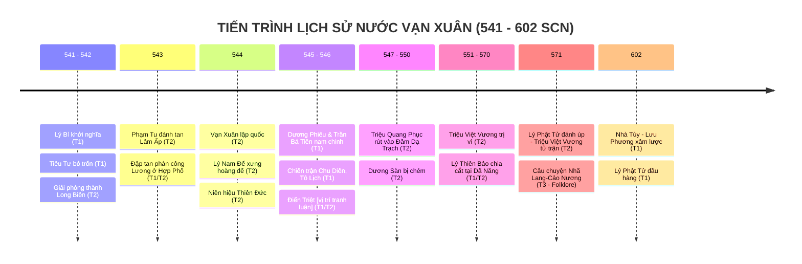

# Bối Cảnh Lịch Sử & Niên Biểu: Nước Vạn Xuân (541–602 SCN)

> [!IMPORTANT]
> **Ràng Buộc Nghiên Cứu Lịch Sử (Task `VS-VX-01`)**:
> Tài liệu này tổng hợp các sự kiện lịch sử thời Tiền Lý / Vạn Xuân, có gắn nhãn tầng nguồn **(T1 / T2 / T3 / T4)** cho từng chi tiết. Không thiết kế gameplay, không gán stats/waves.

> [!WARNING]
> **Ngôn ngữ thẩm định**: Các chi tiết chỉ có nguồn T2 trở về sau được trình bày như "theo ghi chép của *Toàn Thư*" hoặc "theo truyền thống / chính sử trung đại", không khẳng định như lịch sử đã được xác nhận gần thời. Các vị trí địa danh còn tranh luận được ghi rõ `[vị trí tranh luận]`.

---

## 1. Bối Cảnh Lịch Sử: Chế Độ Đô Hộ Nhà Lương

### 1.1. Chính Trị Phương Bắc (T1 — Near-source Chinese chronicles)

* Thế kỷ VI là giai đoạn Nam Bắc Triều chia cắt ở Trung Hoa. Nhà Lương (502–557) do Lương Vũ Đế Tiêu Diễn trị vì, duy trì bộ máy quan lại đô hộ tại Giao Châu.
* *Lương Thư* xác nhận Giao Châu năm 541 có Thứ sử là **Vũ Lâm hầu Tiêu Tư** — khi Lý Bí nổi dậy, Tiêu Tư "hành tiền cầu hòa" (hối lộ để cầu hòa) rồi bỏ trốn về Quảng Châu.

### 1.2. Tình Hình Giao Châu Dưới Tiêu Tư

* **T1 — Near-source**: *Lương Thư* chỉ ghi ngắn gọn rằng Tiêu Tư "hành tiền cầu hòa" (hối lộ) và bỏ trốn; không liệt kê các loại thuế cụ thể.
* **T2 — Later historiography**: *Đại Việt Sử Ký Toàn Thư* và *Cương Mục* mô tả Tiêu Tư tham nhũng nặng nề, đặt ra nhiều loại thuế bất hợp lý (thuế cây cối, súc vật, vải vóc…). **Các chi tiết danh mục thuế cụ thể này là T2 / popular tradition**, không được xác nhận bởi T1.

### 1.3. Tinh Thiều và Chức Vụ Nhà Lương (T2)

* **T2 — Later historiography**: *Toàn Thư* ghi rằng Tinh Thiều từng ra Bắc xin làm quan, được nhà Lương phong chức **Quảng Dương môn lang** (廣陽門郎) — tức chức viên lang coi giữ cửa Quảng Dương, một chức quan nhỏ giữ cổng hoàng thành theo hệ quan chế Nam Triều.
  * > [!CAUTION]
    > **Không dùng cụm từ "gác cổng Tây Viên"**: Đây là **diễn dịch dân gian / popular paraphrase** không có trong nguyên văn *Toàn Thư*. Tên chính xác của chức vụ theo T2 là **Quảng Dương môn lang**.
* Tinh Thiều phẫn chí vì chức vụ thấp, trở về hưởng ứng Lý Bí.

---

## 2. Niên Biểu Chi Tiết Lịch Sử Nước Vạn Xuân (541–602 SCN)

---

### Giai Đoạn 1: Khởi Nghĩa Bùng Nổ & Đánh Đuổi Tiêu Tư (541–543)

* **541 (T1 — *Lương Thư*)**: Lý Bí (người Giao Châu) nổi dậy. Thứ sử Tiêu Tư "hành tiền cầu hòa" rồi chạy về Quảng Châu.
* **542 (T1 — *Lương Thư*)**: Nhà Lương sai Tôn Quýnh, Lư Tử Hùng sang đàn áp nhưng không tiến quân được; cả hai bị bãi chức. Theo *Toàn Thư* (T2), nghĩa quân chiếm thành Long Biên.
* **542–543 (T1 — *Lương Thư*, bổ sung T2 — *Toàn Thư*)**: Nhà Lương lại sai quân từ Quảng Châu; *Toàn Thư* ghi Lý Bí chặn đánh tại Hợp Phố. Vua Lâm Ấp xâm lấn Cửu Đức; theo *Toàn Thư* (T2), **Phạm Tu** đem quân đánh tan — chi tiết này chỉ có trong T2, không có trong T1.

---

### Giai Đoạn 2: Khai Sinh Nước Vạn Xuân (544)

* **544 (T2 — *Toàn Thư*, *Việt Sử Lược*, *Cương Mục*)**: Lý Bí lên ngôi hoàng đế (Lý Nam Đế), đặt quốc hiệu **Vạn Xuân**, niên hiệu **Thiên Đức**.
  * Các chi tiết về tổ chức triều đình (Tinh Thiều đứng đầu quan văn, Phạm Tu đứng đầu quan võ, Triệu Túc làm Thái phó), xây điện Vạn Thọ, lập chùa Khai Quốc — **toàn bộ thuộc T2; không có T1 nào đề cập**.
  * **Tiền đồng**: *Toàn Thư* ghi có việc "đúc tiền"; tên gọi **"Thiên Đức thông bảo"** xuất hiện trong các ghi chép sau, nhưng **chưa có vật thể khảo cổ nào xác nhận đến nay** — `[attribution disputed / unverified by archaeology]`.
  * **Chùa Khai Quốc**: *Toàn Thư* ghi Lý Nam Đế lập chùa Khai Quốc năm 544. Việc đồng nhất chùa này với **Chùa Trấn Quốc** (Tây Hồ, Hà Nội) ngày nay là **local tradition (T3)**, không được xác nhận bởi tư liệu gần thời.

---

### Giai Đoạn 3: Kháng Chiến Chống Quân Lương (545–547)

* **545 (T1 — *Lương Thư*, *Trần Thư*)**: Lương Vũ Đế sai **Dương Phiêu** (Thứ sử Giao Châu) và **Trần Bá Tiên** (Tư mã) dẫn quân nam chinh.
* **Chiến trường Chu Diên & Tô Lịch (T1 — *Trần Thư*)**: Trận giao tranh tại các địa điểm này được ghi nhận gần thời. Phòng tuyến nghĩa quân bị phá vỡ; Lý Nam Đế rút quân.
  * **Cái chết của Phạm Tu, Tinh Thiều**: *Toàn Thư* (T2) ngụ ý cả hai hy sinh trong giai đoạn này. **T1 không xác nhận chi tiết này** — ghi là `[Later historiography; not confirmed by near-source]`.
* **Trận Điển Triệt (545–546, T1 — *Trần Thư*)**: Tên địa điểm được xác nhận gần thời trong *Trần Thư* (Cao Tổ kỷ). Tuy nhiên, **vị trí địa lý cụ thể và cách phiên âm hiện đại vẫn là vấn đề tranh luận** — `[vị trí tranh luận; T2 đề xuất Lập Thạch (Vĩnh Phúc) nhưng chưa được xác định bởi khảo cổ]`.
* **Động Khuất Lão / Khuất Nao (T1 — *Trần Thư*, bản chép tay khác nhau)**: Lý Nam Đế rút về nơi này. **Tên địa điểm bất nhất giữa các bản (*Khuất Lão* vs *Khuất Nao*); vị trí chưa xác định** — `[tên gọi và vị trí bất định]`. *Cương Mục* (T2) đề xuất Tam Nông (Phú Thọ).

---

### Giai Đoạn 4: Triệu Quang Phục & Căn Cứ Đầm Dạ Trạch (547–550)

* **547 (T2 — *Toàn Thư*)**: Lý Nam Đế trao quyền bính cho **Triệu Quang Phục**. *Toàn Thư* ghi Triệu Quang Phục rút về đầm Dạ Trạch (vùng Khoái Châu, Hưng Yên theo T2/T4).
* **Chiến thuật Dạ Trạch (T2 — *Toàn Thư*; T3 — *Lĩnh Nam Chích Quái*)**: Mô tả chi tiết về chiến thuật ban đêm, thuyền độc mộc, ẩn náu trong lau sậy — **nguồn T2 biên soạn cách sự kiện gần 1.000 năm; T1 không mô tả chi tiết chiến thuật này**.
  * **Số quân "hai vạn"**: Chỉ có trong T2; T1 không xác nhận.
  * **Danh hiệu Dạ Trạch Vương**: T2, T3. Không có trong T1.
* **548 (T2)**: Lý Nam Đế qua đời tại Khuất Lão. Triệu Quang Phục xưng Triệu Việt Vương.
* **549–550 (T2 — *Toàn Thư*)**: Loạn Hầu Cảnh khiến nhà Lương suy yếu; Trần Bá Tiên được triệu về. Triệu Việt Vương tổng phản công, **chém tướng Dương Sàn** và tái chiếm Long Biên — tên Dương Sàn có trong T1 (*Trần Thư*); hoàn cảnh chết trận chỉ trong T2.

---

### Giai Đoạn 5 & 6: Hậu Kỳ và Sụp Đổ (551–602)

* **551–570 (T1/T2)**: Triệu Việt Vương trị vì. Lý Thiên Bảo xưng Đào Lang Vương tại Dã Năng (xác nhận từ T1 — *Lương Thư*). Lý Phật Tử kế vị Thiên Bảo (T2).
* **571 (T2)**: Lý Phật Tử đánh úp Triệu Việt Vương; Triệu Việt Vương tử trận tại cửa biển Đại Nha.
  * **Câu chuyện Nhã Lang — Cảo Nương (T3 — Folklore)**: Toàn bộ câu chuyện tình duyên bi kịch và việc đánh cắp Móng Rồng là **folklore / local legend**, không phải historical fact được xác nhận bởi T1 hoặc T2 độc lập.
* **602 (T1 — *Tùy Thư*)**: Lưu Phương dẫn 27 doanh quân sang Giao Châu; Lý Phật Tử đầu hàng tại Đô Long. **Đây là sự kiện được xác nhận gần thời (T1).**

---

## 3. Nhận Định Học Thuật về Ý Nghĩa Lịch Sử

* **Quốc hiệu và ý thức độc lập** (T2, được học giả T4 đồng thuận): Việc đặt quốc hiệu Vạn Xuân và niên hiệu Thiên Đức phản ánh ý thức xây dựng nhà nước độc lập ngang hàng với phương Bắc. Đây là nhận định học thuật có cơ sở từ T2, nhưng cần lưu ý rằng T1 không ghi nhận những chi tiết này.
* **Nghệ thuật quân sự Dạ Trạch** (T2/T3, bổ sung T4): Chiến thuật kháng cự dài hạn trong địa hình đầm lầy được ghi nhận trong T2 và ca ngợi trong T3; có giá trị nghiên cứu quân sự nhưng cần thận trọng khi các chi tiết cụ thể (số quân, chiến thuật đêm, thuyền độc mộc) thiếu xác nhận T1.
