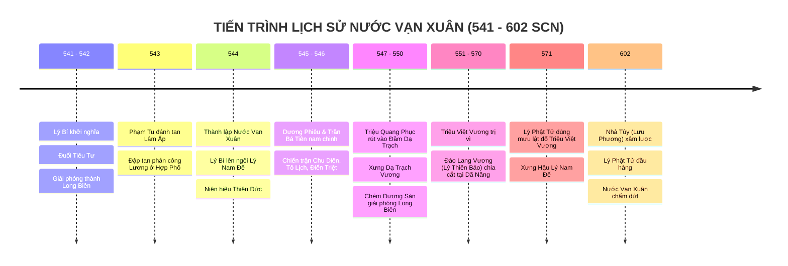

# Bối Cảnh Lịch Sử & Niên Biểu Toàn Diện: Nước Vạn Xuân (541–602 SCN)

> [!IMPORTANT]
> **Ràng Buộc Nghiên Cứu Lịch Sử (Task `VS-VX-01`)**:
> - Tài liệu này khảo cứu bối cảnh kinh tế - chính trị - quân sự của triều đại Tiền Lý (541–602 SCN).
> - Phục vụ định hướng cốt truyện lịch sử, xây dựng bản đồ địa lý và phân bổ các giai đoạn nội dung cho dự án *Huyền Sử TD*.
> - **KHÔNG thiết kế màn chơi gameplay, không gán số liệu stats/waves**.

---

## 1. Bối Cảnh Lịch Sử: Chế Độ Đô Hộ Nhà Lương & Làn Sóng Khởi Nghĩa

* **Bối cảnh chính trị phương Bắc**:
  * Thế kỷ VI là thời kỳ Nam Bắc Triều chia cắt ở Trung Hoa. Nhà Lương (502–557) do Lương Vũ Đế Tiêu Diễn trị vì ở phương Nam, thi hành chế độ môn phiệt - sĩ tộc cực kỳ khắt khe, coi thường các hào tộc và người tài ngoài giới quý tộc thượng lưu Kiến Khang.
* **Tình hình Giao Châu dưới ách đô hộ của Thứ sử Tiêu Tư**:
  * Thứ sử Giao Châu là **Vũ Lâm hầu Tiêu Tư** (người trong hoàng tộc họ Tiêu của nhà Lương) nổi tiếng tàn bạo, tham lam và hà khắc. Hắn đặt ra hàng trăm thứ thuế khóa vô lý (thuế cây cối, thuế súc vật, thuế vải vóc...), khiến dân chúng lầm than oán hận.
  * Nhân tài bản địa như **Tinh Thiều** dù học rộng tài cao, đỗ đạt giỏi kinh sử đến kinh đô Kiến Khang thi cử, nhưng chỉ được nhà Lương phong cho chức "Gác cổng Tây Viên". Tinh Thiều căm giận bỏ về quê hương, cùng các hào kiệt mưu tính việc đại sự.
* **Hào kiệt Lý Bí dấy cờ nghĩa**:
  * Lý Bí (Lý Bôn) vốn là tôn thất hào trưởng quê đất Thái Bình (vùng Sơn Tây/Vĩnh Phúc hoặc Thái Bình cổ), từng giữ chức Giám quân ở châu Đức (Hà Tĩnh). Do bất mãn với sự tàn bạo của quan lại đô hộ, ông đã từ quan trở về quê nhà, liên kết với các hào trưởng địa phương chuẩn bị khởi nghĩa.

---

## 2. Niên Biểu Chi Tiết Lịch Sử Nước Vạn Xuân (541–602 SCN)

### Giai đoạn 1: Khởi Nghĩa Bùng Nổ & Quét Sạch Quân Đô Hộ (541–543)
* **Cuối năm 541**: Lý Bí chính thức dựng cờ khởi nghĩa tại Thái Bình. Đông đảo hào kiệt hưởng ứng: Tinh Thiều, cha con Triệu Túc — Triệu Quang Phục (Chu Diên), Lão tướng Phạm Tu (Thanh Liệt).
* **Đầu năm 542**: Nghĩa quân tiến đánh sấm sét, Thứ sử Tiêu Tư kinh hoàng bỏ trốn về Quảng Châu. Nghĩa quân chiếm thành Long Biên, giải phóng hoàn toàn Giao Châu.
* **Cuối năm 542 — Đầu 543**: Nhà Lương sai Thứ sử Quảng Châu Tôn Quýnh và Lư Tử Hùng dẫn quân phản công. Lý Bí chủ động chặn đánh tại Hợp Phố, tiêu diệt phần lớn đạo quân địch.
* **Tháng 5 năm 543**: Vua Lâm Ấp nhân cơ hội đem quân cướp phá quận Cửu Đức (Hà Tĩnh). Lý Bí phái Lão tướng **Phạm Tu** thống lĩnh quân thủy bộ tiến xuống phía Nam, đánh tan tành quân Lâm Ấp tại biên giới.

---

### Giai đoạn 2: Khai Sinh Nước Vạn Xuân & Xưng Hoàng Đế (544)
* **Tháng Giêng năm 544**: Sau khi quét sạch ngoại xâm và dẹp yên bờ cõi, Lý Bí chính thức lên ngôi Hoàng đế, tự xưng là **Lý Nam Đế**.
* **Các chính sách dựng nước mang tính lịch sử**:
  1. Đặt quốc hiệu là **VẠN XUÂN** — Mang ý nghĩa mong ước xã tắc bền vững muôn vạn mùa xuân, độc lập tự chủ lâu dài.
  2. Đặt niên hiệu là **Thiên Đức** (Đức của Trời) — Khẳng định vương quyền độc lập ngang hàng với các Hoàng đế Trung Hoa.
  3. Dựng **Điện Vạn Thọ** làm nơi thiết triều, đúc tiền đồng **Thiên Đức thông bảo** khẳng định chủ quyền tiền tệ.
  4. Dựng chùa **Khai Quốc** (nghĩa là Mở Nước — tiền thân của Chùa Trấn Quốc ngày nay tại Hà Nội) làm trung tâm tâm linh Phật giáo của quốc gia.
  5. Thiết lập triều đình: Phong **Tinh Thiều** đứng đầu ban văn, **Phạm Tu** đứng đầu ban võ (Thái úy/Đại tướng quân), **Triệu Túc** làm Thái phó.

---

### Giai đoạn 3: Đại Kháng Chiến Chống Quân Lương (Trần Bá Tiên & Dương Phiêu) (545–547)
* **Tháng 5 năm 545**: Lương Vũ Đế cử tướng giỏi nhất của Nam Triều là **Dương Phiêu** (Thứ sử Giao Châu) và danh tướng mưu lược **Trần Bá Tiên** (Tư mã Đô đốc) dẫn đạo quân thủy bộ thiện chiến hơn vạn người ồ ạt nam chinh.
* **Chiến lũy Chu Diên & Thành Tô Lịch (545)**:
  * Lý Nam Đế dàn quân nghênh chiến tại sông Chu Diên và lập chiến lũy gỗ đất tại cửa sông Tô Lịch.
  * Quân Lương với thuyền lớn và binh lực mạnh đã đột phá phòng tuyến. Lão tướng Phạm Tu và Tinh Thiều anh dũng quyết tử cản giặc để vua rút lui.
* **Trận thủy chiến hồ Điển Triệt (546)**:
  * Lý Nam Đế lui quân về hồ Điển Triệt (Lập Thạch, Vĩnh Phúc) — một đầm hồ tự nhiên hiểm trở ăn thông ra sông Lô, hai bên là vách núi rậm rạp. Vua cho neo đóng hàng vạn chiến thuyền, chặn đứng đà tiến của Trần Bá Tiên suốt nhiều tháng.
  * Đêm thu năm 546, trời đổ mưa to gió lớn nước sông dâng ngập, Trần Bá Tiên chớp thời cơ xuôi dòng đánh úp hồ Điển Triệt. Thủy quân nghĩa quân bị vỡ trận, Lý Nam Đế phải rút vào động Khuất Lão (Tam Nông, Phú Thọ).

---

### Giai đoạn 4: Dạ Trạch Vương Quật Khởi & Chiến Thuật Du Kích Đầm Lầy (547–550)
* **Năm 547**: Lý Nam Đế tại động Khuất Lão trao lại toàn bộ tiết chế binh quyền và bảo kiếm cho danh tướng trẻ **Triệu Quang Phục**.
* **Đại bản doanh Đầm Dạ Trạch (Hưng Yên)**:
  * Triệu Quang Phục nhận định không thể đối đầu trực diện với quân thiết giáp của Trần Bá Tiên trên bình nguyên, bèn rút toàn bộ 2 vạn nghĩa binh về **đầm Dạ Trạch** (vùng bãi Màn Trù, Khoái Châu, Hưng Yên) — một bãi lầy mênh mông, lau sậy rậm rạp, bùn sâu ngập lút đầu gối ngựa xe.
  * **Nghệ thuật du kích đầm lầy**:
    * Ban ngày ẩn náu trong rừng lau sậy, cấm nổi lửa thổi cơm tránh khói.
    * Ban đêm dùng thuyền độc mộc nhỏ lướt nhanh luồn lách qua lau lách, bất ngờ tập kích vào các đồn trại quân Lương, cướp lương thực, đoạt vũ khí rồi biến mất không dấu vết.
    * Nhân dân hết lòng ủng hộ, tôn xưng Triệu Quang Phục là **Dạ Trạch Vương** (Vua Đầm Đêm).
* **Năm 548**: Lý Nam Đế qua đời vì bạo bệnh tại động Khuất Lão. Triệu Quang Phục xưng là **Triệu Việt Vương**.
* **Năm 549–550 (Tổng phản công thắng lợi)**:
  * Nhà Lương nổ ra Loạn Hầu Cảnh, triều đình nguy khốn triệu hồi Trần Bá Tiên về nước cứu viện; Bá Tiên giao lại quyền cho phó tướng **Dương Sàn** ở lại cố thủ.
  * Chớp thời cơ vàng, Triệu Việt Vương tung toàn bộ lực lượng từ đầm Dạ Trạch mở đợt tổng phản công sấm sét, chém chết tướng Dương Sàn tại trận, quét sạch quân giặc, tái chiếm thành Long Biên và khôi phục độc lập nước Vạn Xuân.

---

### Giai đoạn 5 & 6: Chia Rẽ Nội Bộ & Sự Xâm Lược Của Nhà Tùy (551–602)
* **551–570**: Triệu Việt Vương trị vì độc lập, đóng đô tại Long Biên. Ở phía Tây, anh trai Lý Nam Đế là Lý Thiên Bảo xưng Đào Lang Vương tại động Dã Năng. Sau khi Thiên Bảo mất (555), **Lý Phật Tử** lên thay và đem quân xuống đồng bằng tranh chấp.
* **571**: Lý Phật Tử dùng mưu gả con trai (Nhã Lang) cho con gái Triệu Việt Vương (Cảo Nương) để thám thính bí mật quân sự (huyền thoại trộm Móng Rồng), sau đó bất ngờ xuất quân đánh úp. Triệu Việt Vương thua trận tuẫn tiết tại cửa biển Đại Nha. Lý Phật Tử lên ngôi (Hậu Lý Nam Đế).
* **Năm 602**: Nhà Tùy thống nhất Trung Hoa, sai danh tướng **Lưu Phương** dẫn 27 doanh quân ồ ạt tiến sang. Lý Phật Tử khiếp sợ đầu hàng tại Đô Long. Kỷ nguyên nước Vạn Xuân kéo dài 60 năm chính thức khép lại.

---

## 3. Ý Nghĩa Lịch Sử Toàn Diện Của Nước Vạn Xuân

1. **Ý thức độc lập và tự chủ ngang hàng**: Việc Lý Bí xưng Hoàng đế (Lý Nam Đế), đặt quốc hiệu Vạn Xuân và đặt niên hiệu Thiên Đức là lời tuyên ngôn đanh thép khẳng định đất nước ta là một quốc gia độc lập có chủ quyền, có giang sơn và văn hiến riêng, không phải là một quận huyện của phong kiến phương Bắc.
2. **Di sản nghệ thuật quân sự độc đáo**: Chiến lược kháng chiến trường kỳ và nghệ thuật tác chiến du kích đầm lầy của Dạ Trạch Vương Triệu Quang Phục đã đặt nền móng kinh điển cho nghệ thuật quân sự Việt Nam: *"Lấy đoản binh thắng trường trận, lấy yếu chống mạnh, dựa vào địa hình hiểm trở tiêu hao sinh lực địch"*.
3. **Biểu tượng Phật giáo & Văn hóa Khai Quốc**: Chùa Khai Quốc (Trấn Quốc) mở ra kỷ nguyên Phật giáo đồng hành cùng vận mệnh dân tộc và sự hưng thịnh của non sông.
